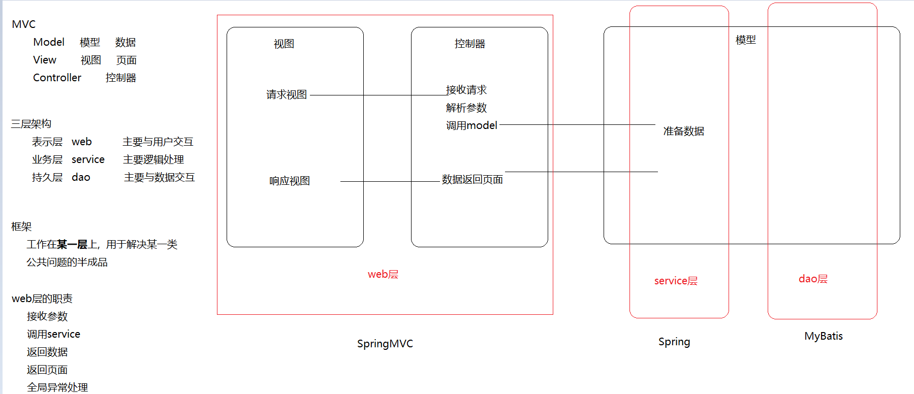

# 回顾

~~~markdown
* aop(动态代理)

* 转账   事务    业务     分离开发     (动态代理  业务+事务组装运行)

* Spring的aop  它需要我们进行配置----然后它底层去实现动态代理

* aop步骤: 找二配一
	1. 目标对象(切点)
	2. 增强对象(增强)
	3. 切面(描述的就是切点和增强运行顺序)
	
* xml   注解
* 环绕通知

* jdbcTemplate(了解)

* 转账
~~~

# Spring中的事务管理(了解)

## 事务管理方式

Spring支持两种事务管理方式：编程式事务和声明式事务

- 编程式事务就是将业务代码和事务代码放在一起书写，它的耦合性太高，开发中不使用

- 声明式事务其实就是将事务代码和业务代码隔离开发，然后通过一段配置让他们组装运行，最后达到事务控制的目的

==声明式事务就是通过AOP原理实现的==

## Spring事务管理相关的API

### PlatformTransactionManager

 

PlatformTransactionManager这是Spring进行事务管理的一个根接口，我们要使用它的实现类做事务管理

我们需要知道的是: ==mybatis和jdbcTemplate都可以使用它的一个子类(DataSourceTransactionManager)做事务管理==

### TransactionDefinition

TransactionDefinition这个API是用来做事务定义的

 

#### 隔离级别

 

#### 传播行为

事务传播行为指的就是当一个业务方法【被】另一个业务方法调用时，应该如何进行事务控制 

~~~java
a(){
    b();//转账   配置的是支持事务
    sdasdasdas;
    sdadasdadasdasd;
}

//立场b
b(){
    
}
~~~

 

#### 只读性

只读事务(增 删  改不能使用,只能查询使用)

换句话说,  只读事务只能用于查询方法

#### 超时时长

事务超时时间, 此属性需要底层数据库的支持

它的默认值是-1, 代表不限制

### TransactionStatus

TransactionStatus代表的是事务的当前状态

### 三个API之间的关系

PlatformTransactionManager通过读取TransactionDefinition中定义事务信息参数,来管理事务,管理之后会产生一些列的TransactionStatus

# 声明式事务(掌握)

## 思路

>aop开发  遵循三个步骤
>
>1. 目标对象     所有的业务层的类(ServiceImpl)           ==AccountServiceImpl(已经开发完成)==
>2. 增强对象     DataSourceTransactionManager       ==Spring已经提供好了,但是它需要我们传递一批参数==
>3. 配置切面     ==在配置文件配置==     

## xml版(重点)

### 复制工程

 

### 目标对象(已完成)

### 增强对象(Spring提供)

### 给增强对象配置参数

 

### 配置声明式事务

 

### 测试

 

### 关于配置参数的解释

 

## 注解版(重点)

### 删除配置文件中的aop配置和tx配置

 

### 在配文件中添加事务注解驱动

 

### 在需要控制事务的方法上添加一个注解

 

## 纯注解版(了解)

### 创建配置类

~~~java
package com.itheima.config;

import com.alibaba.druid.pool.DruidDataSource;
import org.springframework.context.annotation.Bean;
import org.springframework.context.annotation.ComponentScan;
import org.springframework.jdbc.core.JdbcTemplate;
import org.springframework.jdbc.datasource.DataSourceTransactionManager;
import org.springframework.transaction.annotation.EnableTransactionManagement;

import javax.sql.DataSource;

@ComponentScan("com.itheima") //注解扫描
@EnableTransactionManagement//激活事务管理, 相当于xml中的<tx:annotation-driven/>
public class SpringConfig {

    @Bean
    public DataSource dataSource() {
        DruidDataSource dataSource = new DruidDataSource();
        dataSource.setDriverClassName("com.mysql.jdbc.Driver");
        dataSource.setUrl("jdbc:mysql:///spring");
        dataSource.setUsername("root");
        dataSource.setPassword("root");
        return dataSource;
    }

    @Bean
    public JdbcTemplate jdbcTemplate(DataSource dataSource) {
        return new JdbcTemplate(dataSource);
    }

    //transactionManager 这个名字不能随便写
    @Bean
    public DataSourceTransactionManager transactionManager(DataSource dataSource) {
        DataSourceTransactionManager transactionManager
                = new DataSourceTransactionManager();
        transactionManager.setDataSource(dataSource);
        return transactionManager;
    }
}
~~~

###  测试

 

# SpringMVC介绍

## 回顾MVC模式

~~~markdown
* MVC是一种用于设计创建 Web 应用程序表现层的模式,使用它可以将业务逻辑、数据、界面显示代码分离开来.
- Model（模型）: 指的就是数据模型,用于封装数据
- View（视图） : 用于数据展示
- Controller（控制器）: 用于程序处理逻辑
~~~

 

## SpringMVC介绍(了解)

> SpringMVC是Spring产品对MVC模式的一种具体实现，==它可以通过一套注解，让一个简单Java类成为控制器。==

 

# SpringMVC案例(重点)

## 案例实现

> 开发一个请求页面, 向后台发送一个请求, 后台需要在控制台打印一句话,  然后跳转到一个新的页面

### 创建一个新模块,转换成web工程

>jbljavatoweb  插件  安装

 

### 引入依赖

 

~~~xml
    <dependencies>
        <dependency>
            <groupId>org.springframework</groupId>
            <artifactId>spring-webmvc</artifactId>
            <version>5.1.6.RELEASE</version>
        </dependency>

        <dependency>
            <groupId>javax.servlet</groupId>
            <artifactId>jsp-api</artifactId>
            <version>2.0</version>
        </dependency>

        <dependency>
            <groupId>javax.servlet</groupId>
            <artifactId>servlet-api</artifactId>
            <version>2.5</version>
        </dependency>
    </dependencies>
~~~

### 加入SpringMVC的配置文件

 

### 加入web.xml(配置前端控制器)

 

### 开发请求页面

 

### 开发控制器

 

### 开发响应页面

 

### 部署测试

 

### bug

>如果你访问的时候是,显示404; 一般就是idea版本问题
>
>解决: 找到对应模块,0 在当前tomcat停止的情况下,  先clean,  再package;  然后重试

 

## 工作流程( 面试必问 )

 

~~~markdown
1. 用户通过浏览器发送请求至前端控制器(DisPatcherServlet)

2. 前端控制器收到请求调用处理器映射器(HandlerMapping)去选择URL对应的方法

3. 处理器映射器找到具体的处理器链返回给前端控制器

4. 前端控制器会根据返回的处理器链调用处理器适配器(HandlerAdapter)

5. 处理器适配器经过适配调用具体的处理器（controller）

6. 处理器执行完成返回一个执行结果ModelAndView

7. 处理器适配器将ModelAndView对象返回给前端控制器

8. 前端控制器将ModelAndView对象传给视图解析器(ViewResolver)

9. 视图解析器解析后得到具体视图对象，并返回给前端控制器

10. 前端控制器根据视图对象进行视图渲染（即将模型数据填充至视图中）

11. 前端控制器会将渲染后的视图响应给浏览器
~~~

## 三大组件

~~~markdown
* 处理器映射器     负责根据URL寻找对应的处理器方法
* 处理器适配器     负责真正的去调用某个处理器方法
* 视图解析器       负责将逻辑视图转换成物理视图
~~~

 

 

## @RequestMapping

~~~markdown
* RequestMapping用于建立请求URL和处理方法之间的对应关系，也可以通过它的属性对请求做出各种限制
- value： 用于限制请求URL(和path作用一样)
- method：用于限制请求类型
* 此注解可以标注在方法上，也可以标注在类上，标注在类上代表类中的所有方法都可以共用一段URL
~~~

### 页面

 

### 后台

 

 

# 接收请求参数(重点)

> 在SpringMVC中可以使用多种类型来接收前端传入的参数

## 简单类型

> 只需要保证前端传递的参数名称跟方法的形参名称一致就好

### 页面

 

### 后台

 

## 对象类型

> 只需要保证前端传递的参数名称跟实体类的属性名称（set方法）一致就好

### 页面

 

### 封装一个实体

 

### 后台

  

## 数组类型

> 只需要保证前端传递的参数名称跟方法中的数组形参名称一致就好

### 页面

 

### 后台

  

## 集合类型

> 获取集合参数时，要将集合参数包装到一个实体中才可以

### 页面

 

### 封装一个Vo对象

 

### 后台

 

### post中文乱码处理

> SpringMVC在使用post提交请求时，对于中文参数是有乱码问题的，针对这种情况它提供了一个中文乱码过滤器，我们只需要进行配置一下就可以了。

  

#  @RequestParam处理参数

~~~markdown
* @RequestParam标注在方法参数之前，用于对传入的参数做一些限制，支持三个属性:
- value：用于指定前端传入的参数名称
- required：用于指定此参数是否必传
- defaultValue：当参数为非必传参数且前端没有传入参数时，指定一个默认值
~~~

## 前端

 

## 后台

 

# @RequestHeader接收请求头

##  前端

 

## 后台

 

练习:

	1. 声明式事务的配置(xml  注解)
	2. SpringMVC的入门案例和接收请求参数
	3. @RequestParam和@RequestHeader  场景式记忆

记忆:

​	1. SpringMVC的运行流程和三大组件的作用

