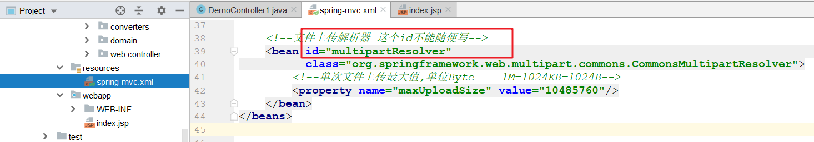

# 回顾

~~~markdown
1. SpringMVC   (servlet代码   = DisPatcherServlet + Controller) 

2. SpringMVC执行流程(11步)

3. @RequestMapping
	value  path 指定当前方法绑定URL
	method      限制请求方式
	
4. 接收请求参数
	简单(17)  对象   数组   集合
	
5. @RequestParam
	场景: 1. 前端传递参数不标准   2. 设置默认值   3. 接收集合
	
6. @RequestHeader
	@RequestHeader Map map
	@RequestHeader("cookie") String cookie
~~~

# 自定义类型转换器(会用)

> 对于一些常见的类型,  SpringMVC内置了类型转换器,  但是对于一些格式比较灵活的参数，它无法完成类型转换，这时候就必须自定义类型转换器。
>
> springMVC默认的日期转换器的格式为  'yyyy/MM/dd'

## 页面

 

## 自定义类型转换器

1. 自定义一个类型转换器的类, 并且实现类型转换方法

    

2. 将自定义的类注册到SpringMVC的转换服务, 并且将转换服务注册到注解驱动中

    

## 后台

 

 

# 文件上传(会用)

>1. 添加依赖
>2. 配置文件上传解析器 (id是固定的)
>3. 编写前端页面 (文件上传三要素)
>4. 编写后台程序 (参数的类型和名称)

## 加入文件上传的依赖

~~~xml
        <!--文件上传-->
        <dependency>
            <groupId>commons-fileupload</groupId>
            <artifactId>commons-fileupload</artifactId>
            <version>1.4</version>
        </dependency>
~~~

## 配置文件上传解析器 

 

## 单文件上传

### 页面

 

### 后台

  

## 多文件上传

### 页面 

  

### 后台

 

# 页面转发

>重点
>
>	1. return "视图名称"
> 	2. return "forward:/视图的全路径"

## 简单方式(推荐)

### 页面

 

### 后台

 

## forward方式(推荐)

### 页面 

 

### 后台 

 

## 原生api方式(了解)

### 页面 

 

### 后台 

 

## 转发过程中传递数据

### 方式一(掌握)

 

 

### 方式二(了解)

 

### 方式三(了解) 

 

# 页面重定向

>重点:
>
>​	1. return "redirect:视图全路径"

## redirect方式(推荐)

### 页面 

 

### 后台 

 

## 原生API方式(了解)

### 页面 

 

### 后台 

 

## 扩展: 通过重定向访问WEB-INF下资源

>本质上还是经过了一次转发

### 页面 

 

### 后台

 

### 例子

 

# 释放静态资源(会用)

> 当有静态资源需要加载时，比如jquery.js，会出现404现象。[ noHandlerFound No mapping for GET /js/jquery-3.3.1.js ]
>
> 之所以发生这种情况是因为：现在SpringMVC的前端控制器DispatcherServlet的url-pattern配置的是 /，代表除了jsp请求不拦截，
>
> 其他的所有请求都会拦截，包括一些静态文件(js  html  css  jpg等等)，而拦截住之后，它又找不到对应的处理器方法来处理，因此报错。

## 方式一(了解) 

 

## 方式二(推荐) 

 

# Ajax实现异步交互(重点)

> 首先回顾下，原来处理异步的方式
>
> ~~~markdown
> 前端
> 	$.post(url,params,function(data){},"json");---------------------$.ajax()
> 后端
> 	接收请求 req.getParameter()--------------------------------------@RequestBody接收请求
> 	返回响应 user对象
> 	user--->json---->resp.getWriter().write(json)-------------------@ResponseBody返回响应
> ~~~

>在SpringMVC中,  这个功能主要是通过两个注解@RequestBody和@ResponseBody实现的
>
>~~~markdown
>* @RequestBody用于接收前端传递的请求体中的json数据，并可以自动转换封装进指定的对象中。
>* @ResponseBody用于将controller方法返回的对象通过转换器转换为指定的格式( 通常为json )之后，再写回响应。
>~~~
>
>==注意:  Springmvc默认用MappingJackson2HttpMessageConverter对json数据进行转换，需要加入jackson的包==
>
>~~~xml
><dependency>
>      <groupId>com.fasterxml.jackson.core</groupId>
>      <artifactId>jackson-databind</artifactId>
>      <version>2.9.8</version>
></dependency>
>~~~
>

## 页面

>发送一个ajax

~~~jsp
<%--script标签不能自闭合--%>

~~~

## 后台 

>1. 接受参数
>2. 返回响应

 

# restful风格(了解)

## restful风格

> REST是一种软件架构风格，其强调HTTP应当以资源为中心[==在请求地址中尽量的不要出现动词==]。
>
> REST规范了HTTP请求动作，使用四个词语分别表示对资源的CRUD操作: 
>
> ​		GET(获取)、POST(新建)、PUT(更新)、DELETE(删除) 

|          | 原来                 | Restful             |
| -------- | -------------------- | ------------------- |
| 保存     | /saveUser            | POST  /user         |
| 修改     | /updateUser          | PUT    /user        |
| 删除     | /deleteUserById?id=1 | DELETE   /user/id/1 |
| 查询所有 | /findAllUser         | GET     /user       |
| 查询一个 | /findUserById?id=1   | GET     /user/id/1  |

## 保存

### 页面 

~~~jsp
 <button id="save">restful--保存</button> 

~~~

### 后台 

 

## 查询所有

### 页面 

~~~jsp
 <button id="findAll">restful--查询所有</button>

~~~

### 后台

 

## 条件查询

### 前端

~~~jsp
 <button id="findByUsernameAndAge">restful--条件查询</button>

~~~

### 后台

 

# 异常处理机制(会用)

>对于异常的处理一般有两种方式:
>
>- 当前方法处理(try-catch)，这种处理方式会造成业务代码和异常处理代码的耦合
>
>- 当前方法不处理, 出现异常后直接抛给调用者处理
>
>使用Spring框架后，我们的代码最终是由框架来调用的。也就是说，异常最终会抛到框架中，然后由框架指定异常处理器来统一处理异常。 

 

## 方式一：配置方式

> 重点:  自定义一个类实现HandlerExceptionResolver接口

### 定义异常处理器的类 

 

### 错误页面的编写

 

### 将这个异常类配置到Spring容器中

 

## 方式二：注解方式

 >使用一个注解实现上面的效果
 >
 >​	@ControllerAdvice 要标注在类上,表示当前类是一个全局异常处理器的类
 >
 >​	@ExceptionHandler 标注在方法上,表示当前方法可以处理哪些异常

### 注释掉上面的方式

 

### 自定义一个类和方法

 

### 添加一个包扫描

 

# 拦截器

## 什么是拦截器

> 拦截器是Spring提供的一种技术，它的功能似于过滤器Filter，==它会在进入controller之前，离开controller之后以及页面渲染完毕之后进行拦截。==

 

## 自定义拦截器

> 重点: 自定义一个类实现HandlerInterceptor接口

### 开发拦截器

>用于定义请求被拦住之后, 应该怎么处理

 

### 配置拦截器

>定义我们要拦截哪些路径,不拦截哪些路径, 只有拦截住的路径才会送到拦截器中进行处理

 

### 测试

 

## 自定义拦截器链

> 开发中拦截器可以单独使用，也可以同时使用多个拦截器形成一条拦截器链。
>
> 开发步骤和单个拦截器是一样的，只不过注册的时候注册多个，==注意这里注册的顺序就代表拦截器执行的顺序==。

### 再开发拦截器 

 

### 再配置拦截器

 

## 案例: 用户访问拦截(作业  难度大)

> 用户访问一个主页面index.jsp(首页, 权限控制)
>
> ​	如果用户已经登录，即可成功访问
>
> ​	如果用户没有登录，不允许访问，返回登录页面login.jsp

  

~~~markdown
1. 自定义类型转换器(会用)
	1) 自定义一个类实现指定转换接口和方法
	2) 将这个类注册到转换服务中, 再将转换服务注册到注解驱动中
2. 文件上传(会用)
	1) 配置文件上传解析器(id)
	2) 编写前端页面(文件上传三要素)
	3) 后台代码(参数类型  名称)
3. 页面的跳转
	1) 页面转发      return "success";     return "forward:/WEB-INF/success.jsp";
		数据传递    req.setAttribute(key,val)
	2) 页面重定向    return  "redirect:/success.jsp"
		如何访问web-inf下资源(本质上内部经过了转发)
4. ajax实现异步交互(重点)
	1) 释放静态资源(会配置)
	2) @RequestBody 接收请求体中json数据转换成对应对象
	3) @ResponseBody 将返回值对象转换成json数据再返回
5. restful(练习)
6. 全局异常处理器(会用)
	1. 配置
		1) 自定义一个全局处理器(创建一个类实现指定接口  指定方法)
		2) 配置到Spring容器中
	2. 注解
		@ControllerAdvice 表在一个类上,表示这是一个异常处理器的类
		@ExceptionHandler(Math....)  表在一个方法上,用于表名当前方法可以处理哪些类型的异常
	
~~~

