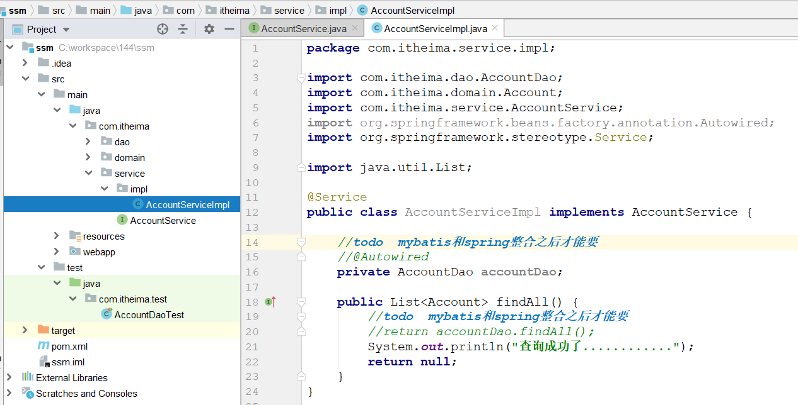

# SSM整合(会用)

## SSM整合思路

~~~markdown
* SSM(SM)
	Spring     业务层   逻辑(声明式事务)
	SpringMVC  表示层   跟用户交互 
	Mybatis    持久层   对数据库操作
	
* SSM整合基本思路：
	使用Spring( 容器 )来整合Mybatis和SpringMVC
	
* 整合步骤是这样：
    1. 先各自搭建SSM的环境
    2. 使用Spring整合Mybatis
    3. 使用Spring整合Springmvc
~~~

## 搭建Mybatis环境

### 创建工程, 转换成web

 

 

### 引入依赖

 

### 创建实体类

 

### 创建dao接口

 

### 创建dao的映射文件

 

### 加入数据库连接配置文件

 

### 加入mybatis的配置文件

 

### 加入日志文件

 

### 测试

 

~~~java
package com.itheima.test;

import com.itheima.dao.AccountDao;
import com.itheima.domain.Account;
import org.apache.ibatis.io.Resources;
import org.apache.ibatis.session.SqlSession;
import org.apache.ibatis.session.SqlSessionFactory;
import org.apache.ibatis.session.SqlSessionFactoryBuilder;
import org.junit.Test;

import java.io.IOException;
import java.io.InputStream;
import java.util.List;

public class AccountDaoTest {

    @Test
    public void testFindAll() throws IOException {
        //1. 读取配置文件,将文件读成一个输入流
        InputStream inputStream = Resources.getResourceAsStream("mybatis-config.xml");

        //2. 创建sqlSessionFactory
        SqlSessionFactory sqlSessionFactory = new SqlSessionFactoryBuilder().build(inputStream);

        //3. 获取sqlSession
        SqlSession sqlSession = sqlSessionFactory.openSession();

        //4. 获取dao的代理对象,可以操作
        AccountDao accountDao = sqlSession.getMapper(AccountDao.class);
        List<Account> accounts = accountDao.findAll();
        for (Account account : accounts) {
            System.out.println(account);
        }

        //5. 提交事务
        sqlSession.commit();

        //6. 释放资源
        sqlSession.close();
    }
}
~~~

## 搭建Spring环境

### 导入依赖

 

### 创建service接口

 

### 创建service实现类

 

### 加入spring的配置文件

 

### 测试

 

## 搭建SpringMVC环境

### 导入依赖

 

### 加入springmvc的配置文件

 

### 加入web.xml

 

### 编写请求页面

 

### 编写控制器

 

### 编写响应页面

 

### 部署测试

 

## Spring整合Mybatis

### 整合思路

将mybatis的所有配置信息转移到Spring的配置文件中

将Mybatis的SqlSessionFactory托管到Spring的IOC容器中

### 加入mybatis对接Spring的依赖

 

### 将mybatis的所有配置转移到spring的配置文件中

~~~xml
<?xml version="1.0" encoding="UTF-8"?>
<beans xmlns="http://www.springframework.org/schema/beans"
       xmlns:xsi="http://www.w3.org/2001/XMLSchema-instance"
       xmlns:context="http://www.springframework.org/schema/context"
       xmlns:aop="http://www.springframework.org/schema/aop"
       xmlns:tx="http://www.springframework.org/schema/tx"
       xsi:schemaLocation="http://www.springframework.org/schema/beans
			    http://www.springframework.org/schema/beans/spring-beans.xsd
			    http://www.springframework.org/schema/context
			    http://www.springframework.org/schema/context/spring-context.xsd
			    http://www.springframework.org/schema/aop
			    http://www.springframework.org/schema/aop/spring-aop.xsd
			    http://www.springframework.org/schema/tx
			    http://www.springframework.org/schema/tx/spring-tx.xsd">

    <!--注解扫描-->
    <context:component-scan base-package="com.itheima.service"/>

    <!--导入外部的properties配置文件-->
    <context:property-placeholder location="classpath:db.properties"/>

    <!--数据源-->
    <bean id="dataSource" class="com.alibaba.druid.pool.DruidDataSource">
        <property name="driverClassName" value="${jdbc.driver}"/>
        <property name="url" value="${jdbc.url}"/>
        <property name="username" value="${jdbc.username}"/>
        <property name="password" value="${jdbc.password}"/>
    </bean>

    <!--事务管理器-->
    <bean id="transactionManager"
          class="org.springframework.jdbc.datasource.DataSourceTransactionManager">
        <property name="dataSource" ref="dataSource"/>
    </bean>

    <!--映射文件导入-->
    <bean id="mapperScannerConfigurer"
          class="org.mybatis.spring.mapper.MapperScannerConfigurer">
        <property name="basePackage" value="com.itheima.dao"/>
    </bean>

    <!--将sqlSessionFactory放入spring容器-->
    <bean id="sqlSessionFactory" class="org.mybatis.spring.SqlSessionFactoryBean">
        <property name="dataSource" ref="dataSource"/>
        <property name="typeAliasesPackage" value="com.itheima.domain"/>
        
        <!--额外引入mybatis的配置文件-->
        <!--<property name="configLocation" value="classpath:mybatis-config.xml"/>-->
    </bean>
</beans>
~~~

 

### 在service中注入dao对象

 

### 测试

 

## Spring整合SpringMVC

### 整合思路

Spring和SpringMVC本身就是一家产品，是不用整合的，

但是现在的Spring容器自己无法启动，我们需要在web容器启动的时候，加载Spring的配置文件，启动Spring容器

那么这个工作是在spring-web包中的一个监听器来做的，这个包不用单独导入，他已经在 spring-webmvc 包中了

它会监听WEB容器的启动和停止，然后就可以控制 Spring容器的启动和停止了

### 配置监听器

 

### 在controller中注入service

 

### 测试

 

### 列表展示

 

# SSM案例(重点)

 

## 思路图

 

## 增加

### 在列表页添加跳转到增加页面的按钮

 

### Controller添加跳转到增加页面的方法

 

### 添加增加页面

 

### Controller添加增加的方法

 

### Service接口添加增加的方法

 

### Service实现类添加增加的方法

 

### dao添加增加的方法

 

### 映射文件中添加的方法

 

### 测试

 

## 修改

### 数据回显

#### 在list页面上添加修改按钮

 

#### 在controller中添加跳转到修改页面的方法

 

#### 在service接口中添加查询方法

 

#### 在service实现类中添加查询方法

 

#### 在dao接口中添加查询方法

 

#### 在映射文件中添加查询方法

 

#### 添加修改账户的页面

 

### 修改提交

#### 在controller中添加修改方法

 

#### 在service接口中添加修改方法

 

#### 在service实现类中添加修改方法

 

#### 在dao接口中添加修改方法

 

#### 在映射文件中添加修改方法

 

### 测试(略)

## 删除

### 修改list页面，添加删除

 

### 在controller中添加删除的方法

 

### 在service接口中添加删除的方法

 

### 在seivice实现类中添加删除的方法

 

### 在dao接口中添加删除的方法

 

### 在映射文件中添加删除的方法

 

### 测试(略)

## 添加事务控制

### xml版

 

### 注解版

1. 修改xml

    

2. 使用注解处理事务

    

## Spring的父子容器

### 说明

Spring和SpringMVC的容器具有父子关系，Spring容器为父容器，SpringMVC为子容器

子容器可以引用父容器中的Bean，而父容器不可以引用子容器中的Bean
 

### 配置(会配)

 

## 拦截器使用

### 思路说明

 

### 开发login.jsp

 

### 开发登录方法

 

### 开发拦截器

 

### 配置拦截器

 

 