# Vue概述

## MVVM模式

~~~markdown
* 在互联网产品快速迭代的背景下，前端开发人员不仅要编写页面，还要通过ajax+js完成页面动态效果，压力较大，为了解决这个问题，MVVM开发模式就诞生了
* MVVM是Model-View-ViewModel的简写，它本质上就是MVC的改进版；MVVM就是将其中的View的状态和行为抽象化，让我们将视图UI和业务逻辑分开。
	- M： 即Model，模型，指的就是数据
	- V： 即View， 视图，指的就是页面
	- VM：即ViewModel，指的是模型和数据的双向绑定(即view和Model互相影响，Model变了，view随之改变；view变了，Model也随之改变)
	
* MVC和MVVM的使用区别
	在MVC模式中，
		开发人员需要从后端获取到数据(Model)，然后通过操作DOM渲染视图(View)。
		如果用户改变了视图(view)，开发人员还需要再通过DOM获取改变之后的数据，同步到Model中。
    在MVVM模式中，
    	Model和View是绑定的，Model变了，view自动变化；view变了，Model自动变化。
    	因此，程序员只需要关注Model即可。
    	
* 基于MVVM模式的前端框架三巨头：Vue、React、Angular，国内目前非常火的就是：Vue
~~~

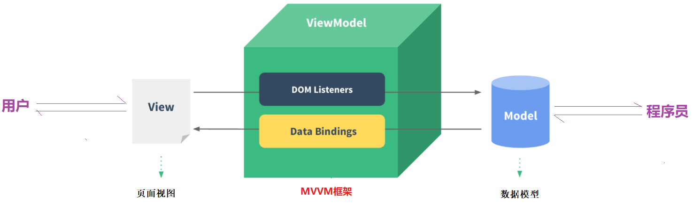 


## 认识Vue

Vue是一套用于构建用户界面的渐进式框架，一个前端项目可以使用vue一两个特性，也可以整个项目都用vue。

Vue的核心库只关注视图层，不仅易于上手，还便于与第三方库或既有项目整合。

Vue的使用也非常简单，直接在需要使用Vue功能的页面直接引入vue.js即可。


# Vue快速入门

## 创建工程

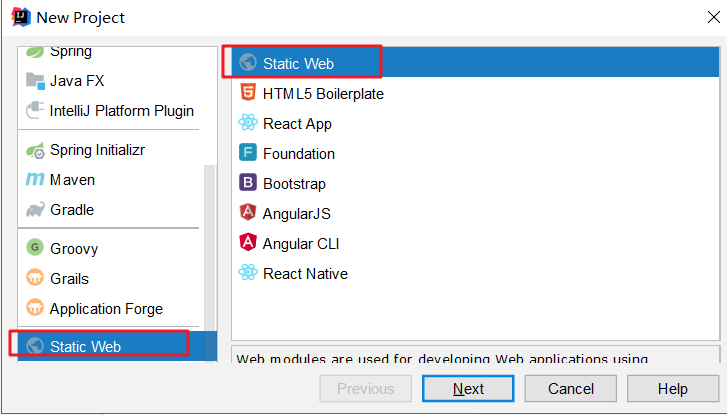 

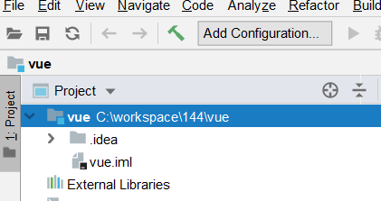 

## 导入代码

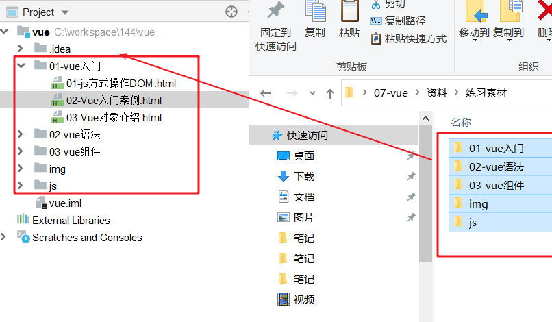 

## Vue案例编写

~~~html
<!DOCTYPE html>
<html lang="en">
<head>
    <meta charset="UTF-8">
    <title>Title</title>
    <!--1. 引入vue的js文件-->
    <script src="../js/vue-2.6.12.js"></script>
</head>
<body>
<!--使用vue向div中渲染文字-->
<div id="app">
    <!--插值表达式-->
    {{message}}
</div>

<script>
    //2. 构建vue的对象
    const app = new Vue({
        el: "#app", //使用css的id选择器指定当前vue对象可以管理的视图范围
        data: {//数据定义
            message: "这是vue的测试文字",
        }
    });
</script>

</body>
</html>
~~~

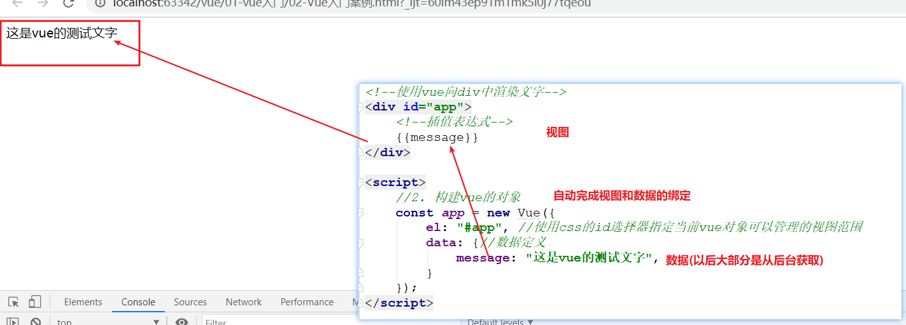 

## Vue对象介绍

>~~~js
>// Vue对象的介绍
>const app = new Vue({
>        el: "#app",  // el用于挂载视图，即使用css选择器，选中当前vue可以管理的视图范围，注意: vue选择视图必须使用的是双标签，html和body除外
>        data:{       // data是一个对象，里面存储的就是视图数据，支持js的各种数据类型(简单  对象{}  数组[])
>            message:""
>        }
>})
>~~~

~~~html
<!DOCTYPE html>
<html lang="en">
<head>
    <meta charset="UTF-8">
    <title>Title</title>
    <!--1. 引入vue的js文件-->
    <script src="../js/vue-2.6.12.js"></script>
</head>
<body>
<!--使用vue向div中渲染文字-->
<div id="app">
    <!--插值表达式-->
    {{message}}<br>
    {{user.username}}--{{user.age}}<br>
    {{userNames[0]}}-- {{userNames[1]}}
</div>

<script>
    //2. 构建vue的对象
    const app = new Vue({
        el: "#app", //使用css的id选择器指定当前vue对象可以管理的视图范围, 这个id选择器必须表在双标签上(html和body除外)
        data: {//用于数据数据定义的区域, 里面支持各种数据类型,主要是三种: 基本类型, 对象类型, 数组类型
            message: "这是vue的测试文字",//基本类型
            user: {username: "张三", age: "18"},//对象类型
            userNames: ["张三", "李四"]//数组类型
        }
    });
</script>

</body>
</html>
~~~


# Vue语法【重点,练习两遍】

## 插值表达式

> ~~~markdown
> * 说明：插值表达式主要作用是从Model中获取数据渲染到View
> * 语法：{{  表达式  }}
> * 注意: 使用{{}}方式在网速较慢时会出现问题，此时可以使用v-text和v-html来替代它
> 	- v-text：将数据输出到元素内部，如果输出的数据有HTML代码，会作为普通文本输出
> 	- v-html：将数据输出到元素内部，如果输出的数据有HTML代码，会被渲染
> ~~~

```html
<!DOCTYPE html>
<html lang="zh-CN">
<head>
    <meta charset="UTF-8">
    <title>Title</title>
    <script src="../js/vue-2.6.12.js"></script>

</head>
<body>


<div id="app">
    <!--
        1. {{ }} 这叫插值表达式(推荐)
            主要作用是将data中的数据渲染到视图上,类似于原来的el表达式
            当网络存在延迟的时候,可能出现原样文本({{message}})输出的形式
        2. v-text
            类似于js的innerText赋值
        3. v-html
            类似于js的innerHTML赋值
    -->

    插值表达式获取值: {{message}}<br>
    v-text获取值: <span v-text="message"></span><br>
    v-html获取值: <span v-html="message"></span><br>
</div>


<script>
    //3s之后再执行
    setTimeout(function () {
        const app = new Vue({
            el: "#app",
            data: {
                message: "<font color='red'>144真棒!!!</font>"
            }
        });
    }, 3000);
</script>
</body>
</html>
```


## 双向绑定

>~~~markdown
>* 插值表达式(包括v-text和v-html)可以看做是单向绑定，数据影响了视图渲染，但是反过来就不行。
>* 接下来学习的v-model是双向绑定，视图（View）和模型（Model）之间会互相影响。
>* 注意：目前v-model的可使用元素有：input、select、textarea、components（vue内置组件）
>~~~

~~~markdown
<!DOCTYPE html>
<html lang="zh-CN">
<head>
    <meta charset="UTF-8">
    <title>Title</title>
    <script src="../js/vue-2.6.12.js"></script>
</head>
<body>
<div id="app">

    <h3>姓名：</h3>
    <input type="text" v-model="username">
    <div>您写的姓名是:{{username}}</div>


    <h3>性别：</h3>
    <input type="radio" value="男" v-model="gender"> 男 <br>
    <input type="radio" value="女" v-model="gender"> 女 <br>
    <div>您选择的性别是:{{gender}}</div>


    <h3>爱好：</h3>
    <input type="checkbox" value="抽烟" v-model="hobby">抽烟<br>
    <input type="checkbox" value="喝酒" v-model="hobby">喝酒<br>
    <input type="checkbox" value="烫头" v-model="hobby">烫头<br>
    <div>您选择的爱好是:{{hobby}}</div>


    <h3>段位：</h3>
    <select v-model="level">
        <option value="">请选择</option>
        <option value="青铜">青铜</option>
        <option value="白银">白银</option>
        <option value="王者">王者</option>
    </select>
    <div>您选择的段位是:{{level}}</div>

</div>
<script>
    const app = new Vue({
        el: "#app",
        data: {
            username: "",//用于装载姓名
            gender: "男",//用于装载性别,默认值为男
            hobby:["抽烟"],//用于装载爱好
            level:"白银",//用于接收段位
        }
    })
</script>
</body>
</html>
~~~

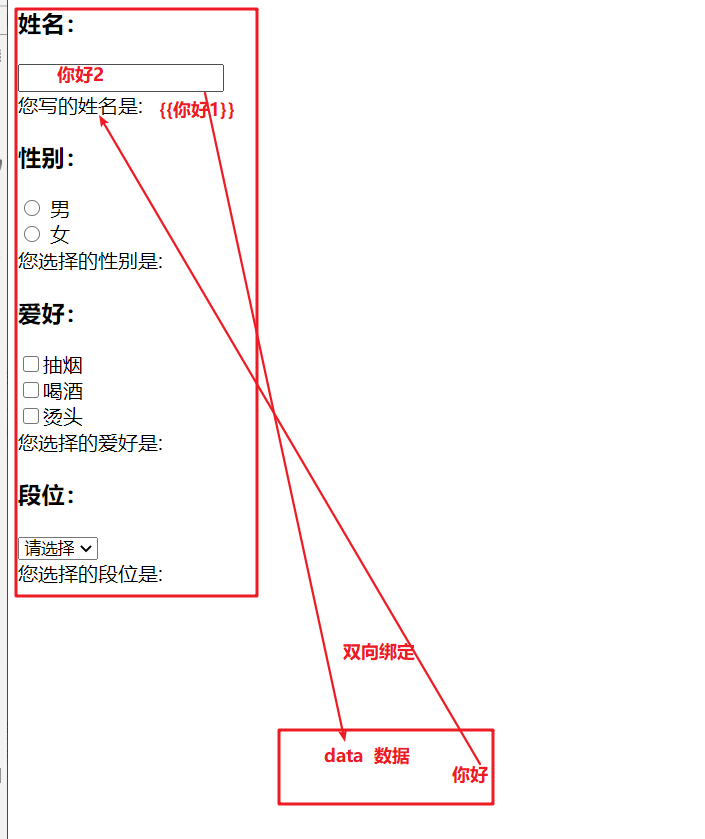 


## 事件处理

> ~~~markdown
> * 事件绑定
> 	1) 标准语法   v-on:事件名="js片段或函数名"   如果不想页面爆红,需要单独引入名称空间
> 	2) 简化语法   @事件名="js片段或函数名"       推荐使用
> ~~~

```html
<!DOCTYPE html>
<html lang="zh-CN">
<head>
    <meta charset="UTF-8">
    <title>Title</title>
    <script src="../js/vue-2.6.12.js"></script>
</head>
<body>
<div id="app">
    <b>数量：</b>
    <button @click="numDiff()">-</button>
    <input type="text" v-model="num" style="width: 30px;">
    <button @click="num++">+</button>
</div>
<script>
    const app = new Vue({
        el: '#app',
        data: {
            num: 1
        },
        methods: { //定义函数的区域
            numDiff() {//num--
                if (this.num <= 1) {
                    alert("到1了");
                    return;
                }
                //如果需要在方法中使用当前vue定义的变量.必须使用this引用
                this.num--;
            },
            //方法1
            //方法2
        }
    })
</script>
</body>
</html>
```


## 列表循环

### 遍历List

>~~~markdown
>* 在vue中使用v-for实现数组的遍历，格式如下:
>* v-for="(item,index) in items"
>     items：要遍历的List
>     item： 每次遍历得到的临时变量
>     index：每次遍历的索引，从0开始计数(可省略)
>~~~

```html
<!DOCTYPE html>
<html lang="zh-CN">
<head>
    <meta charset="UTF-8">
    <title>Title</title>
    <script src="../js/vue-2.6.12.js"></script>
</head>
<body>
<div id="app">

    <!--
        vue中使用遍历主要的点:
            1. 你要的遍历是谁,你就在谁上声明v-for
            2. 语法 v-for="(item,index) in items" (推荐)
                如果不使用index 可以简写为  v-for="item in items"
    -->

    <ul>
        <li v-for="(user,index) in users">
            {{index}}--{{user.id}}--{{user.name}}--{{user.address}}
        </li>
    </ul>
</div>
<script>
    const app = new Vue({
        el: '#app',
        data: {
            users: [
                {id: 1, name: 'jack', address: '北京顺义'},
                {id: 2, name: 'lucy', address: '上海虹桥'},
                {id: 3, name: 'jerry', address: '天津宝坻'}
            ]
        }
    })
</script>
</body>
</html>
```

### 遍历Map

>~~~markdown
>* v-for除了可以遍历数组，也可以Map。 格式如下:
>* v-for="(value,key,index) in items"
> 	items：要遍历的Map
> 	key：  每次遍历得到的key
> 	value：每次遍历得到的value
> 	index：每次遍历的索引，从0开始计数
>~~~

```html
<!DOCTYPE html>
<html lang="zh-CN">
<head>
    <meta charset="UTF-8">
    <title>Title</title>
    <script src="../js/vue-2.6.12.js"></script>
</head>
<body>
<div id="app">
    <!--
        v-for="(value,key,index) in items"
            items：要遍历的Map
            key：  每次遍历得到的key
            value：每次遍历得到的value
            index：每次遍历的索引，从0开始计数
    -->
    <ul>
        <li v-for="(sex,username,index) in users">{{index}}--{{username}}--{{sex}}</li>
    </ul>

</div>
<script>
    const app = new Vue({
        el: '#app',
        data: {
            users: {
                "张三": "男",
                "李四": "男",
                "王五": "女",
                "赵六": "男"
            }
        }
    })
</script>
</body>
</html>
```


## 条件判断

> ~~~markdown
> * 语法：
> 	v-if="布尔表达式"
> 	v-else-if="布尔表达式"
> 	v-else
> * 注意：
> 	v-else元素必须紧跟在带v-if或者v-else-if元素的后面，否则它将不会被识别
> 	v-if还可以和v-for联合使用，当二者出现在一起时，会先遍历再判断条件
> ~~~

```html
<!DOCTYPE html>
<html lang="zh-CN">
<head>
    <meta charset="UTF-8">
    <title>Title</title>
    <script src="../js/vue-2.6.12.js"></script>
</head>
<body>
<div id="app">
    <!--从文本框输入成绩, 然后判断成绩是否及格  >=60:及格    <60:不及格   其他:未知-->
    <h3>考试成绩练习</h3>
    请输入成绩:<input type="text" v-model="score"><br>
    你本次考试成绩:
    <span v-if="score>=60">及格</span>
    <span v-else-if="score<60">不及格</span>
    <span v-else>未知</span>

    <!--遍历users, 但是要求只显示性别为女的用户-->
    <h3>用户列表</h3>
    <ul>
        <li v-for="(user,index) in users" v-if="user.gender == '女'">{{user.name}}--{{user.gender}}</li>
    </ul>
</div>
<script>
    const app = new Vue({
        el: '#app',
        data: {
            score: "未知",//成绩分数
            users: [
                {name: 'jack', gender: '女'},
                {name: 'lucy', gender: '女'},
                {name: 'jerry', gender: '男'}
            ]
        }
    })
</script>
</body>
</html>
```


## 属性绑定

> ~~~markdown
> * 对于HTML标签属性，如果想要动态传值，不能使用{{}}，而应该使用专门的属性绑定语法
> 	标准语法：   v-bind:属性名="Vue中的变量"
> 	简写语法：         :属性名='Vue中的变量'
> 	
> * 对于class属性，除了上述方式外，还支持一种特殊语法
> 	可以传给:class一个对象，以动态地切换class    <div :class="{redback:false,font:false}">黑马程序员</div>
> 	其中redback和font为提前声明好的class样式，true和false表示这个class是否生效
> ~~~

```html
<!DOCTYPE html>
<html lang="zh-CN">
<head>
    <meta charset="UTF-8">
    <title>Title</title>
    <script src="../js/vue-2.6.12.js"></script>
    <style>
        #cz {
            width: 200px;
            height: 200px;
            border: 1px solid grey;
        }

        .back {
            background-color: red;
        }

        .font {
            font-size: 40px;
            font-weight: bold;
        }
    </style>
</head>
<body>
<div id="app">
    <h3>属性绑定基本使用</h3>
    有两个图片地址分别是:../img/vue.png 和 ../img/lj.jpg,请在下面输入地址,改变图片:<br>
    图片地址: <input type="text" v-model="imgSrc">
    图片宽度: <input type="text" v-model="imgWidth">
    <br>
    {{imgSrc}}--{{imgWidth}}

    <h3>绑定class属性的特殊用法</h3>
    <div id="cz" :class="{'back':false,'font':true}">黑马程序员</div>
</div>
<script>
    const app = new Vue({
        el: '#app',
        data: {
            imgSrc: "../img/vue.png",
            imgWidth: "100px"
        },
    })
</script>
</body>
</html>
```


## 监控器

> ~~~markdown
> * 监控器可以监控一个值的变化，通过监听器可以获取到变化前后的值。
>         watch: {
>             被监控的简单变量(newVal, oldVal) {
>             
>             },
>         }
> * 如果监控的值是一个对象，需要进行深度监控，才能监控到对象中属性的变化，这种方式只能获取到变化之后的对象的值。
>         watch: {
>             被监控的对象变量: {
>                 deep:true,
>                 handler(value) {}
>             }
>         }
> ~~~

```html
<!DOCTYPE html>
<html lang="zh-CN">
<head>
    <meta charset="UTF-8">
    <title>Title</title>
    <script src="../js/vue-2.6.12.js"></script>
</head>
<body>
<div id="app">
    <h3>学历选择</h3>
    <select v-model="xueli">
        <option value="小学">小学</option>
        <option value="初中">初中</option>
        <option value="高中">高中</option>
        <option value="大学">大学</option>
    </select>

    <h3>年龄变化</h3>
    <input type="text" v-model="student.age">
</div>
<script>
    const app = new Vue({
        el: '#app',
        data: {
            xueli: "小学",
            student: {
                name: "小明",
                age: 20
            }
        },
        watch: { //监控器
            //这种写法只能监控一个简单值,如果要监控的是一个对象,他就不行了
            xueli(newVal, oldVal) {//xueli代表的是被监控的对象
                console.log(oldVal + "------------->" + newVal);
            },

            //下面的写法叫做深度监控,它可以监控对象, 但是他只能获取到变化之后的值
            student: {
                deep: true,//开启深度监控
                handler(value) {
                    console.log(value.age);
                }
            }
        }
    })
</script>
</body>
</html>
```


# Vue组件（了解）

> ~~~markdown
> * 在大型应用开发的时候，页面可以划分成很多部分。往往不同的页面，也会有相同的部分。例如：可能会有相同的头部导航、尾部菜单等等。
> * 我们可以将页面相同的部分拆成独立组件，然后在不同页面就可以共享这些组件，避免重复开发。
> * 组件的定义格式
>         Vue.component("counter",{                                                               ---counter是组件的名称
>             template:'<button v-on:click="count++">你点了我 {{ count }} 次，我记住了.</button>',  ----这是组件的模板内容
>             data(){                                                                             ----这是组件需要的数据(必须放在data方法中)
>                 return {count:0}
>             }
>         })
> * 组件的调用
> 	<counter></counter>
> ~~~

```html
<!DOCTYPE html>
<html lang="zh-CN">
<head>
    <meta charset="UTF-8">
    <title>Title</title>
    <script src="../js/vue-2.6.12.js"></script>
</head>
<body>
<div id="app">
    <!--使用组件名调用组件-->
    <counter></counter>
    <br>
    <counter></counter>
    <br>
    <counter></counter>
    <br>
</div>
<script>
    //定义一个vue的组件(实现一个button的效果)
    Vue.component("counter", {//counter这是当前组件的名称,调用的时候会用
        template: "<button @click='num++'>我被点了{{num}}次</button>",//定义模板,html
        data() {//这里面就是当前组件要使用的数据
            return {
                num:0
            }
        }
    });
    
    const app = new Vue({
        el: '#app',
        data: {},
        methods: {}
    })
</script>
</body>
</html>
```


# 异步交互【重点】

## axios使用

> Vue并没有直接处理ajax的组件，需要使用第三方插件实现。Vue官网推荐使用 Axios 插件实现ajax功能。

```js
// 执行get请求
axios.get('/url?name=admin&password=123').then(resp=>{
	console.log(resp.data);
})


// 执行get请求参数比较多的时候
axios.get('/url',{
    params:{
		name: 'admin',
		password: '123'
    }
}).then(resp=>{
	console.log(resp.data);
})


//执行post请求
axios.post('/url', {
    name: 'admin',
    password: '123'
}).then(resp=>{
    console.log(resp.data);
})
```

## 页面加载完成

>created方法用于定义页面加载完毕之后需要执行的事情
>
>~~~js
>const app = new Vue({
>	created() {
>		console.log("页面加载完毕了......");
>	}
>});
>~~~


# Vue使用总结(重点,用笔写一遍)

~~~html
<!--Vue对象模板-->
<script>
    const app = new Vue({
        el: "#app", //指定当前vue管理的视图范围
        data: {},   //用于定义当前vue管理的数据
        methods: {}, //用于定义方法
        watch: {},   //用于定义监听器
        created() {} //用于定义页面加载完成时间
    });
</script>

1. 单方向赋值
	html文本: {{插值表达式}}
	html属性: <span :class="" :width="" > </span>

2. 双向绑定
	<input type="text" v-model="name" ></input>

3. 遍历循环
	<li v-for="(item,index) in list"></li>
	<li v-for="(value,key,index) in map"></li>

4. 判断
	<span v-if></span>
	<span v-else-if></span>
	<span v-else></span>

5. 事件绑定
	<a @click="方法()"></a>

6. ajax请求
	get请求
		参数比较少
			axios.get('url?name=zs&age=18').then(resp=>{
				resp.data
			})
		参数比较多
			axios.get('url',{
				params:{
					name:zs,
					age:18
				}
			}).then(resp=>{
				resp.data
			})

	post请求
			axios.post('url',{
				name:zs,
				age:18
			}).then(resp=>{
				resp.data
			})
~~~


# 综合案例(写两遍)

## 导入工程

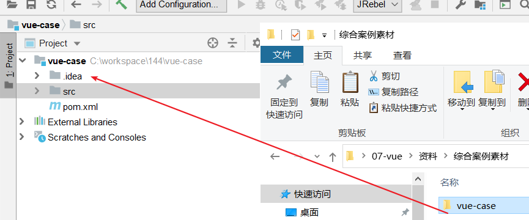 

## 功能开发

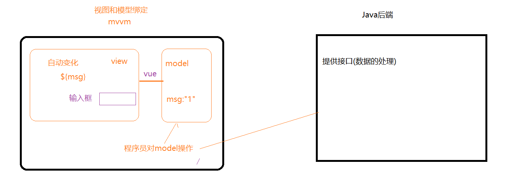 

### 列表查询

1. 编写vue的骨架

   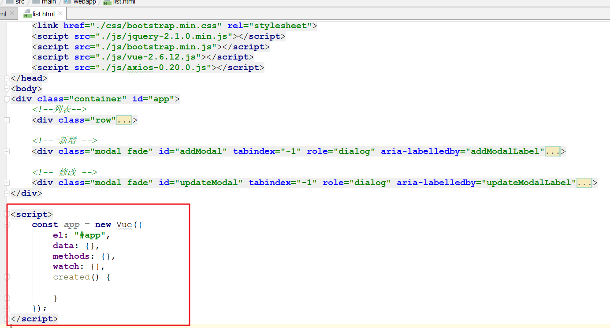 

2. 从后台抓取数据,放入model

   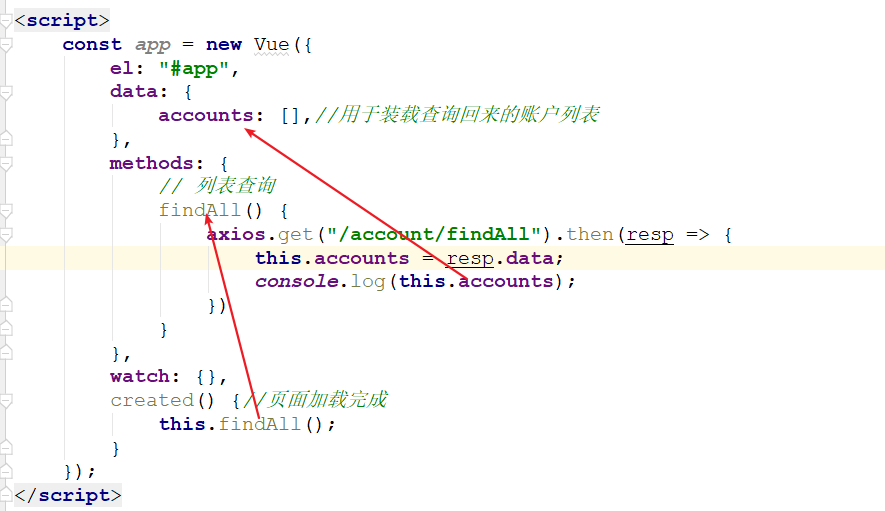 

3. 将账户集合数据遍历到表格中

   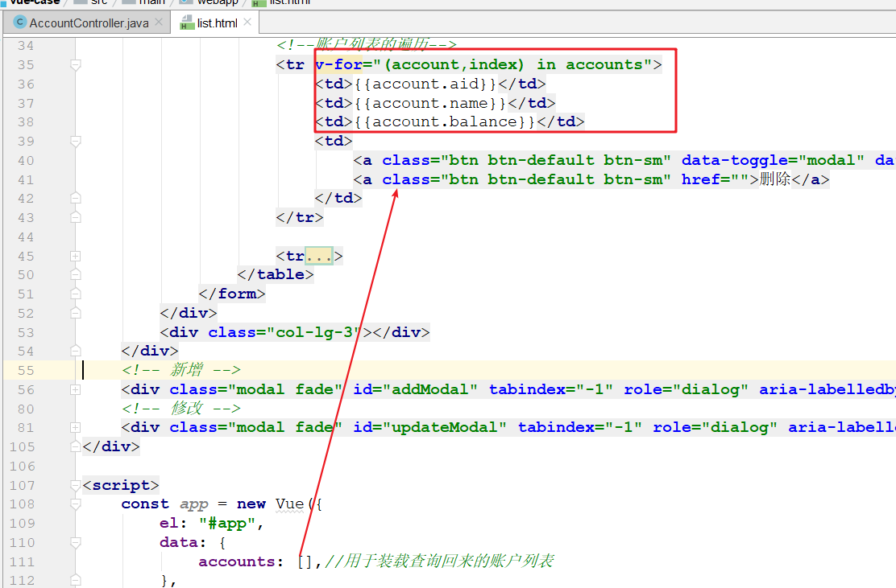 

### 账户新增

1. 实现账户表单跟model的双向绑定

   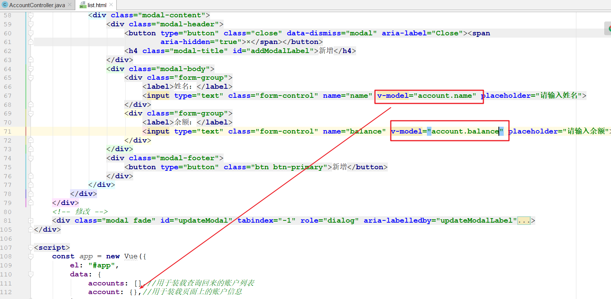 

2. 对新增按钮添加一个事件,当点击时,发送请求到后台

   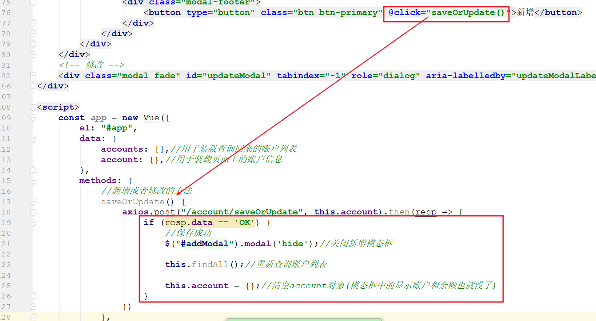 

### 账户修改

1. 为修改按钮添加点击事件,当点击的时候触发查询请求,返回值赋值到account

   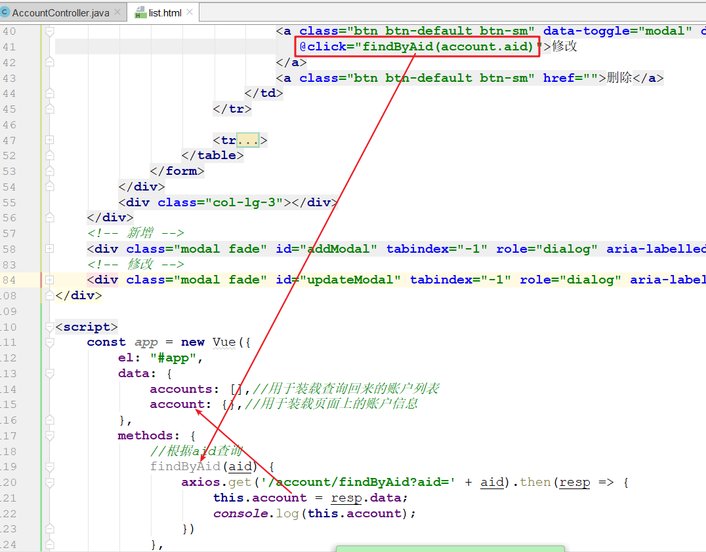 

2. 实现账户修改表单跟account的双向绑定

   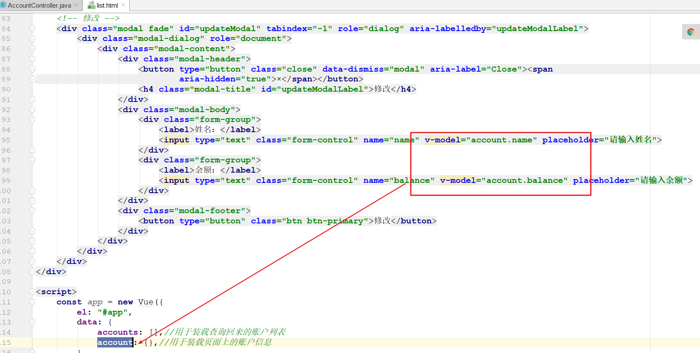 

3. 为表单修改按钮添加点击事件,当点击时,触发修改方法

   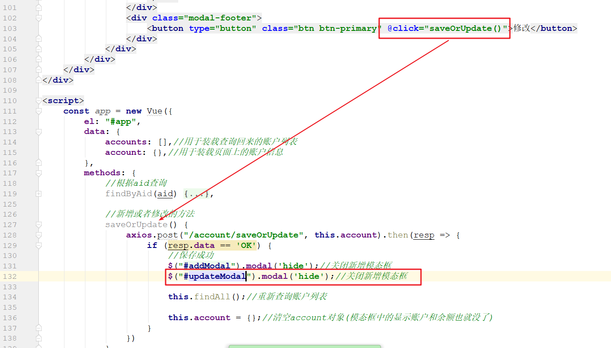 

### 账户删除

1. 为删除按钮添加事件

   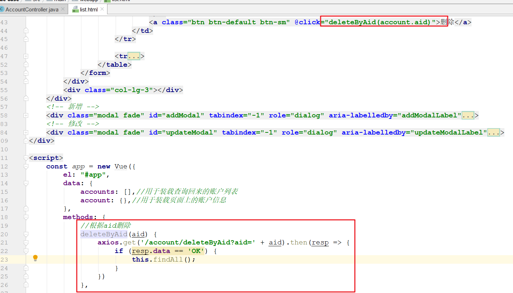 