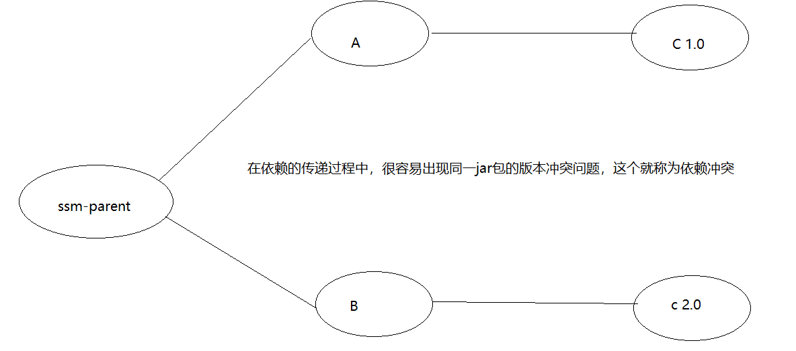
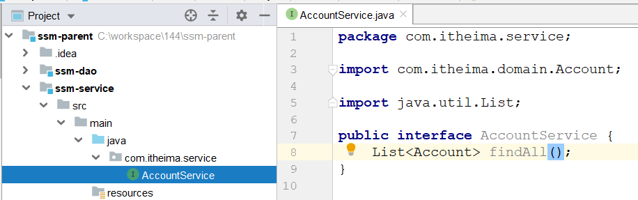

# 回顾

~~~markdown
1. vue mvvm(程序员--->model---->view)

2. vue骨架
	const app = new Vue({
		el:"#app", // 挂载视图
		data:{ // 定义数据
			message:"",
			user:{},
			users:[]
		},
		methods:{ // 定义方法
			methodA(参数1,参数2){}
		},
		watch:{ //监控器
			pageNum(){}
		},
		created(){ // 页面加载完毕之后 要哦执行的内容
		
		}
	})
	
2. model-view  单向赋值
	给html文本赋值:  {{}}
	给html属性赋值   <span :color=""></span>
	
3. model-view  双向绑定
	<input v-model="">
	
4. 遍历
	list: <li v-for="(item,index) in items"></li>
	map:  <li v-for="(value,key,index) in items"></li> 
	
5. 判断
	<span v-if="true">显示</span>
	<span v-else-if="true">显示</span>
	<span v-else>显示</span>
	
6. 事件绑定
	<button @click="js函数  代码段">
	
7. 异步发送请求(axios)
	1.get
		axios.get(url,{
			params:{}
		}).then(resp=>{
			resp.data
		})
	2.post
		axios.post(url,{}).then(resp=>{
			resp.data
		})
~~~


# maven基础知识

~~~markdown
1. maven的作用
	依赖管理: 对jar包管理(pom文件声明坐标)
	一键构建: 通过一个命令来快速搞定maven的构建过程

2. maven的常用命令
	clean:   清理, 删除上一次项目构建产生的文件(删除target目录)
	compile: 将正式java代码(main)编译成class文件
	test:    编译并运行测试代码(test)
	package: 将正式文件打成jar包或者war包
	install: 将上面得到的jar包或者war包安装到本地仓库
	deploy:  将上面得到的jar包或者war包安装到私服

3. maven的生命周期
	清理(clean) :clean
	默认(default): compile test package  install  deploy
	站点(site): site
	
4. maven仓库的种类
	本地仓库(开发者电脑)
	私服(公司服务器)
	中央仓库(公网)

5. maven的主要标签
	groupId    公司名(公司域名倒写)
	artifactId 项目名
	version    版本
		SNAPSHOT   快照版    测试版
		RELEASE    发行版    稳定版
	packing   打包方式
		jar     普通java工程
		war     web工程
		pom     父工程
~~~


# 分模块开发

## 拆分与聚合

> **拆分** 将原来的一个项目拆分成一个个小的模块, 每个模块都有自己的坐标,  当其它项目需要本模块的功能时,  只需要按照坐标引入本模块就可以了
>
> **聚合** 通过坐标的形式，将各个模块组装在一起,完成一个项目的功能

 

## 父子工程搭建

### 创建父工程

 

### 创建dao模块

 

### 创建service模块

 

### 创建web模块

 

### 建立模块之间的依赖关系

 

## 两套关系梳理

在上面的工程中, 存在两套关系

- 父子工程之间:  继承关系, 子工程可以使用父工程中的jar包

- 模块工程之间:  默认是没有任何关系的，但是可以通过依赖建立两者之间的关系，而且这个依赖关系是可以传递的

  在依赖传递过程中,可能出现这样的情况

  ~~~markdown
  a-------b-------c
  	a----b    b-----c    直接依赖
  	a--------c           间接依赖
  ~~~


# 依赖冲突

## 什么是依赖冲突

在依赖的传递过程中，很容易出现同一jar包的版本冲突问题，这个就称为依赖冲突 

 

## 依赖冲突解决(面试)

### 第一声明优先原则

在pom文件定义依赖，先声明的依赖为准。

 

### 路径近者优先原则

从依赖开始开始算起，到被依赖的程序，以路径短的为准。

 

### 依赖排除

依赖排除就是在依赖引入的过程中，通过`exclusions`标签排掉指定的跟随依赖

 

### 版本锁定

面对众多的依赖，有一种方法不用考虑依赖路径、声明优先等因素，可以采用直接锁定版本的方法确定依赖构件的版本

版本锁定后，系统会以锁定的版本的为准添加到工程中，此方法在企业开发中常用。

 


# SSM环境搭建(重点)

## 环境准备

准备数据环境(spring库 account表)

准备项目环境(就使用现在的环境, 但是要把坐标加入到父工程中的pom文件

 

## 修改dao模块

### 创建实体类包

 

### 创建dao接口(注解)

 

### 加入spring的配置文件

 

### 测试

 

## 修改service模块

### 创建service接口

 

### 创建service实现类

  

### 加入spring的配置文件

 

### 测试

 

## 修改web模块

### 加入springmvc的配置文件

 

### 加入web.xml

 

### 创建请求页面

 

### 创建控制器

 

### 创建响应页面

 

### 测试

 


# 私服(了解)

 

## 私服简介

公司在自己的局域网内搭建自己的私服，私服服务器即是公司内部的maven远程仓库，

每个员工的电脑上安装maven软件并且连接私服，可以将自己开发的项目发布到私服，也可以从私服下载其它成员上传的项目包。

 

## 搭建私服环境

### 下载nexus

Nexus是Maven仓库管理器，通过nexus可以搭建maven仓库, 软件已经提供在资料中`nexus-2.12.0-01-bundle.zip`

 

### 安装nexus

第1步:  解压nexus-2.12.0-01-bundle.zip到一个没有中文没有空格的目录  

 

第2步: 以`管理员身份`运行cmd命令, 然后进入软件的bin目录，通过命令安装并启动nexus软件

 

~~~markdown
* 补充下停止和下载的命令
* 停止 		nexus.bat  stop
* 卸载 		nexus.bat  uninstall
~~~

第3步: 访问nexus

nexus默认监听端口为8081, 通过 `http://localhost:8081/nexus` 即可访问


第4步: 登录nexus

nexus默认的用户名是==admin==, 默认的密码是==admin123==

 

登录成功后,会看到下面的内容:

 

## 仓库类型 

仓库有下面四类:

- proxy  代理仓库, 用于代理远程仓库(中央)
- virtual  废弃的代理仓库
- hosted  用于本地jar包上传的仓库
- group  就是上面仓库的综合, 用于jar包的下载

## 将jar发布到私服

企业中多个团队协作开发通常会将一些公用的组件、开发模块等发布到私服供其它团队或模块开发人员使用。

第1步：在maven的settings.xml文件中,  添加下面配置

 ```xml
  <!--
      此用户名和密码用于私服校验，因为私服需要知道上传的账号和密码是否和私服中的账号和密码一致。
      添加到servers节点下
  -->
  <server>
       <id>releases</id>
       <username>admin</username>
       <password>admin123</password>
  </server>
  <server>
       <id>snapshots</id>
       <username>admin</username>
       <password>admin123</password>
  </server>
 ```

第2步： 在需要操作的模块(比如ssm-dao)的pom.xml文件中, 添加下面配置

```xml
<!--
	配置私服仓库的地址，如果版本为release则上传到私服的release仓库，如果版本为snapshot则上传到私服的snapshot仓库
-->
<distributionManagement>
    <repository>
        <id>releases</id>
        <url>http://localhost:8081/nexus/content/repositories/releases/</url>
    </repository>
    <snapshotRepository>
        <id>snapshots</id>
        <url>http://localhost:8081/nexus/content/repositories/snapshots/</url>
    </snapshotRepository>
</distributionManagement>
```

 

第3步： 选择需要操作的模块(比如ssm-dao), 执行deploy命令

 

第4步: 执行完毕后, 可以在私服的对应目录下观察到上传的文件

 

## 从私服下载jar包 

配置nexus之后，本地仓库没有jar包，就去私服下载，私服如果没有, 再由私服去中央下载。

第1步:  在maven的settings.xml文件中, 添加下面配置

```xml
<!--配置下载仓库-->
<profile>
  <id>dev</id>
  <repositories>
   <repository> 
    <id>nexus</id>
    <url>http://localhost:8081/nexus/content/groups/public/</url>
    <releases>  
       <enabled>true</enabled> 
    </releases>
    <snapshots>
       <enabled>true</enabled>
    </snapshots>
   </repository>
  </repositories>
  <pluginRepositories>
    <pluginRepository>
      <id>public</id>
      <name>Public Repositories</name>
      <url>http://localhost:8081/nexus/content/groups/public/</url>
    </pluginRepository>
  </pluginRepositories>
 </profile>

 <!--使用profile定义仓库需要激活才可生效-->
 <activeProfiles>
     <activeProfile>dev</activeProfile>
 </activeProfiles>
```

第2步: 测试

1)  首先在ssm_parent工程上执行install, 这样就可以将所有模块打包到本地仓库

2)  然后删除本地仓库中的ssm_dao的文件

3)  在ssm-service模块上执行compile命令

​     注意: service 要编译成功必须依赖仓库中的ssm-dao, 而现在本地仓库中没有, 他就会从私服下载

4)  通过控制台观察效果


# Mybatis逆向工程(会用)

## 介绍	

Mybatis是目前非常流行的持久层框架，其逆向工程更是大大缩减了我们的开发时间。

所谓mybatis逆向工程，就是Mybatis会根据我们设计好的数据表，自动生成**pojo（实体）**、**mapper（接口）**以及**mapper.xml（映射）**

而且会在文件中给我们生成单表增删改查的方法和sql

 

## 插件使用

### 创建工程，引入依赖

 

~~~xml
<dependencies>
        <dependency>
            <groupId>org.mybatis.generator</groupId>
            <artifactId>mybatis-generator-core</artifactId>
            <version>1.3.7</version>
        </dependency>
        <dependency>
            <groupId>org.mybatis</groupId>
            <artifactId>mybatis</artifactId>
            <version>3.5.1</version>
        </dependency>
        <dependency>
            <groupId>log4j</groupId>
            <artifactId>log4j</artifactId>
            <version>1.2.17</version>
        </dependency>
        <dependency>
            <groupId>mysql</groupId>
            <artifactId>mysql-connector-java</artifactId>
            <version>5.1.6</version>
        </dependency>
		<dependency>
            <groupId>junit</groupId>
            <artifactId>junit</artifactId>
            <version>4.12</version>
        </dependency>
    </dependencies>

    <build>
        <plugins>
            <plugin>
                <groupId>org.mybatis.generator</groupId>
                <artifactId>mybatis-generator-maven-plugin</artifactId>
                <version>1.3.7</version>
                <configuration>
                    <verbose>true</verbose>
                    <overwrite>true</overwrite>
                </configuration>
            </plugin>
            <plugin>
                <groupId>org.apache.maven.plugins</groupId>
                <artifactId>maven-compiler-plugin</artifactId>
                <version>3.1</version>
                <configuration>
                    <source>1.8</source>
                    <target>1.8</target>
                    <encoding>UTF-8</encoding>
                </configuration>
            </plugin>
        </plugins>
    </build>
~~~

### 加入配置文件

 

### 运行插件，生成文件 

 


## 生成的文件的使用(重点)

### 基础操作

~~~java
package com.itheima.dao;

import com.itheima.domain.Account;
import com.itheima.domain.AccountExample;

import java.util.List;

public interface AccountDao {

    //保存
    int insert(Account record);

    //带动态sql的保存
    int insertSelective(Account record);

    //根据主键更新
    int updateByPrimaryKey(Account record);

    //带动态sql的根据主键更新
    int updateByPrimaryKeySelective(Account record);

    //根据主键删除
    int deleteByPrimaryKey(Integer aid);

    //根据主键查询
    Account selectByPrimaryKey(Integer aid);

    //条件查询
    List<Account> selectByExample(AccountExample example);
}
~~~

### 条件查询

**模板代码,直接复制使用即可**

~~~java
public class MyBatisTest {

    private SqlSession sqlSession;

    @Before
    public void getSqlSession() {
        InputStream stream = null;
        try {
            stream = Resources.getResourceAsStream("mybatis-config.xml");
        } catch (IOException e) {
            e.printStackTrace();
        }
        SqlSessionFactory factory = new SqlSessionFactoryBuilder().build(stream);
        sqlSession = factory.openSession(true);

    }

    @After
    public void closeSqlSession() {
        sqlSession.close();
    }

    @Test
    public void test1() {
        AccountDao accountDao = sqlSession.getMapper(AccountDao.class);
        AccountExample example = new AccountExample();

    }
}
~~~

**测试代码**

~~~java
package com.itheima.test;

import com.itheima.dao.AccountDao;
import com.itheima.domain.Account;
import com.itheima.domain.AccountExample;
import org.apache.ibatis.io.Resources;
import org.apache.ibatis.session.SqlSession;
import org.apache.ibatis.session.SqlSessionFactory;
import org.apache.ibatis.session.SqlSessionFactoryBuilder;
import org.junit.After;
import org.junit.Before;
import org.junit.Test;

import java.io.IOException;
import java.io.InputStream;
import java.util.List;

public class AccountDaoTest {

    private SqlSession sqlSession;

    @Before
    public void getSqlSession() {
        InputStream stream = null;
        try {
            stream = Resources.getResourceAsStream("mybatis-config.xml");
        } catch (IOException e) {
            e.printStackTrace();
        }
        SqlSessionFactory factory = new SqlSessionFactoryBuilder().build(stream);
        sqlSession = factory.openSession(true);
    }

    @After
    public void closeSqlSession() {
        sqlSession.close();
    }

    //条件查询用法
    //example有三个作用
    //1. 条件查询  example.createCriteria().
    //2. 排序     example.setOrderByClause("aid desc")
    //3. 去重     example.setDistinct(true)
    @Test
    public void test1() {
        AccountDao accountDao = sqlSession.getMapper(AccountDao.class);
        AccountExample example = new AccountExample();

        //example有三个作用:
        //1. criteria  用于组装查询条件
        AccountExample.Criteria criteria = example.createCriteria();
//        criteria.andBalanceLessThan(10f);//where balance < 10
//        criteria.andAidEqualTo(1);//and aid = 1
//        criteria.andNameLike("张%");//and name like '张%'
        criteria.andBalanceLessThan(10f).andAidEqualTo(1).andNameLike("张%");

        List<Account> accounts = accountDao.selectByExample(example);
    }


    //排序
    @Test
    public void test2() {
        AccountDao accountDao = sqlSession.getMapper(AccountDao.class);
        AccountExample example = new AccountExample();

        //example有三个作用:
        //1. criteria  用于组装查询条件

        AccountExample.Criteria criteria = example.createCriteria();
        criteria.andBalanceLessThan(10f).andAidEqualTo(1).andNameLike("张%");

        //2. setOrderByClause("aid desc") 排序
        example.setOrderByClause("aid desc");


        List<Account> accounts = accountDao.selectByExample(example);
    }

    //去重
    @Test
    public void test3() {
        AccountDao accountDao = sqlSession.getMapper(AccountDao.class);
        AccountExample example = new AccountExample();

        //example有三个作用:
        //1. criteria  用于组装查询条件

        AccountExample.Criteria criteria = example.createCriteria();
        criteria.andBalanceLessThan(10f).andAidEqualTo(1).andNameLike("张%");

        //2. setOrderByClause("aid desc") 排序
        example.setOrderByClause("aid desc");

        //3. setDistinct(true) 是否去重
        example.setDistinct(true);

        List<Account> accounts = accountDao.selectByExample(example);
    }
}
~~~


### 模板说明

>~~~markdown
>* 条件说明
>* criteria.andXxxIsNull    添加字段xxx为null的条件
>* criteria.andXxxIsNotNull    添加字段xxx不为null的条件
>* criteria.andXxxEqualTo(value)    添加xxx字段等于value条件
>* criteria.andXxxNotEqualTo(value)    添加xxx字段不等于value条件
>* criteria.andXxxGreaterThan(value)    添加xxx字段大于value条件
>* criteria.andXxxGreaterThanOrEqualTo(value)    添加xxx字段大于等于value条件
>* criteria.andXxxLessThan(value)    添加xxx字段小于value条件
>* criteria.andXxxLessThanOrEqualTo(value)    添加xxx字段小于等于value条件
>* criteria.andXxxIn(List<？>)    添加xxx字段值在List<？>条件
>* criteria.andXxxNotIn(List<？>)    添加xxx字段值不在List<？>条件
>* criteria.andXxxLike(“%”+value+”%”)    添加xxx字段值为value的模糊查询条件
>* criteria.andXxxNotLike(“%”+value+”%”)    添加xxx字段值不为value的模糊查询条件
>* criteria.andXxxBetween(value1,value2)    添加xxx字段值在value1和value2之间条件
>* criteria.andXxxNotBetween(value1,value2)    添加xxx字段值不在value1和value2之间条件
>~~~


重点:

 1. 面试

    maven基础知识+依赖冲突解决

	2. 练习

    ssm分模块环境搭建

    逆向工程的生成完文件的使用