# 回顾

```markdown
1. maven的分模块环境搭建
	
2. 私服

3. dao咋用
	Exsmple
		设置查询条件
		排序
		去重
```


# 项目介绍

## 项目描述

在互联网快速发展的今天，电视广播等媒体的地位已经逐渐被网络视频所替代，各种视频网站逐步发展起来，优酷，爱奇艺，黑马影视等等。

本项目主要功能主要分成两部分：

- 后台管理系统

  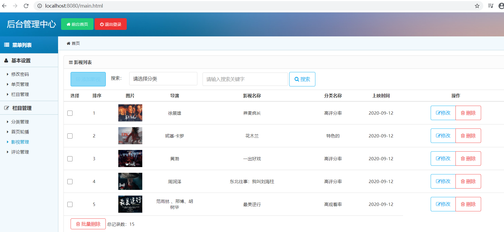 

- 影视门户系统

   

## 环境导入

### 数据库导入

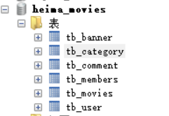 

### 模块设计

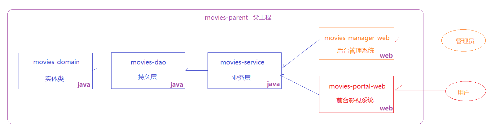 

### 工程导入

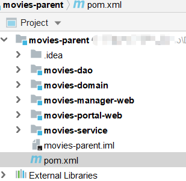  

### 部署测试

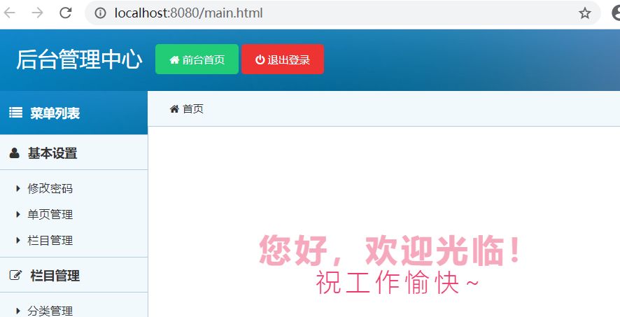 


# 影视管理(重点)

## 影视列表

### movies_list.html

修改`\src\main\webapp\movies_list.html`页面，添加页面加载完成事件，查询影视列表数据。注意：还要考虑点击搜索按钮时候的查询是有条件的

1. 为两个搜索条件绑定数据变量，为搜索按钮绑定点击事件

   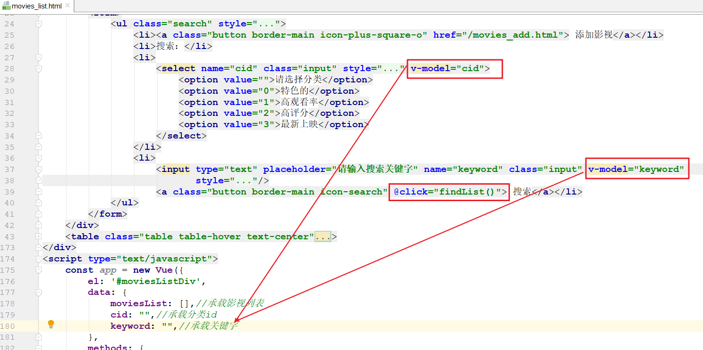

2. 添加查询方法

   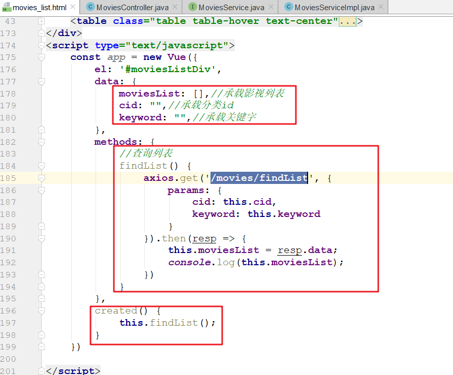 


### MoviesController

在`movies-manager-web模块`创建`com.itheima.web.controller.MoviesController`,添加下面内容

~~~java
@Controller
public class MoviesController {

    @Autowired
    private MoviesService moviesService;

    @RequestMapping("/movies/findList")
    @ResponseBody
    public List<Movies> findList(Integer cid, String keyword) {
        MoviesExample moviesExample = new MoviesExample();
        MoviesExample.Criteria criteria = moviesExample.createCriteria();
        if (cid != null) {
            criteria.andCidEqualTo(cid);
        }
        if (StringUtils.isNotEmpty(keyword)) {
            criteria.andKeywordLike("%" + keyword + "%");
        }
        return moviesService.findList(moviesExample);
    }
}
~~~

### MoviesService

在`movies-service模块`创建`com.itheima.service.MoviesService`,添加下面内容

~~~java
public interface MoviesService {
    List<Movies> findList(MoviesExample moviesExample);
}
~~~

### MoviesServiceImpl

在`movies-service模块`创建`com.itheima.service.MoviesService.impl.MoviesServiceImpl`,添加下面内容

~~~java
@Service
public class MoviesServiceImpl implements MoviesService {

    @Autowired
    private MoviesDao moviesDao;

    @Override
    public List<Movies> findList(MoviesExample moviesExample) {
        return moviesDao.selectByExample(moviesExample);
    }
}
~~~

### movies_list.html

修改`\src\main\webapp\movies_list.html`页面，将查询到的影视列表遍历到页面，查询影视列表数据。

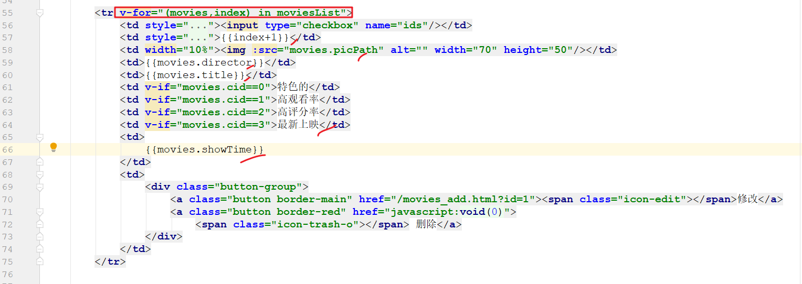 


## 影视新增

>影视新增是有图片文件需要上传的，本次为了图片能够分享，我们采用nginx做为图片存储服务器。
>
>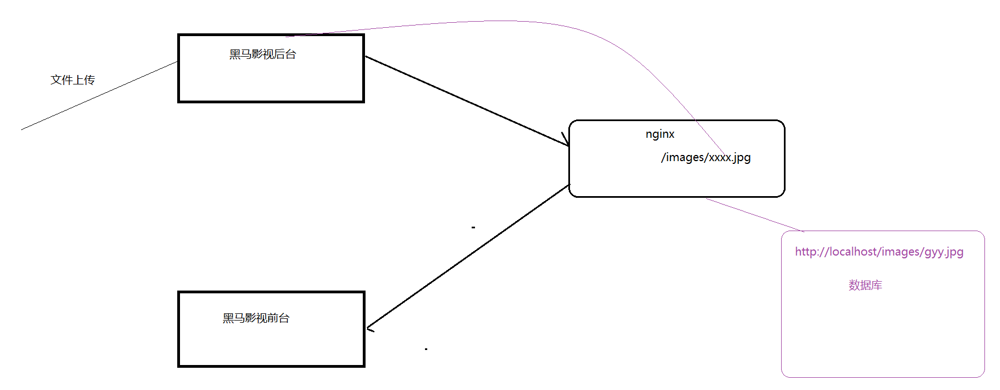 

### movies_list.html

`\src\main\webapp\movies_add.html`页面代码已经写好，表单提交地址为`/movies/save`。 

### spring-mvc.xml

注意：本次提交是有文件需要上传的，所以要在配置文件中配置文件上传解析器。

~~~xml
    <!--文件上传解析器-->
    <bean id="multipartResolver"
          class="org.springframework.web.multipart.commons.CommonsMultipartResolver">
        <property name="maxUploadSize" value="52428800"/>
    </bean>
~~~

### MoviesController

~~~java
    @RequestMapping("/movies/save")
    public String save(Movies movies, MultipartFile img) throws IOException {
        //1. 文件上传保存
        if (img.getSize() > 0) {
            //设置图片路径
            String newFileName = UUID.randomUUID().toString() + img.getOriginalFilename();
            String picPath = "C:\\workspace\\141\\nginx-1.16.0\\html\\images\\" + newFileName;
            //文件上传
            img.transferTo(new File(picPath));
            //向数据库保存文件的路径
            movies.setPicPath("http://localhost/images/" + newFileName);
        }

        //2.保存
        moviesService.save(movies);

        //3. 页面重定向到查询列表页面
        return "redirect:/movies_list.html";
    }
~~~

### MoviesService

~~~java
    void save(Movies movies);
~~~

### MoviesServiceImpl

~~~java
    @Override
    public void save(Movies movies) {
        moviesDao.insertSelective(movies);
    }
~~~


## 影视修改-回显

### movies_list.html

`\src\main\webapp\movies_list.html`页面修改代码已经写好，但是需要我们将跳转地址中的id的值写成动态的。 

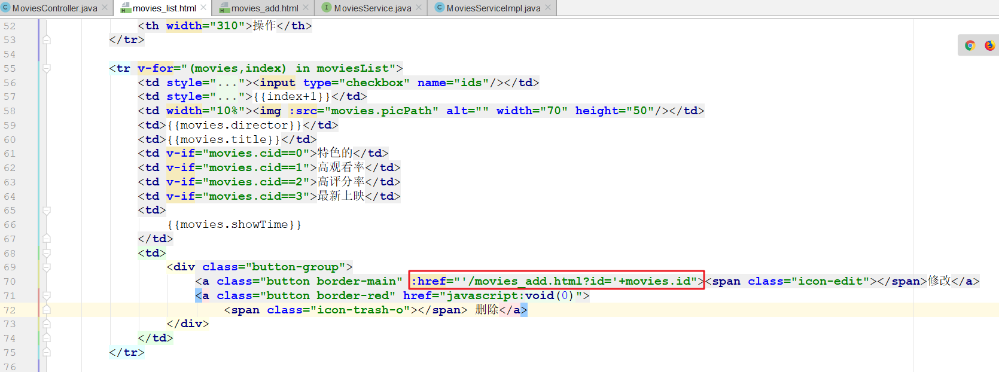 

### movies_add.html

我们将添加和修改功能使用一个页面（movies_add.html）来做，二者的区别在于跳转修改页面的时候，会传入一个id

而我们需要在进入页面的时候判断是否传入了此id，如果有传入，代表是进入修改功能，我们需要根据这个id去查询到对应的影视记录，然后回显到本页面

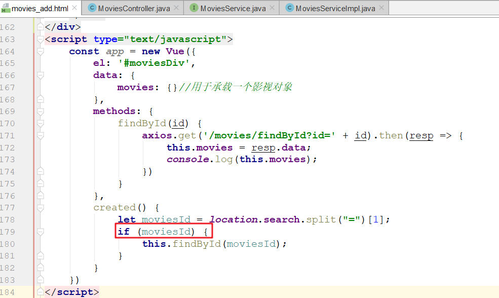 

### MoviesController

~~~java
    //根据id查询
    @RequestMapping("/movies/findById")
    @ResponseBody
    public Movies findById(Integer id) {
        return moviesService.findById(id);
    }
~~~

### MoviesService

~~~java
	Movies findById(Integer id);
~~~

### MoviesServiceImpl

~~~java
    @Override
    public Movies findById(Integer id) {
        return moviesDao.selectByPrimaryKey(id);
    }
~~~


## 影视修改-修改

### movies_add.html

本页面是影视的修改页面，其提交地址是`/movies/save`，也就是修改要和新增使用同一个后台方法。

### MoviesController

~~~java
    //新增或者修改
    @RequestMapping("/movies/save")
    public String save(Movies movies, MultipartFile img) throws IOException {
        //1. 文件上传保存
        if (img.getSize() > 0) {
            //设置图片路径
            String newFileName = UUID.randomUUID().toString() + img.getOriginalFilename();
            String picPath = "C:\\workspace\\141\\nginx-1.16.0\\html\\images\\" + newFileName;
            //文件上传
            img.transferTo(new File(picPath));
            //向数据库保存文件的路径
            movies.setPicPath("http://localhost/images/" + newFileName);
        }

        //2.保存或者更新
        if (movies.getId() == null){

            moviesService.save(movies);
        }else {
            moviesService.update(movies);
        }


        //3. 页面重定向到查询列表页面
        return "redirect:/movies_list.html";
    }
~~~

### MoviesService

~~~java
	void update(Movies movies);
~~~

### MoviesServiceImpl

~~~java
    @Override
    public void update(Movies movies) {
        moviesDao.updateByPrimaryKeySelective(movies);
    }
~~~


## 影视删除

### movies_list.html

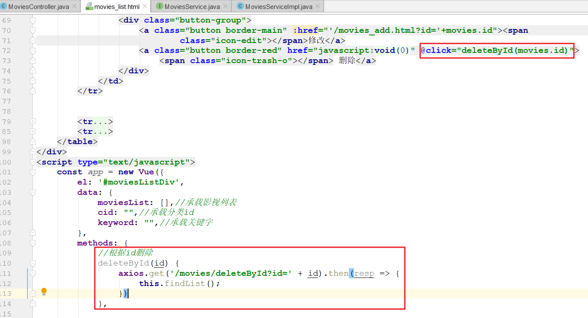 

### MoviesController

~~~java
    //根据id删除
    @RequestMapping("/movies/deleteById")
    @ResponseBody
    public void deleteById(Integer id) {
        moviesService.deleteById(id);
    }
~~~

### MoviesService

~~~java
    void deleteById(Integer id);
~~~

### MoviesServiceImpl

~~~java
    @Override
    public void deleteById(Integer id) {
        moviesDao.deleteByPrimaryKey(id);
    }
~~~


## 影视批量删除

### movies_list.html

1. 为复选框绑定ids

   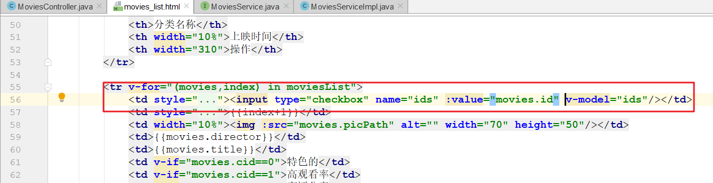 

2. 为批量删除按钮添加点击事件，绑定deleteByIds方法, 添加批量删除方法

   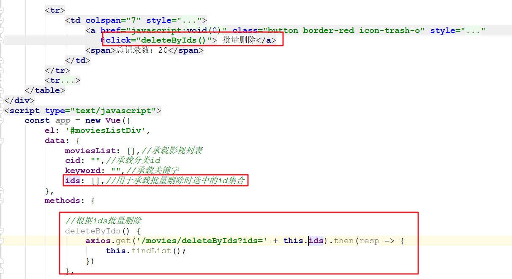 


### MoviesController

~~~java
    //根据ids批量删除
    @RequestMapping("/movies/deleteByIds")
    @ResponseBody
    public void deleteById(Integer[] ids) {
        moviesService.deleteByIds(ids);
    }
~~~

### MoviesService

~~~java
    void deleteByIds(Integer[] ids);
~~~

### MoviesServiceImpl

~~~java
    @Override
    public void deleteByIds(Integer[] ids) {
        if (ids != null && ids.length > 0) {
            for (Integer id : ids) {
                moviesDao.deleteByPrimaryKey(id);
            }
        }
    }
~~~


# 列表分页

## 分页思路

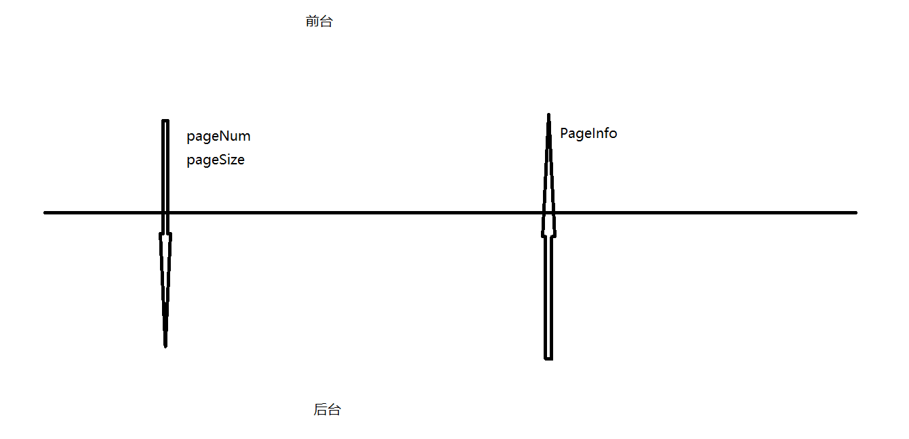 

## 后台实现

### PageHelper介绍

PageHelper是一款优秀的开源mybatis分页插件，它支持常用的数据库，例如 mysql、oracle等。网址：https://pagehelper.github.io/

PageHelper的使用非常简单，主要包括下面３步：

第１步：引入坐标(已处理)

~~~xml
<dependency>
   <groupId>com.github.pagehelper</groupId>
   <artifactId>pagehelper</artifactId>
   <version>${pagehelper.version}</version>
 </dependency>
~~~

第２步：添加配置

在SqlSessionFactoryBean的配置中添加一个plugins项

~~~xml
<!--sqlSessionFactory-->
<bean id="sqlSessionFactory" class="org.mybatis.spring.SqlSessionFactoryBean">
    <property name="dataSource" ref="dataSource"/>
    <property name="plugins">
        <array>
            <bean class="com.github.pagehelper.PageInterceptor">
                <property name="properties">
                    <value>
                        helperDialect=mysql
                    </value>
                </property>
            </bean>
        </array>
    </property>
</bean>
~~~

第３步：开始使用

~~~java
// 设置要查询的页码和每页大小
PageHelper.startPage(pageNum,pageSize); 

// 执行一个查询, 注意这个查询中不用再去写分页条件(limit)
List<Movies> list = companyDao.findAll();

// 组装一个PageInfo 参数1: 上一步查询得到的集合  参数2: 页面显示几个页码
return new PageInfo<Movies>(list,10);
~~~

### 配置分页插件

在applicationContext-dao.xml配置文件中的SqlSessionFactoryBean的配置中添加一个plugins项

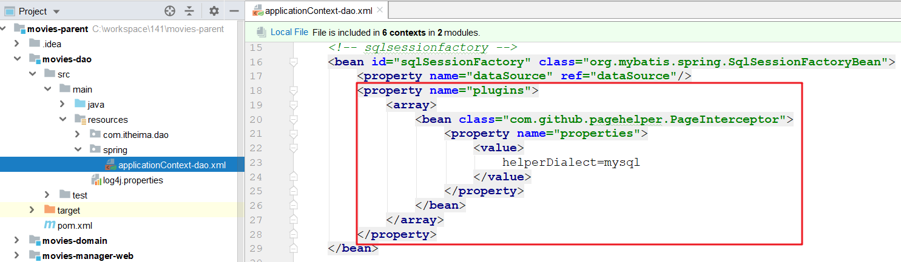 

### MoviesController

~~~java
    //带条件列表分页查询
    @RequestMapping("/movies/findByPage")
    @ResponseBody
    public PageInfo<Movies> findByPage(Integer cid, String keyword,
                                       @RequestParam(defaultValue = "1") Integer pageNum,
                                       @RequestParam(defaultValue = "10") Integer pageSize) {
        MoviesExample moviesExample = new MoviesExample();
        MoviesExample.Criteria criteria = moviesExample.createCriteria();
        if (cid != null) {
            criteria.andCidEqualTo(cid);
        }
        if (StringUtils.isNotEmpty(keyword)) {
            criteria.andKeywordLike("%" + keyword + "%");
        }

        moviesExample.setOrderByClause("show_time desc");

        return moviesService.findByPage(moviesExample,pageNum,pageSize);
    }
~~~

### MoviesService

~~~java
    PageInfo<Movies> findByPage(MoviesExample moviesExample, Integer pageNum, Integer pageSize);
~~~

### MoviesServiceImpl

~~~java
    @Override
    public PageInfo<Movies> findByPage(MoviesExample moviesExample, Integer pageNum, Integer pageSize) {
        //1. 设置pageNum和pageSize
        PageHelper.startPage(pageNum,pageSize);

        //2. 调用dao的查询所有方法
        List<Movies> movies = moviesDao.selectByExample(moviesExample);

        //3. 组装一个PageInfo并返回
        return new PageInfo<Movies>(movies);
    }
~~~

### 分页原理说明

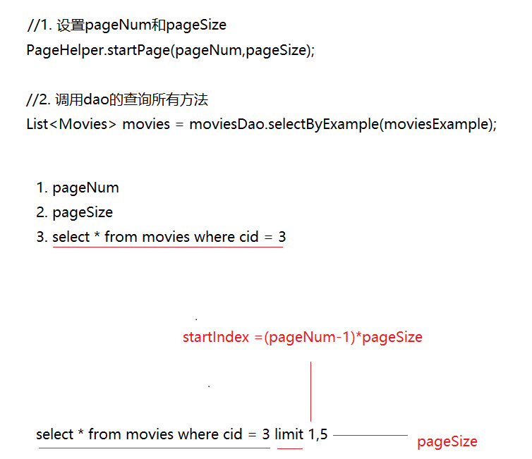 


## 前台请求发送

 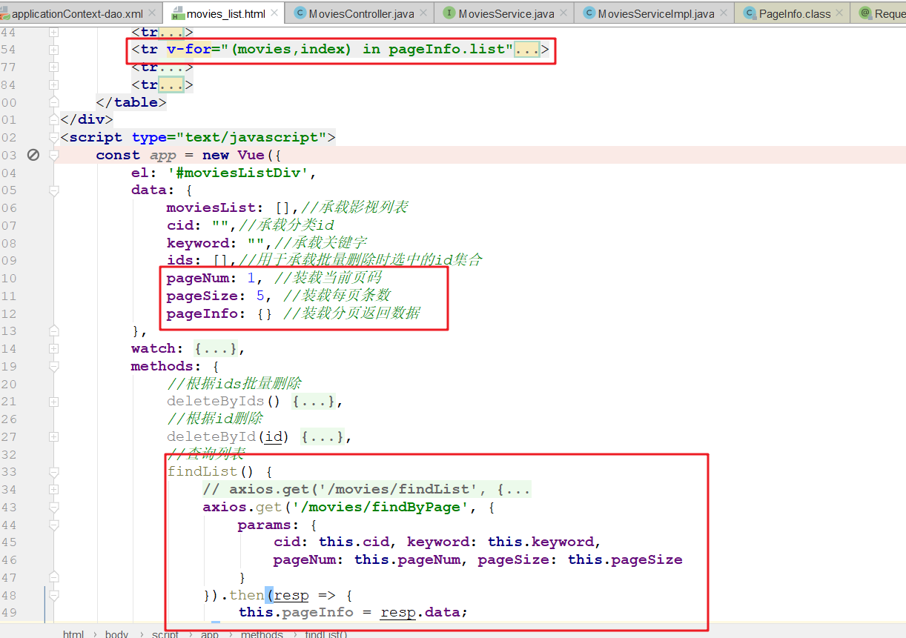 

## 前台结果处理

### 返回数据查看

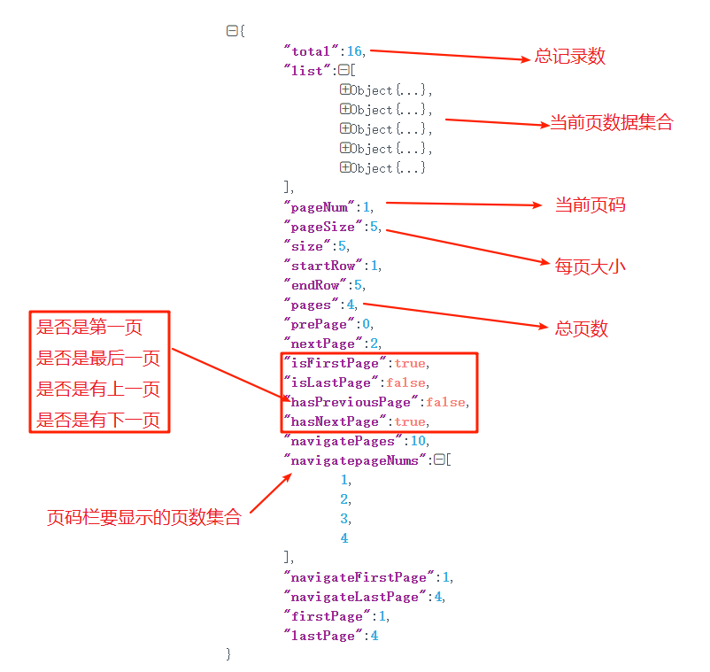 

### 遍历数据到页面

 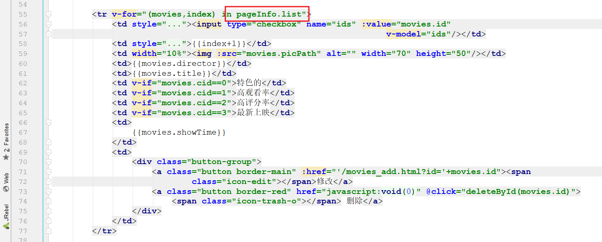 

### 实现分页栏

监听pageNum，当它的值变化时，重新查询

 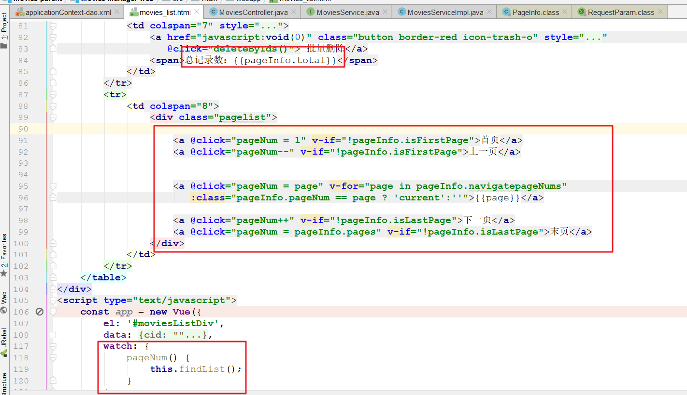

 


