# 回顾

~~~markdown
1. 环境(分模块) domain----dao-----service-----后台(manager-web)
                                    |
                                    |
                            前台(portal-web) 

2. manager-web: 影视的增删改查   分页插件  轮播图增删改查

3. portal-web:  影视列表(vue的for使用)   影视详情  评论列表   发表评论

今天: 会员登录     页面静态化     域名访问
 
~~~


# 会员登录

## 后台

### IndexController

~~~java
    //会员登录
    @RequestMapping("/index/login")
    @ResponseBody
    public String login(String username, String password, HttpServletRequest request) {

        //会员登录
        Members members = membersService.login(username, password);

        //判断登录成功或者失败
        if (members == null) {
            //登录失败
            return "fail";
        } else {
            //登录成功
            //将用户信息放入session
            request.getSession().setAttribute("currentMember", members);

            //返回标识
            return "success";
        }
    }
~~~

### MembersService

在`movies-service`模块下的`com.itheima.service.MembersService`接口中添加下面的方法

~~~java
package com.itheima.service;

import com.itheima.domain.Members;

public interface MembersService {
    //会员登录
    Members login(String username, String password);
}
~~~

### MembersServiceImpl

在`movies-service`模块下的`com.itheima.service.impl.MembersServiceImpl`类中添加下面的方法

~~~java
package com.itheima.service.impl;

import com.itheima.dao.MembersDao;
import com.itheima.domain.Members;
import com.itheima.domain.MembersExample;
import com.itheima.service.MembersService;
import org.springframework.beans.factory.annotation.Autowired;
import org.springframework.stereotype.Service;

import java.util.List;

@Service
public class MembersServiceImpl implements MembersService {
    @Autowired
    private MembersDao membersDao;


    @Override
    public Members login(String username, String password) {

        //1. 封装查询条件
        MembersExample membersExample = new MembersExample();
        membersExample.createCriteria().andUsernameEqualTo(username).andPasswordEqualTo(password);

        //2. 进行查询
        List<Members> membersList = membersDao.selectByExample(membersExample);

        //3. 返回结果
        if (membersList == null || membersList.size() == 0) {//查询不到
            return null;
        } else {//查询到
            return membersList.get(0);//获取到查询的对象
        }
    }
}
~~~

## 前端

### 添加绑定

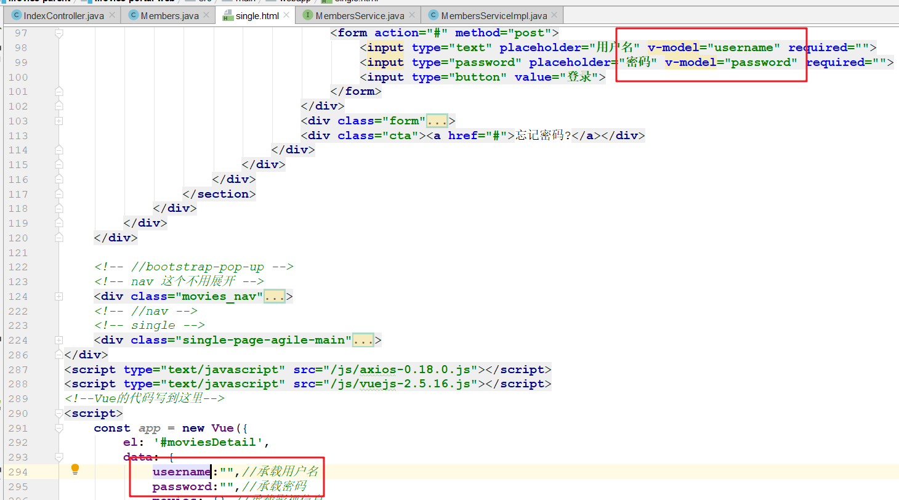 

### 添加登录方法

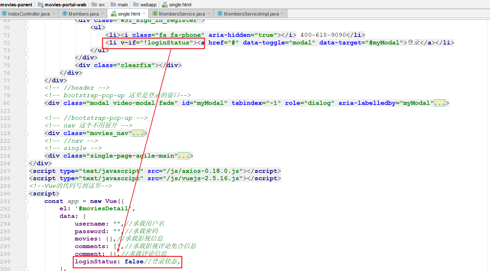 

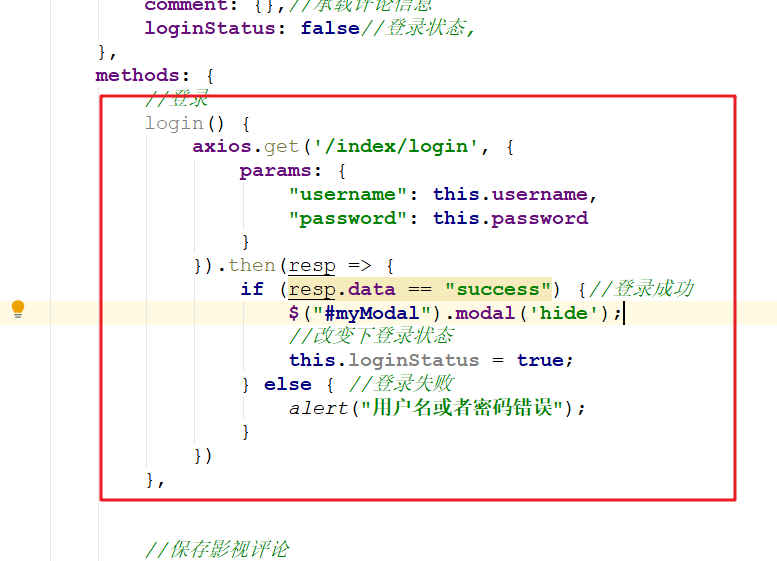 


# 登录状态获取

## 后台

```java
    //查询当前用户是否登录
    @RequestMapping("/index/loginStatus")
    @ResponseBody
    public Boolean loginStatus(HttpServletRequest request) {
        //1. 判断session中是否存在登录标识
        Members currentMember = (Members) request.getSession().getAttribute("currentMember");

        //2. 返回结果
        if (currentMember == null) {//session中没有,未登录
            return false;
        } else {//session中有,已登录
            return true;
        }
    } 
```

## 前端

 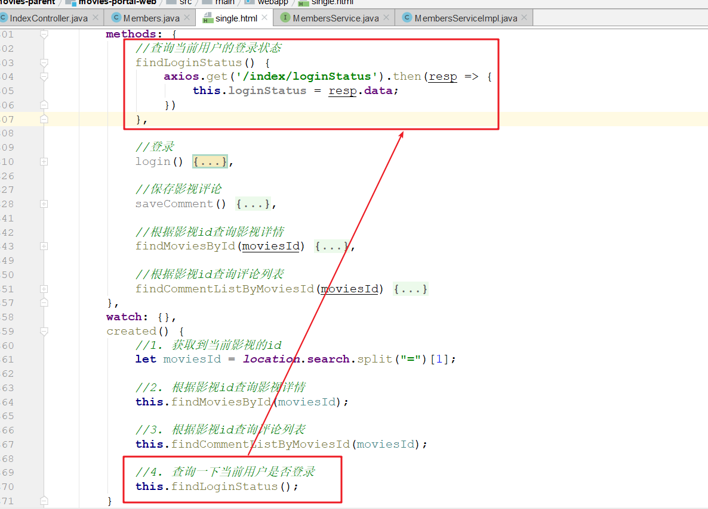

## 修改评论功能

### 前端修改

> 在提交评论之前判断用户是否登录

  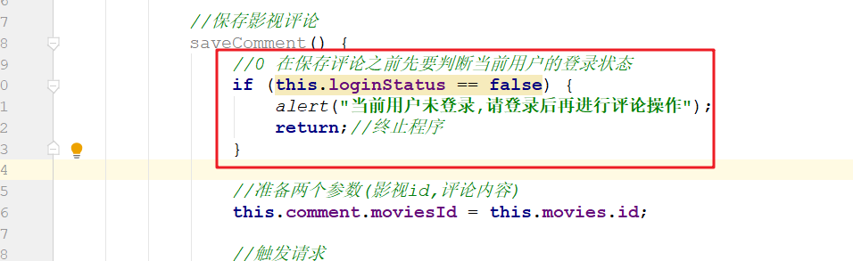 

### 后台修改

> 修改添加评论代码将会员姓名和id设置成从session中获取

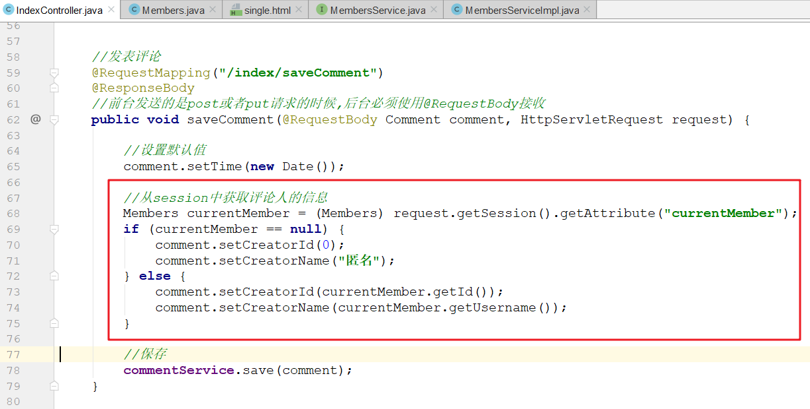 


# Freemarker

## Freemarker介绍

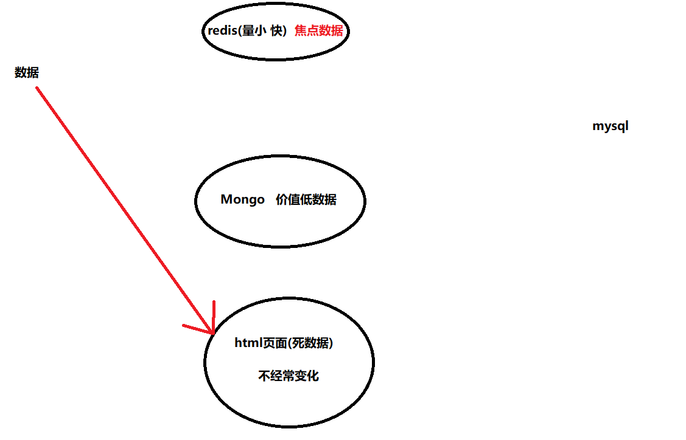 

### 页面静态化

目前每次访问门户网站进入首页时：轮播图和影视列表都需要从后台获取数据展示，如果并发量高时会给MySQL造成很大的访问压力。

解决这种问题的方式有两种：

1. 使用缓存，比如redis  
2. 页面静态化，将当前页面生成一个静态的html页面

在业界，可以实现页面静态化的技术有很多，比如说：jsp、velocity、thymeleaf、freemarker等等，其中freemarker是使用最多的一个。

### 什么是Freemarker

FreeMarker 是一个用Java语言编写的模板引擎，它基于模板来生成文本，支持：XML，html 或 Java 等

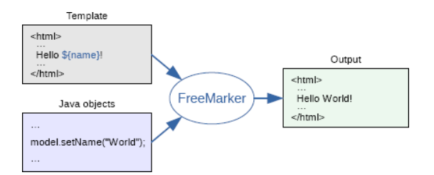 

## 入门案例

### 准备模板

~~~html
<h3>
    欢迎回来,${username}
</h3>
<hr>
~~~

### 模板赋值

 ~~~java
    public static void main(String[] args) throws IOException, TemplateException {
        //1. 创建freemark配置对象
        Configuration configuration = new Configuration(Configuration.getVersion());

        //2. 设置模板目录
        configuration.setDirectoryForTemplateLoading(
                new File("C:\\workspace\\bk\\movies-parent\\movies-portal-web\\src\\main\\webapp\\ftl"));

        //3. 设置模板字符集
        configuration.setDefaultEncoding("utf-8");

        //4. 加载模板对象
        Template template = configuration.getTemplate("demo.ftl");

        //5. 准备数据模型
        HashMap<Object, Object> map = new HashMap<>();
        map.put("username", "黑马程序员");

        //6. 设置文件输出位置
        FileWriter fileWriter = new FileWriter("c:/upload/demo.html");

        //7. 文件输出
        template.process(map, fileWriter);

        //8. 释放资源
        fileWriter.close();
    }
 ~~~

### 结果输出

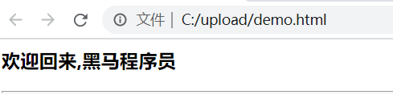  


## 常用语法

###  include

>include 用于在一个模板中导入另外的模板文件
>
>~~~html
><#include "top.ftl">
>~~~

**top.ftl**

~~~html
<h2>这个页面是用来演示FreeMark语法的</h2>
<hr>
~~~

**demo.ftl**

 ~~~html
<#--include表示在一个ftl中引入另外一个ftl-->
<#include 'top.ftl'>

<h3>欢迎回来,${username}</h3>
<hr>
 ~~~


### assign

>assign 用于变量的赋值
>
>~~~html
><#assign 变量名=变量值>
>~~~

 ~~~html
<#--assign用于赋值-->
<#assign username="传智教育">
<h3>欢迎回来,${username}</h3>
<hr>
 ~~~


### if-else

>if-else 用于实现条件判断
>
>~~~html
><#if>
>    逻辑1
><#else>
>    逻辑2
></#if>
>    
>    
>if(){
>     逻辑1
>}else{
>	逻辑2
>}
>~~~

  ~~~html
<#--如果user存在,显示用户名;如果user不存在,显示请登录-->
<#--<#assign user={"username":"张三","age":"18"}>-->
<#--<#if user ?exists>-->
<#if user ??>
    欢迎您,${user.username}
<#else>
    请登录
</#if>
  ~~~


###  list

>list 用于数据的遍历
>
>~~~html
><#list list as emp>   </#list>
>
><#list map?keys as key>   </#list> 
><#list map?values as value>   </#list>    
>~~~

~~~html
<#--list遍历-->
<#assign myList=["张三","李四","王五"]>

<#list  myList as emp>
    ${emp}--
</#list>
<hr>

<#--map遍历-->
<#--map['1001']-->
<#assign myMap={"1001":"张三","1002":"李四"}>
遍历键:
<#list myMap?keys as key>
    ${key}--
</#list>
<br>
遍历值:
<#list myMap?values as value>
    ${value}--
</#list>
<br>
遍历键值:
<#list myMap?keys as key>
    ${key}--${myMap['${key}']}
</#list>
~~~


## 内置函数

> 语法：`变量?函数名`       变量.函数名  arr.length    list.size()
>
> ~~~markdown
> 1. 获取集合大小: ${strList?size}
> 2. 转换数字为字符串: ${数字?c}
> 3. 转换JSON字符串为对象: json字符串?eval
> 4. 日期格式化
> 	日期：${.now?date}
> 	时间：${.now?time}
> 	日期时间：${.now?datetime}
> 	自定义格式：${.now?string('yyyy年MM月dd日')}
> ~~~

 ~~~html
<h3>常见函数</h3>
获取集合长度:${myList?size}<br>
转换数字为字符串: ${8+9} ======${8?c+9?c}<br>
<#assign member='{"1001":"张三","1002":"李四"}'?eval>
转换JSON字符串为对象:${member['1001']}<br>
日期:${.now}<br>
年月日:${.now?date}<br>
时间:${.now?time}<br>
自定义格式：${.now?string('yyyy年MM月dd日')}
 ~~~


# 门户首页静态化

## 添加模板文件

从资料中复制对应的模板代码到工程中

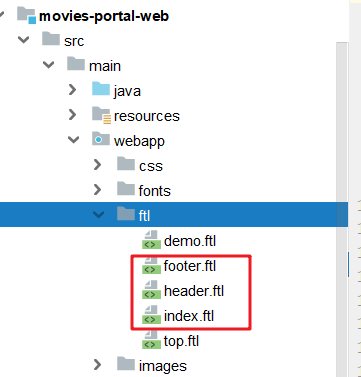  

## 配置模板位置

在`movies-portal-web`模块的`spring-mvc.xml`配置文件中添加下面的配置

~~~xml
    <!-- 把Freemarker的 freemarkerConfig这个对象放在容器中管理-->
    <bean id="freemarkerConfig"	class="org.springframework.web.servlet.view.freemarker.FreeMarkerConfigurer">
        <property name="templateLoaderPath" value="/ftl/" />
        <property name="defaultEncoding" value="UTF-8" />
    </bean>
~~~

## 添加生成模板的方法

在`IndexController`中添加下面的方法

~~~java
    @Autowired
    private FreeMarkerConfig freeMarkerConfig;

    @Autowired
    private BannerService bannerService;

    @RequestMapping(value = "/generatorHtml", name = "生成页面静态化")
    @ResponseBody
    public String generatorHtml(HttpSession session) throws Exception {
        // 1.获取FreeMarker配置对象 （已经指定了模板目录和字符集编码）
        Configuration configuration = freeMarkerConfig.getConfiguration();
        // 2.获取模板对象
        Template template = configuration.getTemplate("index.ftl");
        // 3.准备数据
        Map<String, Object> model = new HashMap<>();
        // 轮播图列表
        PageInfo<Banner> pageInfo = bannerService.findPage(new BannerExample(), 1, 5);
        model.put("bannerList", pageInfo.getList());

        // 影视列表
        Map<String, List<Movies>> moviesMap = moviesService.findMoviesListMap();
        model.put("moviesMap", moviesMap);

        // 4.指定输出路径
        String outPath = session.getServletContext().getRealPath("/") + "/index.html";
        Writer writer = new OutputStreamWriter(new FileOutputStream(new File(outPath)), "utf-8");

        // 5.合并输出
        template.process(model, writer);

        // 6.释放资源
        writer.close();

        return "生成index.html完毕";
    }
~~~


# 域名访问

## 介绍

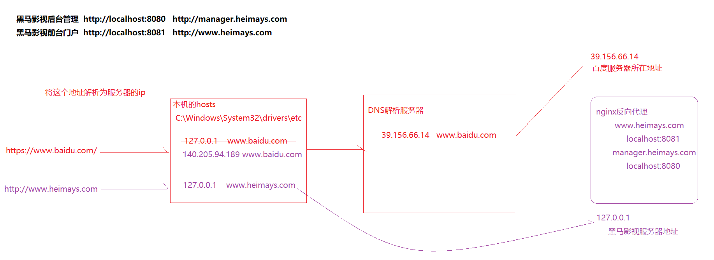 

## 配置host

> 编辑电脑的host文件，位置`C:\Windows\System32\drivers\etc\hosts`，注意在修改之前先做备份

```properties
127.0.0.1 www.heimays.com  
127.0.0.1 manage.heimays.com
```

## 配置Nginx 

>编辑nginx的配置文件, 添加下面的配置

```nginx
server { 
    listen       80;
    server_name  www.heimays.com;	
    location / {
        proxy_pass   http://localhost:8081;
        proxy_connect_timeout 60;
        proxy_read_timeout 60;
    }
}

server { 
    listen       80;
    server_name  manage.heimays.com;	
    location / {
        proxy_pass   http://localhost:8080;
        proxy_connect_timeout 60;
        proxy_read_timeout 60;
    }
}
```


