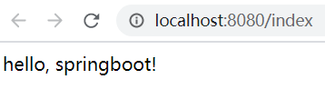

# 简介

## Spring优缺点

~~~markdown
* 优点：
		Spring是一个轻量级的Java开源框架，通过IOC和AOP轻松实现程序开发。
* 缺点：
		1. 添加一个框架或技术时，需要添加相应的maven依赖    (起步依赖)
		2. 添加一个框架或技术时，引入的依赖可能出现依赖冲突    (版本锁定)
		3. 添加一个框架或技术时，需要添加大量的配置  (自动配置)
~~~

## SpringBoot概述

~~~markdown
* SpringBoot对Spring的缺点进行的改善和优化，它基于`约定优于配置`的思想，提供了大量的默认配置和实现
* 使用SpringBoot之后，程序员只需按照SpringBoot规定的方式去进行程序代码的开发即可，而无需再去编写一堆复杂的配置
* SpringBoot的主要功能如下：
		版本锁定：SpringBoot在父工程中进行了大量常见依赖的版本锁定
		起步依赖：SpringBoot以功能化的方式将需要的依赖进行组装，并且允许程序员以start的方式进行引入(ssm-starter)
		自动配置：SpringBoot实现了大量依赖框架的默认配置项，程序员无须再进行自己配置
		内置Tomcat：SpringBoot内置了一个tomcat，使用它开发的程序无需再进行tomcat部署，可直接运行
* 总之：SpringBoot最主要作用就是帮我们快速的构建庞大的spring项目，并且尽可能的减少配置，让程序员去关注业务而非配置。
~~~


# 入门案例

> 需求：搭建一个SpingBoot项目，实现访问浏览器地址`localhost:8080/index`, 返回`hello, springboot! `这句话

## 代码开发

### 创建父工程

>创建一个`Empty Project`

 

### 创建模块，导入依赖

>注意: springboot工程要求必须去继承一个springboot提供的父工程，里面对大量的依赖版本进行了锁定

```xml
<?xml version="1.0" encoding="UTF-8"?>
<project xmlns="http://maven.apache.org/POM/4.0.0"
         xmlns:xsi="http://www.w3.org/2001/XMLSchema-instance"
         xsi:schemaLocation="http://maven.apache.org/POM/4.0.0 http://maven.apache.org/xsd/maven-4.0.0.xsd">
    <modelVersion>4.0.0</modelVersion>

    <groupId>com.itheima</groupId>
    <artifactId>springboot-quickstart</artifactId>
    <version>1.0-SNAPSHOT</version>

    <!--1. 设置父工程: 里面进行版本的锁定-->
    <parent>
        <groupId>org.springframework.boot</groupId>
        <artifactId>spring-boot-starter-parent</artifactId>
        <version>2.2.2.RELEASE</version>
    </parent>

    <!--2. 引入依赖启动器: 里面是一堆需要的依赖的集合-->
    <dependencies>
        <dependency>
            <groupId>org.springframework.boot</groupId>
            <artifactId>spring-boot-starter-web</artifactId>
        </dependency>
        <!--lombok-->
        <dependency>
            <groupId>org.projectlombok</groupId>
            <artifactId>lombok</artifactId>
        </dependency>
    </dependencies>
</project>
```

 

### 编写Controller

 

### 编写启动类

 

### 测试

 

## 案例解析

~~~markdown
* 做完了入门案例，我们应该会有下面这样几个疑问：
	1. 我们的工程在引入`spring-boot-starter-web`依赖的时候，为什么没有指定版本
	2. `spring-boot-starter-web`是个啥，为什么引入了它之后，就不需要再引入我们原来做spring开发的那一堆包了
	3. 我们的程序没有部署到tomcat，为什么就可以被访问
	4. 为什么我们访问程序的时候要用8080端口，谁定义的
~~~

### 版本锁定

> 我们的项目继承了`spring-boot-starter-parent`父工程，它内部已经锁定了一些常见依赖的版本号，故而在我们自己开发的工程中无需再指定依赖的版本。

  

### 起步依赖

>SpringBoot根据场景将各种依赖组装成了一个个的集合（starter），我们根据功能引入指定的start即可。

 

### 内置tomcat

>SpringBoot在中引入一个内置的tomcat，故而我们无需再将程序部署到位置的tomcat中即可运行。

 

### 自动配置

> SpringBoot的`约定大于配置`，即SpringBoot的大量配置都有默认值，如果我们不去写配置就使用默认的。
>
> **比如说：**tomcat默认端口 8080、redis 默认端口6379 、session 的过期默认时间为30m等等

 


# 配置文件说明

## 自定义配置

>SpringBoot是基于约定的，很多配置都有默认值，但它也允许使用自己的配置替换默认配置，具体做法是在resources下创建文件：
>
>~~~sql
>application.yml   或者   application.yaml  或者  application.properties
>~~~
>
>注意：SpringBoot启动时会依次加载：yml、yaml、properties文件，如果多个配置文件同时存在，后加载的会覆盖前面加载的内容。

 

## YAML介绍

> YAML 是专门用来写配置文件的语言，非常简洁和强大。

### 语法

```yaml
# 大小写敏感
# 使用缩进表示层级关系
# 缩进的空格数目不重要，但是相同层级的元素必须左侧对齐 
# 参数值和冒号之间必须有空格
server:
  port: 8082
  servlet:
     context-path: /itheima
```

### 数据格式

```yaml
# 纯量：单个的、不可再分的值（包括字符串字符串、布尔值、数值、Null、时间类型）
username: 'jack'

# 对象：键值对的集合，又称为映射（mapping）/ 哈希（hashes） / 字典（dictionary）
user:
  username: '张三'
  password: '123'
  
# 数组：一组按次序排列的值，又称为序列（sequence） / 列表（list）
addressList:
  - '北京'
  - '上海'
  - '广州'
```


## 读取配置

~~~markdown
* 方式一: Environment（了解）
	此对象是Spring框架提供的，用来表示整个应用运行时的环境，可以读取配置文件中的属性值并逐个注入到Bean对象的对应属性中

* 方式二: @Value 
	此注解是Spring框架提供的，用来读取配置文件中的属性值并逐个注入到Bean对象的对应属性中

* 方式三: @Configuration 
	此注解是SpringBoot框架提供的，用来快速、方便地将配置文件中的自定义属性值批量注入到某个Bean对象的多个对应属性中
~~~

### Environment

 

### @Value

 

### @ConfigurationProperties (重点)

1. 创建一个配置类读取配置信息

    

2. 在使用的地方直接注入配置类

     


# 整合Junit

## 引入依赖

> 在pom.xml加入单元测试的starter

```xml
<!--引入junit依赖启动器-->
<dependency>
    <groupId>org.springframework.boot</groupId>
    <artifactId>spring-boot-starter-test</artifactId>
</dependency>
```

## 编写测试类

 


# 整合SpringMVC

## 日志输出设置

~~~yaml
# 日志级别设置格式是   
# 包名: 日志级别(常用的级别有4个: debug info warn error)
logging:
  level:
    org.springframework: error
    com.itheima: info
~~~

## 访问静态资源

> 现在项目是一个普通java工程，没有webapp，那么静态资源应该放哪里呢？ 其实SpringBoot已经定义了几个位置用于存放静态资源
>
> ~~~java
> public class ResourceProperties {
> //定义了静态资源路径
> private static final String[] CLASSPATH_RESOURCE_LOCATIONS = 
>   	new String[]{"classpath:/META-INF/resources/", "classpath:/resources/", "classpath:/static/", "classpath:/public/"};
> }
> ~~~
>
> 我们习惯会把静态资源放在`classpath:/static/` 目录下。
>
> ~~~yaml
> # 当然，如果想自定义位置也可以，使用下面格式即可
> spring:
> 	resources:
>  		static-locations: classpath:/templates/
> ~~~

  

## 拦截器配置

> 在SpringBoot中，拦截器的配置是使用java注解实现的，主要分为下面两步骤：
>
> 1. 自定义拦截器类(干什么)
> 2. 使用java注解配置将自定义的拦截器类注册到SpringBoot(拦住谁)

### 定义拦截器

> 自定义一个类实现HandlerInterceptor接口，重写自己需要的方法

 

### 注册拦截器

>自定义一个配置类，实现WebMvcConfigurer接口，并通过addInterceptors方法将自己的拦截器注册到SpringBoot

 


# 整合Thymeleaf

> Thymeleaf是一个用于展示页面的模板引擎，类似于jsp，但是springboot推荐用Thymeleaf，因为其开发和运行效率比jsp要高。

## 添加依赖

```xml
<!--thymeleaf 起步依赖-->
<dependency>
    <groupId>org.springframework.boot</groupId>
    <artifactId>spring-boot-starter-thymeleaf</artifactId>
</dependency>
```

## 添加配置

> Springboot默认使用的就是Thymeleaf视图解析器，在执行页面跳转的时候，自动的从`resources/templates`文件夹中找到对应xxx.html页面
>
> 因此我们仅仅需要将我们的页面文件放入对应的位置即可，如果想自定义模板的位置和格式可以使用下面的配置
>
> ~~~yaml
> spring：
> 	thymeleaf： 
> 		prefix：classpath:/templates/  # 自定义前缀
> 		suffix：.html # 自定义后缀
> ~~~

## 开发后台代码

**User**

~~~java
package com.itheima.domain;

import lombok.AllArgsConstructor;
import lombok.Data;
import lombok.NoArgsConstructor;

@Data
@NoArgsConstructor
@AllArgsConstructor
public class User {
    private Long id;
    private String username;
    private String password;
    private String nickName;
    private Integer age;
    private String email;
}
~~~

**UserController**

~~~java
package com.itheima.web.controller;

import com.itheima.domain.User;
import org.springframework.stereotype.Controller;
import org.springframework.web.bind.annotation.RequestMapping;

import javax.servlet.http.HttpServletRequest;
import java.util.*;

@Controller
public class UserController {

    @RequestMapping("/user/list")
    public String list(HttpServletRequest request) {

        //1. 模拟数据
        List<User> users = new ArrayList<User>();
        users.add(new User(1L, "张三", "admin", "zhangsan", 19, "zhangsan@itcast.cn"));
        users.add(new User(2L, "李四", "admin", "lisi", 19, "zhangsan@itcast.cn"));
        users.add(new User(3L, "王五", "admin", "wangwu", 19, "zhangsan@itcast.cn"));
        users.add(new User(4L, "赵六", "admin", "zhaoliu", 19, "zhangsan@itcast.cn"));
        users.add(new User(5L, "孙七", "admin", "sunqi", 19, "zhangsan@itcast.cn"));
        users.add(new User(6L, "钱八", "admin", "qianba", 19, "zhangsan@itcast.cn"));

        //2 放入request域
        request.setAttribute("users", users);

        //3. 页面转发
        return "user_list";
    }
}
~~~

## 开发前端代码

在`resources/templates`放置`user_list.html`

~~~html
<!DOCTYPE html>
<html lang="en" xmlns:th="http://www.w3.org/1999/xhtml">
<head>
    <meta charset="UTF-8">
    <title>Title</title>
</head>
<body>
<table border="1" cellpadding="0" cellspacing="0">
    <tr>
        <td>id</td>
        <td>username</td>
        <td>password</td>
        <td>nickName</td>
        <td>age</td>
        <td>email</td>
    </tr>
    <tr th:each="user:${users}">
        <td th:text="${user.id}">id</td>
        <td th:text="${user.username}">username</td>
        <td th:text="${user.password}">password</td>
        <td th:text="${user.nickName}">nickName</td>
        <td th:text="${user.age}">age</td>
        <td th:text="${user.email}">email</td>
    </tr>
</table>
</body>
</html>
~~~


# 整合Mybatis 

## 整合步骤

### 数据准备

> 使用下面的sql创建数据库和表

~~~sql
CREATE DATABASE `springboot`;
USE `springboot`;

DROP TABLE IF EXISTS `tb_user`;
CREATE TABLE `tb_user` (
  `id` bigint(20) NOT NULL AUTO_INCREMENT COMMENT '主键ID',
  `username` varchar(20) NOT NULL COMMENT '用户名',
  `password` varchar(20) NOT NULL COMMENT '密码',
  `nick_name` varchar(30) DEFAULT NULL COMMENT '姓名',
  `age` int(11) DEFAULT NULL COMMENT '年龄',
  `email` varchar(50) DEFAULT NULL COMMENT '邮箱',
  PRIMARY KEY (`id`)
) ENGINE=InnoDB AUTO_INCREMENT=6 DEFAULT CHARSET=utf8;


insert  into `tb_user`(`id`,`username`,`password`,`nick_name`,`age`,`email`) values 
(1,'zhangsan','123456','张三',18,'test1@itcast.cn'),
(2,'lisi','123456','李四',20,'test2@itcast.cn'),
(3,'wangwu','123456','王五',28,'test3@itcast.cn'),
(4,'zhaoliu','123456','赵六',21,'test4@itcast.cn'),
(5,'sunqi','123456','孙七',24,'test5@itcast.cn');
~~~

### 添加依赖

> 在pom.xml中加入下面依赖

~~~xml
        <!--调整mysql的版本-->
        <dependency>
            <groupId>mysql</groupId>
            <artifactId>mysql-connector-java</artifactId>
            <version>5.1.6</version>
        </dependency>
        <!--加入mybatis的启动器,这是mybatis公司提供的-->
        <dependency>
            <groupId>org.mybatis.spring.boot</groupId>
            <artifactId>mybatis-spring-boot-starter</artifactId>
            <version>2.1.1</version>
        </dependency>
~~~

### 创建UserMapper接口

>创建dao层的接口，推荐使用类似于xxxMapper的名字

 

### 创建UserMapper映射 

>在resources下创建`mappers`目录，然后在此目录下创建`UserMapper.xml`文件，注意：这里用做到包的对应

   

~~~xml
<?xml version="1.0" encoding="UTF-8" ?>
<!DOCTYPE mapper PUBLIC "-//mybatis.org//DTD Mapper 3.0//EN" "http://mybatis.org/dtd/mybatis-3-mapper.dtd">
<mapper namespace="com.itheima.mapper.UserMapper">
    <select id="findAll" resultType="com.itheima.domain.User">
        select * from tb_user
    </select>
</mapper>
~~~

### 添加配置文件

> 在配置文件`application.yaml`中添加数据源和mybatis的配置

```yaml
# 数据源配置（springboot内置连接池对象HiKariCP）
spring:
  datasource:
    driver-class-name: com.mysql.jdbc.Driver
    url: jdbc:mysql:///springboot
    username: root
    password: root

# mybatis简单配置
mybatis:
  mapper-locations: classpath:mappers/** # 指定mapper映射文件
  configuration:
    map-underscore-to-camel-case: true # 开启驼峰式映射
```

### 修改启动类

> 修改启动类，在类中使用`@MapperScan`注解指定mapper接口所在的包

  

### 测试

>修改`UserController`代码为从数据库查询，然后重启程序进行测试。

 

## 切换数据源

> Springboot 2.2.0版本之后，内置了HiKariCP连接池，那如何将其切换换成druid连接池呢？

1. 修改pom.xml，添加druid的依赖

   ```xml
   <!--druid依赖-->
   <dependency>
       <groupId>com.alibaba</groupId>
       <artifactId>druid</artifactId>
       <version>1.1.15</version>
   </dependency>
   ```

2. 修改application.yaml，添加`spring.datasource.type`配置项

   ~~~yaml
   # 连接池配置（springboot内置连接池对象HiKariCP）
   spring:
     datasource:
       driver-class-name: com.mysql.jdbc.Driver
       url: jdbc:mysql:///springboot
       username: root
       password: root
       type: com.alibaba.druid.pool.DruidDataSource
   ~~~


# 整合Redis

> Spring为了让开发者简化Jedis的操作，提供了`spring-data-redis`框架，它对reids底层开发包(Jedis)进行了高度封装，
>
> 通过`RedisTemplate`对象实现了redis各种操作、异常处理及序列化，支持发布订阅等功能。

## 案例开发

### 添加依赖

>在pom.xml中加入下面依赖

```xml
<!--redis 起步依赖-->
<dependency>
    <groupId>org.springframework.boot</groupId>
    <artifactId>spring-boot-starter-data-redis</artifactId>
</dependency>
```

### 添加配置(可以省略)

> Springboot默认会连接localhost:6379端口，然后操作索引为0的数据，如果需要调整，可以使用下面的配置
>
> ~~~yaml
> spring:
> 	redis:
>          host: localhost # 服务器地址
>          port: 6379 # 端口
>          database: 0 # 使用库的索引标识
> ~~~

### 测试

 

## 模板对象

| 模板对象            | 序列化方式                      | 序列化效果                                                   |
| ------------------- | ------------------------------- | ------------------------------------------------------------ |
| RedisTemplate       | JdkSerializationRedisSerializer |  |
| StringRedisTemplate | StringRedisSerializer           |  |

 
