# 回顾

```markdown
1. Springboot主要功能
	版本锁定 (父工程)
	起步依赖 (功能化组装成starter)
	默认配置 (约定大于配置)
	内置tomcat

2. 使用SpringBoot
	1. 继承父工程
	2. 引入starter
	3. 编写启动类
	
3. 配置文件
	yml--yaml(推荐)--properties
	配置类(跟配置文件中的配置对应的)-----放入容器-------在需要的地方注入配置类的对象

4. SpringBoot整合

```


# 整合MybatisPlus(重点  整合之后的使用 )

## MybatisPlus介绍

Mybatis-Plus（简称MP）是一个Mybatis的增强工具，在Mybatis的基础上只做增强不做改变，为简化开发、提高效率而生。

Mybatis-Plus已经封装好了一些crud方法，我们不需要再写xml了，直接调用这些方法就行。

**官网：https://mybatis.plus/**

## 入门案例

### 创建模块,导入依赖

 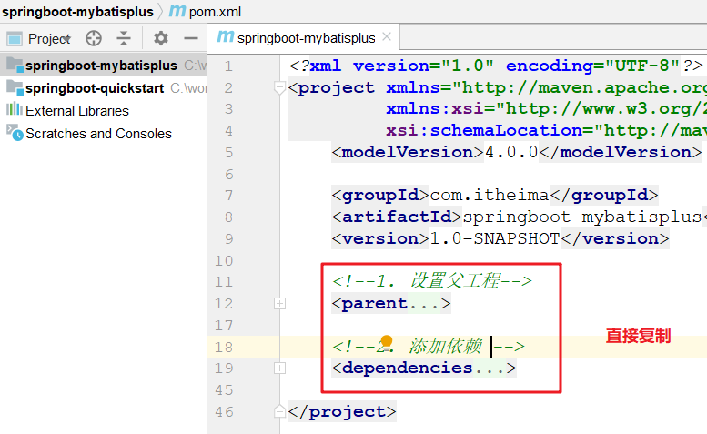 

~~~xml
    <!--1. 设置父工程: 里面进行版本的锁定-->
    <parent>
        <groupId>org.springframework.boot</groupId>
        <artifactId>spring-boot-starter-parent</artifactId>
        <version>2.2.2.RELEASE</version>
    </parent>

    <dependencies>
        <dependency>
            <groupId>mysql</groupId>
            <artifactId>mysql-connector-java</artifactId>
            <version>5.1.6</version>
        </dependency>
        <dependency>
            <groupId>com.alibaba</groupId>
            <artifactId>druid</artifactId>
            <version>1.1.15</version>
        </dependency>
        <dependency>
            <groupId>org.projectlombok</groupId>
            <artifactId>lombok</artifactId>
        </dependency>
        <dependency>
            <groupId>org.springframework.boot</groupId>
            <artifactId>spring-boot-starter-test</artifactId>
        </dependency>

        <!--mybatisPlus 启动器-->
        <dependency>
            <groupId>com.baomidou</groupId>
            <artifactId>mybatis-plus-boot-starter</artifactId>
            <version>3.4.0</version>
        </dependency>
    </dependencies>
~~~

### 创建User实体

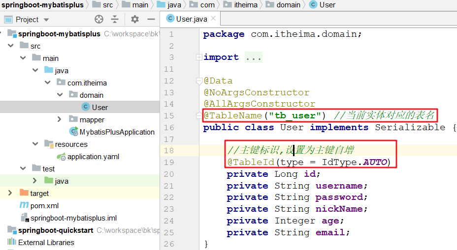  

### 创建UserMapper接口

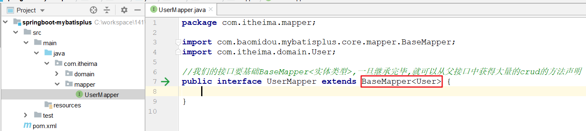 

### 添加配置文件

>在resources中添加配置文件application.yaml，然后在里面加入下面配置

 ~~~yaml
spring:
  datasource:
    driver-class-name: com.mysql.jdbc.Driver
    url: jdbc:mysql:///springboot
    username: root
    password: root
    type: com.alibaba.druid.pool.DruidDataSource 
    
mybatis-plus:
  configuration:
    # 是否将sql打印到控制面板(该配置会将sql语句和查询的结果都打印到控制台)
    log-impl: org.apache.ibatis.logging.stdout.StdOutImpl
 ~~~

### 编写启动类

 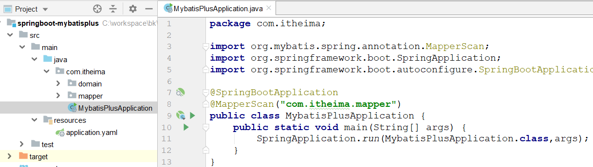 

### 测试

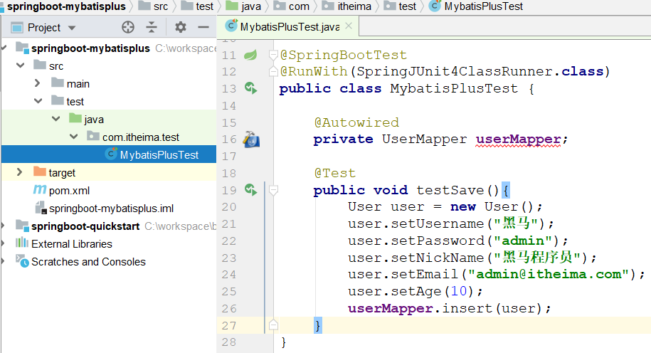 

## 增删改查

>下面列出的是MybatisPlus常见的一些接口方法

~~~java
int insert(T entity);// 插入一条记录

int deleteById(Serializable id); // ID删除
int deleteBatchIds(Collection idList);// ID批量删除
int delete(Wrapper<T> wrapper);// 条件删除

int updateById(T entity);// ID修改
int update(T entity,Wrapper<T> updateWrapper);// 条件更新

T selectById(Serializable id);// 主键查询
List<T> selectBatchIds(Collection idList); // 主键批量查询
T selectOne(Wrapper<T> queryWrapper);// 条件查询，返回值为一条记录
List<T> selectList(Wrapper<T> queryWrapper);// 条件查询，返回值为多条记录
Integer selectCount(Wrapper<T> queryWrapper);// 条件查询记录数
IPage<T> selectPage(IPage<T> page, Wrapper<T> queryWrapper);//条件分页查询
~~~


```java
    @Autowired
    private UserMapper userMapper;

    //测试保存
    @Test
    public void testSave() {
        //1. 创建User对象
        User user = new User();
        user.setUsername("传智");
        user.setPassword("123");
        user.setNickName("黑马");
        user.setAge(15);
        user.setEmail("admin@itcast.cn");

        //2. 调用mapper的保存方法
        userMapper.insert(user);
    }

    //主键修改
    @Test
    public void testUpdate() {
        //1. 创建User对象
        User user = new User();
        user.setId(1L);
        user.setUsername("传智1");
        user.setPassword("1231");
        user.setNickName("黑马1");
        user.setAge(151);
        user.setEmail("admin1@itcast.cn");

        //2. 调用mapper的修改方法
        userMapper.updateById(user);
    }


    //主键删除
    @Test
    public void testDelete() {
        //1. 调用mapper的删除方法
        userMapper.deleteById(1L);
    }


    //主键查询
    @Test
    public void testFindById() {
        //1. 调用mapper的插叙方法
        User user = userMapper.selectById(2L);
        System.out.println(user);
    }

    //查询所有
    @Test
    public void testFindAll() {
        //1. 设置查询条件
        QueryWrapper<User> queryWrapper = new QueryWrapper<>();

        //2. 执行查询
        List<User> userList = userMapper.selectList(queryWrapper);

        //3.查看结果
        for (User user : userList) {
            System.out.println(user);
        }
    }
```

## 条件查询

> 官网使用：QueryWrapper对象用于生成 sql 的 where 条件

| 查询方法                                                     | 说明     | 例子                                                         |
| ------------------------------------------------------------ | -------- | ------------------------------------------------------------ |
| eq(=)、ne(<>)、gt(>)、ge(>=)、lt(<)、le(<=)、isNull、isNotNull | 比较运算 | eq("name", "老王")`--->`name = '老王'                        |
| like、notLike、likeLeft、likeRight                           | 模糊查询 | likeRight("name", "王")`--->`name like '王%'                 |
| in、notIn、between、notBetween                               | 范围运算 | in("age",{1,2,3})`--->`age in (1,2,3)                        |
| orderByAsc、orderByDesc                                      | 排序     | orderByDesc("id", "name")`--->`order by id DESC,name DESC    |
| groupBy                                                      | 分组     | groupBy("id", "name")`--->`group by id,name                  |
| having                                                       | 过滤     | having("sum(age) > 10")`--->`having sum(age) > 10            |
| or、and                                                      | 拼接     | eq("id",1).or().eq("name","老王")`--->`id = 1 or name = '老王' |

```java

    //条件查询
    @Test
    public void testFindByCondition() {
        //1. 设置查询条件
        QueryWrapper<User> queryWrapper = new QueryWrapper<>();

//        queryWrapper.gt("id", 1);//id>1
//        queryWrapper.eq("username", "张三");//username = "张三"
//        queryWrapper.like("password", "admin");//password like "%admin%"
//        queryWrapper.likeLeft("nick_name", "张");//nickName like "%张"
//        queryWrapper.between("age", 10, 20);//age between 10 and 20
//        queryWrapper.in("email", new String[]{"admin@itcast.cn", "heima@itcast.cn"});//email in  ["",""]
        //推荐使用链式编程写法
        queryWrapper
                .gt("id", 1).or()
                .eq("username", "张三")
                .like("password", "admin")
                .likeLeft("nick_name", "张")
                .between("age", 10, 20)
                .in("email", new String[]{"admin@itcast.cn", "heima@itcast.cn"});

        //设置排序条件
        queryWrapper.orderByDesc("id").orderByAsc("age");//order by id desc,age asc

        //2. 执行查询
        List<User> userList = userMapper.selectList(queryWrapper);
    }
}
```


# 工作原理(难点 面试 听3遍+ )

## 源码分析

>SpringBootApplication注解分析

~~~java
@Target({ElementType.TYPE})   //标注位置: 类  接口
@Retention(RetentionPolicy.RUNTIME) // 保留策略  运行时代码
@Documented // 生成JavaDoc
@Inherited //运行被继承

@SpringBootConfiguration // 相当于@Configuration  表示这是一个配置类
@EnableAutoConfiguration // 借助@Import的支持，将所有符合自动配置条件的bean定义加载到IoC容器
@ComponentScan(...) // 注解扫描  扫描的是当前类所在包及其子包中类中的注解
public @interface SpringBootApplication {}
~~~

>@EnableAutoConfiguration注解分析

~~~java
@AutoConfigurationPackage // 获取注解扫描的包路径
@Import({AutoConfigurationImportSelector.class})// 选择所有符合自动配置条件的bean，然后将其加载到IoC容器
public @interface EnableAutoConfiguration {}
~~~

>Registrar类分析

~~~java
//@AutoConfigurationPackage包中使用了@Import导入了Registrar.class
@Import({Registrar.class})
public @interface AutoConfigurationPackage {}
~~~

~~~java
static class Registrar...{
        //加载启动类所在的包下的主类与子类的所有组件注册到spring容器，这就是springboot默认扫描启动类所在的包下的主类与子类的所有组件。
        public void registerBeanDefinitions(AnnotationMetadata metadata, BeanDefinitionRegistry registry) {
            AutoConfigurationPackages.register(registry, (new AutoConfigurationPackages.PackageImport(metadata)).getPackageName());
        }
}
~~~

> AutoConfigurationImportSelector类分析

~~~java
public class AutoConfigurationImportSelector...{
    ...

    public String[] selectImports(AnnotationMetadata annotationMetadata) {
        if (!this.isEnabled(annotationMetadata)) {
            return NO_IMPORTS;
        } else {
            AutoConfigurationMetadata autoConfigurationMetadata = AutoConfigurationMetadataLoader.loadMetadata(this.beanClassLoader);
            AutoConfigurationImportSelector.AutoConfigurationEntry autoConfigurationEntry
                		= this.getAutoConfigurationEntry(autoConfigurationMetadata, annotationMetadata);
            return StringUtils.toStringArray(autoConfigurationEntry.getConfigurations());
        }
    }

    protected AutoConfigurationImportSelector.AutoConfigurationEntry 
        getAutoConfigurationEntry(AutoConfigurationMetadata autoConfigurationMetadata, AnnotationMetadata annotationMetadata) {
        if (!this.isEnabled(annotationMetadata)) {
            return EMPTY_ENTRY;
        } else {
            AnnotationAttributes attributes = this.getAttributes(annotationMetadata);
            List<String> configurations = this.getCandidateConfigurations(annotationMetadata, attributes);
            configurations = this.removeDuplicates(configurations);
            Set<String> exclusions = this.getExclusions(annotationMetadata, attributes);
            this.checkExcludedClasses(configurations, exclusions);
            configurations.removeAll(exclusions);
            configurations = this.filter(configurations, autoConfigurationMetadata);
            this.fireAutoConfigurationImportEvents(configurations, exclusions);
            return new AutoConfigurationImportSelector.AutoConfigurationEntry(configurations, exclusions);
        }
    }

    protected List<String> getCandidateConfigurations(AnnotationMetadata metadata, AnnotationAttributes attributes) {
        //从所有的jar包中读取META-INF/spring.factories文件信息。
        List<String> configurations = SpringFactoriesLoader.loadFactoryNames(this.getSpringFactoriesLoaderFactoryClass(), this.getBeanClassLoader());
        Assert.notEmpty(configurations, "No auto configuration classes found in META-INF/spring.factories....");
        return configurations;
    }
}
~~~

>下面是spring-boot-autoconfigure这个jar中spring.factories文件部分内容，其中有一个key为org.springframework.boot.autoconfigure.EnableAutoConfiguration的值定义了需要自动配置的bean，通过读取这个配置获取一组@Configuration类。

~~~properties
org.springframework.boot.autoconfigure.EnableAutoConfiguration=\
org.springframework.boot.autoconfigure.admin.SpringApplicationAdminJmxAutoConfiguration,\
org.springframework.boot.autoconfigure.aop.AopAutoConfiguration,\
org.springframework.boot.autoconfigure.data.redis.RedisAutoConfiguration,\
org.springframework.boot.autoconfigure.data.redis.RedisReactiveAutoConfiguration,\
org.springframework.boot.autoconfigure.data.redis.RedisRepositoriesAutoConfiguration,\
org.springframework.boot.autoconfigure.mail.MailSenderAutoConfiguration,\
org.springframework.boot.autoconfigure.mail.MailSenderValidatorAutoConfiguration,\
org.springframework.boot.autoconfigure.web.servlet.DispatcherServletAutoConfiguration,\
org.springframework.boot.autoconfigure.web.servlet.ServletWebServerFactoryAutoConfiguration,\
org.springframework.boot.autoconfigure.web.servlet.error.ErrorMvcAutoConfiguration,\
org.springframework.boot.autoconfigure.web.servlet.HttpEncodingAutoConfiguration,\
org.springframework.boot.autoconfigure.web.servlet.MultipartAutoConfiguration,\
org.springframework.boot.autoconfigure.web.servlet.WebMvcAutoConfiguration,\
......省略了很多
~~~

>DispatcherServletAutoConfiguration

~~~java
@AutoConfigureOrder(-2147483648)
@Configuration(
    proxyBeanMethods = false
)
@ConditionalOnWebApplication(
    type = Type.SERVLET
)
@ConditionalOnClass({DispatcherServlet.class})  //只有JVM中有DispatcherServlet这个类的字节码时,当前类才有效
@AutoConfigureAfter({ServletWebServerFactoryAutoConfiguration.class})
public class DispatcherServletAutoConfiguration {
    public static final String DEFAULT_DISPATCHER_SERVLET_BEAN_NAME = "dispatcherServlet";
    public static final String DEFAULT_DISPATCHER_SERVLET_REGISTRATION_BEAN_NAME = "dispatcherServletRegistration";

    @Configuration(
        proxyBeanMethods = false
    )
    @Conditional({DispatcherServletAutoConfiguration.DefaultDispatcherServletCondition.class})
    @ConditionalOnClass({ServletRegistration.class})
    @EnableConfigurationProperties({HttpProperties.class, WebMvcProperties.class})
    protected static class DispatcherServletConfiguration {
        protected DispatcherServletConfiguration() {
        }

        //创建DispatcherServlet的对象并放入容器
        @Bean(
            name = {"dispatcherServlet"}
        )
        public DispatcherServlet dispatcherServlet(HttpProperties httpProperties, WebMvcProperties webMvcProperties) {
            DispatcherServlet dispatcherServlet = new DispatcherServlet();
            dispatcherServlet.setDispatchOptionsRequest(webMvcProperties.isDispatchOptionsRequest());
            dispatcherServlet.setDispatchTraceRequest(webMvcProperties.isDispatchTraceRequest());
            dispatcherServlet.setThrowExceptionIfNoHandlerFound(webMvcProperties.isThrowExceptionIfNoHandlerFound());
            dispatcherServlet.setPublishEvents(webMvcProperties.isPublishRequestHandledEvents());
            dispatcherServlet.setEnableLoggingRequestDetails(httpProperties.isLogRequestDetails());
            return dispatcherServlet;
        }

        @Bean
        @ConditionalOnBean({MultipartResolver.class})
        @ConditionalOnMissingBean(
            name = {"multipartResolver"}
        )
        public MultipartResolver multipartResolver(MultipartResolver resolver) {
            return resolver;
        }
    }
}
~~~

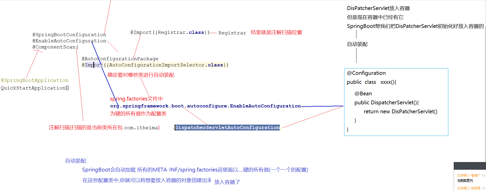

>条件装配

~~~markdown
* 并不是读取META-INF/spring.factories所有的Bean都会被初始化，在配置类中使用@Condition来加载满足条件的Bean
- ConditionalOnClass：      判断环境中是否有对应字节码文件才初始化Bean
- ConditionalOnProperty：   判断配置文件中是否有对应属性和值才初始化Bean
- ConditionalOnMissingBean：判断环境中没有对应Bean才初始化Bean
~~~

## 源码图示

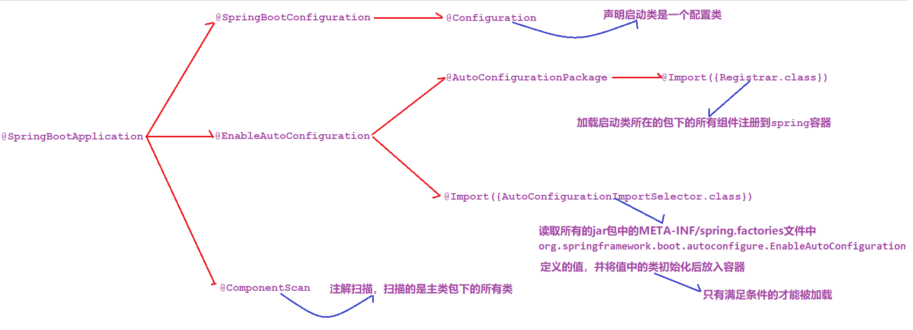


# 自定义启动器(难点  练习2遍)

> 有了上面的一些知识点，我们可以自定义一个发送短信的启动器 `sms-boot-starter`，其设计可以参考mybatisplus。

## 分析MybatisPlus启动器

>分析发现主要包含下面四部分内容
>
>​	spring.factories: 在里面定义配置类的名字，好让SpringBoot发现自动装配类
>
>​    MybatisPlusAutoConfiguration：启动类，核心功能是将sqlSessionFactory配置好，放入容器
>
>​    MybatisPlusProperties：配置类，用于读取配置文件的一些配置信息，提供给启动类使用
>
>​    SqlSessionFactory: 产生操作数据库的对象

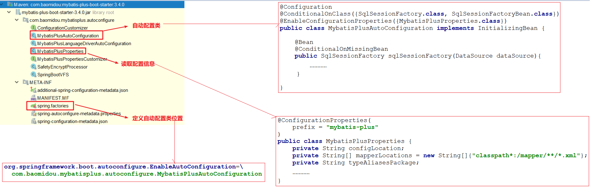  

## 需求分析

>设计一个`sms-boot-starter`工程，里面大体包含下面内容
>
>- SmsTemplate（工具类，里面主要是阿里提供的发送短信的代码）
>- SmsProperties（配置参数类，里面主要读取配置文件中的一些发送短信的参数）
>- SmsAutoConfiguration（短信自动装配类，主要用于将SmsTemplate放入容器）
>- META-INF/spring.factories（配置文件，主要用于根据springboot规范声明配置类的位置）

## 代码实现

### 创建工程，导入依赖

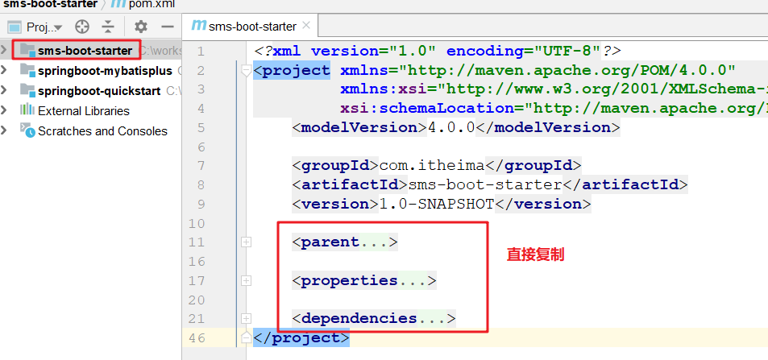 

```xml
<parent>
    <groupId>org.springframework.boot</groupId>
    <artifactId>spring-boot-starter-parent</artifactId>
    <version>2.2.2.RELEASE</version>
</parent>

<properties>
    <java.version>1.8</java.version>
</properties>

<dependencies>
    <dependency>
        <groupId>org.springframework.boot</groupId>
        <artifactId>spring-boot-autoconfigure</artifactId>
    </dependency>
    <dependency>
        <groupId>org.springframework.boot</groupId>
        <artifactId>spring-boot-configuration-processor</artifactId>
    </dependency>
    <dependency>
        <groupId>org.projectlombok</groupId>
        <artifactId>lombok</artifactId>
    </dependency>
    <!--阿里云短信服务-->
    <dependency>
        <groupId>com.aliyun</groupId>
        <artifactId>aliyun-java-sdk-core</artifactId>
        <version>4.0.6</version>
    </dependency>
    <dependency>
        <groupId>com.aliyun</groupId>
        <artifactId>aliyun-java-sdk-dysmsapi</artifactId>
        <version>1.1.0</version>
    </dependency>
</dependencies>
```

### 编写SmsTemplate

```java
package com.itheima.sms.autoconfigure;

import com.aliyuncs.DefaultAcsClient;
import com.aliyuncs.IAcsClient;
import com.aliyuncs.dysmsapi.model.v20170525.SendSmsRequest;
import com.aliyuncs.dysmsapi.model.v20170525.SendSmsResponse;
import com.aliyuncs.exceptions.ClientException;
import com.aliyuncs.profile.DefaultProfile;
import com.aliyuncs.profile.IClientProfile;

public class SmsTemplate {
    
    private String accessKeyId;
    private String accessKeySecret;
    private String signName;
    private String templateCode;

    // 初始化短信模板对象
    public SmsTemplate(String accessKeyId, String accessKeySecret, String signName, String templateCode) {
        this.accessKeyId = accessKeyId;
        this.accessKeySecret = accessKeySecret;
        this.signName = signName;
        this.templateCode = templateCode;
    }

    // 实现发送短信的方法
    public SendSmsResponse sendSms(String phoneNumbers, String code) throws ClientException {

        //可自助调整超时时间
        System.setProperty("sun.net.client.defaultConnectTimeout", "10000");
        System.setProperty("sun.net.client.defaultReadTimeout", "10000");

        //初始化acsClient,暂不支持region化
        IClientProfile profile = DefaultProfile.getProfile("cn-hangzhou", accessKeyId, accessKeySecret);
        DefaultProfile.addEndpoint("cn-hangzhou", "cn-hangzhou", "Dysmsapi", "dysmsapi.aliyuncs.com");
        IAcsClient acsClient = new DefaultAcsClient(profile);

        //组装请求对象-具体描述见控制台-文档部分内容
        SendSmsRequest request = new SendSmsRequest();
        //必填:待发送手机号
        request.setPhoneNumbers(phoneNumbers);
        //必填:短信签名-可在短信控制台中找到
        request.setSignName(signName);
        //必填:短信模板-可在短信控制台中找到
        request.setTemplateCode(templateCode);
        //可选:模板中的变量替换JSON串,如模板内容为"亲爱的${name},您的验证码为${code}"时,此处的值为
        request.setTemplateParam("{\"code\":\"" + code + "\"}");

        //选填-上行短信扩展码(无特殊需求用户请忽略此字段)
        //request.setSmsUpExtendCode("90997");

        //可选:outId为提供给业务方扩展字段,最终在短信回执消息中将此值带回给调用者
        request.setOutId("yourOutId");

        //hint 此处可能会抛出异常，注意catch
        SendSmsResponse sendSmsResponse = acsClient.getAcsResponse(request);

        return sendSmsResponse;
    }
}
```

~~~java
    public SendSmsResponse sendSms(String phoneNumbers, String code) throws ClientException {
        System.out.println(phoneNumbers + "发送短信验证码:" + code);
        return null;
    }
~~~

### 编写SmsProperties

```java
package com.itheima.sms.autoconfigure;

import lombok.Data;
import org.springframework.boot.context.properties.ConfigurationProperties;
import org.springframework.stereotype.Component;


//此类是配置文件对应的类
@ConfigurationProperties(prefix = "sms")
@Data
public class SmsProperties {
    private String accessKeyId;
    private String accessKeySecret;
    private String signName;
    private String templateCode;
}
```

### 编写SmsAutoConfiguration

```java
package com.itheima.sms.autoconfigure;

import org.springframework.context.annotation.Bean;
import org.springframework.context.annotation.Configuration;
import org.springframework.context.annotation.Import;

//在这个类中,我们需要初始化SmsTemplate ,然后将其放入容器
@Configuration//自动装配的类
@Import(SmsProperties.class)//将SmsProperties初始化放入容器
public class SmsAutoConfiguration {
    @Bean
    public SmsTemplate smsTemplate(SmsProperties smsProperties) {
        //创建并返回一个发送短信的对象(进入了Spring容器)
        SmsTemplate smsTemplate = new SmsTemplate(
                smsProperties.getAccessKeyId(),
                smsProperties.getAccessKeySecret(),
                smsProperties.getSignName(),
                smsProperties.getTemplateCode()
        );
        return smsTemplate;
    }
}

```

### 编写spring.factories

> 创建`/META-INF/spring.factories`文件，加入下面配置

```properties
org.springframework.boot.autoconfigure.EnableAutoConfiguration=\
  com.itheima.sms.autoconfigure.SmsAutoConfiguration
```

## 测试

> 我们选择在`springboot-quickstart`模块中来做测试

### 导入sms起步依赖

```xml
<!--sms 起步依赖-->
<dependency>
    <groupId>com.itheima</groupId>
    <artifactId>sms-boot-starter</artifactId>
    <version>1.0-SNAPSHOT</version>
</dependency>
```

### 编写配置文件

```yaml
# 短信发送配置
sms:
  access-key-id: LTAI4G3uHmEsKn5okn1wWYk6
  access-key-secret: ZhTbkMEuFhPmRTQvPpQJSRfiY41yCg
  sign-name: 黑马旅游网
  template-code: SMS_170836451
```

### 单元测试

```java
@SpringBootTest
@RunWith(SpringJUnit4ClassRunner.class)
public class SmsTest {
    @Autowired
    private SmsTemplate smsTemplate;

    @Test
    public void testSendSms() throws Exception {
        smsTemplate.sendSms("1111111111", "123654");
    }
}
```


# 项目监控（了解）

## 改造springboot-mybatisplus项目

1. 添加web-starter的依赖

   ~~~xml
           <dependency>
               <groupId>org.springframework.boot</groupId>
               <artifactId>spring-boot-starter-web</artifactId>
           </dependency>
   ~~~

2. 实现一个controller查询

   ~~~java
   package com.itheima.controller;
   
   import com.baomidou.mybatisplus.core.conditions.query.QueryWrapper;
   import com.itheima.domain.User;
   import com.itheima.mapper.UserMapper;
   import org.springframework.beans.factory.annotation.Autowired;
   import org.springframework.stereotype.Controller;
   import org.springframework.web.bind.annotation.RequestMapping;
   import org.springframework.web.bind.annotation.ResponseBody;
   
   import java.util.List;
   
   @Controller
   public class IndexController {
   
       @Autowired
       private UserMapper userMapper;
   
       @RequestMapping("/index")
       @ResponseBody
       public List<User> index() {
           List<User> userList = userMapper.selectList(new QueryWrapper<User>());
   
           return userList;
       }
   }
   
   ~~~

## Actuator监控

### 导入依赖

```xml
<dependency>
    <groupId>org.springframework.boot</groupId>
    <artifactId>spring-boot-starter-actuator</artifactId>
</dependency>
```

### 添加配置

```yaml
# 配置展示详细信息
management:
  endpoint:
    health:
      show-details: always
  endpoints:
    web:
      exposure:
        include: "*"
```

### 选项说明

>访问地址`http://localhost:8080/actuator`查看监控信息，下面是详细项

| **路径**        | **描述**                                                     |
| --------------- | ------------------------------------------------------------ |
| /beans          | 描述应用程序上下文里全部的Bean，以及它们的关系               |
| /env            | 获取全部环境属性                                             |
| /env/{name}     | 根据名称获取特定的环境属性值                                 |
| /health         | 报告应用程序的健康指标，这些值由HealthIndicator的实现类提供  |
| /info           | 获取应用程序的定制信息，这些信息由info打头的属性提供         |
| /mappings       | 描述全部的URI路径，以及它们和控制器(包含Actuator端点)的映射关系 |
| /metrics        | 报告各种应用程序度量信息，比如内存用量和HTTP请求计数         |
| /metrics/{name} | 报告指定名称的应用程序度量值                                 |
| /trace          | 提供基本的HTTP请求跟踪信息(时间戳、HTTP头等)                 |


## SpringBootAdmin

> SpringBoot Admin是一款SpringBoot程序的监控和管理的源软件，它能够将Actuator中的信息进行界面化的展示 。
>
> 它分为服务端和客户端两部分，其中服务端为单独程序，客户端为被监控的项目。

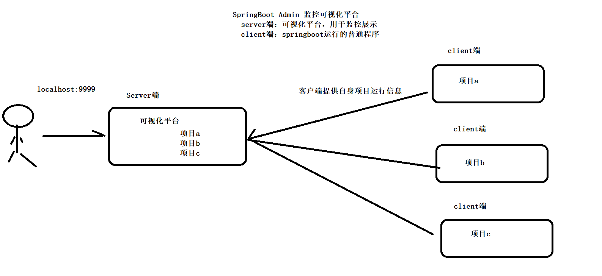 

### 搭建server端

1. 创建`springboot-admin`工程，导入依赖

   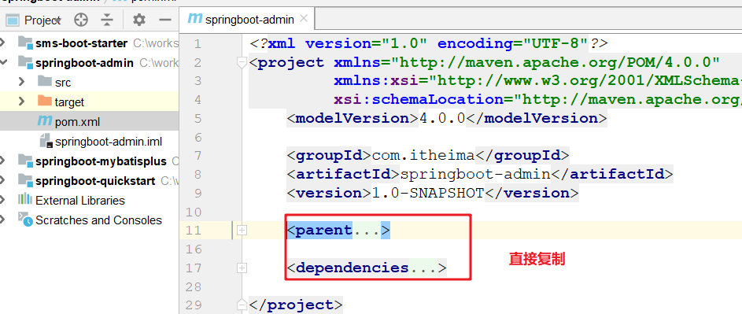 

   ~~~xml
   <parent>
       <groupId>org.springframework.boot</groupId>
       <artifactId>spring-boot-starter-parent</artifactId>
       <version>2.2.2.RELEASE</version>
   </parent>
   
   <dependencies>
       <dependency>
           <groupId>org.springframework.boot</groupId>
           <artifactId>spring-boot-starter-web</artifactId>
       </dependency>
       <dependency>
           <groupId>de.codecentric</groupId>
           <artifactId>spring-boot-admin-starter-server</artifactId>
           <version>2.2.2</version>
       </dependency>
   </dependencies>
   ~~~

2. 创建application.yaml，添加端口

   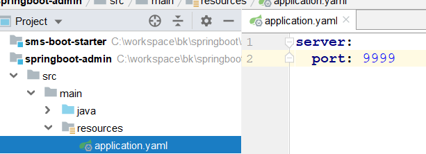 

3. 创建启动类

   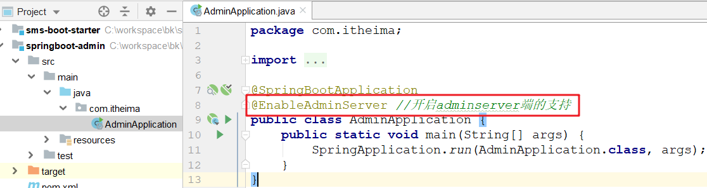 

### 配置client端

> 使用`springboot-mybatisplus`作为客户端进行测试，接下来在此模块中添加相关依赖和配置

1. 添加依赖

   ~~~xml
   <dependency>
       <groupId>de.codecentric</groupId>
       <artifactId>spring-boot-admin-starter-client</artifactId>
       <version>2.2.2</version>
   </dependency>
   ~~~

2. 添加配置

   ~~~yaml
   spring:
     boot:
       admin:
         client:
   	    url: http://localhost:9999/
   ~~~

   

# 项目部署 ( 了解 )

>使用`springboot-mybatisplus`为例演示项目部署

## jar包发布（推荐）

### 配置打包插件

>在pom.xml中加入下面配置

```xml
<build>
    <finalName>user-manager</finalName>
    <plugins>
        <plugin>
            <groupId>org.springframework.boot</groupId>
            <artifactId>spring-boot-maven-plugin</artifactId>
        </plugin>
    </plugins>
</build>
```

### 将项目打包

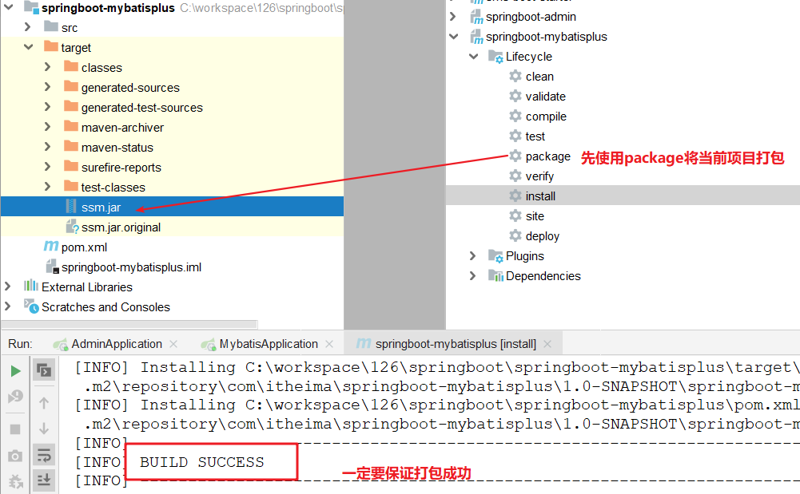 

### 启动项目

> 通过maven命令package完成项目打包；找到jar包位置，以命令行窗口执行

```shell
java -jar user-manager.jar
```


## war包发布（了解）

### 项目打包方式

> 找到项目的pom.xml文件修改默认打包方式为war

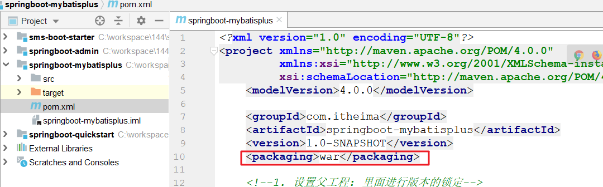 

### 配置启动类

>在主类中添加下面配置

```java
package com.itheima;

import org.mybatis.spring.annotation.MapperScan;
import org.springframework.boot.SpringApplication;
import org.springframework.boot.autoconfigure.SpringBootApplication;
import org.springframework.boot.builder.SpringApplicationBuilder;
import org.springframework.boot.web.servlet.support.SpringBootServletInitializer;

@SpringBootApplication
@MapperScan("com.itheima.mapper")
public class MybatisApplication  extends SpringBootServletInitializer {
    public static void main(String[] args) {
        SpringApplication.run(MybatisPlusApplication.class, args);
    }

    @Override
    protected SpringApplicationBuilder configure(SpringApplicationBuilder builder) {
        return builder.sources(MybatisPlusApplication.class);
    }
}
```

### 部署到Tomcat

> 执行maven的package命令，将打好的war包放入Tomcat中运行即可

