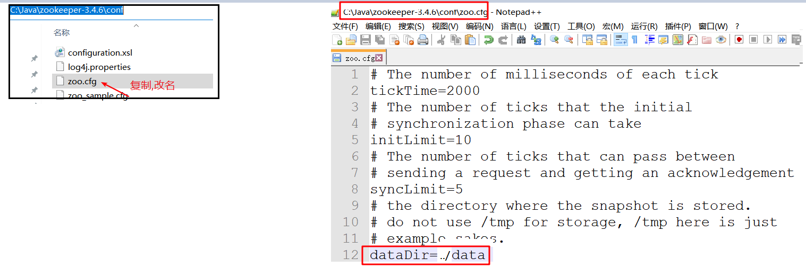
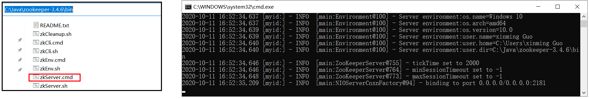
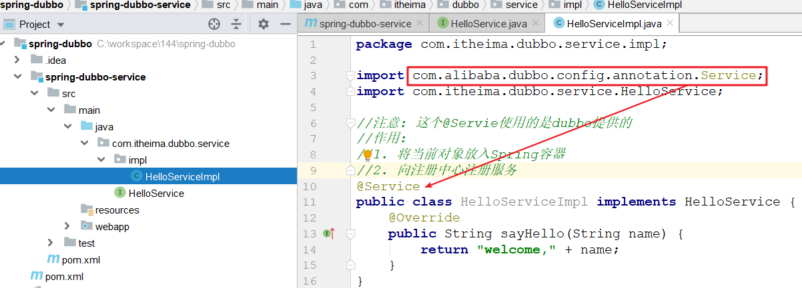

# 回顾

~~~markdown
1. MyBatisplus(整合  使用)

2. Springboot的自动装配执行原理(面试)
	SpringBoot扫描所有jar包下面的META-INF/spring.factories文件中
		org.springframework.boot.autoconfigure.EnableAutoConfiguration = 对应的所有值各个程序的启动类
			启动类中创建一些对象放入spring容器

3. Springboot自定义启动器
	1) META-INF/spring.factories
		org.springframework.boot.autoconfigure.EnableAutoConfiguration = SmsAutoConfiguration
	2) SmsAutoConfiguration
    	创建出发送短信的工具类对象
    3) 编写工具类
    4) 编写配置类(读取yaml配置)

4. Springboot的监控

5. Springboot的项目发布
~~~


# 系统架构演变（了解）

随着互联网的发展，网站应用的规模也在不断的扩大，进而导致系统架构也在不断的进行变化。

从互联网早起到现在，系统架构大体经历了下面几个过程: 单体应用架构--->垂直应用架构--->分布式架构--->SOA架构`--->微服务架构`

## 单体应用架构

> 单体应用结构，就是将一个系统的多个模块做成一个web项目，然后部署到一台tomcat服务器上

 

~~~markdown
优点：
	- 项目架构简单，小型项目的话， 开发成本低
	- 项目部署在一个节点上， 维护方便

缺点：
	- 项目模块之间紧密耦合，单点容错率低
	- 无法针对不同模块进行针对性优化和水平扩展
~~~

## 垂直应用架构

> 垂直应用架构，就是将原来的一个系统拆成成多个模块，然后每个模块部署在一台tomcat服务器上

 

~~~markdown
优点：
	- 可以针对不同模块进行优化和水平扩展
	- 一个系统的问题不会影响到其他系统，提高单点容错率
    
缺点：
	- 系统之间相互独立，无法进行相互调用，会有重复的开发任务
~~~

## 分布式架构

> 分布式架构就是指将服务层单独部署在tomcat上对外提供服务，在controller中可以通过远程调用访问服务层中的方法

 

~~~markdown
优点：
	- 抽取公共的功能为服务层，提高代码复用性

缺点：	
	- 调用关系错综复杂，难以维护
~~~

## SOA架构

> SOA结构，在分布式架构的基础上，增加一个调度中心对系统进行实时管理。

 


> 面试直达: 聊一聊集群和分布式的区别

~~~markdown
集群:多台服务器重复完成同一个任务,即同一个任务部署在多台服务器上
分布式:多台服务器协同完成同一个任务,即同一个任务拆分为多个子任务,多个子任务部署在多台服务器上协同完成同一个任务 
~~~

 

# Dubbo概述

## Dubbo简介

> Apache Dubbo是一款高性能的Java RPC框架，可以和Spring框架无缝集成。官网地址：[http://dubbo.apache.org]

### 发展历程

- Dubbo是阿里巴巴内部使用的分布式业务框架，2012年由阿里巴巴开源
- 在很短时间内，Dubbo就被许多互联网公司所采用，并产生了许多衍生版本，如网易，京东，新浪，当当等等
- 由于阿里策略变化，2014年10月Dubbo停止维护。随后部分互联网公司公开了自行维护的Dubbo版本，比较著名的如当当DubboX
- 经过三年的沉寂，在2017年9月，阿里宣布重启Dubbo项目，并决策在未来对开源进行长期持续的投入
- 随后Dubbo开始了密集的更新，并将停摆三年以来大量分支上的特性及缺陷修正快速整合
- 2018.2月，阿里将Dubbo捐献给Apache基金会，Dubbo成为Apache孵化器项目

### RPC介绍

- RPC全称为remote procedure call，**即远程过程调用**
- 简单的讲，RPC可以==让我们像调用本地方法一样来调用远程方法==
- 需要注意的是RPC并不是一个具体的技术，而是指整个网络远程调用过程

- Java中的RPC框架比较多，广泛使用的有RMI、Hessian、Dubbo等

### 核心能力

- 面向接口的远程方法调用
- 智能容错和负载均衡
- 服务自动注册和发现

## Dubbo架构 (重点  手画)

 

 

**节点角色说明：**

| **节点**  | **角色名称**                           |
| --------- | -------------------------------------- |
| Provider  | 暴露服务的服务提供方                   |
| Consumer  | 调用远程服务的服务消费方               |
| Registry  | 服务注册与发现的注册中心               |
| Monitor   | 统计服务的调用次数和调用时间的监控中心 |
| Container | 服务运行容器                           |

**调用关系说明**:

0. 服务容器负责启动，加载，运行服务提供者。
1. 服务提供者在启动时，向注册中心注册自己提供的服务。
2. 服务消费者在启动时，向注册中心订阅自己所需的服务。
3. 注册中心返回服务提供者地址列表给消费者，如果有变更，注册中心将基于长连接推送变更数据给消费者。
4. 服务消费者，从提供者地址列表中，基于软负载均衡算法，选一台提供者进行调用，如果调用失败，再选另一台调用。
5. 服务消费者和提供者，在内存中累计调用次数和调用时间，定时每分钟发送一次统计数据到监控中心。

>面试直达: 
>
>1. 服务调用者和注册中心是基于推模式还是拉模式获取服务的
>
> 2. 如果服务注册中心宕机了, 会不会影响到服务的正常调用
> 3. 在dubbo的各个服务组件调用中中,  什么地方用的是长连接,  什么地方用的是短连接


# Spring整合Dubbo（重点）

## 服务注册中心

> 注册中心负责服务地址的注册与查找，服务提供者和消费者与注册中心交互。
>
> Dubbo支持的服务注册中心有很多，比如zookeeper、redis、mysql等等，官方推荐使用 zookeeper 注册中心。

### 安装

> 将资料中的zookeeper-3.4.6.zip复制到一个没有中文，没有空格的目录，然后解压，即可得到zookeeper的软件

 

### 修改配置

> 1. 进入到zookeeper的配置目录，复制`zoo_sample.cfg`为`zoo.cfg`
> 2. 编辑`zoo.cfg`文件，修改`dataDir`的值为`../data`这是zookeeper存储数据的位置



### 启动

进入安装路径的bin目录，双击zkServer.cmd即可启动zookeeper服务

 

>问题:
>
>	1. 启动一闪而失, 检查环境变量中jdk配置
> 	2. 当出现选择的时候,zk的线程会卡死,  解决方案,在dos框中点一下右键
>
> 


## 创建父工程

>spring-dubbo

 

## 创建服务提供者模块

> spring-dubbo-service

### 创建web模块

 

### 创建service接口

 

### 创建service实现

 

### 加入spring配置文件

 

### 加入web.xml

 

### 部署

 


## 创建服务消费者模块

>spring-dubbo-web

### 创建web模块

 

### 复制提供者的接口

 

### 创建controller

 

### 加入spring配置文件

 

### 加入web.xml

 

### 部署测试

 

## 执行过程说明

 

## 使用细节说明

### 包扫描

~~~xml
<!--服务提供者和服务消费者都需要配置包扫描，作用是扫描指定包(包括子包)下的类中的注解: @Service  @Reference-->
<dubbo:annotation package="com.itheima.dubbo.controller" />
~~~

### 协议

```xml
<!--
	在服务提供者一方配置，可以指定使用的协议名称和端口号。
	其中Dubbo支持的协议有：dubbo、rmi、hessian、http、webservice、rest、redis等。
-->
<dubbo:protocol name="dubbo" port="20880"/>
```

### 启动时检查

```xml
<!--
    启动时检查, 配置在服务消费者一方，用于服务消费者在启动的时候主动检查服务提供者是否准备好提供服务
       如果配置为false, 代表不检查
       如果配置为true, 代表检查, 一旦检查到服务提供者未准备好, 就会直接抛异常
-->
<dubbo:consumer check="false"/>
```

###  超时时间和重试机制

```xml
<!--配置在消费者端一方: 默认的超时时间是1s ，默认的重试次数是3次--> 
<dubbo:consumer timeout="50000000" retries="0"/>
```

## 案例代码改进

~~~markdown
* 当前代码中Service接口代码重复
* 改进思路: 将service接口单独做成一个模块, 然后让provider和consumer来引用
~~~

### 创建一个新的接口模块 

>spring-dubbo-interface

 

### 从provider和consumer引入新模块 

 

## Dubbo下的模块划分

 

# SpringBoot整合Dubbo（重点）

## 创建父工程

>springboot-dubbo

 

## 创建接口模块

>springboot-dubbo-interface

  

## 创建服务提供者模块

>springboot-dubbo-service

### 创建模块

  

### 编写service实现类

 

### 加入springboot配置文件

 

### 启动类

 

 


## 创建服务消费者模块

>springboot-dubbo-web

### 创建工程

  

### 编写controller

 

### 加入springboot的配置文件

 

### 编写启动类

 

### 启动测试

 

## bug

~~~markdown
* 常见问题: 
    1. 运行过程中 不动了--------zk是不是进程阻塞了
    2. @Service注解写错了-------在服务消费者启动的时候保存
    3. @Reference注解写错了-------会在调用方法的时候报空指针
~~~


# Dubbo监控中心（了解）

> Dubbo给我们提供了一个UI界面的监控中心, 通过它可以观察到dubbo内部的详细信息

## 安装

### 准备tomcat

> 准备一个没有使用过的tomcat(资料中有), 解压到一个没有中文和空格的路径

 

### 部署监控程序

> 将`dubbo-admin.war`程序部署到tomcat, 然后启动tomcat, 让程序解压

 

### 配置文件调整

> 如果zk的地址和端口没有修改过,这步无需操作;   如果修改了下面的文件, 则必须重启tomcat

 

## 使用

### 登录

> 打开浏览器，输入http://127.0.0.1:9999/dubbo-admin/ ，登录用户名和密码均为root, 登录成功可以见到下面的页面


### 使用

> 通过服务治理下`服务  提供者  消费者`可以观察具体应用的信息

 


~~~markdown
* 今日重点
1. 面试
	dubbo的架构图(手画)  + 三道面试题
	分布式和集群
2. 代码
	spring整合dubbo(次重点)  细节
	springboot整合dubbo(重点)
~~~

