# 回顾

~~~markdown
1. dubbo架构图

2. 短连接  监控中心                长连接  其他

3. 当注册中心宕机,会不会影响到服务调用
	1. 消费者刚启动,还没服务提供者地址列表
	2. 消费者刚已经正常运行,获取到了服务提供者地址列表  
	
4. 集群和分布式

5. dubbo  maven

* root(clean  package)
~~~

# Zookeeper安装

## 介绍

~~~markdown
* ZooKeeper是一个分布式服务协调框架，主要用来解决分布式应用中的一些数据管理问题，如：统一命名服务、状态同步服务、应用配置项的管理等等。
* ZooKeeper由雅虎研究院开发，是Google Chubby的开源实现，后来托管到Apache，于2010年11月正式成为Apache的顶级项目。
* 官方网址：https://zookeeper.apache.org/
~~~

## 服务端

### 安装

> 将资料中的zookeeper-3.4.6.zip复制到一个没有中文，没有空格的目录，然后解压，即可得到zookeeper的软件

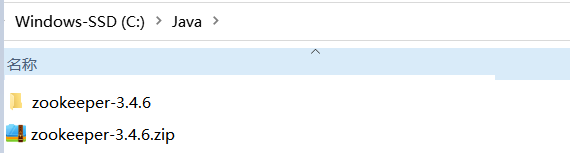 

### 修改配置

>1. 进入到zookeeper的配置目录，复制`zoo_sample.cfg`为`zoo.cfg`
>2. 编辑`zoo.cfg`文件，修改`dataDir`的值为`../data`，这是zookeeper存储数据的位置

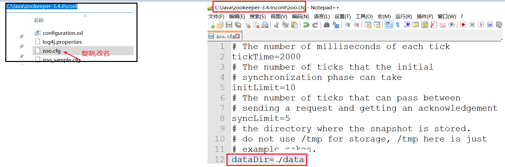

### 启动

> 进入安装路径的bin目录，双击zkServer.cmd即可启动zookeeper服务

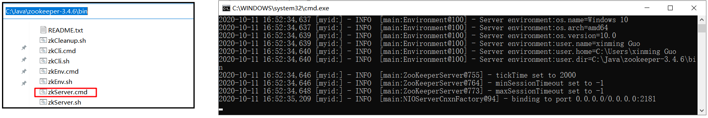 

## 命令行客户端

>1. 进入安装路径的bin目录，双击zkCli.cmd即可启动zookeeper命令行客户端
>2. 在客户端中输入`create /data "ceshi"`，没有报错，代表客户端可以成功操作服务器 

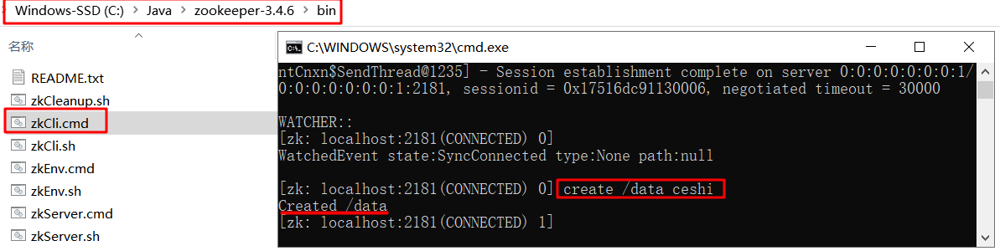 

## UI界面客户端

### 安装

> 将资料中的ZooInspector.zip复制到一个没有中文，没有空格的目录，然后解压，即可得到ZooInspector的软件

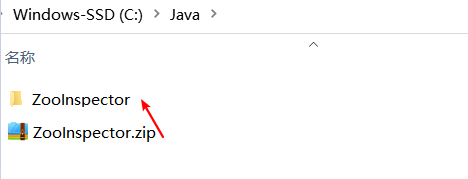 

### 启动

> 在安装软件的build目录下，执行`java -jar zookeeper-dev-ZooInspector.jar`命令，即可启动软件的界面

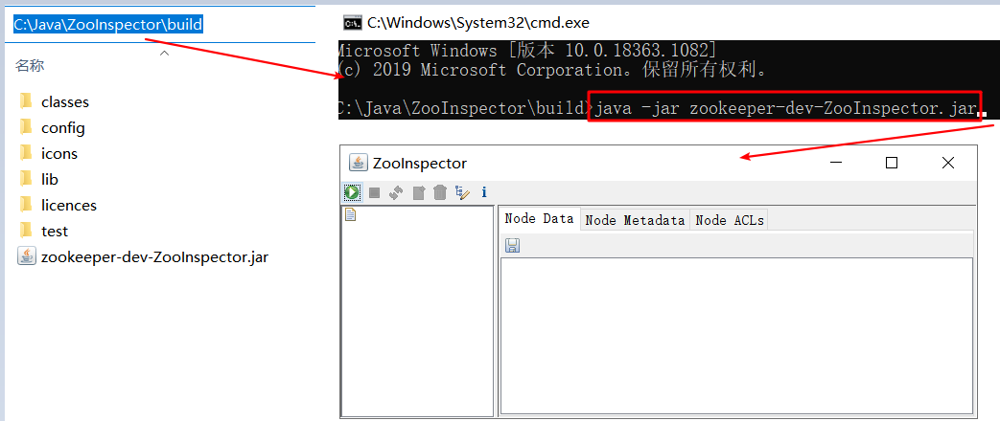 

### 连接服务

>1. 点击连接按钮，输入zk的服务地址，点击OK连接
>2. 连接成功之后可以点击data查看节点存储的信息

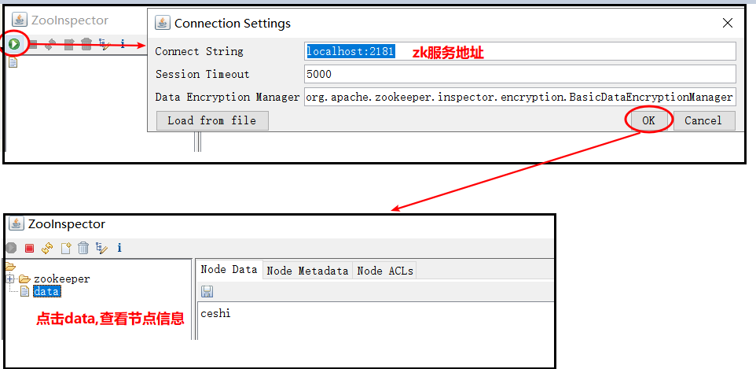 

# Zookeeper数据结构(重点)

## 数据结构

~~~markdown
* Zookeeper的数据节点可以视为树状（或者目录）结构，树中的各节点被称为znode（即zookeeper node），一个znode可以有多个子节点。
* Zookeeper节点在结构上表现为树状，使用路径path来定位某个znode，比如/itcast/bj/java，此处itcast、bj、java分别是根节点、2级节点、3级节点
* Znode兼具文件和目录两种特点。既可以像目录一样可以保存子节点，又可以像文件一样可以保存信息。
* 一个znode大体上分为3部分：
	1. data：节点的数据
	2. children：节点的子节点
	3. stat：节点的状态，用来描述当前节点的创建、修改记录等
~~~

==Znode兼具文件和目录两种特点。既可以像目录一样可以保存子节点，又可以像文件一样可以保存信息。==

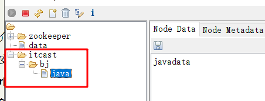 

~~~powershell
# 在zookeeper shell中使用get命令查看指定路径节点的data、stat信息：
[zk: localhost:2181(CONNECTED) 5] get  /itcast/bj
bjdata
cZxid = 0x17
ctime = Sun Oct 11 17:24:37 CST 2020
mZxid = 0x17
mtime = Sun Oct 11 17:24:37 CST 2020
pZxid = 0x1b 
cversion = 1
dataVersion = 0
aclVersion = 0
ephemeralOwner = 0x0
dataLength = 6
numChildren = 1

# cZxid：数据节点创建时的事务ID
# ctime：数据节点创建时的时间
# mZxid：数据节点最后一次更新时的事务 ID
# mtime：数据节点最后一次更新时的时间
# pZxid：数据节点的子节点最后一次被修改时的事务 ID

# cversion：子节点的更改次数
# dataVersion：节点数据的更改次数
# aclVersion: 权限的更改次数

# ephemeralOwner: 持久节点还是临时节点
# dataLength：数据内容的长度
# numChildren：数据节点当前的子节点个数
~~~

## 节点类型

对于Zookeeper中的节点，有两种分类方式，一种是按照节点是否持久化，一种是按照节点是否有顺序进行分类。

> 按照节点是否持久化分类，可以分别为临时节点和永久节点

- **临时节点**：该节点的生命周期依赖于创建它们的会话。一旦会话(Session)结束，临时节点将被自动删除

  虽然每个临时的Znode都会绑定到一个客户端会话，但他们对所有的客户端还是可见的。另外，ZooKeeper的临时节点不允许拥有子节点

- **持久化节点**(默认)：该节点的生命周期不依赖于会话，并且只有在客户端显示执行删除操作的时候，他们才能被删除

> 按照节点是否有顺序进行分类，可以分别为有序节点和无序节点

- **有序节点**：每个节点都会为它的一级子节点维护一个顺序
- **无序节点**(默认)：节点不会为子节点维护顺序

~~~markdown
* 节点类型
	持久化无序节点 ：节点创建后会一直存在zookeeper服务器上，直到主动删除
	持久化有序节点 ：在持久化无序节点的基础上,为每个节点都会为它的一级子节点维护一个顺序
	临时无序节点 ：  临时节点的生命周期和客户端的会话保持一致，当客户端会话失效，该节点自动清理
	临时有序节点 ：  在临时节点上多了一个顺序性特性
~~~

# Zookeeper常见命令(重点)

## 创建节点

>  create [-s] [-e] path data  [默认情况下持久化无序节点]
>
>  ~~~markdown
>  path：节点名称 (完整绝对路径, 不能缺少层数)
>  data：节点数据
>  -s：有序节点
>  -e：临时节点
>  ~~~

~~~powershell
# 1）创建 /node节点
[zk: localhost:2181(CONNECTED) 14] create /node node
Created /node

# 2）创建 /node/data1节点(无序持久节点)
[zk: localhost:2181(CONNECTED) 15] create /node/data1 data
Created /node/data1

# 3）创建 /node/data2节点(无序临时节点)
# 注意: 一旦创建此节点的连接断开(命令行退出)，节点会自动删除
[zk: localhost:2181(CONNECTED) 16] create -e /node/data2 data
Created /node/data2

# 4) 创建 /node/data3节点(有序持久节点)
# 注意: 此类节点创建出来后会在节点名称后面自动跟随一串递增的数字
[zk: localhost:2181(CONNECTED) 0] create -s /node/data3 data
Created /node/data30000000002
[zk: localhost:2181(CONNECTED) 1] create -s /node/data3 data
Created /node/data30000000003

# 4) 创建 /node/data4节点(有序临时节点)
# 注意: 此类节点创建出来后会在节点名称后面自动跟随一串递增的数字
#      一旦创建此节点的连接断开(命令行退出)，节点会自动删除
[zk: localhost:2181(CONNECTED) 10] create -s -e /node/data4 data
Created /node/data40000000006
[zk: localhost:2181(CONNECTED) 11] create -s -e /node/data4 data
Created /node/data40000000007
~~~

## 查看节点

### 查看节点信息

>get path : 获取节点的状态信息和数据信息
>
>stat  path : 获取节点的状态信息

~~~powershell
[zk: localhost:2181(CONNECTED) 3] get /node/data1
data # 节点数据
cZxid = 0x21   # 数据节点创建时的事务ID
ctime = Sun Oct 11 22:35:27 CST 2020  # 数据节点创建时的时间
mZxid = 0x21   # 数据节点最后一次更新时的事务ID
mtime = Sun Oct 11 22:35:27 CST 2020  # 数据节点最后一次更新时的时间
pZxid = 0x21 # 数据节点的子节点最后一次被修改时的事务ID
cversion = 0 # 子节点的更改次数
dataVersion = 0 # 节点数据的更改次数
aclVersion = 0  # 权限的更改次数
ephemeralOwner = 0x0 # 如果节点为临时节点，那么它的值为这个节点拥有者的sessionID；如果该节点不是临时节点， 值为0
dataLength = 4 # 数据内容的长度
numChildren = 0 # 数据节点当前的子节点个数
~~~

### 查看节点列表

>ls   path:  查看指定节点的子节点列表
>
>ls2 path:  查看指定节点的信息以及子节点列表  = ls +stat

~~~powershell
#1) ls
[zk: localhost:2181(CONNECTED) 17] ls /
[node， zookeeper， data， itcast]
[zk: localhost:2181(CONNECTED) 18] ls /node
[data30000000003， data30000000004， data30000000002， data2]

#２）ls2
[zk: localhost:2181(CONNECTED) 19] ls2 /
[node， zookeeper， data， itcast]
cZxid = 0x0
ctime = Thu Jan 01 08:00:00 CST 1970
mZxid = 0x0
mtime = Thu Jan 01 08:00:00 CST 1970
pZxid = 0x3c
cversion = 14
dataVersion = 0
aclVersion = 0
ephemeralOwner = 0x0
dataLength = 0
numChildren = 4
~~~

## 修改节点

>set path data [version]

~~~powershell
# 1) set path data 直接使用set命令对指定节点内容进行修改
# 注意: 在修改的时候，除了数据内容变化之外，还有一个关键属性变化了  
# dataVersion = 1 指的是数据版本，每次数据被修改，版本自动加1
[zk: localhost:2181(CONNECTED) 9] set /node/data1 mydata
cZxid = 0x21
ctime = Sun Oct 11 22:35:27 CST 2020
mZxid = 0x40
mtime = Sun Oct 11 23:26:43 CST 2020
pZxid = 0x21
cversion = 0
dataVersion = 1
aclVersion = 0
ephemeralOwner = 0x0
dataLength = 6
numChildren = 0

# 2) set path data version 基于版本号对指定节点内容进行修改
# 即修改数据的时候，要传入要修改数据的版本号， 如果传入的版本号和当前的版本号不符合时，zookeeper会拒绝本次修改
[zk: localhost:2181(CONNECTED) 10] set /node/data1 mydatadata 0
version No is not valid : /node/data1
[zk: localhost:2181(CONNECTED) 11] set /node/data1 mydatadata 1
cZxid = 0x21
ctime = Sun Oct 11 22:35:27 CST 2020
mZxid = 0x42
mtime = Sun Oct 11 23:32:17 CST 2020
pZxid = 0x21
cversion = 0
dataVersion = 2
aclVersion = 0
ephemeralOwner = 0x0
dataLength = 10
numChildren = 0
[zk: localhost:2181(CONNECTED) 12]
~~~

## 删除节点

>delete path [version]    删除没有子节点的node
>
>rmr path  遍历删除

~~~powershell
#1) delete path 使用delete命令删除指定节点
[zk: localhost:2181(CONNECTED) 13] delete /node/data30000000003

#2) delete path version 基于版本号删除指定节点
#   即删除节点的时候，要传入要删除节点的版本号， 如果传入的版本号和当前的版本号不符合时，zookeeper会拒绝本次删除
[zk: localhost:2181(CONNECTED) 14] delete /node/data1 1
version No is not valid : /node/data1
[zk: localhost:2181(CONNECTED) 14] delete /node/data1 2

#3) rmr path 遍历删除
# 删除非空节点(含有子节点)失败
[zk: localhost:2181(CONNECTED) 5] delete /a
Node not empty: /a
# 遍历删除
[zk: localhost:2181(CONNECTED) 6] rmr /a
[zk: localhost:2181(CONNECTED) 7]
~~~

~~~markdown
1. 创建节点
	create [-s]  [-e]  path data
2. 查看节点
	get path  查看节点的数据和状态
	ls  path  查看节点的子节点
3. 修改节点
	set path data [version]
4. 删除节点
	delete path [version]   删除没有子节点的节点
	rmr    path             遍历删除节点
~~~

## 监听节点

>~~~markdown
>* 在zookeeper中还支持一种watch（监听）机制，它允许对zookeeper注册监听，当监听的对象发生指定的事件的时候，zookeeper就会返回一个通知。
>* 它可以监听事件类型包含下面这些:
> 		None:客户端和服务端连接状态发生变化
>   		NodeCreated:创建节点
> 		NodeDeleted:删除节点
> 		NodeDataChanged:节点数据发生变化,注意即使变更前后的数据内容完全一样也会触发该事件,或者理解成该事件的触发条件是Znode的版本号变更
>   		NodeChildrenChanged:子节点发生变化(创建\删除\数据变更)
> * Zookeeper的事件监听机制有以下特性：
> 	1.当监听器监听的事件被触发，服务端会发送通知给客户端，但通知信息中不包括事件的具体内容，如果想获取具体变更的内容，需要客户端主动再去获取
> 	2.Watcher是一次性的，一旦被触发将会失效，如果需要反复进行监听就需要反复进行注册。
>~~~
> 
> ~~~markdown
> get path watch：    注册的监听器能够在监听节点的`内容发生改变`的时候，向客户端发出通知
> stat path watch：   注册的监听器能够在监听节点的`状态发生改变`的时候，向客户端发出通知
> ls/ls2 path watch： 注册的监听器能够在监听节点的`子节点新增和删除`的时候，向客户端发出通知
>~~~

~~~powershell
# 注意: 下面的操作，需要使用两个客户端来完成，一个负责注册监听，令一个负责修改
# 1) 创建/node/data5
[zk: localhost:2181(CONNECTED) 23] create /node/data5 data
Created /node/data5

# 2) 对/node/data5注册get(内容)监听
[zk: localhost:2181(CONNECTED) 24] get /node/data5 watch
data
cZxid = 0x46
ctime = Mon Oct 12 00:20:37 CST 2020
mZxid = 0x46
mtime = Mon Oct 12 00:20:37 CST 2020
pZxid = 0x46
cversion = 0
dataVersion = 0
aclVersion = 0
ephemeralOwner = 0x0
dataLength = 4
numChildren = 0

# 3) 此处，新开一个客户端，去修改掉/node/data5的内容: set /node/data5 mydata
# 4) 然后就会发现控制台返回了一个NodeDataChanged(节点数据变化)的通知
[zk: localhost:2181(CONNECTED) 25]
WATCHER::

WatchedEvent state:SyncConnected type:NodeDataChanged path:/node/data5
~~~

~~~powershell
# 1) 对/node/data5注册stat(状态)监听
[zk: localhost:2181(CONNECTED) 25] stat /node/data5 watch
cZxid = 0x46
ctime = Mon Oct 12 00:20:37 CST 2020
mZxid = 0x49
mtime = Mon Oct 12 00:21:57 CST 2020
pZxid = 0x46
cversion = 0
dataVersion = 2
aclVersion = 0
ephemeralOwner = 0x0
dataLength = 7
numChildren = 0

# 2) 此处，新开一个客户端，去修改掉/node/data5的内容: set /node/data5 mydata2
# 3) 然后就会发现控制台返回了一个NodeDataChanged(节点数据变化)的通知
[zk: localhost:2181(CONNECTED) 26]
WATCHER::

WatchedEvent state:SyncConnected type:NodeDataChanged path:/node/data5
~~~

~~~powershell
# 1) 对/node/data5注册ls(子节点新增或者删除)监听
[zk: localhost:2181(CONNECTED) 26] ls /node/data5 watch
[]

# 2) 此处，新开一个客户端，去添加掉/node/data5的子节点: set /node/data5/test test
# 3) 然后就会发现控制台返回了一个NodeChildrenChanged(子节点变化)的通知
[zk: localhost:2181(CONNECTED) 27]
WATCHER::

WatchedEvent state:SyncConnected type:NodeChildrenChanged path:/node/data5
~~~

# Java操作Zookeeper(理解)

> 原生API：Java API位于org.apache.ZooKeeper包中。
>
> ZkClient（不推荐）：Github上一个开源的ZooKeeper客户端，在源生 api 基础之上进行扩展的开源 JAVA 客户端。
>
> Apache Curator（推荐使用）：最初是Netfix研发的，后来捐献了Apache基金会，目前是Apache的顶级项目。

## 环境导入

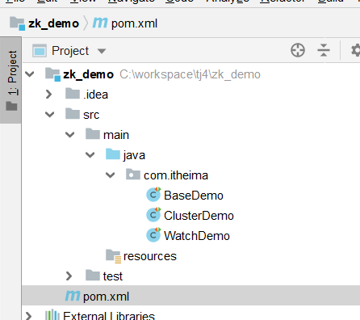 

## 节点操作

~~~java
	//创建节点
    @Test
    public void testCreateNodes() throws Exception {
        String path = null;

        //1. 创建一个空节点a, 值默认为请求端ip
        //path = getClient().create().forPath("/a");

        //2. 创建一个有内容的b节点
        //path = getClient().create().forPath("/b", "data".getBytes());

        //3. 创建多层节点
        //creatingParentsIfNeeded() 递归创建父目录
        //withMode() 创建模式
        //path = getClient().create().creatingParentsIfNeeded().withMode(CreateMode.PERSISTENT).forPath("/c/c1/c2", "data".getBytes());

        //4. 创建带有的序号的节点
        //path = getClient().create().creatingParentsIfNeeded().withMode(CreateMode.PERSISTENT_SEQUENTIAL).forPath("/d");

        //5. 创建临时节点（客户端关闭，节点消失），设置延时5秒关闭
        //path = getClient().create().creatingParentsIfNeeded().withMode(CreateMode.EPHEMERAL).forPath("/e");

        //6. 创建临时带序号节点（客户端关闭，节点消失），设置延时5秒关闭
        //path = getClient().create().creatingParentsIfNeeded().withMode(CreateMode.EPHEMERAL_SEQUENTIAL).forPath("/f");

        System.out.println(path);
        //关闭客户端
        getClient().close();
    }

    //更新节点
    @Test
    public void testUpdateNodes() throws Exception {
        //更新节点数据
        //getClient().setData().forPath("/a", "itheima".getBytes());
        //根据版本号更新节点数据
        //getClient().setData().withVersion(2).forPath("/a", "itheima".getBytes());

        getClient().close();
    }

    //获取节点
    @Test
    public void testGetNodes() throws Exception {
        //查询节点数据
        byte[] bytes = getClient().getData().forPath("/a");
        System.out.println(new String(bytes));

        // 包含状态查询
        Stat stat = new Stat();
        getClient().getData().storingStatIn(stat).forPath("/a");
        System.out.println(stat.getVersion());
    }

    //删除数据
    @Test
    public void testDeleteNodes() throws Exception {
        //删除节点
        //getClient().delete().forPath("/c");
        //删除节点并递归删除其子节点
        //getClient().delete().deletingChildrenIfNeeded().forPath("/c");
    }
~~~

## 节点监听

~~~markdown
* Cache是Curator对zookeeper事件监听的包装，其对事件的监听可以近似看做是一个本地缓存视图和远程ZooKeeper视图的对比过程。
* 而且它会自动的再次监听，我们就不需要自己手动的重复监听了。Curator中的Cache共有三种:
    NodeCache:         用来监听指定节点的创建和数据变化
    PathChildrenCache: 用来监听指定节点的子节点增删和数据变化
    TreeCache:         像上面两种Cache的结合体，能够监听自身节点的变化、也能够监听子节点的变化
~~~

~~~java
package com.itheima;

import org.apache.curator.RetryPolicy;
import org.apache.curator.framework.CuratorFramework;
import org.apache.curator.framework.CuratorFrameworkFactory;
import org.apache.curator.framework.recipes.cache.*;
import org.apache.curator.retry.ExponentialBackoffRetry;
import org.junit.Test;

/**
 * Watch机制
 */
public class WatchDemo {

    //只监测当前节点数据
    @Test
    public void testNodeCache() throws Exception {
        //创建节点数据监听对象
        final NodeCache nodeCache = new NodeCache(getClient(), "/a");
        nodeCache.start(true); //开始缓存
        System.out.println(new String(nodeCache.getCurrentData().getData()));

        //添加监听对象
        nodeCache.getListenable().addListener(new NodeCacheListener() {
            //如果节点数据有变化，会回调该方法
            public void nodeChanged() throws Exception {
                System.out.println("数据Watcher：路径=" + nodeCache.getCurrentData().getPath() + ",data=" + 
                                   new String(nodeCache.getCurrentData().getData()));
            }
        });
        System.in.read();
    }

    //监测所有子节点数据
    @Test
    public void testPathChildrenCache() throws Exception {
        //监听指定节点的子节点变化情况包括: 新增子节点 子节点数据变更 和子节点删除
        PathChildrenCache childrenCache = new PathChildrenCache(getClient(), "/a", true);
        //在启动时缓存子节点数据，提示初始化
        childrenCache.start(PathChildrenCache.StartMode.POST_INITIALIZED_EVENT);
        //添加监听
        childrenCache.getListenable().addListener(new PathChildrenCacheListener() {
            @Override
            public void childEvent(CuratorFramework client, PathChildrenCacheEvent event) throws Exception {
                if (event.getType() == PathChildrenCacheEvent.Type.CHILD_ADDED) {
                    System.out.println(event.getData().getPath() + "子节点添加：" + new String(event.getData().getData()));
                } else if (event.getType() == PathChildrenCacheEvent.Type.CHILD_REMOVED) {
                    System.out.println(event.getData().getPath() + "子节点移除：" + new String(event.getData().getData()));
                } else if (event.getType() == PathChildrenCacheEvent.Type.CHILD_UPDATED) {
                    System.out.println(event.getData().getPath() + "子节点修改：" + new String(event.getData().getData()));
                } else if (event.getType() == PathChildrenCacheEvent.Type.INITIALIZED) {
                    System.out.println("初始化完成");
                } else if (event.getType() == PathChildrenCacheEvent.Type.CONNECTION_SUSPENDED) {
                    System.out.println("连接过时");
                } else if (event.getType() == PathChildrenCacheEvent.Type.CONNECTION_RECONNECTED) {
                    System.out.println("重新连接");
                } else if (event.getType() == PathChildrenCacheEvent.Type.CONNECTION_LOST) {
                    System.out.println("连接过时一段时间");
                }
            }
        });
        System.in.read();
    }

    //监测当前节点和所有的子节点
    @Test
    public void testTreeCache() throws Exception {
        TreeCache treeCache = new TreeCache(getClient(), "/a");
        treeCache.start();

        System.out.println(treeCache.getCurrentData("/a"));

        treeCache.getListenable().addListener(new TreeCacheListener() {
            @Override
            public void childEvent(CuratorFramework client, TreeCacheEvent event) throws Exception {
                if (event.getType() == TreeCacheEvent.Type.NODE_ADDED) {
                    System.out.println(event.getData().getPath() + "节点添加");
                } else if (event.getType() == TreeCacheEvent.Type.NODE_REMOVED) {
                    System.out.println(event.getData().getPath() + "节点移除");
                } else if (event.getType() == TreeCacheEvent.Type.NODE_UPDATED) {
                    System.out.println(event.getData().getPath() + "节点修改");
                } else if (event.getType() == TreeCacheEvent.Type.INITIALIZED) {
                    System.out.println("初始化完成");
                } else if (event.getType() == TreeCacheEvent.Type.CONNECTION_SUSPENDED) {
                    System.out.println("连接过时");
                } else if (event.getType() == TreeCacheEvent.Type.CONNECTION_RECONNECTED) {
                    System.out.println("重新连接");
                } else if (event.getType() == TreeCacheEvent.Type.CONNECTION_LOST) {
                    System.out.println("连接过时一段时间");
                }
            }
        });
        System.in.read();
    }
}
~~~

# Zookeeper使用场景(面试)

## ID生成器

> 通过在ZooKeepr里创建顺序节点，很容易创建一个全局唯一的名字，即生成全局唯一的ID。

~~~markdown
* 在每一台机子上需要id的时候执行一个创建顺序节点的操作,一定可以获取到一个唯一的id
~~~

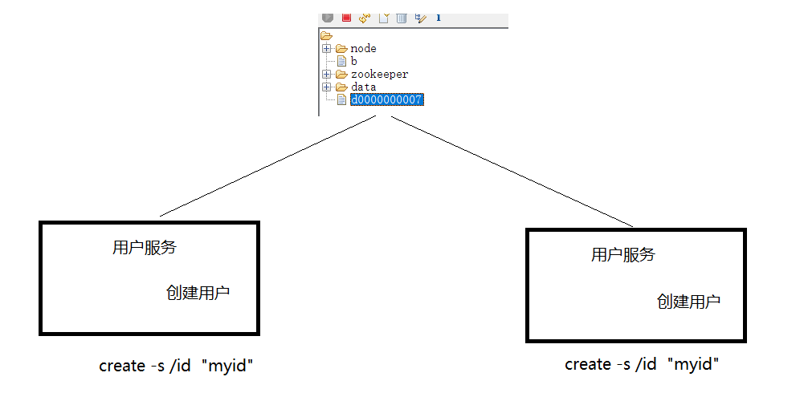 

## 配置中心

>配置中心使用的是Zookeeper的watch机制

~~~markdown
* 需求： 
	在分布式应用系统中，会有很多的类似的配置文件，他们会散落在各个服务中，比如数据库的用户名和密码
	如果后期要修改的话，就需要修改非常多的配置文件，这显然不是好的做法，基于这种现状，就有了配置中心的概念

* 方案：
	可以把所有的配置都放在一个配置中心，然后各个服务分别去监听配置中心，一旦发现里面的内容发生变化，立即获取变化的内容，然后更新本地配置即可

* 实现：
	通过Zookeeper的watch机制，我们可以轻松的实现这一需求，
	所有的服务需要监听Zookeeper的配置节点，当配置信息发生变化之后，Zookeeper会将变化信息推送给服务，当然服务也可以主动去拉取节点数据

* 说明:
    在这里Zookeeper采用了推拉模式相结合的做法：
    	push可以保证能够第一时间拿到更新配置，基本可以做到准实时的更新，但push存在问题，即如果有网络抖动，某一次push没有推送成功，将丢失这次配置的更新
    	pull可以保证一定可以拉取得到数据，pull一般采用定时拉取的方式，即使某一次出现网络问题，没有拉取得到数据，那在下一次定时器也将可以拉取得到数据
~~~

 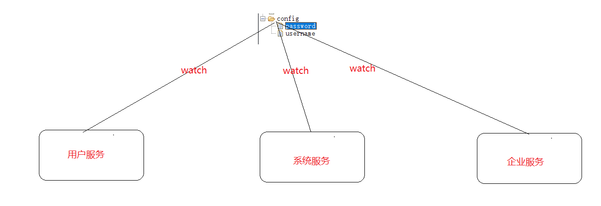 

## 分布式协调

>分布式协调服务使用的是Zookeeper的watch机制

~~~markdown
* 不同的客户端如机器节点，发生了变化，那么所有订阅的客户端都能够接收到相应的Watcher通知，并做出相应的处理。
~~~

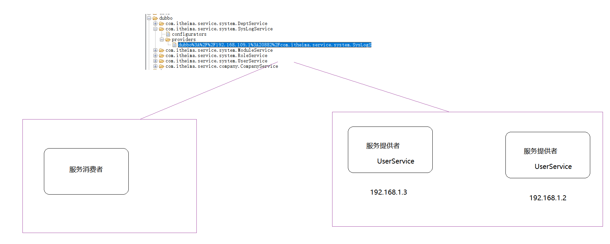 

## 集群选主

>集群选主使用的是zookeeper的临时节点

~~~markdown
* 需求:
	在集群中，很多情况下是要区分主从节点的，一般情况下主节点负责数据写入，从节点负责数据读取，那么问题来了，怎么确定哪一个节点是主节点的
    
* 实现：
	使用Zookeeper的临时节点可以轻松实现这一需求
	我们把上面描述的这个过程称为集群选主的过程，首先所有的节点都认为是从节点，都有机会称为主节点，然后开始选主，步骤比较简单:
		1. 所有参与选主的主机都去Zookeeper上创建同一个临时节点，那么最终一定只有一个客户端请求能够创建成功。
		2. 成功创建节点的客户端所在的机器就成为了主节点，其他没有成功创建该节点的客户端，成为从节点
		3. 所有的从节点都会在主节点上注册一个子节点变更的Watcher，用于监控当前主节点是否存活，一旦发现当前的主节点挂了，那么其他客户端将会重新进行选主。
~~~

 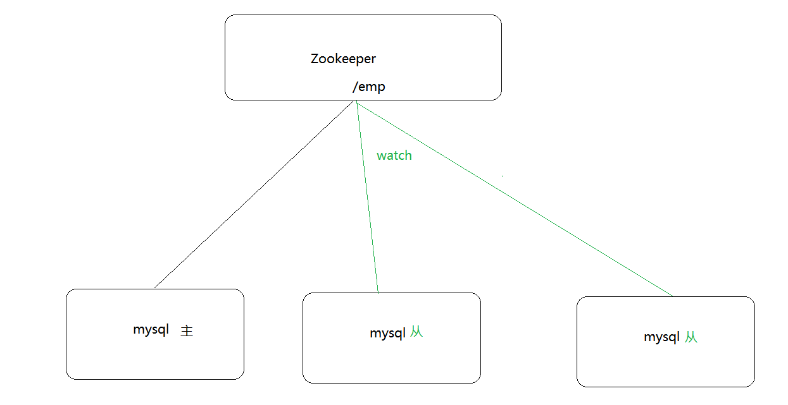

## 分布式锁

>分布式锁使用的是Zookeeper的临时有序节点

~~~markdown
* 需求： 
	在分布式系统中，很容出现多台主机操作同一资源的情况，比如两台主机同时往一个文件中追加写入文本， 
	如果不去做任何的控制，很有可能出现一个写入操作被另一个写入操作覆盖掉的状况

* 方案：
	此时我们可以来一把锁，哪个主机获取到了这把锁的操作权限，就执行写入，另一台主机等待;直到写入操作执行完毕，另一台主机再去获得锁，然后写入
	这把锁就称为分布式锁， 也就是说:分布式锁是控制分布式系统之间同步访问共享资源的一种方式

* 实现:
	使用Zookeeper的   临时有序   节点可以轻松实现这一需求
		1. 所有需要执行操作的主机都去Zookeeper上创建一个临时有序节点
		2. 然后获取到Zookeeper上创建出来的这些节点进行一个从小到大的排序
		3. 判断自己创建的节点是不是最小的，如果是，自己就获取到了锁;如果不是，则对最小的节点注册一个监听
		4. 如果自己获取到了锁，就去执行相应的操作，当执行完毕之后，连接断开，节点消失，锁就被释放了
		5. 如果自己没有获取到锁，就等待，一直监听节点消失，锁释放后，再重新执行抢夺锁的操作
		
create -e -s "/a"
~~~

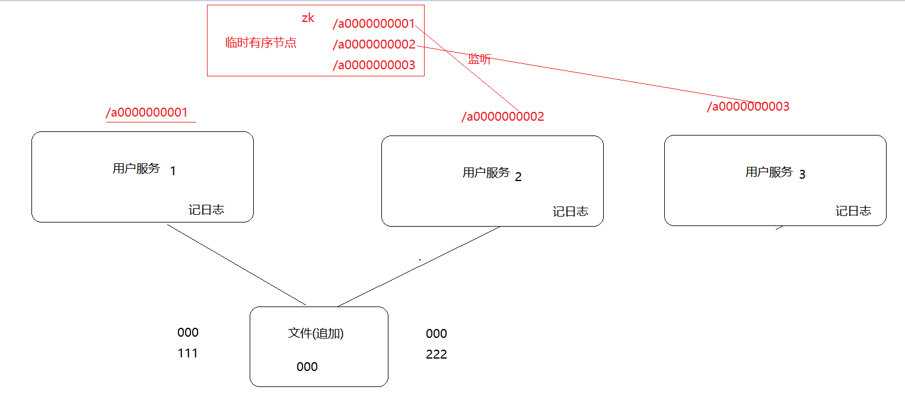

# 集群(高级)

## 集群介绍

~~~markdown
* Zookeeper在一个系统中一般会充当一个很重要的角色，所以一定要保证它的高可用，这就需要部署Zookeeper的集群。
* Zookeeper有三种运行模式：单机模式、集群模式和伪集群模式。
	单机模式：使用一台主机部署一个Zookeeper来对外提供服务，有单点故障问题，仅适合于开发、测试环境
	集群模式：使用多台服务器，每台上部署一个Zookeeper一起对外提供服务，适合于生产环境
	伪集群模式：在服务器不够多的情况下，也可以考虑在一台服务器上部署多个Zookeeper来对外提供服务
~~~

## 集群搭建

>本次学习环境，为了方便，我们采用windows平台部署伪集群的方式来演示Zookeeper集群的安装和使用。

~~~markdown
1. 软件准备
	创建一个文件夹，将Zookeeper软件解压三次，得到三个程序

2. 配置zookeeper[此步骤在所有zk上都有操作]
	编辑Zookeeper的配置文件，主要修改的是端口号和服务地址，修改的内容如下:
        dataDir： 数据存储的地址，修改为当前zk下的data目录
        clientPort：当前zk对外的端口号，因为是在同一个服务器上部署多台，此端口号不能重复
        server.id: 集群节点信息
            格式为: server.A=B:C:D    
                A：是一个数字，表示这个是服务器的编号    
                B：是这个服务器的ip地址    
                C：Zookeeper服务器之间的通信端口    
                D：Leader选举的端口
       
        server.1=127.0.0.1:3181:3281
        server.2=127.0.0.1:3182:3282
        server.3=127.0.0.1:3183:3283
        
3. 创建节点ID
	在dataDir指定的目录下创建一个文件名字为myid，文件内容为上一步service.id中的id
    
4. 启动集群
	分别进入到每个zk服务器的bin目录，双击zkServer.cmd，启动三个服务器   

5. 连接测试
	进入到其中一个zk的bin目录执行连接命令: zkCli.cmd -server 127.0.0.1:2182
~~~

## 集群角色

~~~markdown
* ZooKeeper集群中的三个角色：
	Leader（领导者）：负责投票的发起和决议，更新系统状态，是事务请求的唯一处理者，一个ZooKeeper同一时刻只会有一个Leader
	Follower（跟随者）：处理客户端请求，参与选主投票
	Observer（观察者）：处理客户端请求，不参与选主投票
* Leader可以提供读写服务，Follower或Observer只提供读服务，但是Observer机器不参与Leader选举，也不参与写操作的『过半写成功』策略
~~~

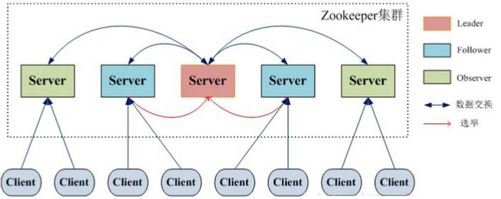 

## 事务处理流程

~~~markdown
1. 所有的事务请求都交由集群的Leader服务器来处理,Leader服务器会将一个事务请求转换成一个Proposal(提议),并为其生成一个全局递增的唯一ID,
    这个ID就是事务ID,即ZXID,Leader服务器对Proposal是按其ZXID的先后顺序来进行排序和处理的。
2. Leader服务器会将Proposal放入每个Follower对应的队列中(Leader会为每个Follower分配一个单独的队列),并以FIFO的方式发送给Follower服务器。
3. Follower服务器接收到事务Proposal后,首先以事务日志的方式写入本地磁盘,并且在成功后返回Leader服务器一个ACK响应。
4. Leader服务器只要收到过半Follower的ACK响应,就会广播一个Commit消息给Follower以通知其进行Proposal的提交,同时Leader自身也会完成Proposal的提交。
5. Follower收到commit请求时，从历史队列中将事务请求commit
~~~

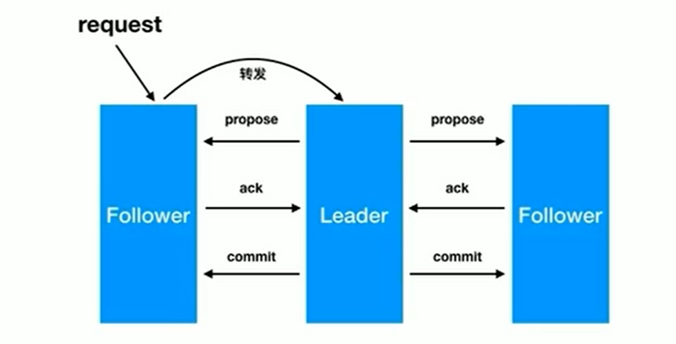 

## 集群选举

### 服务器状态

~~~markdown
* Zookeeper服务器有四个状态
	looking：  寻找leader状态。当服务器处于该状态时，它会认为当前集群中没有leader，因此需要进入leader选举状态。
	
	
	leading：  领导者状态。表明当前服务器角色是leader。
	following：跟随者状态。表明当前服务器角色是follower。
	observing：观察者状态。表明当前服务器角色是observer。
~~~

### leader选举

~~~markdown
* 在集群初始化阶段，当有一台服务器server1启动时，其单独无法进行和完成leader选举，
* 当第二台服务器server2启动时，此时两台机器可以相互通信，每台机器都试图找到leader，于是进入leader选举过程。 
* 选举过程如下:
	1. 每个server发出一个投票。
	   由于是初始情况，server1和server2都会将自己作为leader服务器来进行投票，每次投票会包含所推举的服务器的myid和zxid，
	   使用(myid, zxid)来表示，此时server1的投票为(1, 0)，server2的投票为(2, 0)，然后各自将这个投票发给集群中其他机器。
	2. 集群中的每台服务器接收来自集群中各个服务器的投票。
	3. 处理投票。针对每一个投票，服务器都需要将别人的投票和自己的投票进行pk，pk规则如下:
		优先检查zxid。zxid比较大的服务器优先作为leader。
		如果zxid相同，那么就比较myid。myid较大的服务器作为leader服务器。
 		对于Server1而言，它的投票是(1, 0)，接收Server2的投票为(2, 0)，首先会比较两者的zxid，均为0，再比较myid，此时server2的myid最大，
 		于是更新自己的投票为(2, 0)，然后重新投票，对于server2而言，其无须更新自己的投票，只是再次向集群中所有机器发出上一次投票信息即可。
	4. 统计投票。每次投票后，服务器都会统计投票信息，判断是否已经有过半机器接受到相同的投票信息，
		对于server1、server2而言，都统计出集群中已经有两台机器接受了(2, 0)的投票信息，此时便认为已经选出了leader
	5. 改变服务器状态。一旦确定了leader，每个服务器就会更新自己的状态，如果是follower，那么就变更为following，如果是leader，就变更为leading。
~~~

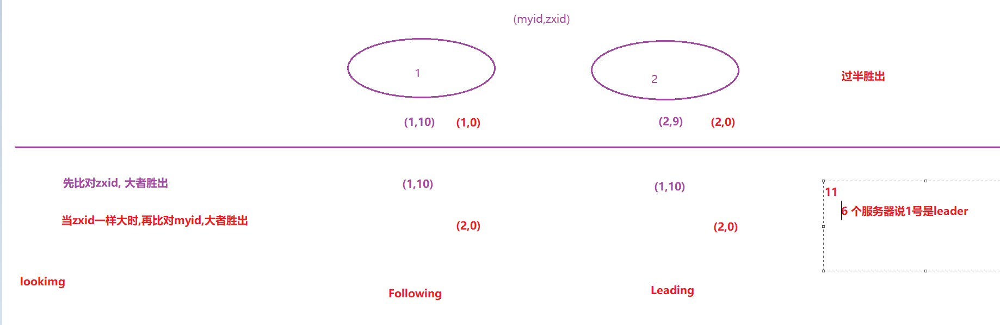 

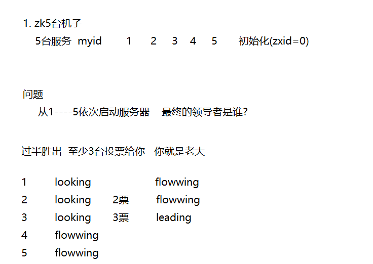 

### observer角色及其配置

~~~markdown
* observer角色特点：
	1. 不参与集群的leader选举
	2. 不参与集群中写数据时的ack反馈
* 为了使用observer角色，在任何想变成observer角色的配置文件中加入如下配置：
	peerType=observer
* 并在所有server的配置文件中，配置成observer模式的server的那行配置追加:observer
	server.3=192.168.60.130:2289:3389:observer
~~~

~~~markdown
1. 面试
	数据结构  分类
	使用场景  
2. 实践
	命令 +  java操作zk
3. 扩展
	能听懂多少是多少
~~~

