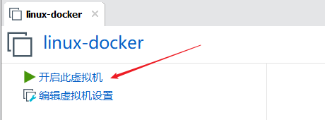
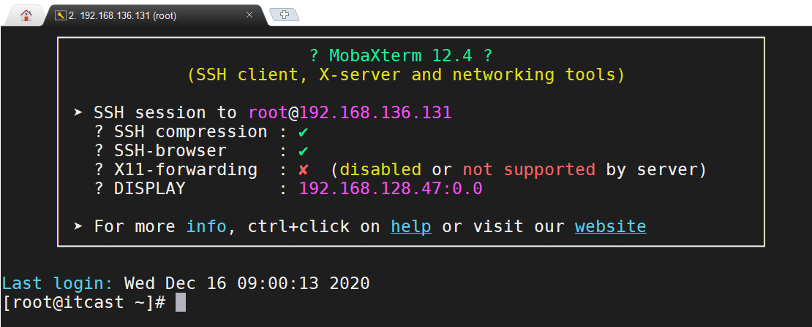
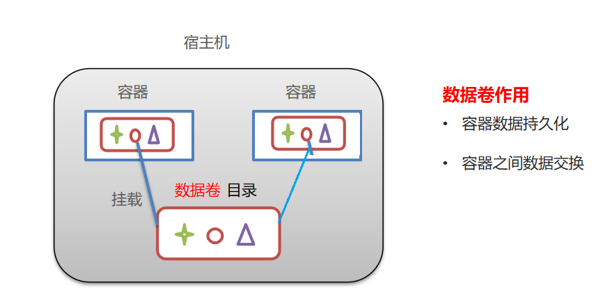

# 回顾

```markdown
1. 命令
	增  create /path  data
	查  get /path                       ls /path
	改  set /path  data  [version]
	删  delete  /path  [version]        rmr /path   
	监听 get /path  watch
2. 数据结构
	目录一样存储子目录    文件一样存储数据
	对于一个节点:1. 节点数据  2 节点状态   3 节点子节点
3. 分类
	是否持久化: 临时节点  持久节点
	是否有顺序: 无序节点  有序节点   /a   ---/a0000000001
4. 使用场景
	全局id生成器
	配置中心
	分布式协调服务
	集群选主
	分布式锁
5. 集群
	
```


# Docker介绍

## Docker初识

~~~markdown
* 一款产品（软件）至少经过：开发、上线二套环境
	开发人员：写好的代码本机可以运行
	运维人员：部署代码时却无法运行
	
* 问题:
    版本不一致
    版本一致, 下载程序不一致
    
* Docker   
~~~

 

## Docker概念

~~~markdown
- Docker是一个开源的应用容器引擎，官网：https://www.docker.com
- 诞生于2013年初，基于Go语言实现， dotCloud公司出品（后改名为Docker Inc）
- Docker可以让开发者打包他们的应用以及依赖包到一个轻量级、可移植的容器中，然后发布到任何流行的 Linux 机器上。
- 容器是完全使用沙箱机制，相互隔离。
- 容器性能开销极低。
~~~

## Docker架构(重点)

 

~~~markdown
* 镜像（Image）
	- 就是一个只读模板，比如：一个镜像可以包含一个完整的CentOS，里面仅安装jdk或用户的其他应用。
	- 镜像可以用来创建docker容器。

* 容器（Container）：
	- 镜像和容器的关系，就像是面向对象程序设计中的类和对象一样。
	- 容器是从镜像创建的运行实例，它可以被启动、停止、 删除。
	- 每个容器都是相互隔离的、保证安全的平台。
	- 可以把容器看做是一个简易版的Linux 环境（包括root用户权限、进程空间、用户空间）和运行在其中的应用程序。

* 仓库（Repository）：
	- 仓库是集中存放镜像文件的场所。
	- 仓库分为公开仓库（Public）和私有仓库（Private）两种形式。
~~~


## 导入linux镜像

> 在今天的资料中提供了linux镜像压缩包，大家解压到非中文路径

 

> 进入解压目录，双击`linux-docker.vmx`启动VMware

  

> 初始化VMware网络环境

 

> 再次检查本机网卡

 

> 设置NAT网络，我们全部统一网络环境为：`192.168.136.0`

 

> 开启此虚拟机

 

> 用户名：root、密码：123456

 

> `ifconfig`查看ens33网卡的ip地址

 

> 通过客户端实现远程连接

 

## Docker安装【已完成】

本课程基于CentOS 7安装Docker：

```shell
# 1、yum 包更新到最新 
yum update

# 2、安装需要的软件包， yum-util 提供yum-config-manager功能，另外两个是devicemapper驱动依赖的 
yum install -y yum-utils device-mapper-persistent-data lvm2

# 3、设置yum源
yum-config-manager --add-repo https://download.docker.com/linux/centos/docker-ce.repo

# 4、安装docker，出现输入的界面都按 y 
yum install -y docker-ce

# 5、查看docker版本，验证是否验证成功
docker -v

# 6、启动docker环境
systemctl start docker

# 7、设置开机自启动
systemctl enable docker
```

## 配置镜像加速器【已完成】

默认情况下，将来从docker hub（https://hub.docker.com/）上下载docker镜像，太慢。一般都会配置镜像加速器：

> 创建或修改 `/etc/docker/daemon.json `文件，修改为如下形式：

~~~shell
# 中国科技大学镜像地址
{
 "registry-mirrors":["https://docker.mirrors.ustc.edu.cn"]
}

# 网易云镜像地址
{
 "registry-mirrors":["http://hub-mirror.c.163.com"]
}

# 阿里云镜像, 需要自己手动生成的加速地址: https://cr.console.aliyun.com/
~~~

```shell
# 重启docker
systemctl restart docker

# 查看是否成功
docker info
```


# Docker常用命令【掌握】

>想要在当前虚拟机运行一个nginx程序

## 进程相关命令

```shell
# 启动服务
systemctl start docker 

# 停止服务 
systemctl stop docker

# 重启服务	
systemctl restart docker

# 查看服务的状态	
systemctl status docker 

# 设置开机自启动 
systemctl enable docker

# 禁止开机自启动 
systemctl disable docker
```


## 镜像相关命令

>想要在当前虚拟机运行一个nginx程序
>
>1. 搜索docker仓库中有哪些版本的nginx镜像      docker search  nginx
>2. 从docker的镜像仓库中拉取到nginx的镜像文件     docker pull  nginx:1.18-alpine
>3. 从本地删除nginx的镜像      docker rmi  nginx:1.18-alpine

```shell
# 查看本地镜像 
docker images

# 搜索镜像仓库(喜欢界面搜索)
docker search 镜像名称 

# 下载（拉取）镜像，镜像名称格式为 名称:版本号
docker pull 镜像名称

# 删除镜像（慎重）
docker rmi 镜像名称
```


## 容器相关命令

>将镜像运行成容器, 并且操作容器
>
> 1. 使用nginx镜像运行处一个nginx容器(就是一个可以对外提供服务的nginx程序)  
>
>    docker run -d -p 8090:80 --name=mynginx nginx:latest
>
>	2. 停止容器   docker stop mynginx
>
>	3. 启动容器   docker  start mynginx
>
>	4. 进入容器   docker exec -it  mynginx  /bin/bash
>
>	5. 删除容器   docker rm  myngnix (删除之前要停止容器)

```shell
# 查看本地容器
docker ps 	  # 能查看正在运行
docker ps -a  # 能查看所有的容器（运行的和停止的）

# 创建一个新的容器并运行(-d  后台运行容器，并返回容器ID  -p 主机端口:容器端口  指定映射关系)
docker run -d -p 8090:80 --name=容器名 镜像名称

# 进入容器内部
docker exec -it 容器名称 /bin/bash

# 查看容器信息
docker inspect 容器名称

# 启动容器
docker start 容器名称

# 停止容器
docker stop 容器名称

# 删除容器
docker rm 容器名称
```


# Docker部署程序【理解】

 

## 部署MySQL

 

```shell
# 搜索mysql镜像
docker search mysql

# 拉取mysql镜像
docker pull mysql:5.7

# 创建并启动容器
docker run -d -p 3306:3306 --name=mysql5.7 -e MYSQL_ROOT_PASSWORD=root mysql:5.7 \
--character-set-server=utf8mb4 --collation-server=utf8mb4_unicode_ci
```


## 部署Tomcat

 

```shell
# 搜索tomcat镜像
docker search tomcat

# 拉取tomcat镜像
docker pull tomcat:8.5

# 创建并启动容器
docker run -d -p 8080:8080  --name=tomcat8.5  tomcat:8.5

# 在本地模拟一个项目(创建一个hello目录,然后向目录中输出一个文件index.html,内容为hello world)
mkdir ./hello
echo "hello world" > ./hello/index.html

# 从宿主机复制文件到容器(docker cp 宿主机路径 容器名称:容器路径)
docker cp ./hello tomcat8.5:/usr/local/tomcat/webapps/
```


## 部署Redis

 

```shell
# 搜索redis镜像
docker search redis

# 拉取redis镜像
docker pull redis:5.0

# 创建并启动容器
docker run -d --name=redis5.0 -p 6379:6379 redis:5.0
```


## 部署Nginx

 

```shell
# 搜索nginx镜像
docker search nginx

# 拉取tomcat镜像
docker pull nginx

# 创建并启动容器
docker run -d --name=nginx -p 80:80 nginx
```


# Docker数据卷【理解】

## 数据卷概念

**思考这样两问题：**

- Docker容器删除后，容器中的数据会不会永久丢失，如果是，岂不是很危险？
- 容器之间可不可以实现文件的共享呢？

**数据卷：**

- 数据卷是`宿主机(容器所在的服务器)`中的一个目录或文件，它可以被挂载到容器中，在容器中对它的操作可以直接反应到宿主机上
- 一个容器可以被挂载多个数据卷，一个数据卷也可以被多个容器同时挂载

 

## 配置数据卷

 

```shell
# 在/root目录下创建tomcat目录用于存储tomcat数据信息
mkdir -p /root/tomcat/webapps

# 创建容器，设置端口映射、目录映射
# docker run ... –v 宿主机目录(文件):容器内目录(文件) ...
docker run -d --name=tomcat1 -p 8081:8080 -v /root/tomcat/webapps:/usr/local/tomcat/webapps tomcat:8.5
docker run -d --name=tomcat2 -p 8082:8080 -v /root/tomcat/webapps:/usr/local/tomcat/webapps tomcat:8.5
```


# Docker镜像制作【了解】

## 镜像构成(了解)

>Docker镜像是一个分层文件系统，最底端是bootfs，它会直接使用宿主机的bootfs；第二层是root文件系统rootfs，称为base image
>
>然后再往上可以叠加其他的镜像文件，一个镜像可以放在另一个镜像的上面。位于下面的镜像称为父镜像，最底部的镜像成为基础镜像。

 

## 使用容器制作镜像(重点)

>docker允许将一个容器直接转化为镜像，使用的命令如下: 
>
>docker commit 容器id 镜像名称:版本号

>**案例：修改当前的nginx容器中的index.html文件内容为hehe，然后将修改后的容器做成一个名为mynginx:hehe的镜像**

~~~powershell
#1. 查看当前正在运行的容器
[root@itcast ~]# docker ps
CONTAINER ID        IMAGE        COMMAND                 CREATED             STATUS              PORTS                     NAMES
0ce0bf14399d        nginx       "/docker-entrypoint.…"   14 hours ago        Up 14 hours         0.0.0.0:80->80/tcp        nginx

#2. 进入nginx容器,然后向主页面覆盖写入"hehe",然后退出容器
[root@itcast ~]# docker exec -it nginx /bin/bash
root@0ce0bf14399d:/# echo "hehe" > /usr/share/nginx/html/index.html
root@0ce0bf14399d:/# exit

#3. 将修改之后的容器生成为mynginx:hehe镜像
[root@itcast ~]# docker commit nginx mynginx:hehe
sha256:139a9ea6a6008bc5557566e54316ccd8b93f508dba1daf7296235a461c8d471e

#4. 查看镜像
[root@itcast ~]# docker images
REPOSITORY          TAG                 IMAGE ID            CREATED             SIZE
mynginx             hehe                139a9ea6a600        8 seconds ago       133MB
~~~

 


## 使用Dockerfile制作镜像(重点)

>Dockerfile是一个用于描述生产docker镜像的文件，它里面是一条条的指令，每条指令都会对镜像产生一定影响。

 

>**案例：基于jdk1.8环境运行springboot项目，打包为镜像**

1)  将springboot-hello-0.0.1-SNAPSHOT.jar上传到linux

 

2）创建一个springboot-dockerfile文件，内容如下

~~~dockerfile
# 定义基础镜像（从哪个镜像的基础上开始做）
FROM java:8 
# 定义作者信息（可以省略）
MAINTAINER  itheima <itheima@itcast.cn>
# 将jar包添加到容器，并改名为app.jar
ADD springboot-hello-0.0.1-SNAPSHOT.jar app.jar
# 镜像启动容器的时候，执行的命令
CMD java -jar app.jar
~~~

3) 通过dockerfile构建镜像 

```shell
# -f :指定要使用的Dockerfile路径   -t :指定生成的镜像名称   .  镜像构建过程中的上下文环境的目录 	
docker build -f ./springboot-dockerfile -t app-itheima .
```

4) 查看生成的镜像，并运行为容器

~~~powershell
[root@itcast ~]# docker images
REPOSITORY          TAG                 IMAGE ID            CREATED             SIZE
app-itheima         latest              663f3e3e33fb        35 minutes ago      661MB

[root@itcast ~]# docker run -d -p 18080:8080 app-itheima:latest
5ea166a3dbec4c091d7a70f84b75703f55a9ccd93f3a45466e4eeb9ac56fdb17

[root@itcast ~]#
[root@itcast ~]# docker ps
CONTAINER ID        IMAGE                COMMAND                  CREATED            PORTS                         NAMES
5ea166a3dbec        app-itheima:latest   "/bin/sh -c 'java -j…"   7 seconds ago      0.0.0.0:18080->8080/tcp       serene_antonelli
~~~

5）访问测试

 


## 镜像导入导出（扩展）

>需求：将`mynginx:hehe`镜像共享给其他人，或者是将别人共享给的镜像包导入到系统中
>
>镜像---------------保存(save -o)------------------文件---------------还原(load -i)---------------------镜像

~~~powershell
# 将镜像保存成tar包: docker save -o 导出文件名 镜像:版本
[root@itcast ~]# docker save -o mynginx.tar mynginx:hehe
[root@itcast ~]# ls
mynginx.tar

#　接下来删除我们本地的mynginx:hehe镜像
[root@itcast ~]# docker rmi mynginx:hehe
Untagged: mynginx:hehe
Deleted: sha256:0121bd7115b67719cc215cea3c2a2b090c0a42a1d70cbd46d4d243fa9c8b0edd

# 然后再从tar包中将镜像导入到本机
[root@itcast ~]# docker load -i  mynginx.tar
Loaded image: mynginx:hehe
~~~


# DockerCompose【了解】

## Compose介绍

~~~markdown
* 在以后的开发中，可能存在同一环境中出现多个程序的情况，这些程序都会单独的作为容器启动，比如说：
	container-web
	container-service
	container-xxxx
	
* 这些容器需要同时启动，同时停止，如果我们一个个的去操作，就会变的很麻烦，这时候我们就需要一个`批量操作容器`的工具

* Compose是Docker的服务编排工具，主要用来构建基于Docker的复杂应用
* Compose通过一个配置文件来管理多个Docker容器，非常适合组合使用多个容器进行开发的场景。
~~~

## Compose安装【已完成】

```shell
# 安装docekr compose 工具
curl -L https://github.com/docker/compose/releases/download/1.22.0/docker-compose-`uname -s`-`uname -m` -o /usr/local/bin/docker-compose

# 设置权限
chmod +x /usr/local/bin/docker-compose

# 查看版本 
docker-compose -version
```

## Compose命令

~~~markdown
* docker-compose主要是通过一个配置文件和几个命令来管理多个容器的
* 配置文件用于配置多个容器信息
* 命令用于控制多个容器的行为
~~~

 

## Compose案例

> 通过docker compose进行容器批量管理：一次性启动三个容器（nginx，tomcat，redis）

1） 创建docker-compose目录

```shell
mkdir ~/docker-compose
cd ~/docker-compose
```

2） 创建docker-compose.yml文件，内容如下

```yaml
version: '3'
services: 
  nginx:
   container_name: my_nginx
   image: nginx
   ports:
    - 80:80
  tomcat:
   container_name: my_tomcat
   image: tomcat:8.5
   ports:
    - 8080:8080    
  redis:
   container_name: my_redis
   image: redis:5.0
   ports:
    - 6379:6379        
```

3） 启动容器

~~~powershell
# 为了演示效果更佳明显，我们使用下面命令先停止并删除所有容器
docker stop $(docker ps -q)
docker rm $(docker ps -aq)

# 执行命令,启动容器
# 执行此命令的时候，需要和配置文件在同一个目录下
docker-compose up -d
~~~

4) 停止并删除容器

~~~powershell
# 执行此命令的时候，需要和配置文件在同一个目录下
docker-compose down
~~~

 


# Docker和VM对比【了解】 

**相同：**

- 容器和虚拟机具有相似的资源隔离和分配优势

**不同：**

- 容器虚拟化的是操作系统，虚拟机虚拟化的是硬件。
- 传统虚拟机可以运行不同的操作系统，容器只能运行同一类型操作系统

| 特性         | 容器               | 虚拟机     |
| ------------ | ------------------ | ---------- |
| 启动         | 秒级               | 分钟级     |
| 硬盘使用     | 一般为MB           | 一般为GB   |
| CPU/内存消耗 | 少                 | 多         |
| 系统支持量   | 单机支持上百个容器 | 一般十几个 |

 


~~~markdown
* 面试题: 
	1. 你是怎么理解docker
	2. 请你说出几个常见的docker命令(镜像  容器)
* 实战:
	1. 命令  (程序部署练习)
	2. 数据卷 (理解)
	3. docker镜像制作(理解)
	4. docker-compose(理解)
~~~


 	1. 