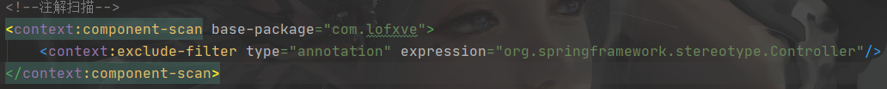

```
jdbc.driver=com.mysql.jdbc.Driver
jdbc.url=jdbc:mysql:///spring
jdbc.username=root
jdbc.password=root
```

# 搭建Mybatis环境

```java
package com.lofxve.domain;

import lombok.Data;

/**
 * @ClassName Account
 * @Author lofxve
 * @Date 2021/1/11 17:51
 * @Version 1.0
 */
@Data
public class Account {
    private Integer aid;
    private String name;
    private float balane;
}
```

```java
package com.lofxve.dao;

import com.lofxve.domain.Account;

import java.util.List;

/**
 * @ClassName AccountDao
 * @Author lofxve
 * @Date 2021/1/11 17:59
 * @Version 1.0
 */
public interface AccountDao {

    List<Account> findAll();
}
```

```xml
<?xml version="1.0" encoding="UTF-8"?>
<!DOCTYPE mapper
        PUBLIC "-//mybatis.org//DTD Mapper 3.0//EN"
        "http://mybatis.org/dtd/mybatis-3-mapper.dtd">
<mapper namespace="com.lofxve.dao.AccountDao">
    <select id="findAll" resultType="com.lofxve.domain.Account">
        select * from account;
    </select>
</mapper>
```

```properties
jdbc.driver=com.mysql.jdbc.Driver
jdbc.url=jdbc:mysql:///spring
jdbc.username=root
jdbc.password=root
```

```properties
### 设置###
log4j.rootLogger = debug,stdout

### 输出信息到控制抬 ###
log4j.appender.stdout = org.apache.log4j.ConsoleAppender
log4j.appender.stdout.Target = System.out
log4j.appender.stdout.layout = org.apache.log4j.PatternLayout
log4j.appender.stdout.layout.ConversionPattern = [%-5p] %d{yyyy-MM-dd HH:mm:ss,SSS} method:%l%n%m%n
```

```xml
<?xml version="1.0" encoding="UTF-8"?>
<!DOCTYPE configuration PUBLIC "-//mybatis.org//DTD Config 3.0//EN" "http://mybatis.org/dtd/mybatis-3-config.dtd">
<configuration>
    <!--导入外部配置文件-->
    <properties resource="db.properties"/>

    <!--实体类的别名-->
    <typeAliases>
        <package name="com.lofxve.domain"/>
    </typeAliases>

    <!--环境配置-->
    <environments default="dev">
        <environment id="dev">
            <transactionManager type="JDBC"></transactionManager>
            <dataSource type="POOLED">
                <property name="driver" value="${jdbc.driver}"/>
                <property name="url" value="${jdbc.url}"/>
                <property name="username" value="${jdbc.username}"/>
                <property name="password" value="${jdbc.password}"/>
            </dataSource>
        </environment>
    </environments>

    <!--映射文件导入-->
    <mappers>
        <package name="com.lofxve.dao"/>
    </mappers>

</configuration>
```

```java
@org.junit.Test
public void mybatisTest() throws IOException {
    //1. 读取配置文件,将文件读成一个输入流
    InputStream inputStream = Resources.getResourceAsStream("mybatis-config.xml");

    //2. 创建sqlSessionFactory
    SqlSessionFactory sqlSessionFactory = new SqlSessionFactoryBuilder().build(inputStream);

    //3. 获取sqlSession
    SqlSession sqlSession = sqlSessionFactory.openSession();

    //4. 获取dao的代理对象,可以操作
    AccountDao accountDao = sqlSession.getMapper(AccountDao.class);
    List<Account> accounts = accountDao.findAll();
    for (Account account : accounts) {
        System.out.println(account);
    }

    //5. 提交事务
    sqlSession.commit();

    //6. 释放资源
    sqlSession.close();
}
```

# 搭建Spring环境

```java
package com.lofxve.service;

import com.lofxve.domain.Account;

import java.util.List;

/**
 * @ClassName AccountService
 * @Author lofxve
 * @Date 2021/1/11 22:05
 * @Version 1.0
 */
public interface AccountService {
    List<Account> findAll();
}
```

```java
package com.lofxve.service.impl;

import com.lofxve.dao.AccountDao;
import com.lofxve.domain.Account;
import com.lofxve.service.AccountService;
import com.sun.xml.internal.bind.v2.TODO;
import org.springframework.beans.factory.annotation.Autowired;
import org.springframework.stereotype.Service;

import java.util.List;

/**
 * @ClassName AccountServiceIml
 * @Author lofxve
 * @Date 2021/1/11 22:06
 * @Version 1.0
 */
@Service
public class AccountServiceIml implements AccountService {
    // TODO: 2021/1/11 等待spring和mybatis整合
//    @Autowired
//    private AccountDao accountDao;

    public List<Account> findAll() {
//        return accountDao.findAll();
        System.out.println("查询所有...");
        return null;
    }
}
```

```xml
<?xml version="1.0" encoding="UTF-8"?>
<beans xmlns="http://www.springframework.org/schema/beans"
       xmlns:xsi="http://www.w3.org/2001/XMLSchema-instance"
       xmlns:context="http://www.springframework.org/schema/context"
       xsi:schemaLocation="http://www.springframework.org/schema/beans http://www.springframework.org/schema/beans/spring-beans.xsd http://www.springframework.org/schema/context http://www.springframework.org/schema/context/spring-context.xsd">
    <!--开启注解扫描-->
    <context:component-scan base-package="com.lofxve.service"></context:component-scan>

</beans>
```

```java
package com.lofve;

import com.lofxve.dao.AccountDao;
import com.lofxve.domain.Account;
import com.lofxve.service.AccountService;
import com.sun.media.sound.SoftTuning;
import org.apache.ibatis.io.Resources;
import org.apache.ibatis.session.SqlSession;
import org.apache.ibatis.session.SqlSessionFactory;
import org.apache.ibatis.session.SqlSessionFactoryBuilder;
import org.junit.Test;
import org.junit.runner.RunWith;
import org.springframework.beans.factory.annotation.Autowired;
import org.springframework.test.context.ContextConfiguration;
import org.springframework.test.context.junit4.SpringJUnit4ClassRunner;

import java.io.IOException;
import java.io.InputStream;
import java.util.List;

/**
 * @ClassName ssmTest
 * @Author lofxve
 * @Date 2021/1/11 21:37
 * @Version 1.0
 */
@RunWith(SpringJUnit4ClassRunner.class)
@ContextConfiguration("classpath:ApplicationContext.xml")
public class ssmTest {
    @Autowired
    private AccountService accountService;

    @Test
    public void springTest(){
        List<Account> all = accountService.findAll();
        if (all != null) {
            for (Account account : all) {
                System.out.println(account);
            }
        }
    }

    @Test
    public void mybatisTest() throws IOException {
        //1. 读取配置文件,将文件读成一个输入流
        InputStream inputStream = Resources.getResourceAsStream("mybatis-config.xml");

        //2. 创建sqlSessionFactory
        SqlSessionFactory sqlSessionFactory = new SqlSessionFactoryBuilder().build(inputStream);

        //3. 获取sqlSession
        SqlSession sqlSession = sqlSessionFactory.openSession();

        //4. 获取dao的代理对象,可以操作
        AccountDao accountDao = sqlSession.getMapper(AccountDao.class);
        List<Account> accounts = accountDao.findAll();
        for (Account account : accounts) {
            System.out.println(account);
        }

        //5. 提交事务
        sqlSession.commit();

        //6. 释放资源
        sqlSession.close();
    }
}
```

# SpringMVC

核心配置文件

1. ==扫描==
2. ==三大组件：处理器映射器，处理器处理器，视图解析器==

web.xml ==监听器，前端控制器，过滤器，文件==

```XML
<?xml version="1.0" encoding="UTF-8"?>
<beans xmlns="http://www.springframework.org/schema/beans"
       xmlns:xsi="http://www.w3.org/2001/XMLSchema-instance"
       xmlns:context="http://www.springframework.org/schema/context" xmlns:mvc="http://www.alibaba.com/schema/stat"
       xsi:schemaLocation="http://www.springframework.org/schema/beans http://www.springframework.org/schema/beans/spring-beans.xsd http://www.springframework.org/schema/context http://www.springframework.org/schema/context/spring-context.xsd http://www.alibaba.com/schema/stat http://www.alibaba.com/schema/stat.xsd">
    <!--开启注解扫描-->
    <context:component-scan base-package="com.lofxve.controller"/>

    <!--三大组件-->
    <!--处理器映射器和处理器适配器-->
    <mvc:annotation-driven/>
    <!--视图解析器-->
    <bean id="viewResolver" class="org.springframework.web.servlet.view.InternalResourceViewResolver">
        <property name="prefix" value="/WEB-INF/"/>
        <property name="suffix" value=".jsp"/>
    </bean>
</beans>
```

```xml
<?xml version="1.0" encoding="UTF-8"?>
<web-app xmlns:xsi="http://www.w3.org/2001/XMLSchema-instance"
         xmlns="http://java.sun.com/xml/ns/javaee"
         xsi:schemaLocation="http://java.sun.com/xml/ns/javaee http://java.sun.com/xml/ns/javaee/web-app_2_5.xsd"
         version="2.5">
    <!--springMVC前端控制器-->
    <servlet>
        <servlet-name>dispatcherServlet</servlet-name>
        <servlet-class>org.springframework.web.servlet.DispatcherServlet</servlet-class>
        <init-param>
            <param-name>contextConfigLocation</param-name>
            <param-value>classpath:Spring-MVC.xml</param-value>
        </init-param>
    </servlet>
    <servlet-mapping>
        <servlet-name>dispatcherServlet</servlet-name>
        <url-pattern>/</url-pattern>
    </servlet-mapping>
    
    <!--中文乱码过滤器-->
    <filter>
        <filter-name>characterEncodingFilter</filter-name>
        <filter-class>org.springframework.web.filter.CharacterEncodingFilter</filter-class>
        <init-param>
            <param-name>encoding</param-name>
            <param-value>UTF-8</param-value>
        </init-param>
    </filter>
    <filter-mapping>
        <filter-name>characterEncodingFilter</filter-name>
        <url-pattern>/*</url-pattern>
    </filter-mapping>
</web-app>
```

```jsp
<%--
  Created by IntelliJ IDEA.
  User: lofxve
  Date: 2021/1/11
  Time: 22:42
  To change this template use File | Settings | File Templates.
--%>
<%@ page contentType="text/html;charset=UTF-8" language="java" %>
<html>
<head>
    <title>Title</title>
</head>
<body>
<a href="${pageContext.request.contextPath}/accountController/findAll">查询所有</a>
</body>
</html>
```

```java
package com.lofxve.controller;

import org.springframework.stereotype.Controller;
import org.springframework.web.bind.annotation.RequestMapping;

import javax.servlet.http.HttpServletRequest;

/**
 * @ClassName AccountController
 * @Author lofxve
 * @Date 2021/1/11 22:26
 * @Version 1.0
 */
@Controller
public class AccountController {
    // TODO: 2021/1/11
//    @Autowired
//    private AccountService accountService;

    @RequestMapping("/accountController/findAll")
    public String findAll(HttpServletRequest request) {
        request.setAttribute("name", "查询所有");
        System.out.println("查询所有");
        return "list";
    }
}
```

```jsp
<%--
  Created by IntelliJ IDEA.
  User: lofxve
  Date: 2021/1/11
  Time: 22:37
  To change this template use File | Settings | File Templates.
--%>
<%@ page contentType="text/html;charset=UTF-8" language="java" %>
<html>
<head>
    <title>Title</title>
</head>
<body>
${name}
</body>
</html>
```

# Spring整合mybatis

将mybatis的所有配置信息转移到Spring的配置文件中

将Mybatis的SqlSessionFactory托管到Spring的IOC容器中


```xml
<?xml version="1.0" encoding="UTF-8"?>
<beans xmlns="http://www.springframework.org/schema/beans"
       xmlns:xsi="http://www.w3.org/2001/XMLSchema-instance"
       xmlns:context="http://www.springframework.org/schema/context"
       xmlns:jdbc="http://www.springframework.org/schema/jdbc"
       xsi:schemaLocation="http://www.springframework.org/schema/beans http://www.springframework.org/schema/beans/spring-beans.xsd http://www.springframework.org/schema/context http://www.springframework.org/schema/context/spring-context.xsd http://www.springframework.org/schema/jdbc http://www.springframework.org/schema/jdbc/spring-jdbc.xsd">
    <!--开启注解扫描-->
    <context:component-scan base-package="com.lofxve.service"></context:component-scan>

    <!--mybatis引入-->
    <!--配置文件-->
    <context:property-placeholder location="classpath:db.properties"/>

    <!--数据源-->
    <bean id="dataSource" class="com.alibaba.druid.pool.DruidDataSource">
        <property name="driverClassName" value="${jdbc.driver}"/>
        <property name="url" value="${jdbc.url}"/>
        <property name="username" value="${jdbc.username}"/>
        <property name="password" value="${jdbc.password}"/>
    </bean>

    <!--事务管理器-->
    <bean id="transactionManager" class="org.springframework.jdbc.datasource.DataSourceTransactionManager">
        <property name="dataSource" ref="dataSource"></property>
    </bean>
    <!--映射文件导入-->
    <bean id="mapperScannerConfigurer" class="org.mybatis.spring.mapper.MapperScannerConfigurer">
        <property name="basePackage" value="com.lofxve.dao"></property>
    </bean>

    <!--将sqlSessionFactory放入spring容器-->
    <bean id="sqlSessionFactory" class="org.mybatis.spring.SqlSessionFactoryBean">
        <property name="dataSource" ref="dataSource"/>
        <property name="typeAliasesPackage" value="com.itheima.domain"/>
        <!--额外引入mybatis的配置文件-->
        <!--<property name="configLocation" value="classpath:mybatis-config.xml"/>-->
    </bean>
</beans>
```

# Spring整合SpringMVC

Spring和SpringMVC本身就是一家产品，是不用整合的，

但是现在的Spring容器自己无法启动，我们需要在web容器启动的时候，加载Spring的配置文件，启动Spring容器

那么这个工作是在spring-web包中的一个监听器来做的，这个包不用单独导入，他已经在 spring-webmvc 包中了

它会监听WEB容器的启动和停止，然后就可以控制 Spring容器的启动和停止了

```XML
<!--传入spring配置文件给监听器，监听器就会监听tomcat的启动，tomcat启动就会启动spring容器-->
<context-param>
    <param-name>contextConfigLocation</param-name>
    <param-value>classpath:ApplicationContext.xml</param-value>
</context-param>
<listener>
    <listener-class>org.springframework.web.context.ContextLoaderListener</listener-class>
</listener>
```

# 总结

ApplicationContext-dao.xml:==配置文件，数据源，事务管理器，映射文件导入，将sqlSessionFactory放入spring容器==


ApplicationContext-service.xml：==开启注解扫描，排除controller注解==



Spring-MVC.xml：==注解扫描，三大组件：处理器映射器，处理器处理器，视图解析器==


web.xml ：==监听器，前端控制器，过滤器，文件==


