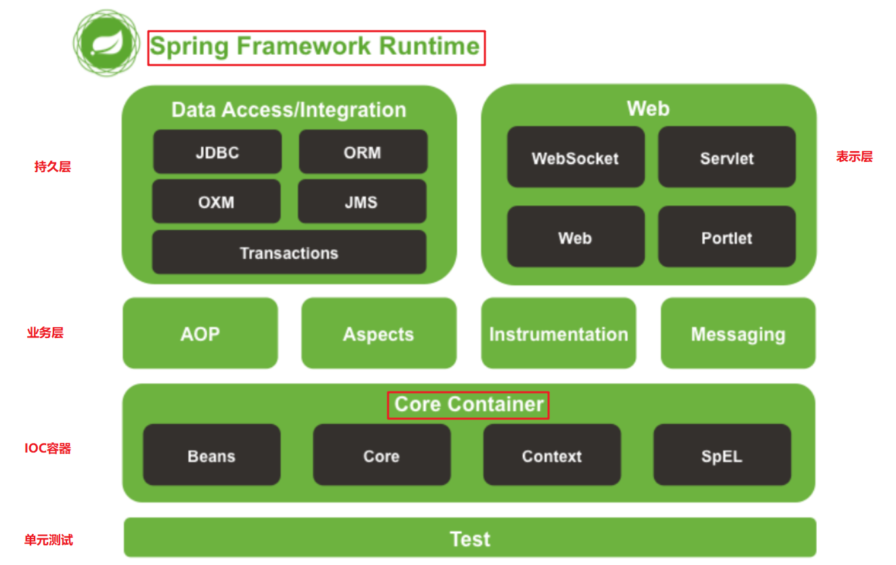
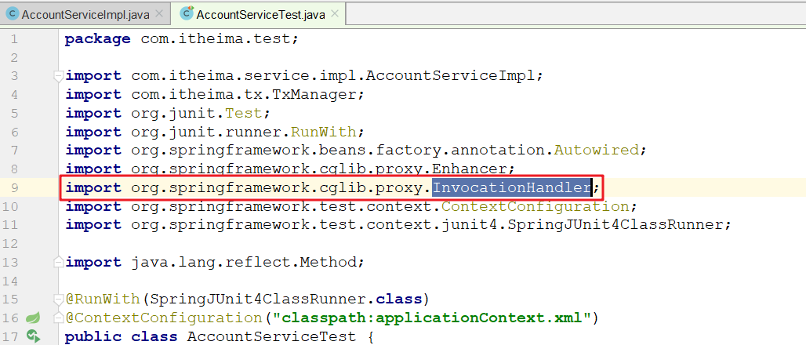
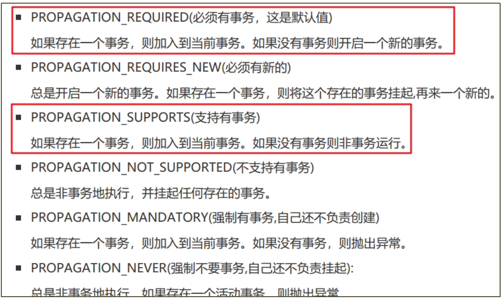

# Spring概述

>Spring是分层(三层)的Java应用轻量级开源框架
>
>Spring的核心是 **IOC（Inverse Of Control：反转控制）**和 **AOP（Aspect Oriented Programming：面向切面编程）**



## **轻量级**

1. api用起来比较简单
2. 运行时占用资源比较少

## **核心**

1. IOC  反转控制           工厂模式解耦

2. AOP 面向切面编程    动态代理

# IOC

> IOC( 控制 反转 )是一种设计思想。它的目的是指导我们设计出更加松耦合的程序。(解耦)
>
> 控制：指的是控制权，现在可以简单理解为对象的创建权限
>
> 反转：指的对象的控制权由==程序员在类中主动控制(new)==反转到==由Spring容器==来控制。

## IOC推导


UserDao

```java
package com.lofxve.dao;

/**
 * @ClassName UserDao
 * @Author lofxve
 * @Date 2021/1/3 19:21
 * @Version 1.0
 */
public interface UserDao {
    void save(String name);
}
```

UserDaoImpl

```java
package com.lofxve.dao.impl;

import com.lofxve.dao.UserDao;

/**
 * @ClassName UserDaoImpl
 * @Author lofxve
 * @Date 2021/1/3 19:21
 * @Version 1.0
 */
public class UserDaoImpl implements UserDao {

    @Override
    public void save(String name) {
        System.out.println("以《"+name+"》的方式创建对象....");
        System.out.println("用户保存成功..");
    }
}
```

BeanFactory

```java
package com.lofxve.factory;

import java.util.Enumeration;
import java.util.HashMap;
import java.util.Map;
import java.util.ResourceBundle;

/**
 * @ClassName BeanFactory
 * @Author lofxve
 * @Date 2021/1/3 19:27
 * @Version 1.0
 */
public class BeanFactory {

    static Map<String, Object> map = new HashMap<String, Object>();

    /**
     * 优化工厂
     * 一次性创建所有配置文件中的类，需要的用的时候直接获取响应的对象
     * 单例
     */
    public static Object getBean(String beanId) {
        return map.get(beanId);
    }

    static {
        try {
            // 读取配置文件
            ResourceBundle resourceBundle = ResourceBundle.getBundle("beans");
            // 获取所有key
            Enumeration<String> keys = resourceBundle.getKeys();
            // 遍历key
            while (keys.hasMoreElements()) {
                // 获取当前name
                String name = keys.nextElement();

                // 根据name 获取 classname
                String classname = resourceBundle.getString(name);

                // 反射获取class对象
                Class clazz = Class.forName(classname);

                // 根据class对象创建类，放入map中
                map.put(name, clazz.newInstance());
            }
        } catch (ClassNotFoundException e) {
            e.printStackTrace();
        } catch (InstantiationException e) {
            e.printStackTrace();
        } catch (IllegalAccessException e) {
            e.printStackTrace();
        }
    }


    /**
     * 工厂解耦
     * 创建需要的对象
     * 多例
     */
    /*public static Object getBean(String beanId) {
        try {
            // 读取配置文件
            ResourceBundle resourceBundle = ResourceBundle.getBundle("beans");

            // 获取classname，类的全限定名
            String classname = resourceBundle.getString(beanId);

            // 获取全限定名的class
            Class clazz = Class.forName(classname);

            // 创建对象
            return clazz.newInstance();
        } catch (ClassNotFoundException e) {
            e.printStackTrace();
        } catch (InstantiationException e) {
            e.printStackTrace();
        } catch (IllegalAccessException e) {
            e.printStackTrace();
        }
        return null;
    }*/
}
```

UserServiceImpl

```java
package com.lofxve.service;

import com.lofxve.dao.UserDao;
import com.lofxve.dao.impl.UserDaoImpl;
import com.lofxve.factory.BeanFactory;
import org.junit.Test;

/**
 * @ClassName UserServiceImpl
 * @Author lofxve
 * @Date 2021/1/3 19:23
 * @Version 1.0
 */
public class UserServiceImpl {
    /**
     * ioc 控制反转 就是我们不能控制对象的创建，我们需要就向ioc容器去要
     */
    @Test
    public void save1() {
        /**
         * 对象创建原始方式
         */
        UserDao userDao = new UserDaoImpl();
        userDao.save("对象创建原始方式");
    }

    @Test
    public void save2() {
        /**
         *工厂解耦 多例 浪费空间
         */
        UserDao userDao = (UserDao) BeanFactory.getBean("userDao");
        userDao.save("工厂解耦");
    }

    @Test
    public void save3(){
        /**
         *优化工厂 单例
         *对象直接从工厂中获取，不需要自己new，直接向工厂要
         */
        UserDao userDao = (UserDao) BeanFactory.getBean("userDao");
        userDao.save("优化工厂");
    }

}
```

beans.properties

```properties
userDao=com.lofxve.dao.impl.UserDaoImpl
userService=com.lofxve.service.UserServiceImpl
```

## Spring IOC的实现

```xml
<dependency>
    <groupId>org.springframework</groupId>
    <artifactId>spring-context</artifactId>
    <version>5.1.6.RELEASE</version>
</dependency>
```

### 一个方法

**getBean() 用于从Spring容器中获取Bean对象，参数可以使用三种情况：**
	getBean("id")                     使用bean的id从容器中查找对象
	getBean(Bean.class)           使用bean的class类型从容器中查找对象
	getBean("id", Bean.class)   使用bean的id 和 class类型从容器中查找对象

### 两个接口

**BeanFactory**
		这是SpringIOC容器的顶级接口，它定义了SpringIOC的最基础的功能，但是其功能比较简单，一般面向Spring自身使用BeanFactroy在**第一次**使用到某个Bean时(调用getBean())，才对该Bean进行加载实例化

**ApplicationContext**
		这是在BeanFactory的子接口，它扩展了BeanFactory的功能，一般面向程序员使用ApplicationContext是在容器**启动时**，一次性创建并加载了所有的Bean

**注意**: 上面两种方式创建的对象都是**单例**，只是创建对象的时机不同

### 三个实现方式

这三个类的作用都是：读取配置文件, 初始化Spring的IOC容器,  不一样的是加载配置文件的位置
	 **ClassPathXmlApplicationContext**         读取类路径下的xml作为配置文件
	 **FileSystemXmlApplicationContext**        读取本地目录下的xml作为配置文件	
	 **AnnotationConfigApplicationContext**     读取一个注解配置作为配置文件

```java
// 读取配置文件，创建spring的ioc容器
ApplicationContext applicationContext = new ClassPathXmlApplicationContext("ApplicationContext.xml");

// 从容器中获取对象
UserDao userDao = applicationContext.getBean("userDao", UserDao.class);

// 调用对象的方法
userDao.save("Spring Ioc 容器创建对象");
```

## Bean的配置

### 三种bean对象创建方式

**Java**

```java
package com.lofxve.beans;

import org.junit.Test;

/**
 * @ClassName App
 * @Author lofxve
 * @Date 2021/1/3 22:08
 * @Version 1.0
 */
public class App {
    @Test
    public void getBook(){
        // 直接使用new关键字创建
        Book book = new Book();
        System.out.println(book);

        // 使用静态工厂创建
        Book book1 = BookFactory.getBook1();
        System.out.println(book1);

        // 使用实例化工厂创建
        BookFactory bookFactory = new BookFactory();
        Book book2 = bookFactory.getBook2();
        System.out.println(book2);
    }
}
```

**Spring**

```xml
<!--    创建对象的三种方式
    1. 直接使用new关键字创建
    2. 使用静态工厂创建
    3. 使用实例化工厂创建-->
<!-- 1. 直接使用new关键字创建-->
<bean id="book0" class="com.lofxve.beans.Book">
    <constructor-arg name="name" value="水浒传"/>
    <constructor-arg name="price" value="72.5"/>
    <constructor-arg name="publish" ref="date"/>
</bean>
<bean id="date" class="java.util.Date"></bean>

<!--2. 使用静态工厂创建-->
<bean id="book1" class="com.lofxve.beans.BookFactory" factory-method="getBook1">

</bean>

<!--3. 使用实例化工厂创建-->
<bean id="bookFactory" class="com.lofxve.beans.BookFactory"></bean>
<bean id="book2" factory-bean="bookFactory" factory-method="getBook2"></bean>
```

### 五种bean作用范围

> singleton(默认)    单例模式，即对象只创建一次, 然后一直存在
>
> prototype          多例模式，即每次获取bean(调用getBean方法的时候)的时候，IOC都给我们创建一个新对象
>
> request            web项目中，Spring创建一个Bean的对象，将对象存入到request域中
>
> session            web 项目中，Spring创建一个Bean 的对象，将对象存入到session域中
>
> globalSession      用于分布式web开发中，创建的实例绑定全局session对象

singleton单例对象在容器创建的时候创建，在容器销毁的时候销毁

```xml
<bean id="userDao" class="com.lofxve.dao.impl.UserDaoImpl" scope="singleton" init-method="init" destroy-method="des"></bean>
```

prototype多例对象会在每次调用getBean的时候创建，对象的销毁是不受Spring控制，由对象所在现成的垃圾回收器负责回收

```xml
<bean id="userDao" class="com.lofxve.dao.impl.UserDaoImpl" scope="prototype" init-method="init" destroy-method="des"></bean>
```

### 两种bean依赖注入方式

依赖注入(Dependency Injection，DI) 其实就是给对象中的属性赋值的过程

依赖注入有两种方式，分别是使用**构造函数**和**set方法**

## anno注解的使用

### **放入对象**

==**@Component**==
用于创建对象，相当于配置文件中的<bean id="" class=""/>
它支持一个属性value,  相当于xml中bean的id。如果不写，默认值为类名的首字母小写

==**@Controller  @Service  @Repository**==
	@Controller  标注在表示层的类上
	@Service     标注在业务层的类上
	@Repository  标注在持久层的类上
推荐使用这三个，当一个类实在不好归属在这三个层上时，再使用@Component

**@Scope**

用于指定bean的作用范围(单例和多例)，相当于配置文件中的<bean scope=""> 

**@PostConstruct @PreDestroy** 

这两个注解标注方法分别在对象的创建之后和销毁之前执行。

相当于<bean init-method="init" destroy-method="destory" /> 

### 取出对象

==@Autowired==

==bytype==
     如果找不到，就会报错
     如果找到了，而且正好找到了一个，那么就进行依赖注入
     如果找到了，但是找到了多个，它会再按照属性名称进行匹配
         如果匹配上了就注入
         如果匹配不上就报错

==@Qualifier==

==byname==

要跟@Autowired联合使用，代表在按照类型匹配的基础上，再按照名称匹配

==@Resource(了解)==

==byname==

==bytype==

此注解由java提供，而且9版本以后废弃了
Spring会在他的IOC容器中先按照属性名称进行寻找
     如果找到了，就进行依赖注入
     如果找不到，再按照类型进行匹配
         如果正好匹配到一个，就注入
         如果匹配到多个，就报错
注意: @Resource(name = "userDaoImpl1") 如果直接使用name指定名称，他就只会按照名称匹配

### 注解小结

| xml配置                                               | 注解配置                                    | 说明                       |
| ----------------------------------------------------- | ------------------------------------------- | -------------------------- |
| < bean id="" class="" >                               | @Component @Controller @Service @Repository | bean的创建                 |
| < property name="" value="">                          | @Value                                      | bean的简单属性注入         |
| < property name="" ref="">                            | @Autowired  @Qualifier  @Resource           | bean的对象属性注入         |
| < bean scope="">                                      | @Scope                                      | 控制bean的作用范围         |
| < bean init-method="init" destroy-method="destory" /> | @PostConstruct @PreDestroy                  | bean创建之后和销毁之前调用 |

### 其他注解

**@ComponentScan**
	组件扫描注解。 相当于xml配置文件中的< context:component-scan base-package=""/> 

**@Bean**
	该注解只能写在方法上，表明使用此方法创建一个对象，并且放入spring容器。它支持一个name属性，用于给生成的bean取一个id。 

**@PropertySource**
	用于引入其它的properties配置文件

**@Import**
	在一个配置类中导入其它配置类的内容

**@Configuration**
	被此注解标注的类,会被Spring认为是配置类。Spring在启动的时候会自动扫描并加载所有配置类,然后将配置类中bean放入容器

**@RunWith(SpringJUnit4ClassRunner.class)**

​	将junit运行期切换成Spring运行器

**@ContextConfiguration(classes = SpringConfig.class)**

​	向Spring的运行器传递配置类，Spring运行期就会自动启动spring容器

### 纯注解开发

DbConfig

```java
package com.lofxve.config;

import com.alibaba.druid.pool.DruidDataSource;
import org.apache.commons.dbutils.QueryRunner;
import org.springframework.beans.factory.annotation.Qualifier;
import org.springframework.beans.factory.annotation.Value;
import org.springframework.context.annotation.Bean;
import org.springframework.context.annotation.Configuration;
import org.springframework.context.annotation.PropertySource;

/**
 * @ClassName DbConfig
 * @Author lofxve
 * @Date 2021/1/5 23:27
 * @Version 1.0
 */
@Configuration // 被此注解标注的类,会被Spring认为是配置类
@PropertySource("db.properties") // 用于引入其它的properties配置文件
public class DbConfig {
    @Value("${jdbc.driver}") // bean的简单属性注入
    private String driver;
    @Value("${jdbc.url}")
    private String url;
    @Value("${jdbc.username}")
    private String username;
    @Value("${jdbc.password}")
    private String password;

    @Bean("daraSource")  //该注解只能写在方法上，表明使用此方法创建一个对象
    public DruidDataSource createDruidDataSource(){
        try {
            DruidDataSource druidDataSource = new DruidDataSource();
            druidDataSource.setDriverClassName(driver);
            druidDataSource.setUrl(url);
            druidDataSource.setUsername(username);
            druidDataSource.setPassword(password);
            return druidDataSource;
        } catch (Exception e) {
            e.printStackTrace();
        }
        return null;
    }

    @Bean
    public QueryRunner createQueryRunner(@Qualifier("daraSource")DruidDataSource druidDataSource){
        return new QueryRunner(druidDataSource);
    }
}
```

SpringConfig

```java
package com.lofxve.config;

import org.springframework.context.annotation.ComponentScan;

/**
 * @ClassName SpringConfig
 * @Author lofxve
 * @Date 2021/1/5 23:27
 * @Version 1.0
 */
@ComponentScan("com.lofxve") //注解扫描
//@Import(DbConfig.class) //在一个配置类中导入其它配置类的内容
public class SpringConfig {
}
```

AccountDaoImpl

```java
package com.lofxve.dao.impl;

import com.lofxve.dao.AccountDao;
import com.lofxve.domin.Account;
import org.apache.commons.dbutils.QueryRunner;
import org.apache.commons.dbutils.handlers.BeanHandler;
import org.apache.commons.dbutils.handlers.BeanListHandler;
import org.springframework.beans.factory.annotation.Autowired;
import org.springframework.beans.factory.annotation.Qualifier;
import org.springframework.context.annotation.Scope;
import org.springframework.stereotype.Repository;

import java.sql.SQLException;
import java.util.List;

/**
 * @ClassName AccountDaoImpl
 * @Author lofxve
 * @Date 2021/1/2 22:34
 * @Version 1.0
 */
@Repository // 创建对象放入Spring容器
@Scope("singleton") // 单例
public class AccountDaoImpl implements AccountDao {

    @Autowired // 从Spring容器中取出对象
    @Qualifier("queryRunner") // 按照类型匹配的基础上，再按照名称匹配
    private QueryRunner queryRunner;

    public void save(Account account) {
        try {
            queryRunner.update("insert into account value(NULL ,?,?)", account.getName(), account.getBalance());
        } catch (SQLException throwables) {
            throwables.printStackTrace();
        }
    }

    public List<Account> findAll() {
        try {
            return queryRunner.query("select * from account", new BeanListHandler<Account>(Account.class));
        } catch (SQLException throwables) {
            throwables.printStackTrace();
        }
        return null;
    }

    public Account findByName(String name) {
        try {
            return queryRunner.query("select * from account where name = ?", new BeanHandler<Account>(Account.class), name);
        } catch (SQLException throwables) {
            throwables.printStackTrace();
        }
        return null;
    }

    public void update(Account account) {
        try {
            queryRunner.update("update account set balance = ? where name = ?", account.getBalance(), account.getName());
        } catch (SQLException throwables) {
            throwables.printStackTrace();
        }

    }

    public void deleteByName(String name) {
        try {
            queryRunner.update("delete from account where name = ?", name);
        } catch (SQLException throwables) {
            throwables.printStackTrace();
        }
    }

}
```

Account

```java
package com.lofxve.domin;

import lombok.Data;

/**
 * @ClassName Account
 * @Author lofxve
 * @Date 2021/1/2 22:25
 * @Version 1.0
 */
@Data
public class Account {
    private Integer aid;
    private String name;
    private Double balance;
}
```

AccountServiceImpl

```java
package com.lofxve.service.impl;

import com.lofxve.dao.AccountDao;
import com.lofxve.domin.Account;
import com.lofxve.service.AccountService;
import org.springframework.beans.factory.annotation.Autowired;
import org.springframework.context.annotation.Scope;
import org.springframework.stereotype.Service;

import javax.annotation.PostConstruct;
import javax.annotation.PreDestroy;
import java.util.List;

@Service
@Scope("prototype") // 多例
public class AccountServiceImpl implements AccountService {

    @Autowired
    private AccountDao accountDao;

    public void save(Account account) {
        accountDao.save(account);
    }

    public List<Account> findAll() {
        return accountDao.findAll();
    }

    public Account findByName(String name) {
        return accountDao.findByName(name);
    }

    public void update(Account account) {
        accountDao.update(account);
    }

    public void deleteByName(String name) {
        accountDao.deleteByName(name);
    }

    public void setAccountDao(AccountDao accountDao) {
        this.accountDao = accountDao;
    }

    //@PostConstruct @PreDestroy 这两个注解标注方法分别在对象的创建之后和销毁之前执行。
    @PostConstruct
    public void init() {
        System.out.println("对象创建之后");
    }

    @PreDestroy
    public void des() {
        System.out.println("对象销毁之前");
    }
}
```

db.properties

```properties
jdbc.driver=com.mysql.jdbc.Driver
jdbc.url=jdbc:mysql:///spring
jdbc.username=root
jdbc.password=root
```

Test

```java
package com.lofxve;

import com.lofxve.config.SpringConfig;
import com.lofxve.domin.Account;
import com.lofxve.service.AccountService;
import org.junit.runner.RunWith;
import org.springframework.beans.factory.annotation.Autowired;
import org.springframework.test.context.ContextConfiguration;
import org.springframework.test.context.junit4.SpringJUnit4ClassRunner;

import java.util.List;


/**
 * @ClassName Test
 * @Author lofxve
 * @Date 2021/1/2 22:57
 * @Version 1.0
 */
@RunWith(SpringJUnit4ClassRunner.class) // 将junit运行期切换成Spring运行器
@ContextConfiguration(classes = SpringConfig.class) // 向Spring的运行器传递配置类，Spring运行期就会自动启动spring容器
public class Test {

    @Autowired
    private AccountService accountService;

    @org.junit.Test
    public void testFindAll() {
        List<Account> all = accountService.findAll();
        for (Account account : all) {
            System.out.println(account);
        }
    }

    @org.junit.Test
    public void testSave() {
        Account account = new Account();
        account.setName("4545");
        account.setBalance(12.56d);
        accountService.save(account);
    }
}
```

# AOP

## AOP推导

> 在不改动原来业务代码的前提下，给代码添加事务管理功能

### 事务管理工具类

TxManager

```java
package com.lofxve.tx;

import com.alibaba.druid.pool.DruidDataSource;
import org.springframework.stereotype.Component;

import java.sql.Connection;
import java.sql.SQLException;

/**
 * @ClassName TxManager
 * @Author lofxve
 * @Date 2021/1/8 20:30
 * @Version 1.0
 */
@Component
public class TxManager {

    private DruidDataSource druidDataSourc;
    
    // 本地集合临时存储连接对象的集合
    ThreadLocal<Connection> th = new ThreadLocal<Connection>();
    
    public void setDruidDataSourc(DruidDataSource druidDataSourc) {
        this.druidDataSourc = druidDataSourc;
    }

    // 获取链接
    public Connection getConnection() throws SQLException {
        Connection connection = th.get();
        if (connection == null) {
            connection = druidDataSourc.getConnection();
            th.set(connection);
        }
        return connection;
    }
    //开启事务
    public void begin() {
        try {
            getConnection().setAutoCommit(false);
        } catch (SQLException e) {
            e.printStackTrace();
        }
    }

    //提交事务
    public void commit() {
        try {
            getConnection().commit();
        } catch (SQLException e) {
            e.printStackTrace();
        }
    }

    //回滚事务
    public void rollback() {
        try {
            getConnection().rollback();
        } catch (SQLException e) {
            e.printStackTrace();
        }
    }

    //关闭事务
    public void close() {
        try {
            getConnection().close();
            th.remove();
        } catch (SQLException e) {
            e.printStackTrace();
        }
    }

}
```

AccountDaoImpl

```java
public class AccountDaoImpl implements AccountDao {
    private QueryRunner queryRunner;

    @Autowired
    private TxManager txManager;

    // 依赖set注入
    public void setQueryRunner(QueryRunner queryRunner) {
        this.queryRunner = queryRunner;
    }

    public void save(Account account) {
        try {
            queryRunner.update(txManager.getConnection(),"insert into account value(NULL ,?,?)", account.getName(), account.getBalane());
        } catch (SQLException throwables) {
            throwables.printStackTrace();
        }
    }
   }
```

AccountServiceImpl

```java
public class AccountServiceImpl implements AccountService {
    private AccountDao accountDao;

    @Autowired
    private TxManager txManager;

    public void transfer(String name, String name1, float d) {
        try {
            // 开启事务
            txManager.begin();
            Account byName = accountDao.findByName(name);
            Account byName1 = accountDao.findByName(name1);

            byName.setBalane(byName.getBalane() - d);
            byName1.setBalane(byName1.getBalane() + d);

            accountDao.update(byName);
            accountDao.update(byName1);
            // 提交事务
            txManager.commit();
        } catch (Exception e) {
            // 回滚事务
            txManager.rollback();
            e.printStackTrace();
        } finally {
            // 关闭事务
            txManager.close();
        }
    }
  }
```

## jdk动态代理

Test

```java
package com.lofxve;

import com.lofxve.config.SpringConfig;
import com.lofxve.domin.Account;
import com.lofxve.service.AccountService;
import com.lofxve.tx.TxManager;
import org.junit.runner.RunWith;
import org.springframework.beans.factory.annotation.Autowired;
import org.springframework.context.ApplicationContext;
import org.springframework.context.support.ClassPathXmlApplicationContext;
import org.springframework.stereotype.Component;
import org.springframework.test.context.ContextConfiguration;
import org.springframework.test.context.junit4.SpringJUnit4ClassRunner;

import java.lang.reflect.InvocationHandler;
import java.lang.reflect.Method;
import java.lang.reflect.Proxy;


/**
 * @ClassName Test
 * @Author lofxve
 * @Date 2021/1/2 22:57
 * @Version 1.0
 */
@RunWith(SpringJUnit4ClassRunner.class) // 将junit运行期切换成Spring运行器
@ContextConfiguration(classes = SpringConfig.class) // 向Spring的运行器传递配置类，Spring运行期就会自动启动spring容器
public class Test {

    @Autowired
    private AccountService accountService;

    @Autowired
    private TxManager txManager;

    @org.junit.Test
    public void testTransfer() {
        // 增强逻辑
        InvocationHandler invocationHandler = new InvocationHandler() {
            public Object invoke(Object proxy, Method method, Object[] args) throws Throwable {
                Object obj = null;
                try {
                    // 开启事务
                    txManager.begin();
                    // 执行原有方法
                    obj = method.invoke(accountService, args);
                    // 提交事务
                    txManager.commit();
                } catch (Exception e) {
                    // 回滚事务
                    txManager.rollback();
                    e.printStackTrace();
                } finally {
                    // 关闭事务
                    txManager.close();
                }

                return obj;
            }
        };
        // 创建代理对象
        AccountService invocationHandlerAccountService = (AccountService) Proxy.newProxyInstance(
                accountService.getClass().getClassLoader(),
                accountService.getClass().getInterfaces(),
                invocationHandler);
        // 调用方法
        invocationHandlerAccountService.transfer("441", "4545", 1f);

        for (Account account : invocationHandlerAccountService.findAll()) {
            System.out.println(account);
        }
    }
}
```

## cglib动态代理

将service接口删掉

 

~~~java
package com.itheima.test;

import com.itheima.service.impl.AccountServiceImpl;
import com.itheima.tx.TxManager;
import org.junit.Test;
import org.junit.runner.RunWith;
import org.springframework.beans.factory.annotation.Autowired;
import org.springframework.cglib.proxy.Enhancer;
import org.springframework.cglib.proxy.InvocationHandler;
import org.springframework.test.context.ContextConfiguration;
import org.springframework.test.context.junit4.SpringJUnit4ClassRunner;

import java.lang.reflect.Method;
import java.lang.reflect.Proxy;

@RunWith(SpringJUnit4ClassRunner.class)
@ContextConfiguration("classpath:applicationContext.xml")
public class AccountServiceTest {

    @Autowired
    private AccountServiceImpl accountService;

    @Autowired
    private TxManager txManager;

    @Test
    public void testTransfer() {

        //增强逻辑
        InvocationHandler invocationHandler = new InvocationHandler() {
            public Object invoke(Object proxy, Method method, Object[] args) throws Throwable {
                Object obj = null;
                try {
                    txManager.begin();//开启事务

                    //这句话的意思就是执行原有的方法
                    obj = method.invoke(accountService, args);

                    txManager.commit();//提交事务
                } catch (Exception e) {
                    e.printStackTrace();
                    txManager.rollback();//回滚事务
                } finally {
                    txManager.close();//关闭事务
                }
                return obj;
            }
        };

        //基于cglib创建出代理对象
        //1. 创建增强器
        Enhancer enhancer = new Enhancer();

        //2 设置父类
        enhancer.setSuperclass(AccountServiceImpl.class);

        //3 设置增强逻辑[注意invocationHandler使用的是cglib的]
        enhancer.setCallback(invocationHandler);

        //4 创建代理对象
        AccountServiceImpl instance = (AccountServiceImpl) enhancer.create();


        //调用代理对象 转账
        instance.transfer("B01", "B02", 1f);
    }
}
~~~

## 两种代理方式的对比和总结

首先明确在创建代理实现类时，jdk的效率要高于cglib，所以选择的时候:

- 当被代理类有接口的时候,使用jdk动态代理，因为它的效率高
- 当被代理类没有接口的时候,使用cglib动态代理，因为没办法

当核心业务（转账）和增强业务（事务）同时出现时，我们可以在开发时对他们分别开发，运行时再组装在一起（使用动态代理的方式）。

这样做的好处是：

1. 逻辑清晰，开发核心业务的时候，不必关注增强业务的代码
2. 代码复用性高：增强代码不用重复书写

这就是一种 AOP 的思想。 

我的总结: ==分离开发,  组装运行==

## AOP思想

>AOP( 面向切面编程 )是一种思想，它的目的就是在不修改源代码的基础上，对原有功能进行增强。
>
>SpringAOP是对AOP思想的一种实现，Spring底层同时支持jdk和cglib动态代理。
>
>Spring会根据被代理的类是否有接口自动选择代理方式

## AOP术语

> ==目标对象==
> 被代理对象
>
> ==连接点==
> 被代理对象中的所有方法
>
> ==切入点==
> 被代理对象中的一部分(要进行功能增强的部分)方法  transfer
>
> ==增强(通知)==
> 一个具体的增强功能(事务控制  开启事务  关闭事务  提交事务  回滚事务) 一个增强对象中会有多个增强功能  事务四个方法
>
> ==织入(强调的是动作或者过程)==
> 将切入点和增强进行组装的过程
>
> ==代理对象==
> 进行增强之后的对象
>
> ==切面==
>
> 是一种描述,描述的是切点和增强方法的执行顺序
> 一个什么样的增强方法   运行在   哪些切点    的    什么位置

## AOP_anno

### 依赖

```xml
<!-- spring核心-->
<dependency>
    <groupId>org.springframework</groupId>
    <artifactId>spring-context</artifactId>
    <version>5.1.6.RELEASE</version>
</dependency>
<!--aop切点表达式解析-->
<dependency>
    <groupId>org.aspectj</groupId>
    <artifactId>aspectjweaver</artifactId>
    <version>1.8.7</version>
    <scope>compile</scope>
</dependency>
```

### 增强对象——环绕通知

Logger

```java
package com.lofxve.log;

import org.aspectj.lang.ProceedingJoinPoint;
import org.aspectj.lang.annotation.Around;
import org.aspectj.lang.annotation.Aspect;
import org.aspectj.lang.annotation.Pointcut;
import org.springframework.stereotype.Component;

/**
 * @ClassName Logger
 * @Author lofxve
 * @Date 2021/1/8 22:07
 * @Version 1.0
 */
@Component
@Aspect // 声明切面
public class Logger {
    // 定义一组规则, 用于在连接点中挑选切点
    @Pointcut("execution(* com.lofxve.service.impl.*.*(..))")
    public void pt(){}

    // 环绕通知是一种特殊的通知，他允许以编码的形式实现四大通知的效果
    @Around("pt()")
    public Object around(ProceedingJoinPoint proceedingJoinPoint){
        try {
            System.out.println("开启事务》");
            Object proceed = proceedingJoinPoint.proceed();
            System.out.println("提交事务》");
            return proceed;
        } catch (Throwable throwable) {
            System.out.println("回滚事务");
            throwable.printStackTrace();
        }finally {
            System.out.println("《关闭事务");
        }
        return null;
    }
}
```

```

```

### 激活切面自动代理

==@EnableAspectJAutoProxy==

## AOP_xml

### 增强对象——四大通知(==不推荐==)

>当四大通知同时出现的时候, 它们的运行顺序会受到配置文件中配置的顺序的影响

Logger

```java
package com.lofxve.log;

/**
 * @ClassName Logger
 * @Author lofxve
 * @Date 2021/1/8 22:07
 * @Version 1.0
 */
public class Logger {
    public void beforeMethod() {
        System.out.print("在切点之前运行》");
    }

    public void afterReturning() {
        System.out.print("===》方法正常执行");
    }

    public void afterThrowing() {
        System.out.print("===》方法执行异常");
    }

    public void afterMethod() {
        System.out.println("《在切点之后运行");
    }
}
```

### ApplicationContext.xml

```xml
<?xml version="1.0" encoding="UTF-8"?>
<beans xmlns="http://www.springframework.org/schema/beans"
       xmlns:xsi="http://www.w3.org/2001/XMLSchema-instance" xmlns:aop="http://www.springframework.org/schema/aop"
       xmlns:context="http://www.springframework.org/schema/context"
       xsi:schemaLocation="http://www.springframework.org/schema/beans http://www.springframework.org/schema/beans/spring-beans.xsd http://www.springframework.org/schema/aop http://www.springframework.org/schema/aop/spring-aop.xsd http://www.springframework.org/schema/context http://www.springframework.org/schema/context/spring-context.xsd">
    <!--注解扫描-->
    <context:component-scan base-package="com.lofxve"/>
    
    <!--激活切面自动代理-->
    <aop:aspectj-autoproxy/>
    
    <!--jdbc数据源-->
    <bean id="druidDataSourc" class="com.alibaba.druid.pool.DruidDataSource">
        <property name="driverClassName" value="com.mysql.jdbc.Driver"></property>
        <property name="url" value="jdbc:mysql:///spring"></property>
        <property name="username" value="root"></property>
        <property name="password" value="root"></property>
    </bean>
    <bean id="jdbcTemplate" class="org.springframework.jdbc.core.JdbcTemplate">
        <property name="dataSource" ref="druidDataSourc"></property>
    </bean>
    
    <!--增强对象-->
    <bean id="logger" class="com.lofxve.log.Logger"></bean>
    
    <aop:config>
        <!--目标对象中哪些方法是切入点-->
        <aop:pointcut id="pt" expression="execution(* com.lofxve.service.impl.*.*(..))"/>
        
        <!--配置切面-->
        <aop:aspect ref="logger">
            
            <!--前置通知(before) ：在切点运行之前执行-->
            <aop:before method="beforeMethod" pointcut-ref="pt"/>
            
            <!--异常通知(after-throwing)：在切点发生异常的时候执行-->
            <aop:after-throwing method="afterThrowing" pointcut-ref="pt"/>
            
            <!--后置通知(after-returning)：在切点正常运行结束之后执行-->
            <aop:after-returning method="afterReturning" pointcut-ref="pt"/>
            
            <!--最终通知(after)：在切点的最终执行-->
            <aop:after method="afterMethod" pointcut-ref="pt"/>
            
        </aop:aspect>
    </aop:config>
</beans>
```

## Spring中的事务管理(了解)

### 事务管理方式

Spring支持两种事务管理方式：编程式事务和声明式事务

- 编程式事务就是将业务代码和事务代码放在一起书写，它的耦合性太高，开发中不使用

- 声明式事务其实就是将事务代码和业务代码隔离开发，然后通过一段配置让他们组装运行，最后达到事务控制的目的

==声明式事务就是通过AOP原理实现的==

### Spring事务管理相关的API

#### PlatformTransactionManager

 

PlatformTransactionManager这是Spring进行事务管理的一个根接口，我们要使用它的实现类做事务管理

我们需要知道的是: ==mybatis和jdbcTemplate都可以使用它的一个子类(DataSourceTransactionManager)做事务管理==

#### TransactionDefinition

TransactionDefinition这个API是用来做事务定义的

 

##### 隔离级别

 

##### 传播行为

事务传播行为指的就是当一个业务方法【被】另一个业务方法调用时，应该如何进行事务控制 

~~~java
a(){
    b();//转账   配置的是支持事务
    sdasdasdas;
    sdadasdadasdasd;
}

//立场b
b(){
    
}
~~~

 

##### 只读性

只读事务(增 删  改不能使用,只能查询使用)

换句话说,  只读事务只能用于查询方法

##### 超时时长

事务超时时间, 此属性需要底层数据库的支持

它的默认值是-1, 代表不限制

#### TransactionStatus

TransactionStatus代表的是事务的当前状态

#### 三个API之间的关系

PlatformTransactionManager通过读取TransactionDefinition中定义事务信息参数,来管理事务,管理之后会产生一些列的TransactionStatus

### Transaction——XML

```xml
<?xml version="1.0" encoding="UTF-8"?>
<beans xmlns="http://www.springframework.org/schema/beans"
       xmlns:xsi="http://www.w3.org/2001/XMLSchema-instance"
       xmlns:aop="http://www.springframework.org/schema/aop"
       xmlns:context="http://www.springframework.org/schema/context"
       xmlns:tx="http://www.springframework.org/schema/tx"
       xsi:schemaLocation="http://www.springframework.org/schema/beans
       http://www.springframework.org/schema/beans/spring-beans.xsd
       http://www.springframework.org/schema/aop
       http://www.springframework.org/schema/aop/spring-aop.xsd
       http://www.springframework.org/schema/context
       http://www.springframework.org/schema/context/spring-context.xsd
       http://www.springframework.org/schema/tx
       http://www.springframework.org/schema/tx/spring-tx.xsd">
    <!--注解扫描-->
    <context:component-scan base-package="com.lofxve"/>


    <!--jdbc数据源-->
    <bean id="druidDataSourc" class="com.alibaba.druid.pool.DruidDataSource">
        <property name="driverClassName" value="com.mysql.jdbc.Driver"></property>
        <property name="url" value="jdbc:mysql:///spring"></property>
        <property name="username" value="root"></property>
        <property name="password" value="root"></property>
    </bean>
    <bean id="jdbcTemplate" class="org.springframework.jdbc.core.JdbcTemplate">
        <property name="dataSource" ref="druidDataSourc"></property>
    </bean>


    <!--增强对象-->
    <bean id="dataSourceTransactionManager" class="org.springframework.jdbc.datasource.DataSourceTransactionManager">
        <property name="dataSource" ref="druidDataSourc"></property>
    </bean>
    <!--增强参数-->
    <tx:advice id="txAdvice" transaction-manager="dataSourceTransactionManager">
        <tx:attributes>
            <tx:method name="*"/>
        </tx:attributes>
    </tx:advice>
    <!--配置声明式事务-->
    <aop:config>
        <!--切点-->
        <aop:pointcut id="pt" expression="execution(* com.lofxve.service.impl.*.*(..))"/>
        <!--切面-->
        <aop:advisor advice-ref="txAdvice" pointcut-ref="pt"/>
    </aop:config>
</beans>
```

### Transaction——ANNO

#### SpringConfig

```java
package com.lofxve.config;

import com.alibaba.druid.pool.DruidDataSource;
import org.springframework.beans.factory.annotation.Qualifier;
import org.springframework.context.annotation.Bean;
import org.springframework.context.annotation.ComponentScan;
import org.springframework.context.annotation.EnableAspectJAutoProxy;
import org.springframework.context.annotation.Import;
import org.springframework.jdbc.datasource.DataSourceTransactionManager;
import org.springframework.transaction.annotation.EnableTransactionManagement;

/**
 * @ClassName SpringConfig
 * @Author lofxve
 * @Date 2021/1/8 21:40
 * @Version 1.0
 */
@ComponentScan("com.lofxve")
@Import(DbConfig.class)
//@EnableAspectJAutoProxy // 激活切面自动代理
@EnableTransactionManagement // 启用事务管理
public class SpringConfig {
    @Bean
    public DataSourceTransactionManager transactionManager(@Qualifier("druidDataSource") DruidDataSource druidDataSource) {
        // 创建数据源事务管理器
        DataSourceTransactionManager transactionManager = new DataSourceTransactionManager();
        // 配置数据源
        transactionManager.setDataSource(druidDataSource);
        return transactionManager;
    }
}
```

#### @Transactional

在

# JdbcTemplate

## 依赖

```xml
<!--数据库-->
<dependency>
    <groupId>mysql</groupId>
    <artifactId>mysql-connector-java</artifactId>
    <version>5.1.6</version>
</dependency>
<dependency>
    <groupId>com.alibaba</groupId>
    <artifactId>druid</artifactId>
    <version>1.1.15</version>
</dependency>
<dependency>
    <groupId>org.springframework</groupId>
    <artifactId>spring-jdbc</artifactId>
    <version>5.1.6.RELEASE</version>
</dependency>
```

## JdbcTemplate核心

JdbcTemplate是Spring提供的持久层技术，用于操作数据库，它底层封装了JDBC技术。

### 核心类

**JdbcTemplate**  用于执行增删改查的SQL语句 (QueryRunner)
**RowMapper**     这是一个接口，主要作用是将数据库返回的记录封装进实体对象 (ResultSetHandler)

### 核心方法

**update**()  用来执行增、删、改语句
**query**()   用来执行查询语句

## Dome

```java
//创建一个JdbcTemplate对象，用来执行增删改查, 需要给一个数据源
JdbcTemplate  jdbcTemplate = new JdbcTemplate(dataSource);

//update方法，用于执行增删改语句
//第一个参数:sql语句   后面的参数:sql语句中的所需要的的值
jdbcTemplate.update("insert into account value(null,?,?)",1,2);

//query或者queryForObject方法，用于执行查询语句
//query 用于查询多条记录,返回一个集合   queryForObject用于查询一条记录,返回一个实体
//第一个参数:sql语句   第二个参数:封装返回值   后面的参数:sql语句中的所需要的的值
jdbcTemplate.query("select * from account", new BeanPropertyRowMapper<Account>(Account.class)); 
jdbcTemplate.queryForObject("select * from account where aid = ?",  new BeanPropertyRowMapper<Account>(Account.class),  1);

```

## map参数映射

```java
List<Foo> fooList = jdbcTemplate.query("SELECT * FROM FOO", new RowMapper<Foo>() {
    @Override
    public Foo mapRow(ResultSet rs, int rowNum) throws SQLException {
        return Foo.builder()
                .id(rs.getLong(1))
                .bar(rs.getString(2))
                .build();
    }
});
```

## 批处理

```java
public void batchInsert() {
    jdbcTemplate.batchUpdate("INSERT INTO FOO (BAR) VALUES (?)",
            new BatchPreparedStatementSetter() {
                @Override
                public void setValues(PreparedStatement ps, int i) throws SQLException {
                    ps.setString(1, "b-" + i);
                }

                @Override
                public int getBatchSize() {
                    return 2;
                }
            });

    List<Foo> list = new ArrayList<>();
    list.add(Foo.builder().id(100L).bar("b-100").build());
    list.add(Foo.builder().id(101L).bar("b-101").build());
    namedParameterJdbcTemplate
            .batchUpdate("INSERT INTO FOO (ID, BAR) VALUES (:id, :bar)",
                    SqlParameterSourceUtils.createBatch(list));
}
```