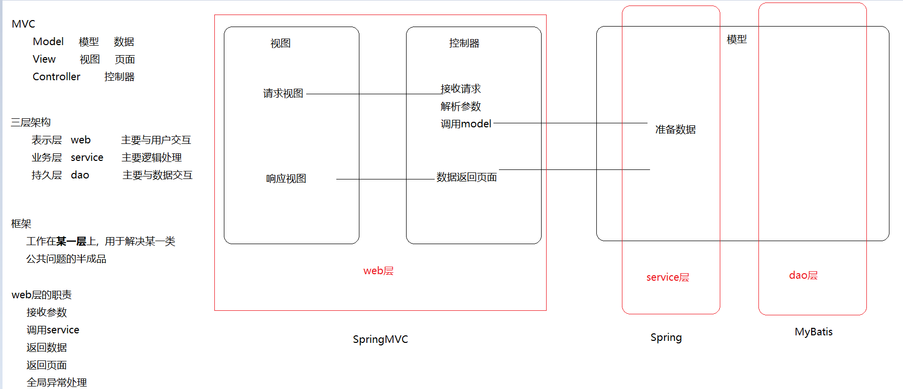
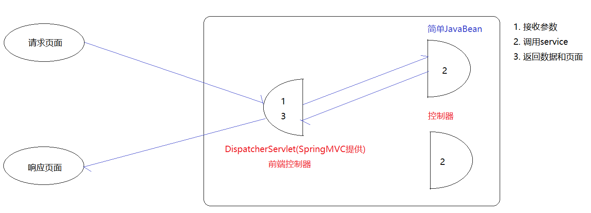
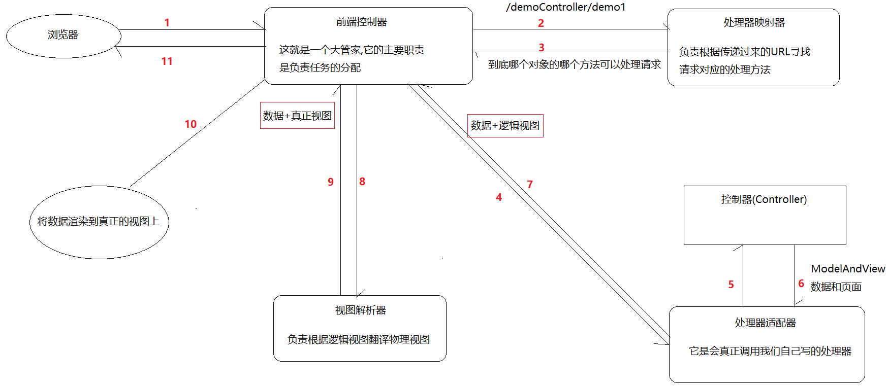

# MVC

MVC是一种用于设计创建 Web 应用程序表现层的模式,使用它可以将业务逻辑、数据、界面显示代码分离开来.

**Model（模型）: 指的就是数据模型,用于封装数据**

**View（视图） : 用于数据展示**

**Controller（控制器）: 用于程序处理逻辑**



# SpringMVC

> SpringMVC是Spring产品对MVC模式的一种具体实现，==它可以通过一套注解，让一个简单Java类成为控制器==



## SpringMVCDome

### 依赖

```xml
<dependencies>
    <dependency>
        <groupId>org.springframework</groupId>
        <artifactId>spring-webmvc</artifactId>
        <version>5.1.6.RELEASE</version>
    </dependency>

    <dependency>
        <groupId>javax.servlet</groupId>
        <artifactId>jsp-api</artifactId>
        <version>2.0</version>
    </dependency>

    <dependency>
        <groupId>javax.servlet</groupId>
        <artifactId>servlet-api</artifactId>
        <version>2.5</version>
    </dependency>
</dependencies>
```
### Spring-MVC.xml-配置文件

```xml
<?xml version="1.0" encoding="UTF-8"?>
<beans xmlns="http://www.springframework.org/schema/beans"
       xmlns:xsi="http://www.w3.org/2001/XMLSchema-instance"
       xmlns:context="http://www.springframework.org/schema/context"
       xmlns:mvc="http://www.springframework.org/schema/mvc"
       xsi:schemaLocation="http://www.springframework.org/schema/beans
       http://www.springframework.org/schema/beans/spring-beans.xsd
       http://www.springframework.org/schema/context
       http://www.springframework.org/schema/context/spring-context.xsd
       http://www.springframework.org/schema/mvc
       http://www.springframework.org/schema/mvc/spring-mvc.xsd">
    <!--    包扫描-->
    <context:component-scan base-package="com.lofxve.controller"/>

    <!--三大组件-->
    <!--    处理器映射器和处理器适配器-->
    <mvc:annotation-driven/>
    <!--    视图解析器-->
    <bean id="viewResolver" class="org.springframework.web.servlet.view.InternalResourceViewResolver">
    </bean>
</beans>
```

### web.xml-配置前端控制器

```xml
<?xml version="1.0" encoding="UTF-8"?>
<web-app xmlns:xsi="http://www.w3.org/2001/XMLSchema-instance"
         xmlns="http://java.sun.com/xml/ns/javaee"
         xsi:schemaLocation="http://java.sun.com/xml/ns/javaee http://java.sun.com/xml/ns/javaee/web-app_2_5.xsd"
         version="2.5">
    <!--前端控制器-->
    <servlet>
        <servlet-name>dispatcherServlet</servlet-name>
        <servlet-class>org.springframework.web.servlet.DispatcherServlet</servlet-class>
        <!--给前端指定配置文件-->
        <init-param>
            <param-name>contextConfigLocation</param-name>
            <param-value>classpath:Spring-MVC.xml</param-value>
        </init-param>
    </servlet>
    <servlet-mapping>
        <servlet-name>dispatcherServlet</servlet-name>
        <!--除了jsp请求不拦截其他都拦截-->
        <url-pattern>/</url-pattern>
    </servlet-mapping>

    <!--中文乱码过滤-->
    <filter>
        <filter-name>characterEncodingFilter</filter-name>
        <filter-class>org.springframework.web.filter.CharacterEncodingFilter</filter-class>
        <init-param>
            <param-name>encoding</param-name>
            <param-value>UTF-8</param-value>
        </init-param>
    </filter>
    <filter-mapping>
        <filter-name>characterEncodingFilter</filter-name>
        <url-pattern>/*</url-pattern>
    </filter-mapping>
</web-app>
```

## SpringMVC工作流程



1. 用户通过浏览器发送请求至前端控制器(DisPatcherServlet)

2. 前端控制器收到请求调用处理器映射器(HandlerMapping)去选择URL对应的方法

3. 处理器映射器找到具体的处理器链返回给前端控制器

4. 前端控制器会根据返回的处理器链调用处理器适配器(HandlerAdapter)

5. 处理器适配器经过适配调用具体的处理器（controller）

6. 处理器执行完成返回一个执行结果ModelAndView

7. 处理器适配器将ModelAndView对象返回给前端控制器

8. 前端控制器将ModelAndView对象传给视图解析器(ViewResolver)

9. 视图解析器解析后得到具体视图对象，并返回给前端控制器

10. 前端控制器根据视图对象进行视图渲染（即将模型数据填充至视图中）

11. 前端控制器会将渲染后的视图响应给浏览器

## SpringMVC三大组件

> 处理器映射器     负责根据URL寻找对应的处理器方法
>
> 处理器适配器     负责真正的去调用某个处理器方法
>
> 视图解析器       负责将逻辑视图转换成物理视图

```xml
<!--三大组件-->
<!--处理器映射器和处理器适配器-->
<mvc:annotation-driven/>
<!--视图解析器-->
<bean id="viewResolver" class="org.springframework.web.servlet.view.InternalResourceViewResolver">
</bean>
```

## @RequestMapping

### 接收请求参数(重点)

```jsp
<%--
  Created by IntelliJ IDEA.
  User: lofxve
  Date: 2021/1/9
  Time: 18:02
  To change this template use File | Settings | File Templates.
--%>
<%@ page contentType="text/html;charset=UTF-8" language="java" %>
<html>
<head>
    <title>Title</title>
</head>
<body>
<a href="${pageContext.request.contextPath}/domeController/dome01">入门案例</a>
<form action="/domeController/dome02" method="post">
    <input type="submit" value="验证post请求">
</form>
<a href="${pageContext.request.contextPath}/domeController/dome03?username=张三&age=18">接受参数-简单类型</a><br>
<a href="${pageContext.request.contextPath}/domeController/dome04?username=张三&age=18">接受参数-对象类型</a><br>
<a href="${pageContext.request.contextPath}/domeController/dome05?age=19&age=18&age=17">接受参数-数组类型</a><br>
<form action="/domeController/dome06" method="post">
    <%--list--%>
    <input type="text" name="userList[0].username" value="张三">
    <input type="text" name="userList[0].age" value="18">
    <input type="text" name="userList[1].username" value="李四">
    <input type="text" name="userList[1].username" value="19">

    <%-- map--%>
        <input type="text" name="map['1001']" value="张三">
        <input type="text" name="map['1002']" value="李四">
        <input type="submit" value="接受参数-集合类型">
</form>
</body>
</html>

```

DomeController

```java
package com.lofxve.controller;

import com.lofxve.domain.User;
import com.lofxve.domain.UserVo;
import org.springframework.stereotype.Controller;
import org.springframework.web.bind.annotation.RequestMapping;
import org.springframework.web.bind.annotation.RequestMethod;

/**
 * @ClassName DomeController
 * @Author lofxve
 * @Date 2021/1/9 17:49
 * @Version 1.0
 */
@Controller
public class DomeController {
    @RequestMapping(value = {"/domeController/dome01", "/domeController/dome02"}, method = {RequestMethod.GET, RequestMethod.POST})
    public String dome01() {
        System.out.println("来了老弟");
        return "/WEB-INF/success.jsp";
    }

    // 简单类型
    @RequestMapping("/domeController/dome03")
    public String dome03(String username, String age) {
        System.out.println(username + "====" + age);
        return "/WEB-INF/success.jsp";
    }

    // 对象类型
    @RequestMapping("/domeController/dome04")
    public String dome04(User user) {
        System.out.println(user);
        return "/WEB-INF/success.jsp";
    }

    // 数组类型
    @RequestMapping("/domeController/dome05")
    public String dome05(String[] age) {
        for (String s : age) {
            System.out.println(s);
        }
        return "/WEB-INF/success.jsp";
    }

    // 集合类型
    @RequestMapping("/domeController/dome06")
    public String dome05(UserVo userVo) {
        System.out.println(userVo);
        return "/WEB-INF/success.jsp";
    }
}
```

## @RequestParam处理参数

> @RequestParam标注在方法参数之前，用于对传入的参数做一些限制，支持三个属性:
>
> value：用于指定前端传入的参数名称
>
> required：用于指定此参数是否必传
>
> defaultValue：当参数为非必传参数且前端没有传入参数时，指定一个默认值

```java
  @RequestMapping()
    public String dome07(@RequestParam("usernAme") String username,
                         @RequestParam("aGe") String age,
                         @RequestParam(defaultValue = "1") Integer pageNum,
                         @RequestParam(defaultValue = "10") Integer pageSize,
                         @RequestParam(required = false) String password,
                         @RequestParam("age") List<String> agelist) {
        return "/WEB-INF/success.jsp";
    }
```

## @RequestHejader接收请求头

```java
 // @RequestHeader
    @RequestMapping("/domeController/dome08")
    public String dome08(@RequestHeader Map map, @RequestHeader("cookie") String cookie) {
        System.out.println(map);
        System.out.println(cookie);
        return "/WEB-INF/success.jsp";
    }
```

# SpringMVC应用

## 自定义类型转换器(会用)-==Converter==

### 前端

```html
<a href="${pageContext.request.contextPath}/domeController/dome09?birthday=2020-12-15">自定义类型转换器</a><br>

```

### 自定义转换器

```java
package com.lofxve.converters;

import org.springframework.core.convert.converter.Converter;

import java.text.ParseException;
import java.text.SimpleDateFormat;
import java.util.Date;

/**
 * @ClassName MyDateConverters
 * @Author lofxve
 * @Date 2021/1/9 22:56
 * @Version 1.0
 */
// 自定义转换器的类
public class MyDateConverters implements Converter<String,Date> {
    // 实现转换方法
    public Date convert(String s) {
        Date date = null;
        try {
            date = new SimpleDateFormat("yyyy-MM-dd").parse(s);
        } catch (ParseException e) {
            e.printStackTrace();
        }
        return date;
    }
}
```

### 转换服务

```xml
<!--    处理器映射器和处理器适配器-->
<mvc:annotation-driven conversion-service="conversionService"/>

<!--    转换服务-->
<bean id="conversionService" class="org.springframework.context.support.ConversionServiceFactoryBean">
    <property name="converters">
        <set>
            <bean class="com.lofxve.converters.MyDateConverters"/>
        </set>
    </property>
</bean>
```

### Controller

```java
// 自定义类型转换
@RequestMapping("/domeController/dome09")
public String dome09(Date birthday) {
    System.out.println(birthday);
    return "/WEB-INF/success.jsp";
}
```

## 文件上传(会用)

### 添加依赖

```xml
<!--文件上传-->
<dependency>
  <groupId>commons-fileupload</groupId>
  <artifactId>commons-fileupload</artifactId>
  <version>1.4</version>
</dependency>
```

### 配置文件上传解析器 (id是固定的)

```xml
    <!--    文件上传解析器-->
    <bean id="multipartResolver"
          class="org.springframework.web.multipart.commons.CommonsMultipartResolver">
        <!-- 上传文件大小上限，单位为字节（10MB） -->
        <property name="maxUploadSize">
            <value>10485760</value>
        </property>
        <!-- 请求的编码格式，必须和jSP的pageEncoding属性一致，以便正确读取表单的内容，默认为ISO-8859-1 -->
        <property name="defaultEncoding">
            <value>UTF-8</value>
        </property>
    </bean>
```

### 编写前端页面 (文件上传三要素)

```jsp
<form action="/domeController/dome10" method="post" enctype="multipart/form-data">
    <input type="file" name="multipartFile">
    <input type="submit" value="单文件上传">
</form>
<form action="/domeController/dome11" method="post" enctype="multipart/form-data">
    <input type="file" name="multipartFiles" multiple>
    <input type="submit" value="多文件上传">
</form>
```

### 编写后台程序 (参数的类型和名称)

```java
// 单文件上传
@RequestMapping("/domeController/dome10")
public String dome010(MultipartFile multipartFile) throws IOException {
    String newfile = UUID.randomUUID().toString() + multipartFile.getOriginalFilename();
    File file = new File("D:\\itheima\\lofxve\\spring\\day04_03_mvc\\src\\main\\resources\\uploadFile\\" + newfile);
    multipartFile.transferTo(file);
    return "/WEB-INF/success.jsp";
}

// 单文件上传
@RequestMapping("/domeController/dome11")
public String dome011(MultipartFile[] multipartFiles) throws IOException {
    for (MultipartFile multipartFile : multipartFiles) {
        String newfile = UUID.randomUUID().toString() + multipartFile.getOriginalFilename();
        File file = new File("D:\\itheima\\lofxve\\spring\\day04_03_mvc\\src\\main\\resources\\uploadFile\\" + newfile);
        multipartFile.transferTo(file);
    }
    return "/WEB-INF/success.jsp";
}
```

## 页面转发-==forward==

```jsp
<a href="${pageContext.request.contextPath}/domeController/dome12">页面转发——简单方式</a><br>
<a href="${pageContext.request.contextPath}/domeController/dome13">页面转发——forward</a><br>
<a href="${pageContext.request.contextPath}/domeController/dome14">页面转发——原生api</a><br>
```

```java
/ 页面转发——简单方式
    @RequestMapping("/domeController/dome12")
    public String dome012(HttpServletRequest request) {
        request.setAttribute("name","dome012");
        return "success";
    }

    // 页面转发——forward
    @RequestMapping("/domeController/dome13")
    public String dome013() {
        return "forward:/index2.jsp";
    }
    // 页面转发——原生api
    @RequestMapping("/domeController/dome14")
    public String dome014(HttpServletRequest request, HttpServletResponse response) throws ServletException, IOException {
        request.getRequestDispatcher("/WEB-INF/jsp/success.jsp").forward(request,response);
        return "forward:/index2.jsp";
    }
```

```jsp
<%--
  Created by IntelliJ IDEA.
  User: lofxve
  Date: 2021/1/9
  Time: 18:04
  To change this template use File | Settings | File Templates.
--%>
<%@ page contentType="text/html;charset=UTF-8" language="java" %>
<html>
<head>
    <title>Title</title>
</head>
<body>
<h1>请求成功</h1>
${requestScope.name}
</body>
</html>
```

## 页面重定向-==redirect==

```jsp
<a href="${pageContext.request.contextPath}/domeController/dome15">页面重定向——redirect</a><br>
<a href="${pageContext.request.contextPath}/domeController/dome16">页面重定向——原生api</a><br>
```

```java
// 页面重定向——redirect
@RequestMapping("/domeController/dome15")
public String dome015() {
    return "redirect:/index2.jsp";
}

// 页面转发——原生api
@RequestMapping("/domeController/dome16")
public void dome016(HttpServletRequest request, HttpServletResponse response) throws IOException {
    response.sendRedirect(request.getContextPath() + "/index2.jsp");
}
```

## 释放静态资源(会用)

```xml
    <!--    释放静态资源 方式一-->
<!--    <mvc:resources mapping="/js/**" location="/js/"-->
    <!--    释放静态资源 方式二-->
    <mvc:default-servlet-handler/>
```

## Ajax实现异步交互(==重点==)

==@RequestBody==

用于接收前端传递的请求体中的json数据，并可以自动转换封装进指定的对象中。

==@ResponseBody==

用于将controller方法返回的对象通过转换器转换为指定的格式( 通常为json )之后，再写回响应。

```xml
<dependency>
     <groupId>com.fasterxml.jackson.core</groupId>
     <artifactId>jackson-databind</artifactId>
     <version>2.9.8</version>
</dependency>
```

```jsp
<button id="btn" type="submit" value="Ajax实现异步交互">Ajax实现异步交互</button>
<%--script标签不能自闭合--%>
<script src="${pageContext.request.contextPath}/js/jquery-3.3.1.js"></script>
<script>
    $("#btn").click(function () {//绑定点击事件
        //触发ajax请求
        $.ajax({
            type: "POST",//请求方式
            url: "${pageContext.request.contextPath}/domeController/dome18",//请求地址
            contentType: "application/json",//指定请求参数的格式为json
            dataType: "json",//指定返回数据的格式为json
            data: '[{"username":"张三","age":18},{"username":"李四","age":19}]',//请求参数
            success: function (data) {//回调函数
                console.log(data);
            }
        });
    })
</script>
```

```java
@ResponseBody
@RequestMapping("/domeController/dome18")
public List<User> dome018(@RequestBody List<User> userList) {
    for (User user : userList) {
        System.out.println(user);
    }
    return userList;
}
```

## restful风格(了解)

> REST是一种软件架构风格，其强调HTTP应当以资源为中心[==在请求地址中尽量的不要出现动词==]。
>
> REST规范了HTTP请求动作，使用四个词语分别表示对资源的CRUD操作: 
>
> ​		GET(获取)、POST(新建)、PUT(更新)、DELETE(删除) 

## 异常处理机制(会用)-==HandlerExceptionResolver==

对于异常的处理一般有两种方式:

- 当前方法处理(try-catch)，这种处理方式会造成业务代码和异常处理代码的耦合

- 当前方法不处理, 出现异常后直接抛给调用者处理

使用Spring框架后，我们的代码最终是由框架来调用的。也就是说，异常最终会抛到框架中，然后由框架指定异常处理器来统一处理异常。 

### 方式一：配置方式

```java
package com.lofxve.handlers;

import org.springframework.web.servlet.HandlerExceptionResolver;
import org.springframework.web.servlet.ModelAndView;

import javax.servlet.http.HttpServletRequest;
import javax.servlet.http.HttpServletResponse;

/**
 * @ClassName CommonsExceptionHandler1
 * @Author lofxve
 * @Date 2021/1/10 8:13
 * @Version 1.0
 */
public class CommonsExceptionHandler1 implements HandlerExceptionResolver {
    public ModelAndView resolveException(HttpServletRequest httpServletRequest, HttpServletResponse httpServletResponse, Object o, Exception e) {
        // 记录异常
        e.printStackTrace();
        // 返回异常页面
        ModelAndView modelAndView = new ModelAndView();

        modelAndView.setViewName("forward:/error.jsp");
        modelAndView.addObject("msg", "未知异常");

        return modelAndView;
    }
}
```

```xml
<bean class="com.lofxve.handlers.CommonsExceptionHandler1"/>
```

### 方式二：注解方式

​	==@ControllerAdvice== 要标注在类上,表示当前类是一个全局异常处理器的类

​	==@ExceptionHandler== 标注在方法上,表示当前方法可以处理哪些异常

```java
package com.lofxve.handlers;

import org.springframework.web.bind.annotation.ControllerAdvice;
import org.springframework.web.bind.annotation.ExceptionHandler;
import org.springframework.web.servlet.HandlerExceptionResolver;
import org.springframework.web.servlet.ModelAndView;

import javax.servlet.http.HttpServletRequest;
import javax.servlet.http.HttpServletResponse;

/**
 * @ClassName CommonsExceptionHandler1
 * @Author lofxve
 * @Date 2021/1/10 8:13
 * @Version 1.0
 */
@ControllerAdvice //要标注在类上,表示当前类是一个全局异常处理器的类
public class CommonsExceptionHandler1 implements HandlerExceptionResolver {
    @ExceptionHandler(Exception.class) //标注在方法上,表示当前方法可以处理哪些异常
    public ModelAndView resolveException(HttpServletRequest httpServletRequest, HttpServletResponse httpServletResponse, Object o, Exception e) {
        // 记录异常
        e.printStackTrace();
        // 返回异常页面
        ModelAndView modelAndView = new ModelAndView();

        modelAndView.setViewName("forward:/error.jsp");
        modelAndView.addObject("msg", "未知异常");

        return modelAndView;
    }
}
```

```xml
<context:component-scan base-package="com.lofxve.handlers"/>
```

## 拦截器-==HandlerInterceptor==

>拦截器是Spring提供的一种技术，它的功能似于过滤器Filter，==它会在进入controller之前，离开controller之后以及页面渲染完毕之后进行拦截。==

```java
package com.lofxve.handlers;

import org.springframework.lang.Nullable;
import org.springframework.web.servlet.HandlerInterceptor;
import org.springframework.web.servlet.ModelAndView;

import javax.servlet.http.HttpServletRequest;
import javax.servlet.http.HttpServletResponse;

/**
 * @ClassName MyHandlerInterceptor
 * @Author lofxve
 * @Date 2021/1/10 15:03
 * @Version 1.0
 */
public class MyHandlerInterceptor implements HandlerInterceptor {
    public boolean preHandle(HttpServletRequest request, HttpServletResponse response, Object handler) throws Exception {
        System.out.println("进入controller之前执行1");
        //true 允许通行，false 不允许通行
        return true;
    }

    public void postHandle(HttpServletRequest request, HttpServletResponse response, Object handler, @Nullable ModelAndView modelAndView) throws Exception {
        System.out.println("离开controller之后执行1");
    }

    public void afterCompletion(HttpServletRequest request, HttpServletResponse response, Object handler, @Nullable Exception ex) throws Exception {
        System.out.println("页面渲染完毕1");
    }
}
```

```xml
<!--    配置拦截器-->
<mvc:interceptors>
    <!--        一个拦截器-->
    <mvc:interceptor>
        <!--            拦截规则,拦截所有路径-->
        <mvc:mapping path="/**"/>
        <!--            指定不拦截的规则-->
        <mvc:exclude-mapping path="/domeController/dome20"/>
        <!--            交给那个拦截器处理-->
        <bean class="com.lofxve.handlers.MyHandlerInterceptor"></bean>
    </mvc:interceptor>
    <!--        二个拦截器-->
    <mvc:interceptor>
        <!--            拦截规则,拦截所有路径-->
        <mvc:mapping path="/**"/>
        <!--            指定不拦截的规则-->
        <mvc:exclude-mapping path="/domeController/dome21"/>
        <!--            交给那个拦截器处理-->
        <bean class="com.lofxve.handlers.MyHandlerInterceptor2"></bean>
    </mvc:interceptor>
</mvc:interceptors>
```