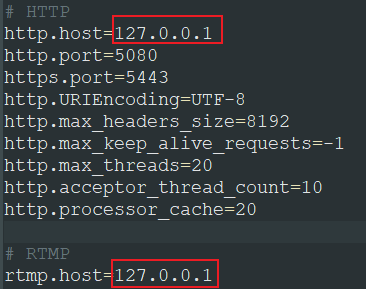
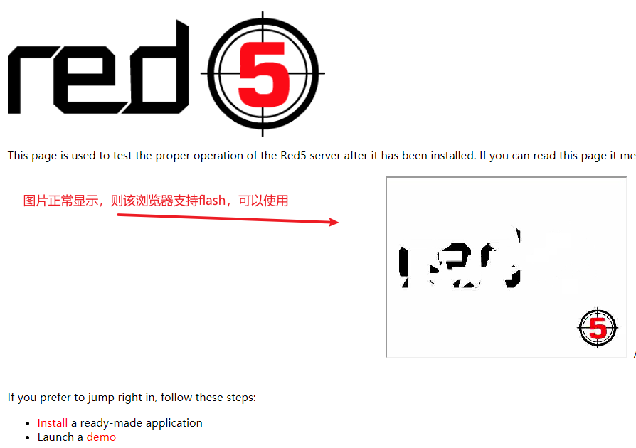
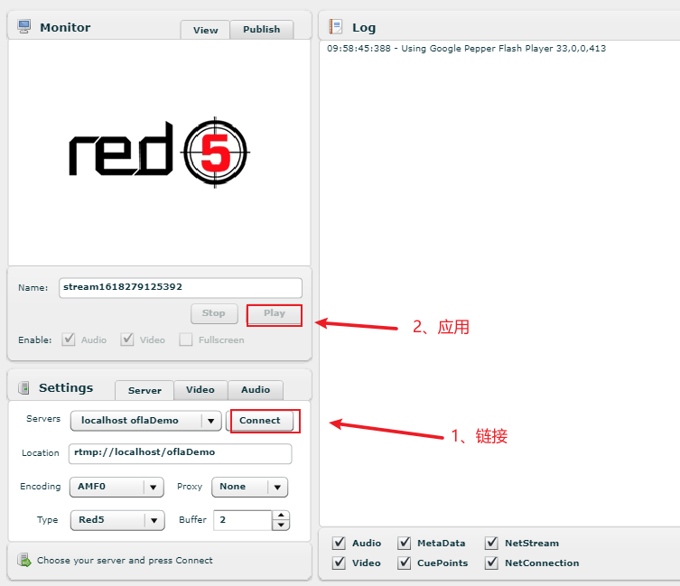
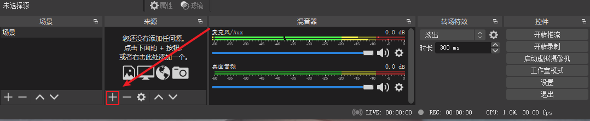
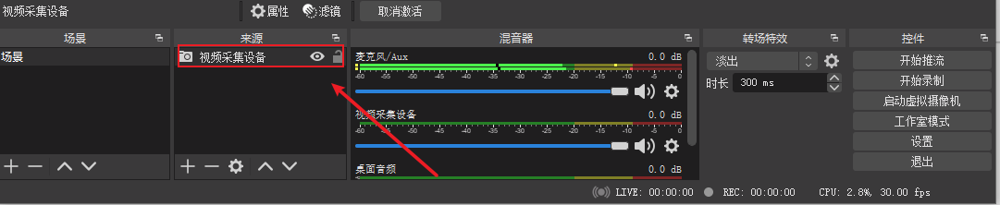
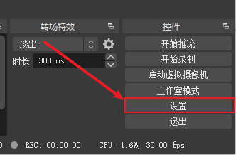
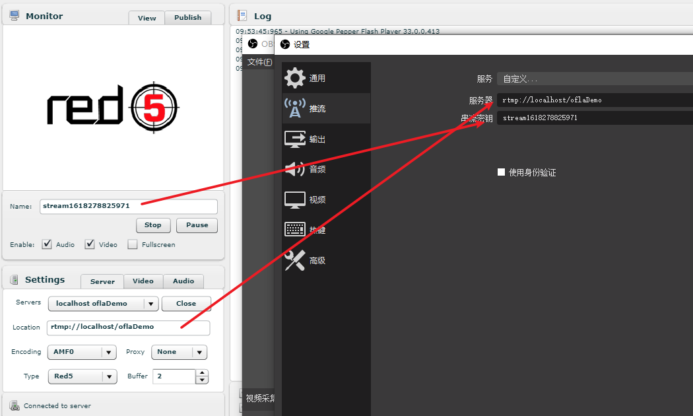
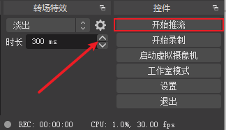

# 直播方案

## 推流端

推流端一般使用的软件是OBS推流工具。

## 流媒体服务

流媒体服务就是实时视频的中转站。
流媒体服务一般而言：nginx，srs，red5等等

## 拉流播放端

PC端：VLC
web端：videojs，flv.js，hls.js，ckplayer等等
移动端：ijkplayer

# red5

下载地址：https://github.com/Red5/red5-server/releases

==选择对应jdk版本==

## 修改配置文件

文件位置：red5-server/conf/red5.properties



## 双击red5.bat

## 访问http://127.0.0.1:5080/ 

==使用qq浏览器等国内浏览器，国外浏览器很少支持flash==



## 访问http://127.0.0.1:5080/demos/publisher.html



# obs

下载地址：https://obsproject.com/download

## 安装打开



## 添加视频采集



## 设置服务器地址和密钥





## 开始推流



# video.js

## 使用vue-cli脚手架初始化Vue项目下的项目结构

### 安装vue-cli

```
npm install -g vue-cli
vue -V
```

```
vue init webpack 项目名
npm install
```

### 安装依赖

```
npm install --save vue-video-player
npm install --save videojs-flash
```

### 项目中使用

```html
<template>
  <section class="video-box">
    <videoPlayer
      ref="videoPlayer"
      :options="videoOptions"
      class="vjs-custom-skin videoPlayer"
      :playsinline="true"
    />
  </section>
</template>
<script>
import 'video.js/dist/video-js.css'
import 'vue-video-player/src/custom-theme.css'
import { videoPlayer } from 'vue-video-player'
import 'videojs-flash'
export default {
  components: {
    videoPlayer
  },
  data () {
    return {
      videoSrc: '',
      // 视频播放
      videoOptions: {
        playbackRates: [0.7, 1.0, 1.5, 2.0], //播放速度
        autoplay: false, //如果true,浏览器准备好时开始回放。
        muted: false, // 默认情况下将会消除任何音频。
        loop: false, // 导致视频一结束就重新开始。
        preload: 'auto', // 建议浏览器在<video>加载元素后是否应该开始下载视频数据。auto浏览器选择最佳行为,立即开始加载视频（如果浏览器支持）
        language: 'zh-CN',
        aspectRatio: '16:9', // 将播放器置于流畅模式，并在计算播放器的动态大小时使用该值。值应该代表一个比例 - 用冒号分隔的两个数字（例如"16:9"或"4:3"）
        techOrder: ['flash', 'html5'],      // 兼容顺序
        sources: [{ // 流配置，数组形式，会根据兼容顺序自动切换
          type: 'rtmp/hls',
          src: 'rtmp://58.200.131.2:1935/livetv/hunantv'
        }],
        poster: "", //你的封面地址
        // width: document.documentElement.clientWidth,
        notSupportedMessage: '此视频暂无法播放，请稍后再试', // 允许覆盖Video.js无法播放媒体源时显示的默认信息。
        controlBar: {
          timeDivider: true,
          durationDisplay: true,
          remainingTimeDisplay: false,
          fullscreenToggle: true  //全屏按钮
        }
      }
    }
  }
}
</script>
<style scoped>
.video-box {
  width: 1000px;
  padding: 20px;
}
</style>
```

