# 创建型模式

## 简单工厂模式

> 简单工厂模式(Simple Factory Pattern)：又称为静态工厂方法(Static Factory Method)模式，它属于类创建型模式。
>
> 在简单工厂模式中，可以根据参数的不同返回不同类的实例。
>
> 简单工厂模式专门定义一个类来负责创建其他类的实例，被创建的实例通常都具有共同的父类。

### 模式结构

1. Factory：工厂角色

   工厂角色负责实现创建所有实例的内部逻辑

2. Product：抽象产品角色

   抽象产品角色是所创建的所有对象的父类，负责描述所有实例所共有的公共接口

3. ConcreteProduct：具体产品角色

   具体产品角色是创建目标，所有创建的对象都充当这个角色的某个具体类的实例。

   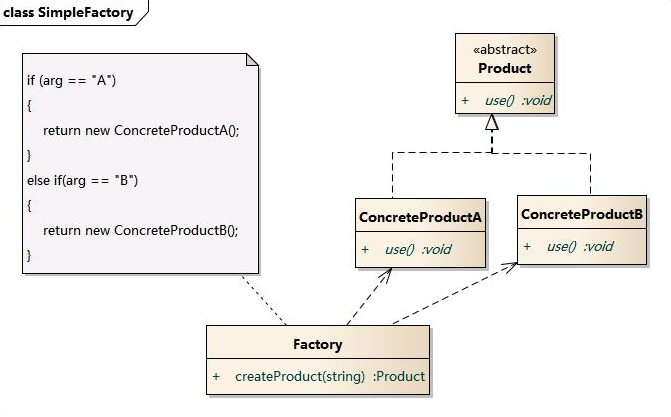

   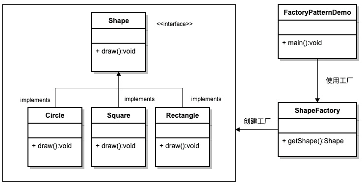

### 时序图

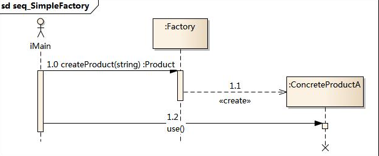

###  简单工厂模式的优点

- 工厂类含有必要的判断逻辑，可以决定在什么时候创建哪一个产品类的实例，客户端可以免除直接创建产品对象的责任，而仅仅“消费”产品；简单工厂模式通过这种做法实现了对责任的分割，它提供了专门的工厂类用于创建对象。
- 客户端无须知道所创建的具体产品类的类名，只需要知道具体产品类所对应的参数即可，对于一些复杂的类名，通过简单工厂模式可以减少使用者的记忆量。
- 通过引入配置文件，可以在不修改任何客户端代码的情况下更换和增加新的具体产品类，在一定程度上提高了系统的灵活性。

###  简单工厂模式的缺点

- 由于工厂类集中了所有产品创建逻辑，一旦不能正常工作，整个系统都要受到影响。
- 使用简单工厂模式将会增加系统中类的个数，在一定程序上增加了系统的复杂度和理解难度。
- 系统扩展困难，一旦添加新产品就不得不修改工厂逻辑，在产品类型较多时，有可能造成工厂逻辑过于复杂，不利于系统的扩展和维护。
- 简单工厂模式由于使用了静态工厂方法，造成工厂角色无法形成基于继承的等级结构。

### 适用环境

- 工厂类负责创建的对象比较少：由于创建的对象较少，不会造成工厂方法中的业务逻辑太过复杂。
- 客户端只知道传入工厂类的参数，对于如何创建对象不关心：客户端既不需要关心创建细节，甚至连类名都不需要记住，只需要知道类型所对应的参数。

## 工厂方法模式

>==从总工厂获取生产某一产品等级的工厂，然后由工厂去创造某一产品登记的产品==
>
>工厂方法模式(Factory Method Pattern)又称为工厂模式，也叫虚拟构造器(Virtual Constructor)模式或者多态工厂(Polymorphic Factory)模式，它属于类创建型模式。
>
>在工厂方法模式中，工厂父类负责定义创建产品对象的公共接口，而工厂子类则负责生成具体的产品对象，这样做的目的是将产品类的实例化操作延迟到工厂子类中完成，即通过工厂子类来确定究竟应该实例化哪一个具体产品类。

### 模式结构

- Product：抽象产品
- ConcreteProduct：具体产品
- Factory：抽象工厂
- ConcreteFactory：具体工厂

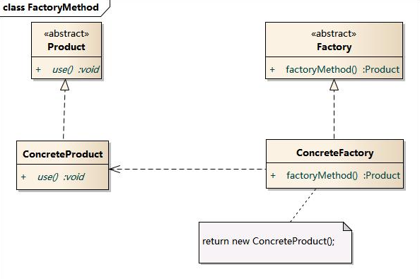

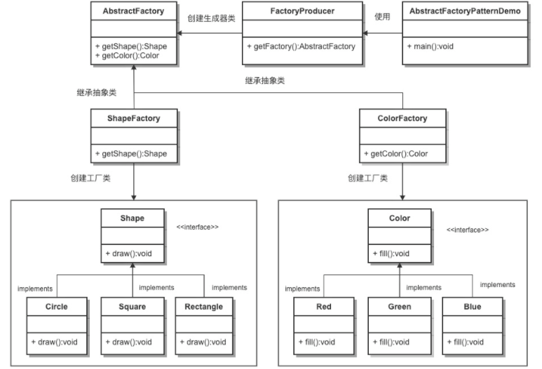

### 时序图

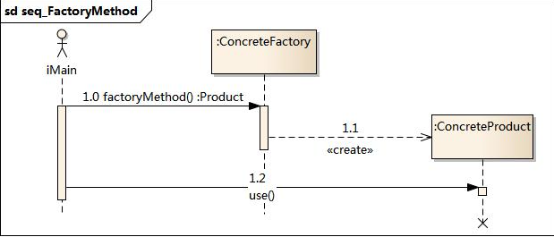

###  工厂方法模式的优点

- 在工厂方法模式中，工厂方法用来创建客户所需要的产品，同时还向客户隐藏了哪种具体产品类将被实例化这一细节，用户只需要关心所需产品对应的工厂，无须关心创建细节，甚至无须知道具体产品类的类名。
- 基于工厂角色和产品角色的多态性设计是工厂方法模式的关键。它能够使工厂可以自主确定创建何种产品对象，而如何创建这个对象的细节则完全封装在具体工厂内部。工厂方法模式之所以又被称为多态工厂模式，是因为所有的具体工厂类都具有同一抽象父类。
- 使用工厂方法模式的另一个优点是在系统中加入新产品时，无须修改抽象工厂和抽象产品提供的接口，无须修改客户端，也无须修改其他的具体工厂和具体产品，而只要添加一个具体工厂和具体产品就可以了。这样，系统的可扩展性也就变得非常好，完全符合“开闭原则”。

###  工厂方法模式的缺点

- 在添加新产品时，需要编写新的具体产品类，而且还要提供与之对应的具体工厂类，系统中类的个数将成对增加，在一定程度上增加了系统的复杂度，有更多的类需要编译和运行，会给系统带来一些额外的开销。
- 由于考虑到系统的可扩展性，需要引入抽象层，在客户端代码中均使用抽象层进行定义，增加了系统的抽象性和理解难度，且在实现时可能需要用到DOM、反射等技术，增加了系统的实现难度。

### 适用环境

- 一个类不知道它所需要的对象的类：在工厂方法模式中，客户端不需要知道具体产品类的类名，只需要知道所对应的工厂即可，具体的产品对象由具体工厂类创建；客户端需要知道创建具体产品的工厂类。
- 一个类通过其子类来指定创建哪个对象：在工厂方法模式中，对于抽象工厂类只需要提供一个创建产品的接口，而由其子类来确定具体要创建的对象，利用面向对象的多态性和里氏代换原则，在程序运行时，子类对象将覆盖父类对象，从而使得系统更容易扩展。
- 将创建对象的任务委托给多个工厂子类中的某一个，客户端在使用时可以无须关心是哪一个工厂子类创建产品子类，需要时再动态指定，可将具体工厂类的类名存储在配置文件或数据库中。

## 抽象工厂模式

>==**从总工厂获取生产某一产品族的工厂，产品族工厂再去生产多个产品等级的产品**==
>
>抽象工厂模式(Abstract Factory Pattern)：提供一个创建一系列相关或相互依赖对象的接口，而无须指定它们具体的类。抽象工厂模式又称为Kit模式，属于对象创建型模式。
>
>**产品等级结构** ：产品等级结构即产品的继承结构，如一个抽象类是电视机，其子类有海尔电视机、海信电视机、TCL电视机，则抽象电视机与具体品牌的电视机之间构成了一个产品等级结构，抽象电视机是父类，而具体品牌的电视机是其子类。
>
>**产品族** ：在抽象工厂模式中，产品族是指由同一个工厂生产的，位于不同产品等级结构中的一组产品，如海尔电器工厂生产的海尔电视机、海尔电冰箱，海尔电视机位于电视机产品等级结构中，海尔电冰箱位于电冰箱产品等级结构中。
>
>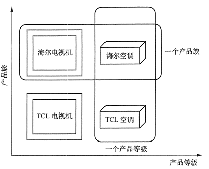

### 模式结构

- AbstractFactory：抽象工厂

- ConcreteFactory：具体工厂

- AbstractProduct：抽象产品

- Product：具体产品

  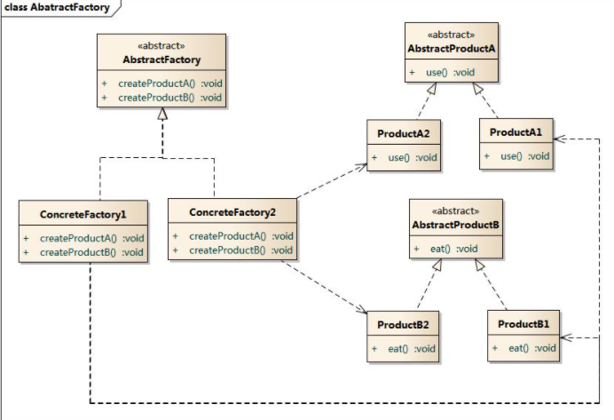

  

### 时序图

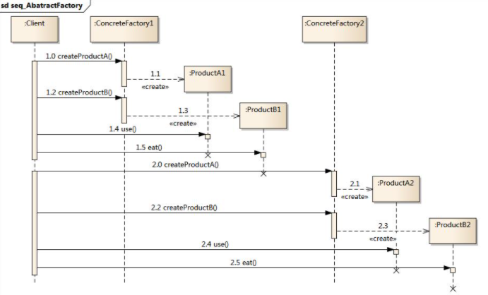

###  抽象工厂模式的优点

- 抽象工厂模式隔离了具体类的生成，使得客户并不需要知道什么被创建。由于这种隔离，更换一个具体工厂就变得相对容易。所有的具体工厂都实现了抽象工厂中定义的那些公共接口，因此只需改变具体工厂的实例，就可以在某种程度上改变整个软件系统的行为。另外，应用抽象工厂模式可以实现高内聚低耦合的设计目的，因此抽象工厂模式得到了广泛的应用。
- 当一个产品族中的多个对象被设计成一起工作时，它能够保证客户端始终只使用同一个产品族中的对象。这对一些需要根据当前环境来决定其行为的软件系统来说，是一种非常实用的设计模式。
- 增加新的具体工厂和产品族很方便，无须修改已有系统，符合“开闭原则”。

###  抽象工厂模式的缺点

- 在添加新的产品对象时，难以扩展抽象工厂来生产新种类的产品，这是因为在抽象工厂角色中规定了所有可能被创建的产品集合，要支持新种类的产品就意味着要对该接口进行扩展，而这将涉及到对抽象工厂角色及其所有子类的修改，显然会带来较大的不便。
- 开闭原则的倾斜性（增加新的工厂和产品族容易，增加新的产品等级结构麻烦）。

### 适用环境

- 一个系统不应当依赖于产品类实例如何被创建、组合和表达的细节，这对于所有类型的工厂模式都是重要的。
- 系统中有多于一个的产品族，而每次只使用其中某一产品族。
- 属于同一个产品族的产品将在一起使用，这一约束必须在系统的设计中体现出来。
- 系统提供一个产品类的库，所有的产品以同样的接口出现，从而使客户端不依赖于具体实现。

## 建造者模式

## 单例模式

>单例模式(Singleton Pattern)：单例模式确保某一个类只有一个实例，而且自行实例化并向整个系统提供这个实例，这个类称为单例类，它提供全局访问的方法。
>
>单例模式的要点有三个：
>
>==一是某个类只能有一个实例；==
>
>==二是它必须自行创建这个实例；==
>
>==三是它必须自行向整个系统提供这个实例。==
>
>单例模式是一种对象创建型模式。单例模式又名单件模式或单态模式。

### 模式结构

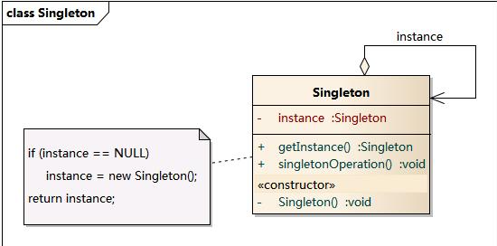

### 时序图

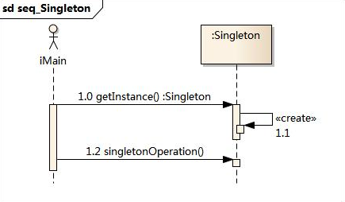

###  单例模式的优点

- 提供了对唯一实例的受控访问。因为单例类封装了它的唯一实例，所以它可以严格控制客户怎样以及何时访问它，并为设计及开发团队提供了共享的概念。
- 由于在系统内存中只存在一个对象，因此可以节约系统资源，对于一些需要频繁创建和销毁的对象，单例模式无疑可以提高系统的性能。
- 允许可变数目的实例。我们可以基于单例模式进行扩展，使用与单例控制相似的方法来获得指定个数的对象实例。

###  单例模式的缺点

- 由于单例模式中没有抽象层，因此单例类的扩展有很大的困难。
- 单例类的职责过重，在一定程度上违背了“单一职责原则”。因为单例类既充当了工厂角色，提供了工厂方法，同时又充当了产品角色，包含一些业务方法，将产品的创建和产品的本身的功能融合到一起。
- 滥用单例将带来一些负面问题，如为了节省资源将数据库连接池对象设计为单例类，可能会导致共享连接池对象的程序过多而出现连接池溢出；现在很多面向对象语言(如Java、C#)的运行环境都提供了自动垃圾回收的技术，因此，如果实例化的对象长时间不被利用，系统会认为它是垃圾，会自动销毁并回收资源，下次利用时又将重新实例化，这将导致对象状态的丢失。

### 适用环境

- 系统只需要一个实例对象，如系统要求提供一个唯一的序列号生成器，或者需要考虑资源消耗太大而只允许创建一个对象。
- 客户调用类的单个实例只允许使用一个公共访问点，除了该公共访问点，不能通过其他途径访问该实例。
- 在一个系统中要求一个类只有一个实例时才应当使用单例模式。反过来，如果一个类可以有几个实例共存，就需要对单例模式进行改进，使之成为多例模式

