# 创建型模式

## 简单工厂模式

> 简单工厂模式(Simple Factory Pattern)：又称为静态工厂方法(Static Factory Method)模式，它属于类创建型模式。
>
> 在简单工厂模式中，可以根据参数的不同返回不同类的实例。
>
> 简单工厂模式专门定义一个类来负责创建其他类的实例，被创建的实例通常都具有共同的父类。

### 模式结构

1. Factory：工厂角色

   工厂角色负责实现创建所有实例的内部逻辑

2. Product：抽象产品角色

   抽象产品角色是所创建的所有对象的父类，负责描述所有实例所共有的公共接口

3. ConcreteProduct：具体产品角色

   具体产品角色是创建目标，所有创建的对象都充当这个角色的某个具体类的实例。

   

   

### 时序图

###  简单工厂模式的优点

- 工厂类含有必要的判断逻辑，可以决定在什么时候创建哪一个产品类的实例，客户端可以免除直接创建产品对象的责任，而仅仅“消费”产品；简单工厂模式通过这种做法实现了对责任的分割，它提供了专门的工厂类用于创建对象。
- 客户端无须知道所创建的具体产品类的类名，只需要知道具体产品类所对应的参数即可，对于一些复杂的类名，通过简单工厂模式可以减少使用者的记忆量。
- 通过引入配置文件，可以在不修改任何客户端代码的情况下更换和增加新的具体产品类，在一定程度上提高了系统的灵活性。

###  简单工厂模式的缺点

- 由于工厂类集中了所有产品创建逻辑，一旦不能正常工作，整个系统都要受到影响。
- 使用简单工厂模式将会增加系统中类的个数，在一定程序上增加了系统的复杂度和理解难度。
- 系统扩展困难，一旦添加新产品就不得不修改工厂逻辑，在产品类型较多时，有可能造成工厂逻辑过于复杂，不利于系统的扩展和维护。
- 简单工厂模式由于使用了静态工厂方法，造成工厂角色无法形成基于继承的等级结构。

### 适用环境

- 工厂类负责创建的对象比较少：由于创建的对象较少，不会造成工厂方法中的业务逻辑太过复杂。
- 客户端只知道传入工厂类的参数，对于如何创建对象不关心：客户端既不需要关心创建细节，甚至连类名都不需要记住，只需要知道类型所对应的参数。

## 工厂方法模式

>==从总工厂获取生产某一产品等级的工厂，然后由工厂去创造某一产品登记的产品==
>
>工厂方法模式(Factory Method Pattern)又称为工厂模式，也叫虚拟构造器(Virtual Constructor)模式或者多态工厂(Polymorphic Factory)模式，它属于类创建型模式。
>
>在工厂方法模式中，工厂父类负责定义创建产品对象的公共接口，而工厂子类则负责生成具体的产品对象，这样做的目的是将产品类的实例化操作延迟到工厂子类中完成，即通过工厂子类来确定究竟应该实例化哪一个具体产品类。

### 模式结构

- Product：抽象产品
- ConcreteProduct：具体产品
- Factory：抽象工厂
- ConcreteFactory：具体工厂

### 时序图

###  工厂方法模式的优点

- 在工厂方法模式中，工厂方法用来创建客户所需要的产品，同时还向客户隐藏了哪种具体产品类将被实例化这一细节，用户只需要关心所需产品对应的工厂，无须关心创建细节，甚至无须知道具体产品类的类名。
- 基于工厂角色和产品角色的多态性设计是工厂方法模式的关键。它能够使工厂可以自主确定创建何种产品对象，而如何创建这个对象的细节则完全封装在具体工厂内部。工厂方法模式之所以又被称为多态工厂模式，是因为所有的具体工厂类都具有同一抽象父类。
- 使用工厂方法模式的另一个优点是在系统中加入新产品时，无须修改抽象工厂和抽象产品提供的接口，无须修改客户端，也无须修改其他的具体工厂和具体产品，而只要添加一个具体工厂和具体产品就可以了。这样，系统的可扩展性也就变得非常好，完全符合“开闭原则”。

###  工厂方法模式的缺点

- 在添加新产品时，需要编写新的具体产品类，而且还要提供与之对应的具体工厂类，系统中类的个数将成对增加，在一定程度上增加了系统的复杂度，有更多的类需要编译和运行，会给系统带来一些额外的开销。
- 由于考虑到系统的可扩展性，需要引入抽象层，在客户端代码中均使用抽象层进行定义，增加了系统的抽象性和理解难度，且在实现时可能需要用到DOM、反射等技术，增加了系统的实现难度。

### 适用环境

- 一个类不知道它所需要的对象的类：在工厂方法模式中，客户端不需要知道具体产品类的类名，只需要知道所对应的工厂即可，具体的产品对象由具体工厂类创建；客户端需要知道创建具体产品的工厂类。
- 一个类通过其子类来指定创建哪个对象：在工厂方法模式中，对于抽象工厂类只需要提供一个创建产品的接口，而由其子类来确定具体要创建的对象，利用面向对象的多态性和里氏代换原则，在程序运行时，子类对象将覆盖父类对象，从而使得系统更容易扩展。
- 将创建对象的任务委托给多个工厂子类中的某一个，客户端在使用时可以无须关心是哪一个工厂子类创建产品子类，需要时再动态指定，可将具体工厂类的类名存储在配置文件或数据库中。

## 抽象工厂模式==不同条件下创建不同实例==

>==**从总工厂获取生产某一产品族的工厂，产品族工厂再去生产多个产品等级的产品**==
>
>抽象工厂模式(Abstract Factory Pattern)：提供一个创建一系列相关或相互依赖对象的接口，而无须指定它们具体的类。抽象工厂模式又称为Kit模式，属于对象创建型模式。
>
>**产品等级结构** ：产品等级结构即产品的继承结构，如一个抽象类是电视机，其子类有海尔电视机、海信电视机、TCL电视机，则抽象电视机与具体品牌的电视机之间构成了一个产品等级结构，抽象电视机是父类，而具体品牌的电视机是其子类。
>
>**产品族** ：在抽象工厂模式中，产品族是指由同一个工厂生产的，位于不同产品等级结构中的一组产品，如海尔电器工厂生产的海尔电视机、海尔电冰箱，海尔电视机位于电视机产品等级结构中，海尔电冰箱位于电冰箱产品等级结构中。
>
>

### 模式结构

- AbstractFactory：抽象工厂

- ConcreteFactory：具体工厂

- AbstractProduct：抽象产品

- Product：具体产品

  

  

### 时序图

###  抽象工厂模式的优点

- 抽象工厂模式隔离了具体类的生成，使得客户并不需要知道什么被创建。由于这种隔离，更换一个具体工厂就变得相对容易。所有的具体工厂都实现了抽象工厂中定义的那些公共接口，因此只需改变具体工厂的实例，就可以在某种程度上改变整个软件系统的行为。另外，应用抽象工厂模式可以实现高内聚低耦合的设计目的，因此抽象工厂模式得到了广泛的应用。
- 当一个产品族中的多个对象被设计成一起工作时，它能够保证客户端始终只使用同一个产品族中的对象。这对一些需要根据当前环境来决定其行为的软件系统来说，是一种非常实用的设计模式。
- 增加新的具体工厂和产品族很方便，无须修改已有系统，符合“开闭原则”。

###  抽象工厂模式的缺点

- 在添加新的产品对象时，难以扩展抽象工厂来生产新种类的产品，这是因为在抽象工厂角色中规定了所有可能被创建的产品集合，要支持新种类的产品就意味着要对该接口进行扩展，而这将涉及到对抽象工厂角色及其所有子类的修改，显然会带来较大的不便。
- 开闭原则的倾斜性（增加新的工厂和产品族容易，增加新的产品等级结构麻烦）。

### 适用环境

- 一个系统不应当依赖于产品类实例如何被创建、组合和表达的细节，这对于所有类型的工厂模式都是重要的。
- 系统中有多于一个的产品族，而每次只使用其中某一产品族。
- 属于同一个产品族的产品将在一起使用，这一约束必须在系统的设计中体现出来。
- 系统提供一个产品类的库，所有的产品以同样的接口出现，从而使客户端不依赖于具体实现。

## 建造者模式==用来创建复杂的复合对象==

>造者模式(Builder Pattern)：将一个复杂对象的构建与它的表示分离，使得同样的构建过程可以创建不同的表示。

### 模式结构

- Builder：抽象建造者

- ConcreteBuilder：具体建造者

- Director：指挥者

- Product：产品角色

  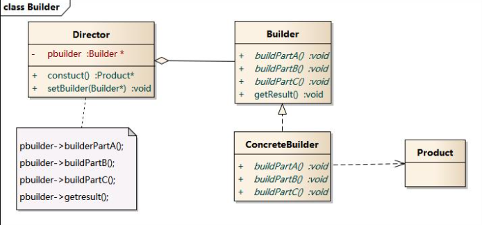

### 时序图

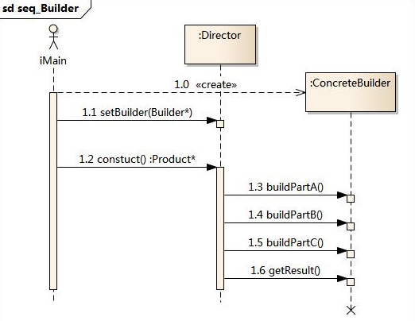

###  建造者模式的优点

- 在建造者模式中， **客户端不必知道产品内部组成的细节，将产品本身与产品的创建过程解耦，使得相同的创建过程可以创建不同的产品对象。**
- 每一个具体建造者都相对独立，而与其他的具体建造者无关，因此可以很方便地替换具体建造者或增加新的具体建造者， **用户使用不同的具体建造者即可得到不同的产品对象** 。
- **可以更加精细地控制产品的创建过程** 。将复杂产品的创建步骤分解在不同的方法中，使得创建过程更加清晰，也更方便使用程序来控制创建过程。
- **增加新的具体建造者无须修改原有类库的代码，指挥者类针对抽象建造者类编程，系统扩展方便，符合“开闭原则”。**

###  建造者模式的缺点

- 建造者模式所创建的产品一般具有较多的共同点，其组成部分相似，如果产品之间的差异性很大，则不适合使用建造者模式，因此其使用范围受到一定的限制。
- 如果产品的内部变化复杂，可能会导致需要定义很多具体建造者类来实现这种变化，导致系统变得很庞大。

### 适用环境

- 需要生成的产品对象有复杂的内部结构，这些产品对象通常包含多个成员属性。
- 需要生成的产品对象的属性相互依赖，需要指定其生成顺序。
- 对象的创建过程独立于创建该对象的类。在建造者模式中引入了指挥者类，将创建过程封装在指挥者类中，而不在建造者类中。
- 隔离复杂对象的创建和使用，并使得相同的创建过程可以创建不同的产品。

## 单例模式==保证一个类仅有一个实例==

>单例模式(Singleton Pattern)：单例模式确保某一个类只有一个实例，而且自行实例化并向整个系统提供这个实例，这个类称为单例类，它提供全局访问的方法。
>
>单例模式的要点有三个：
>
>==一是某个类只能有一个实例；==
>
>==二是它必须自行创建这个实例；==
>
>==三是它必须自行向整个系统提供这个实例。==
>
>单例模式是一种对象创建型模式。单例模式又名单件模式或单态模式。

### 模式结构

### 时序图

###  单例模式的优点

- 提供了对唯一实例的受控访问。因为单例类封装了它的唯一实例，所以它可以严格控制客户怎样以及何时访问它，并为设计及开发团队提供了共享的概念。
- 由于在系统内存中只存在一个对象，因此可以节约系统资源，对于一些需要频繁创建和销毁的对象，单例模式无疑可以提高系统的性能。
- 允许可变数目的实例。我们可以基于单例模式进行扩展，使用与单例控制相似的方法来获得指定个数的对象实例。

###  单例模式的缺点

- 由于单例模式中没有抽象层，因此单例类的扩展有很大的困难。
- 单例类的职责过重，在一定程度上违背了“单一职责原则”。因为单例类既充当了工厂角色，提供了工厂方法，同时又充当了产品角色，包含一些业务方法，将产品的创建和产品的本身的功能融合到一起。
- 滥用单例将带来一些负面问题，如为了节省资源将数据库连接池对象设计为单例类，可能会导致共享连接池对象的程序过多而出现连接池溢出；现在很多面向对象语言(如Java、C#)的运行环境都提供了自动垃圾回收的技术，因此，如果实例化的对象长时间不被利用，系统会认为它是垃圾，会自动销毁并回收资源，下次利用时又将重新实例化，这将导致对象状态的丢失。

### 适用环境

- 系统只需要一个实例对象，如系统要求提供一个唯一的序列号生成器，或者需要考虑资源消耗太大而只允许创建一个对象。
- 客户调用类的单个实例只允许使用一个公共访问点，除了该公共访问点，不能通过其他途径访问该实例。
- 在一个系统中要求一个类只有一个实例时才应当使用单例模式。反过来，如果一个类可以有几个实例共存，就需要对单例模式进行改进，使之成为多例模式

# 结构型模式

## 适配器模式==将原来不兼容的两个类融合在一起==

>适配器模式(Adapter Pattern) ：将一个接口转换成客户希望的另一个接口，适配器模式使接口不兼容的那些类可以一起工作，其别名为包装器(Wrapper)。适配器模式既可以作为类结构型模式，也可以作为对象结构型模式。

### 模式结构

- Target：目标抽象类
- Adapter：适配器类
- Adaptee：适配者类
- Client：客户类

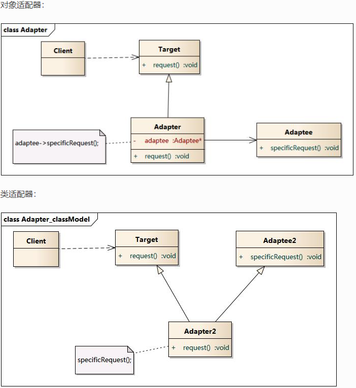

### 时序图

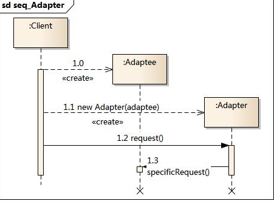

###  适配器模式的优点

- 将目标类和适配者类解耦，通过引入一个适配器类来重用现有的适配者类，而无须修改原有代码。
- 增加了类的透明性和复用性，将具体的实现封装在适配者类中，对于客户端类来说是透明的，而且提高了适配者的复用性。
- 灵活性和扩展性都非常好，通过使用配置文件，可以很方便地更换适配器，也可以在不修改原有代码的基础上增加新的适配器类，完全符合“开闭原则”。

- 类适配器模式还具有如下优点：

  由于适配器类是适配者类的子类，因此可以在适配器类中置换一些适配者的方法，使得适配器的灵活性更强。

- 对象适配器模式还具有如下优点：

  一个对象适配器可以把多个不同的适配者适配到同一个目标，也就是说，同一个适配器可以把适配者类和它的子类都适配到目标接口。

###  适配器模式的缺点

- 类适配器模式的缺点如下：

  对于Java、C#等不支持多重继承的语言，一次最多只能适配一个适配者类，而且目标抽象类只能为抽象类，不能为具体类，其使用有一定的局限性，不能将一个适配者类和它的子类都适配到目标接口。

  对象适配器模式的缺点如下：

  与类适配器模式相比，要想置换适配者类的方法就不容易。如果一定要置换掉适配者类的一个或多个方法，就只好先做一个适配者类的子类，将适配者类的方法置换掉，然后再把适配者类的子类当做真正的适配者进行适配，实现过程较为复杂。

### 适用环境

- 系统需要使用现有的类，而这些类的接口不符合系统的需要。
- 想要建立一个可以重复使用的类，用于与一些彼此之间没有太大关联的一些类，包括一些可能在将来引进的类一起工作。

## 桥接模式==将两个能够独立变化的部分分离开来==

### 模式结构

> 桥接模式(Bridge Pattern)：将抽象部分与它的实现部分分离，使它们都可以独立地变化。它是一种对象结构型模式，又称为柄体(Handle and Body)模式或接口(Interface)模式。

- Abstraction：抽象类
- RefinedAbstraction：扩充抽象类
- Implementor：实现类接口
- ConcreteImplementor：具体实现类

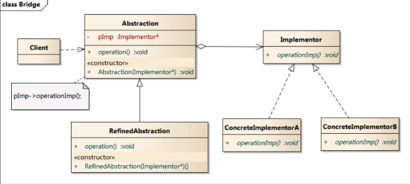

### 时序图

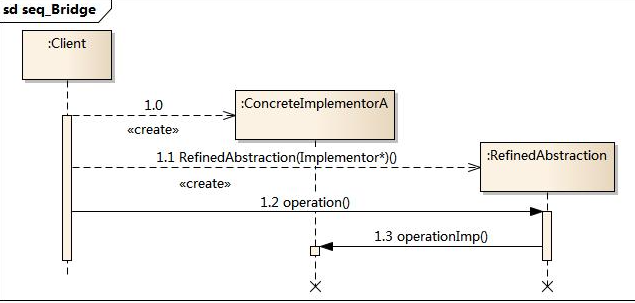

###  桥接模式的优点

- 分离抽象接口及其实现部分。
- 桥接模式有时类似于多继承方案，但是多继承方案违背了类的单一职责原则（即一个类只有一个变化的原因），复用性比较差，而且多继承结构中类的个数非常庞大，桥接模式是比多继承方案更好的解决方法。
- 桥接模式提高了系统的可扩充性，在两个变化维度中任意扩展一个维度，都不需要修改原有系统。
- 实现细节对客户透明，可以对用户隐藏实现细节。

###  桥接模式的缺点

- 桥接模式的缺点:

  - 桥接模式的引入会增加系统的理解与设计难度，由于聚合关联关系建立在抽象层，要求开发者针对抽象进

  行设计与编程。 - 桥接模式要求正确识别出系统中两个独立变化的维度，因此其使用范围具有一定的局限性。

### 适用环境

- 如果一个系统需要在构件的抽象化角色和具体化角色之间增加更多的灵活性，避免在两个层次之间建立静态的继承联系，通过桥接模式可以使它们在抽象层建立一个关联关系。
- 抽象化角色和实现化角色可以以继承的方式独立扩展而互不影响，在程序运行时可以动态将一个抽象化子类的对象和一个实现化子类的对象进行组合，即系统需要对抽象化角色和实现化角色进行动态耦合。
- 一个类存在两个独立变化的维度，且这两个维度都需要进行扩展。
- 虽然在系统中使用继承是没有问题的，但是由于抽象化角色和具体化角色需要独立变化，设计要求需要独立管理这两者。
- 对于那些不希望使用继承或因为多层次继承导致系统类的个数急剧增加的系统，桥接模式尤为适用。

## 装饰模式==为对象添加新功能==

> 装饰模式(Decorator Pattern) ：动态地给一个对象增加一些额外的职责(Responsibility)，就增加对象功能来说，装饰模式比生成子类实现更为灵活。其别名也可以称为包装器(Wrapper)，与适配器模式的别名相同，但它们适用于不同的场合。根据翻译的不同，装饰模式也有人称之为“油漆工模式”，它是一种对象结构型模式。

### 模式结构

- Component: 抽象构件
- ConcreteComponent: 具体构件
- Decorator: 抽象装饰类
- ConcreteDecorator: 具体装饰类

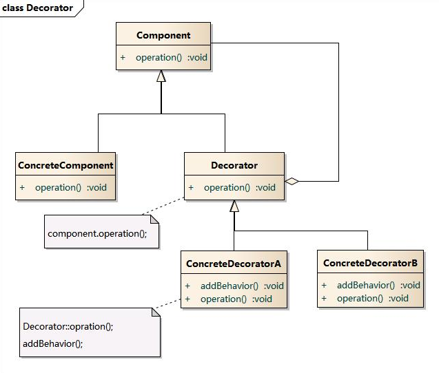

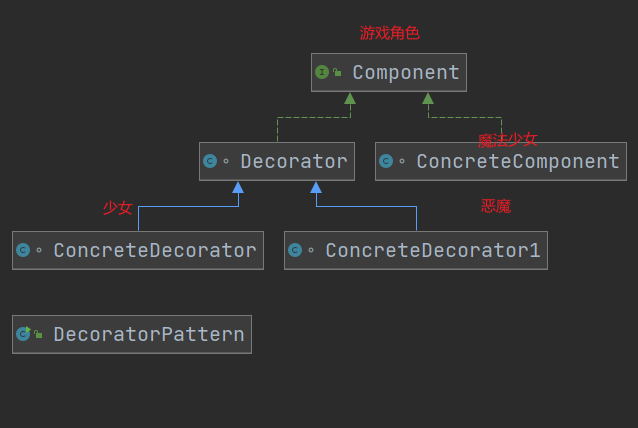

### 时序图

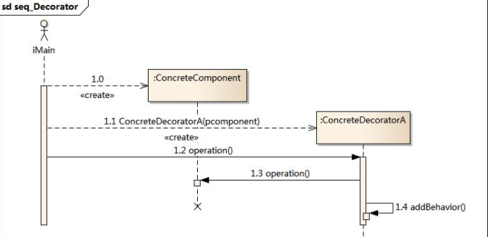

###  装饰模式的优点

- 装饰模式与继承关系的目的都是要扩展对象的功能，但是装饰模式可以提供比继承更多的灵活性。
- 可以通过一种动态的方式来扩展一个对象的功能，通过配置文件可以在运行时选择不同的装饰器，从而实现不同的行为。
- 通过使用不同的具体装饰类以及这些装饰类的排列组合，可以创造出很多不同行为的组合。可以使用多个具体装饰类来装饰同一对象，得到功能更为强大的对象。
- 具体构件类与具体装饰类可以独立变化，用户可以根据需要增加新的具体构件类和具体装饰类，在使用时再对其进行组合，原有代码无须改变，符合“开闭原则”

###  装饰模式的缺点

- 使用装饰模式进行系统设计时将产生很多小对象，这些对象的区别在于它们之间相互连接的方式有所不同，而不是它们的类或者属性值有所不同，同时还将产生很多具体装饰类。这些装饰类和小对象的产生将增加系统的复杂度，加大学习与理解的难度。
- 这种比继承更加灵活机动的特性，也同时意味着装饰模式比继承更加易于出错，排错也很困难，对于多次装饰的对象，调试时寻找错误可能需要逐级排查，较为烦琐。

### 适用环境

- 在不影响其他对象的情况下，以动态、透明的方式给单个对象添加职责。
- 需要动态地给一个对象增加功能，这些功能也可以动态地被撤销。
- 当不能采用继承的方式对系统进行扩充或者采用继承不利于系统扩展和维护时。不能采用继承的情况主要有两类：第一类是系统中存在大量独立的扩展，为支持每一种组合将产生大量的子类，使得子类数目呈爆炸性增长；第二类是因为类定义不能继承（如final类）.

## 外观模式==对外提供一个统一的接口用来访问子系统==

### 模式结构

- Facade: 外观角色

- SubSystem:子系统角色

  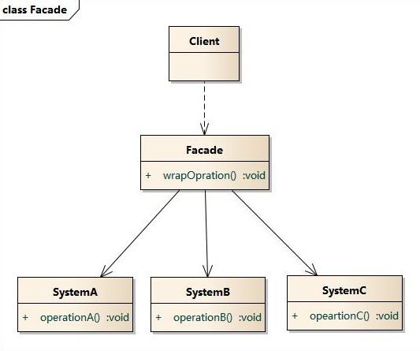

### 时序图

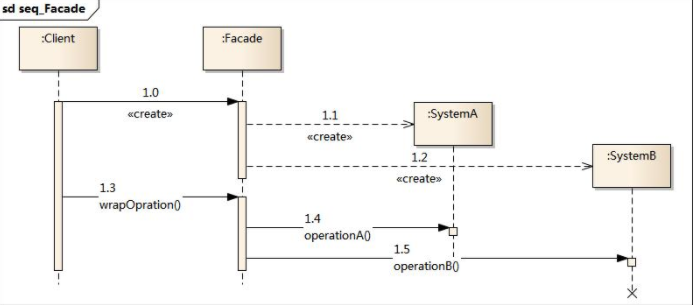

###  外观模式的优点

- 对客户屏蔽子系统组件，减少了客户处理的对象数目并使得子系统使用起来更加容易。通过引入外观模式，客户代码将变得很简单，与之关联的对象也很少。
- 实现了子系统与客户之间的松耦合关系，这使得子系统的组件变化不会影响到调用它的客户类，只需要调整外观类即可。
- 降低了大型软件系统中的编译依赖性，并简化了系统在不同平台之间的移植过程，因为编译一个子系统一般不需要编译所有其他的子系统。一个子系统的修改对其他子系统没有任何影响，而且子系统内部变化也不会影响到外观对象。
- 只是提供了一个访问子系统的统一入口，并不影响用户直接使用子系统类。

###  外观模式的缺点

- 不能很好地限制客户使用子系统类，如果对客户访问子系统类做太多的限制则减少了可变性和灵活性。
- 在不引入抽象外观类的情况下，增加新的子系统可能需要修改外观类或客户端的源代码，违背了“开闭原则”。

### 适用环境

- 当要为一个复杂子系统提供一个简单接口时可以使用外观模式。该接口可以满足大多数用户的需求，而且用户也可以越过外观类直接访问子系统。
- 客户程序与多个子系统之间存在很大的依赖性。引入外观类将子系统与客户以及其他子系统解耦，可以提高子系统的独立性和可移植性。
- 在层次化结构中，可以使用外观模式定义系统中每一层的入口，层与层之间不直接产生联系，而通过外观类建立联系，降低层之间的耦合度。

## 享元模式

## 代理模式==为其他对象提供一种代理以控制对这个对象的访问==

>代理模式(Proxy Pattern) ：给某一个对象提供一个代 理，并由代理对象控制对原对象的引用。代理模式的英 文叫做Proxy或Surrogate，它是一种对象结构型模式。

### 模式结构

- Subject: 抽象主题角色
- Proxy: 代理主题角色
- RealSubject: 真实主题角色

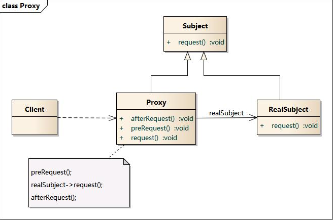

### 时序图

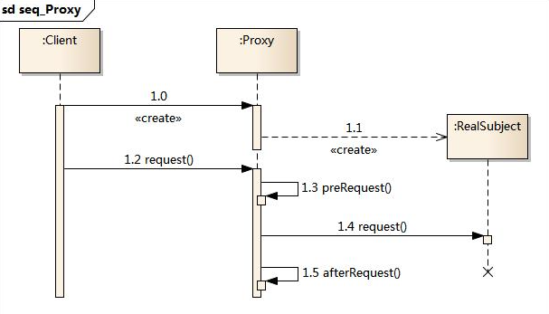

###  代理模式的优点

- 代理模式能够协调调用者和被调用者，在一定程度上降低了系 统的耦合度。
- 远程代理使得客户端可以访问在远程机器上的对象，远程机器 可能具有更好的计算性能与处理速度，可以快速响应并处理客户端请求。
- 虚拟代理通过使用一个小对象来代表一个大对象，可以减少系 统资源的消耗，对系统进行优化并提高运行速度。
- 保护代理可以控制对真实对象的使用权限。

###  代理模式的缺点

- 由于在客户端和真实主题之间增加了代理对象，因此 有些类型的代理模式可能会造成请求的处理速度变慢。
- 实现代理模式需要额外的工作，有些代理模式的实现 非常复杂。

### 适用环境

- 远程(Remote)代理：为一个位于不同的地址空间的对象提供一个本地 的代理对象，这个不同的地址空间可以是在同一台主机中，也可是在 另一台主机中，远程代理又叫做大使(Ambassador)。
- 虚拟(Virtual)代理：如果需要创建一个资源消耗较大的对象，先创建一个消耗相对较小的对象来表示，真实对象只在需要时才会被真正创建。
- Copy-on-Write代理：它是虚拟代理的一种，把复制（克隆）操作延迟 到只有在客户端真正需要时才执行。一般来说，对象的深克隆是一个 开销较大的操作，Copy-on-Write代理可以让这个操作延迟，只有对象被用到的时候才被克隆。
- 保护(Protect or Access)代理：控制对一个对象的访问，可以给不同的用户提供不同级别的使用权限。
- 缓冲(Cache)代理：为某一个目标操作的结果提供临时的存储空间，以便多个客户端可以共享这些结果。
- 防火墙(Firewall)代理：保护目标不让恶意用户接近。
- 同步化(Synchronization)代理：使几个用户能够同时使用一个对象而没有冲突。
- 智能引用(Smart Reference)代理：当一个对象被引用时，提供一些额外的操作，如将此对象被调用的次数记录下来等。

## 组合模式==将整体与局部（树形结构）进行递归组合==

### 模式结构

抽象构件（Component）角色：它的主要作用是为树叶构件和树枝构件声明公共接口，并实现它们的默认行为。在透明式的组合模式中抽象构件还声明访问和管理子类的接口；在安全式的组合模式中不声明访问和管理子类的接口，管理工作由树枝构件完成。（总的抽象类或接口，定义一些通用的方法，比如新增、删除）

树叶构件（Leaf）角色：是组合中的叶节点对象，它没有子节点，用于继承或实现抽象构件。

树枝构件（Composite）角色 / 中间构件：是组合中的分支节点对象，它有子节点，用于继承和实现抽象构件。它的主要作用是存储和管理子部件，通常包含 Add()、Remove()、GetChild() 等方法。

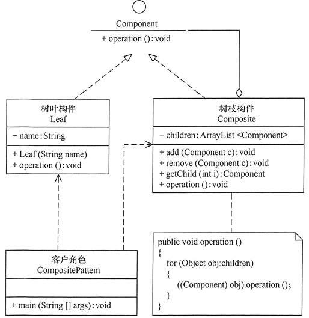

### 时序图

###  组合模式的优点

- 组合模式使得客户端代码可以一致地处理单个对象和组合对象，无须关心自己处理的是单个对象，还是组合对象，这简化了客户端代码；
- 更容易在组合体内加入新的对象，客户端不会因为加入了新的对象而更改源代码，满足“开闭原则”；

###  组合模式的缺点

- 设计较复杂，客户端需要花更多时间理清类之间的层次关系；
- 不容易限制容器中的构件；
- 不容易用继承的方法来增加构件的新功能；

### 适用环境

- 在需要表示一个对象整体与部分的层次结构的场合。
- 要求对用户隐藏组合对象与单个对象的不同，用户可以用统一的接口使用组合结构中的所有对象的场合。

# 行为型模式

## 模板模式

### 模式结构

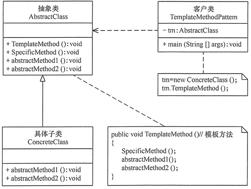

###  模板模式的优点

- 它封装了不变部分，扩展可变部分。它把认为是不变部分的算法封装到父类中实现，而把可变部分算法由子类继承实现，便于子类继续扩展。
- 它在父类中提取了公共的部分代码，便于代码复用。
- 部分方法是由子类实现的，因此子类可以通过扩展方式增加相应的功能，符合开闭原则。

###  模板模式的缺点

- 对每个不同的实现都需要定义一个子类，这会导致类的个数增加，系统更加庞大，设计也更加抽象，间接地增加了系统实现的复杂度。
- 父类中的抽象方法由子类实现，子类执行的结果会影响父类的结果，这导致一种反向的控制结构，它提高了代码阅读的难度。
- 由于继承关系自身的缺点，如果父类添加新的抽象方法，则所有子类都要改一遍。

### 适用环境

- 算法的整体步骤很固定，但其中个别部分易变时，这时候可以使用模板方法模式，将容易变的部分抽象出来，供子类实现。
- 当多个子类存在公共的行为时，可以将其提取出来并集中到一个公共父类中以避免代码重复。首先，要识别现有代码中的不同之处，并且将不同之处分离为新的操作。最后，用一个调用这些新的操作的模板方法来替换这些不同的代码。
- 当需要控制子类的扩展时，模板方法只在特定点调用钩子操作，这样就只允许在这些点进行扩展。

## 命令模式

## 中介者模式