# 回顾

```markdown
1. 模块

2. 登录注册
	发送验证码
	登录注册
		先比对验证码  比对失败，直接返回错误
		手机号在数据库中存在    登录成功
         手机号在数据库中不存在  注册-----向数据库中保存用户
		
3. JWT技术
	app                       服务器                    redis
	请求--------------------->创建token------------------->token:user
  携带token------------------>对比------>获取当前用户的信息	
  
  
4. 使用第三方技术
	1. 注册账号      accessKey   secret
	2. 实名认证(付费)
	3. 创建项目
	4. 使用的api
	
```


# 头像上传

## 图片存储解决方案

~~~markdown
* 实现图片上传服务，需要有存储的支持，那么我们的解决方案将以下几种：
    1. 直接将图片保存到服务的硬盘
        优点：开发便捷，成本低
        缺点：扩容困难
    2. 使用分布式文件系统进行存储(视频实现)
        优点：容易实现扩容
        缺点：开发复杂度稍大
    3. 使用第三方的存储服务(头像上传)
        优点：开发简单，拥有强大功能，免维护
        缺点：付费
* 在本套课程中选用阿里云的OSS服务进行图片存储
* 七牛云
~~~

## 阿里云OSS存储

### 介绍

官网地址：https://www.aliyun.com/product/oss

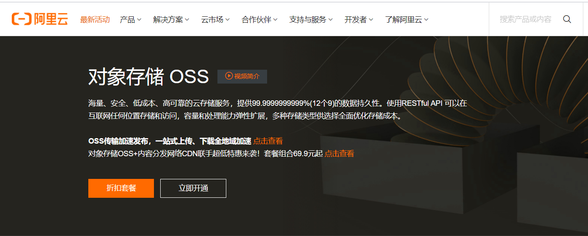 

### 购买服务(做)

oss需要我们付费的有两个地方: 1) 存储，直接4.98购买套餐；2）流量，按照访问量自动扣费

> 存储包，直接购买套餐

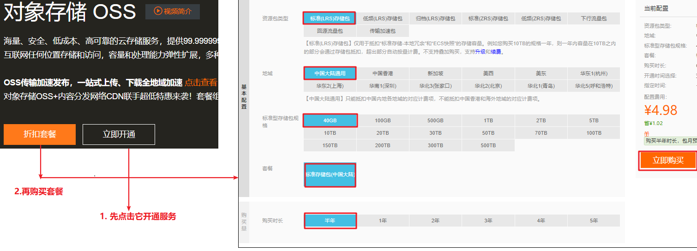 

> 流量包，上行流量是免费的，下行流量是按照访问量自动扣费的

 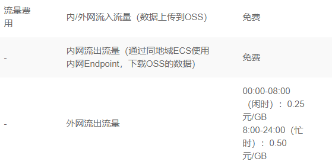 

### 创建存储空间(做)

>这四个位置跟我一致,其他全部默认

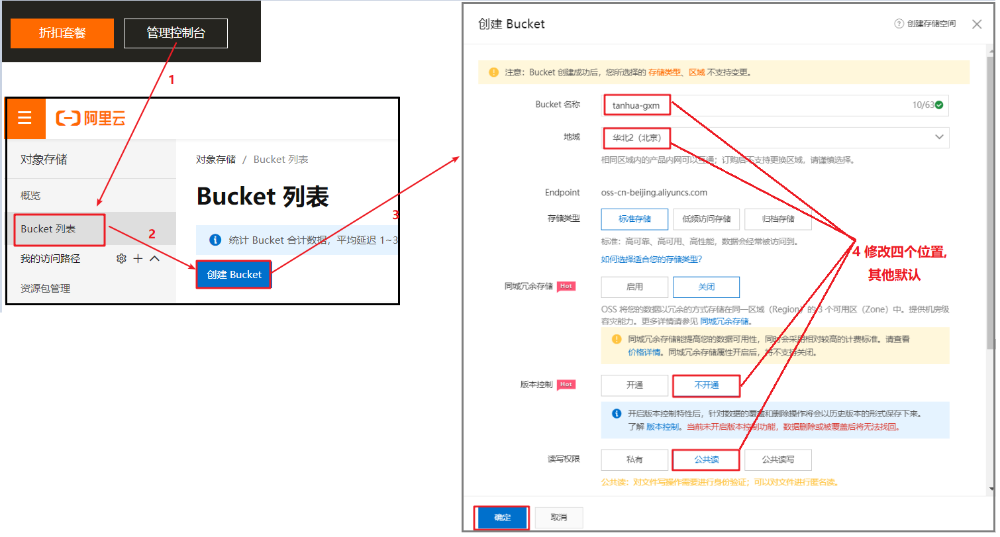 

###  文件上传

>https://help.aliyun.com/document_detail/84781.html?spm=a2c4g.11174283.6.946.425e7da24qVtmx

```java
package com.itheima.test;

import com.aliyun.oss.OSS;
import com.aliyun.oss.OSSClientBuilder;

import java.io.FileInputStream;
import java.io.FileNotFoundException;
import java.io.InputStream;

public class OssTest {
    public static void main(String[] args) throws FileNotFoundException {
        // 区域
        String endpoint = "http://oss-cn-beijing.aliyuncs.com";

        //秘钥
        String accessKeyId = "LTAI4G3uHmEsKn5okn1wWYk6";
        String accessKeySecret = "ZhTbkMEuFhPmRTQvPpQJSRfiY41yCg";
        
        OSS ossClient = new OSSClientBuilder().build(endpoint, accessKeyId, accessKeySecret);

        // 上传文件
        InputStream inputStream = new FileInputStream("C:\\upload\\jr.jpg");
        ossClient.putObject("tanhua-gxm", "haha.jpg", inputStream);

        // 关闭OSSClient。
        ossClient.shutdown();
    }
}
```

## 抽取组件

### 导入依赖

> 已完成，此步略过

```xml
<dependency>
    <groupId>com.aliyun.oss</groupId>
    <artifactId>aliyun-sdk-oss</artifactId>
    <version>3.10.2</version>
</dependency>
```

### oss配置类

> 在`tanhua-autoconfig`下创建`com.itheima.autoconfig.oss.OssProperties`类，用于读取阿里云存储配置信息

```java
package com.itheima.autoconfig.oss;

import lombok.Data;
import org.springframework.boot.context.properties.ConfigurationProperties;

//读取阿里存储设置
@Data
@ConfigurationProperties(prefix = "tanhua.oss")
public class OssProperties {
    private String accessKey;
    private String secret;
    private String bucketName;
    private String url;
    private String Endpoint;
}
```

### oss模板

> 在`tanhua-autoconfig`下创建`com.itheima.autoconfig.oss.OssTemplate`类，完成上传图片功能

```java
package com.itheima.autoconfig.oss;

import com.aliyun.oss.OSS;
import com.aliyun.oss.OSSClientBuilder;
import com.aliyun.oss.model.ObjectMetadata;

import java.io.InputStream;
import java.text.SimpleDateFormat;
import java.util.Date;

//阿里存储工具类
public class OssTemplate {

    private OssProperties ossProperties;

    public OssTemplate(OssProperties properties) {
        this.ossProperties = properties;
    }

    public String upload(String fileName, InputStream inputStream) {

        // Endpoint以杭州为例，其它Region请按实际情况填写。
        String endpoint = ossProperties.getEndpoint();

        // 云账号AccessKey有所有API访问权限，
        String accessKeyId = ossProperties.getAccessKey();
        String accessKeySecret = ossProperties.getSecret();

        // 创建OSSClient实例。
        OSS ossClient = new OSSClientBuilder().build(endpoint, accessKeyId, accessKeySecret);

        // 上传文件流。
        // <yourObjectName>表示上传文件到OSS时需要指定包含文件后缀在内的完整路径，例如 images/2020/11/11/asdf.jpg。
        String objectName = "images/" + new SimpleDateFormat("yyyy/MM/dd").format(new Date())
                + "/" + System.currentTimeMillis() + fileName.substring(fileName.lastIndexOf("."));

        // meta设置请求头,解决访问图片地址直接下载
        ObjectMetadata meta = new ObjectMetadata();
        meta.setContentType(getContentType(fileName.substring(fileName.lastIndexOf("."))));
        ossClient.putObject(ossProperties.getBucketName(), objectName, inputStream,meta);

        // 关闭OSSClient。
        ossClient.shutdown();

        return ossProperties.getUrl() + "/" + objectName;
    }

    public  String getContentType(String FilenameExtension) {
        if (FilenameExtension.equalsIgnoreCase(".bmp")) {
            return "image/bmp";
        }
        if (FilenameExtension.equalsIgnoreCase(".gif")) {
            return "image/gif";
        }
        if (FilenameExtension.equalsIgnoreCase(".jpeg") ||
                FilenameExtension.equalsIgnoreCase(".jpg") ||
                FilenameExtension.equalsIgnoreCase(".png")) {
            return "image/jpg";
        }
        return "image/jpg";
    }
}
```

### 探花配置类

> 修改`tanhua-autoconfig`下的`com.itheima.autoconfig.TanhuaAutoConfiguration`类，用于将OssTemplate放入容器

```java
package com.itheima.autoconfig;

import com.itheima.autoconfig.oss.OssProperties;
import com.itheima.autoconfig.oss.OssTemplate;
import com.itheima.autoconfig.sms.SmsProperties;
import com.itheima.autoconfig.sms.SmsTemplate;
import org.springframework.context.annotation.Bean;
import org.springframework.context.annotation.Configuration;
import org.springframework.context.annotation.Import;

@Configuration
@Import({
        SmsProperties.class,//加载短信配置
        OssProperties.class//加载oss配置
})
public class TanhuaAutoConfiguration {
    @Bean
    public SmsTemplate smsTemplate(SmsProperties smsProperties) {
        return new SmsTemplate(smsProperties);
    }

    @Bean
    public OssTemplate ossTemplate(OssProperties ossProperties) {
        return new OssTemplate(ossProperties);
    }
}
```

### 配置文件(做)

> 编辑`tanhua-app`下 `application.yml`文件，加入配置

~~~yaml
tanhua:
  oss:
    accessKey: LTAI4G3uHmEsKn5okn1wWYk6
    secret: ZhTbkMEuFhPmRTQvPpQJSRfiY41yCg
    endpoint: oss-cn-beijing.aliyuncs.com
    bucketName: tanhua-gxm
    url: https://tanhua-gxm.oss-cn-beijing.aliyuncs.com
~~~

### 测试

> 在`tanhua-app`下创建 `com.itheima.test.OssTest`测试类，编写测试方法
>
> 注意：1) 测试之前，必须保证`tanhua-db-service`是启动状态的;  2) 测试之后，将测试方法里面的内容注释掉

~~~java
package com.itheima.test;

import com.itheima.autoconfig.oss.OssTemplate;
import org.junit.Test;
import org.junit.runner.RunWith;
import org.springframework.beans.factory.annotation.Autowired;
import org.springframework.boot.test.context.SpringBootTest;
import org.springframework.test.context.junit4.SpringJUnit4ClassRunner;

import java.io.FileInputStream;
import java.io.FileNotFoundException;

@RunWith(SpringJUnit4ClassRunner.class)
@SpringBootTest
public class OssTest {

    @Autowired
    private OssTemplate ossTemplate;

    @Test
    public void testUploadFile() throws FileNotFoundException {
        String fileName = "C:\\upload\\jr.jpg";
        String url = ossTemplate.upload(fileName, new FileInputStream(fileName));
        System.out.println(url);
    }
}
~~~


# 人脸检测

## 人脸检测解决方案

~~~markdown
* 在用户将图片上传到阿里云OSS云存储之后，还要对头像要做人脸识别，非人脸照片不得上传
	1. 人工检测：
		优点：审核严格	
		缺点：成本高、效率低
	2. AI检测：
		优点：成本低、效率高
		缺点：审核有误差

* 在本套课程中选用百度云AI服务进行人脸检测。
~~~

## 百度云AI

### 介绍

官网地址：https://ai.baidu.com/tech/face

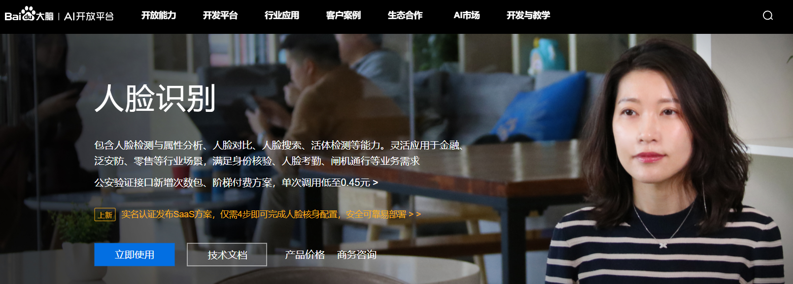  

### 账号申请登录(做)

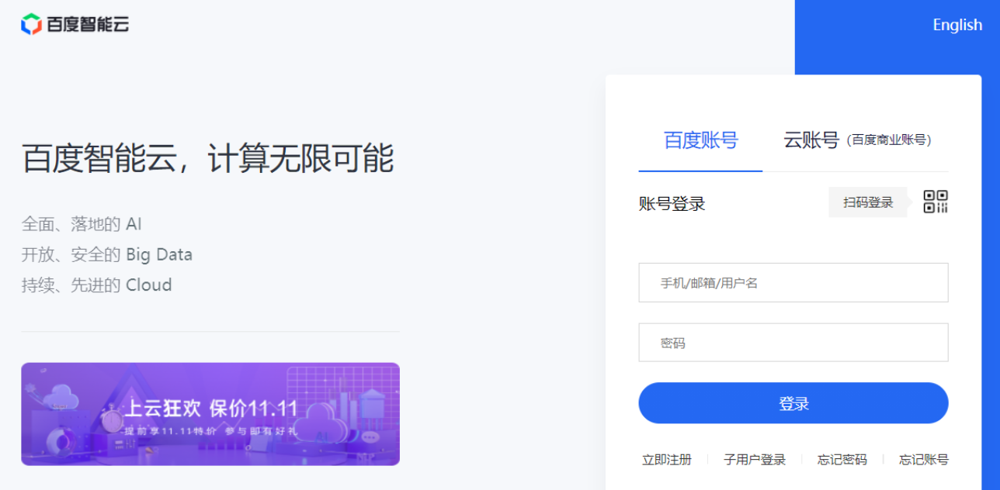 

### 创建应用(做)

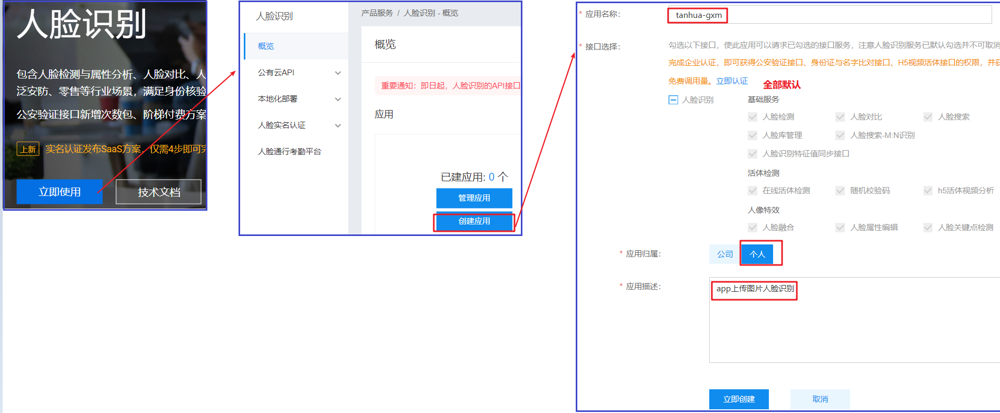  

### 人脸检测

> https://cloud.baidu.com/doc/FACE/s/8k37c1rqz

```java
package com.itheima.test;

import cn.hutool.core.io.FileUtil;
import com.baidu.aip.face.AipFace;
import com.baidu.aip.util.Base64Util;
import org.json.JSONObject;
import org.junit.Test;

import java.io.File;
import java.util.HashMap;

public class AipTest {

    @Test
    public void test01() throws Exception {
        // 初始化一个AipFace
        AipFace client = new AipFace("23185047", "sAXm3wjOaTL0KyqIvVpD4ODN", "i3DrQhOn5m37hEnBAOdpLamtFUZaGZhl");
        // 传入可选参数调用接口
        HashMap<String, String> options = new HashMap<String, String>();
        options.put("face_field", "age");
        options.put("max_face_num", "2");
        options.put("face_type", "LIVE");
        options.put("liveness_control", "LOW");

        // 图片，要求通过base64编码
        File file = new File("c:/upload/gyy.jpg");
        byte[] bytes = FileUtil.readBytes(file);
        String image = Base64Util.encode(bytes);
        String imageType = "BASE64";

        // 人脸检测
        JSONObject res = client.detect(image, imageType, options);
        System.out.println(res.toString(2));
    }
}
```


## 抽取组件

### 导入依赖

> 已完成，此步略过

```xml
<dependency>
    <groupId>com.baidu.aip</groupId>
    <artifactId>java-sdk</artifactId>
    <version>4.8.0</version>
</dependency>
```

### Aip配置类

> 在`tanhua-autoconfig`下创建`com.itheima.autoconfig.face.AipFaceProperties`类，用于读取百度云人脸识别配置信息

```java
package com.itheima.autoconfig.face;

import lombok.Data;
import org.springframework.boot.context.properties.ConfigurationProperties;
import org.springframework.stereotype.Component;

//读取百度云人脸识别配置
@Data
@ConfigurationProperties("tanhua.aip")
public class AipFaceProperties {
    private String appId;
    private String apiKey;
    private String secretKey;
}
```

### Aip模板

> 在`tanhua-autoconfig`下创建`com.itheima.autoconfig.face.AipFaceTemplate`类，完成人脸识别功能

```java
package com.itheima.autoconfig.face;

import com.baidu.aip.face.AipFace;
import com.baidu.aip.util.Base64Util;
import org.json.JSONObject;

import java.util.HashMap;

//百度云人脸识别工具类
public class AipFaceTemplate {

    private AipFaceProperties properties;

    public AipFaceTemplate(AipFaceProperties properties) {
        this.properties = properties;
    }

    public boolean detect(byte[] body) {

        AipFace client = new AipFace(properties.getAppId(), properties.getApiKey(), properties.getSecretKey());
        // 传入可选参数调用接口
        HashMap<String, String> options = new HashMap<String, String>();
        options.put("face_field", "age");
        options.put("max_face_num", "2");
        options.put("face_type", "LIVE");
        options.put("liveness_control", "LOW");

        String imageType = "BASE64";
        String image = Base64Util.encode(body);

        // 人脸检测
        JSONObject res = client.detect(image, imageType, options);
        int code = res.getInt("error_code");

        return code == 0;
    }
}
```

### 探花配置类

> 修改`tanhua-autoconfig`下的`com.itheima.autoconfig.TanhuaAutoConfiguration`类，用于将AipFaceTemplate放入容器

```java
package com.itheima.autoconfig;

import com.itheima.autoconfig.face.AipFaceProperties;
import com.itheima.autoconfig.face.AipFaceTemplate;
import com.itheima.autoconfig.oss.OssProperties;
import com.itheima.autoconfig.oss.OssTemplate;
import com.itheima.autoconfig.sms.SmsProperties;
import com.itheima.autoconfig.sms.SmsTemplate;
import org.springframework.context.annotation.Bean;
import org.springframework.context.annotation.Configuration;
import org.springframework.context.annotation.Import;

@Configuration
@Import({
        SmsProperties.class,//加载短信配置
        OssProperties.class,//加载oss配置
        AipFaceProperties.class//加载人脸识别配置
})
public class TanhuaAutoConfiguration {
    @Bean
    public AipFaceTemplate aipFaceTemplate(AipFaceProperties aipFaceProperties) {
        return new AipFaceTemplate(aipFaceProperties);
    }
    
    @Bean
    public SmsTemplate smsTemplate(SmsProperties smsProperties) {
        return new SmsTemplate(smsProperties);
    }

    @Bean
    public OssTemplate ossTemplate(OssProperties ossProperties) {
        return new OssTemplate(ossProperties);
    }
}
```

### 配置文件(做)

> 编辑`tanhua-app`下 `application.yml`文件，加入配置

~~~yaml
tanhua:
  aip:
    appId: 23185047
    apiKey: sAXm3wjOaTL0KyqIvVpD4ODN
    secretKey: i3DrQhOn5m37hEnBAOdpLamtFUZaGZhl
~~~

### 测试

> 在`tanhua-app`下创建 `com.itheima.test.AipTest`测试类，编写测试方法，
>
> 注意：1) 测试之前，必须保证`tanhua-db-service`是启动状态的;  2) 测试之后，将测试方法里面的内容注释掉

~~~java
package com.itheima.test;

import cn.hutool.core.io.FileUtil;
import com.itheima.autoconfig.face.AipFaceTemplate;
import org.junit.Test;
import org.junit.runner.RunWith;
import org.springframework.beans.factory.annotation.Autowired;
import org.springframework.boot.test.context.SpringBootTest;
import org.springframework.test.context.junit4.SpringJUnit4ClassRunner;

import java.io.File;

@RunWith(SpringJUnit4ClassRunner.class)
@SpringBootTest
public class AipTest {

    @Autowired
    private AipFaceTemplate template;

    @Test
    public void testAip() {
        String filename = "c:/upload/gyy.jpg";
        File file = new File(filename);
        byte[] bytes = FileUtil.readBytes(file);
        System.out.println(template.detect(bytes));
    }
}
~~~


# 完善个人信息(重点)

## 功能说明

> 用户在首次登录时需要完善个人信息，包括性别、昵称、生日、城市、头像等。
>
> 其中，头像数据需要做图片上传，这里采用阿里云的OSS服务作为我们的图片服务器，并且对头像要做人脸识别，非人脸照片不得上传。
>
> 接口地址:
>
> ​	https://mock-java.itheima.net/project/35/interface/api/569
>
> ​	https://mock-java.itheima.net/project/35/interface/api/575

**根据接口文档，可以发现这个业务需要后端提供两个接口**

1. /user/loginReginfo  用于接收用户基本信息，存储到`user_info`表，此表专门用存储用户详情，与用户表通过主键保持一对一关系。
2. /user/loginReginfo/head   用于接收用户头像，先人脸检测，如果没有问题，保存到阿里云存储, 然后将上传之后的图片地址存储到`user_info`表

## 完善个人基本信息

### 思路分析

>接收用户基本信息，将信息保存到数据库中

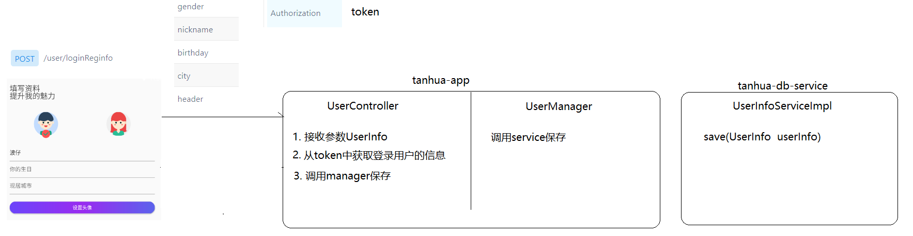 

### UserController

~~~java
    //完善个人基本信息
    @PostMapping("/user/loginReginfo")
    public void saveBaseInfo(@RequestBody UserInfo userInfo,
                             @RequestHeader("Authorization") String token) {
        //1. 根据token获取用户信息
        User user = getUserFromToken(token);

        //2. 将用户的id设置到UserInfo
        userInfo.setId(user.getId());

        //3. 调用manager保存
        userManager.saveBaseInfo(userInfo);
    }

    //根据token获取用户信息
    private User getUserFromToken(String token) {
        //1. 从redis中查询token
        String json = stringRedisTemplate.opsForValue().get(ConstantUtil.USER_TOKEN + token);

        //2. 将json转换成User对象
        User user = JSON.parseObject(json, User.class);

        //3. redis进行续期
        stringRedisTemplate.opsForValue().set(ConstantUtil.USER_TOKEN + token, json, Duration.ofDays(7));

        //4. 将user对象返回
        return user;
    }
~~~

### UserManager

~~~java
    //保存用户基本信息
    public void saveBaseInfo(UserInfo userInfo) {
        //调用userInfoservice保存
        userInfoService.save(userInfo);
    }
~~~

### UserInfoService

>在`tanhua-db-interface`中创建`com.itheima.service.db.UserInfoService`类

~~~java
package com.itheima.service.db;

import com.itheima.domain.db.UserInfo;

public interface UserInfoService {

    //保存用户信息
    void save(UserInfo userInfo);
}
~~~

### UserInfoServiceImpl

>在`tanhua-db-service`中创建`com.itheima.service.db.impl.UserInfoServiceImpl`类

```java
package com.itheima.service.db.impl;

import com.itheima.domain.db.UserInfo;
import com.itheima.mapper.UserInfoMapper;
import com.itheima.service.db.UserInfoService;
import org.apache.dubbo.config.annotation.Service;
import org.springframework.beans.factory.annotation.Autowired;

@Service
public class UserInfoServiceImpl implements UserInfoService {

    @Autowired
    private UserInfoMapper userInfoMapper;

    @Override
    public void save(UserInfo userInfo) {
        userInfoMapper.insert(userInfo);
    }
}
```


## 完善个人头像信息

>接收用户头像信息，首先将头像文件上传到阿里云，再将头像图片的访问地址更新到数据库的`user_Info`表中

### 思路分析

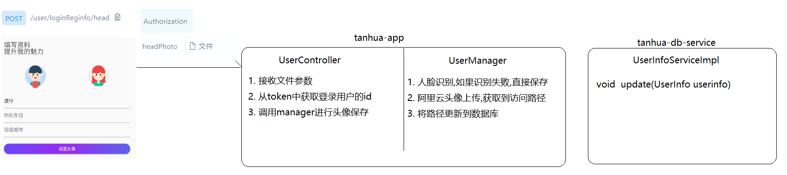 

### UserController

~~~java
    //完善个人的头像信息
    @PostMapping("/user/loginReginfo/head")
    public void savePhotoInfo(MultipartFile headPhoto,
                              @RequestHeader("Authorization") String token) throws IOException {
        //1. 从token中获取登录用户的信息
        User user = getUserFromToken(token);

        //2. 调用manager进行更新
        userManager.savePhotoInfo(user.getId(), headPhoto);
    }

~~~

### UserManager

~~~java
    //完善个人的头像信息
    public void savePhotoInfo(Long id, MultipartFile headPhoto) throws IOException {
        //1. 人脸识别,如果识别失败,直接抛异常
        boolean detect = aipFaceTemplate.detect(headPhoto.getBytes());
        System.out.println("人脸识别结果:" + detect);
        if (!detect) {
            throw new RuntimeException("人脸审核失败");
        }

        //2. 阿里云文件上传,返回访问路径
        String filePath = ossTemplate.upload(headPhoto.getOriginalFilename(), headPhoto.getInputStream());
        System.out.println("文件上传之后的访问路径是:" + filePath);

        //3. 将访问路径设置userInfo
        UserInfo userInfo = new UserInfo();
        userInfo.setId(id);//where id = ?
        userInfo.setCoverPic(filePath);//封面 set coverPic = ?
        userInfo.setAvatar(filePath);//头像 avatar = ?

        //4. 调用service更新
        userInfoService.update(userInfo);
    }
~~~

### UserInfoService

```java
    //更新用户信息
    void update(UserInfo userInfo);
```

### UserInfoServiceImpl

```java
    @Override
    public void update(UserInfo userInfo) {
        userInfoMapper.updateById(userInfo);//默认情况下,这哥们就是动态sql更新的
    }
```


# 查询个人信息(重点)

## 功能说明

> 用户在登录成功后，点击底部菜单我的，查询用户基本信息（头像、昵称、性别、地区）
>
> 接口文档: https://mock-java.itheima.net/project/35/interface/api/875

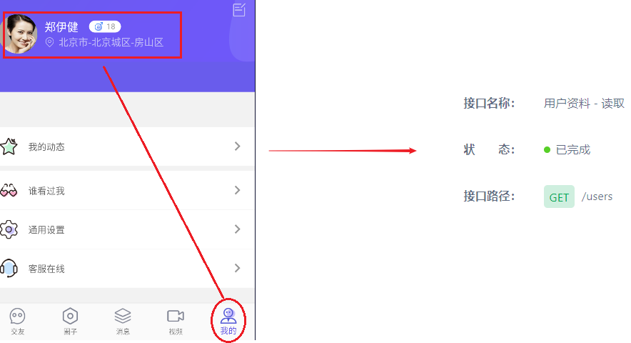 

## 思路分析

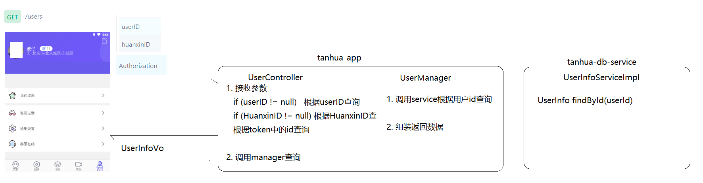 

## 代码编写

### 添加vo

>在`tanhua-domain`模块中添加下面vo代码，用于对接前端

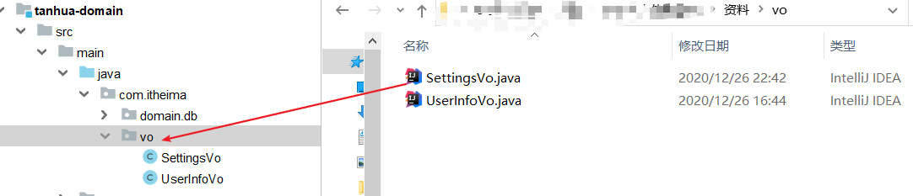 

### UserController

```java
    //查询个人信息
    @GetMapping("/users")
    public UserInfoVo findUserInfo(@RequestHeader("Authorization") String token,
                                   Long userID, Long huanxinID) {
        //如果userID不为空,就按照userID查询
        if (userID != null) {
            return userManager.findById(userID);
        }
        //如果userID为空,huanxinID不为空,就按照huanxinID查询
        if (huanxinID != null) {
            return userManager.findById(huanxinID);
        }
        //如果上面两个都为空,就从token中获取登录用户id查询
        User user = getUserFromToken(token);
        return userManager.findById(user.getId());
    }
```

### UserInfoManager

~~~java
    //根据用户id查询用户信息
    public UserInfoVo findById(Long userId) {
        //1. 调用service根据userId查询
        UserInfo userInfo = userInfoService.findById(userId);

        //2. 组装返回数据
        UserInfoVo userInfoVo = new UserInfoVo();
        BeanUtils.copyProperties(userInfo, userInfoVo);//属性复制,条件是两个对象中的属性完全一样的可以复制
        userInfoVo.setAge(userInfo.getAge() + "");//再来设置一下age

        return userInfoVo;
    }
~~~

### UserInfoService

```java
    //根据主键查询用户信息
    UserInfo findById(Long userId);
```

### UserInfoServiceImpl

~~~java
    @Override
    public UserInfo findById(Long userId) {
        return userInfoMapper.selectById(userId);
    }
~~~


# 更新个人信息(重点)

## 功能说明

> 用户在我的页面中，点击右上角编辑，实现更新用户信息功能（头像、生日、性别）
>
> 接口文档:
>
> ​	修改基本信息  https://mock-java.itheima.net/project/35/interface/api/887
>
> ​	修改头像信息  https://mock-java.itheima.net/project/35/interface/api/881

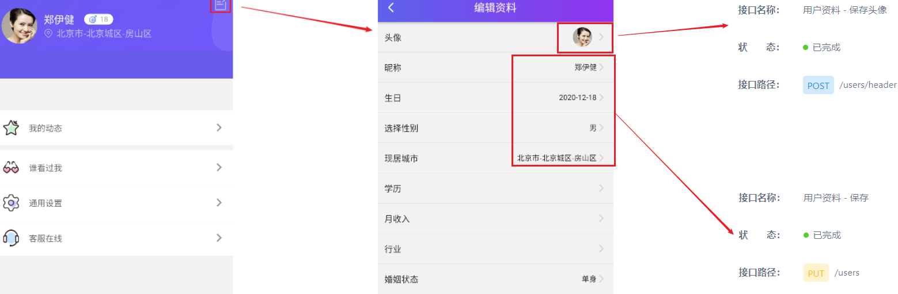 

## 更新基本信息

>更新用户信息的操作比较简单，就是接收userInfo信息，然后对数据库进行更新操作

### UserController

```java
    //修改个人信息
    @PutMapping("/users")
    public void updateBaseInfo(@RequestHeader("Authorization") String token,
                               @RequestBody UserInfo userInfo) {

        //调用manager执行修改
        userManager.updateBaseInfo(userInfo);
    }
```

### UserManager

~~~java
    //更新用户基本信息
    public void updateBaseInfo(UserInfo userInfo) {
        //调用service更新用户信息
        userInfoService.update(userInfo);
    }
~~~

## 更新头像

>更新头像和保存头像可以使用同一个方法

~~~markdown
接收头像信息--->人脸识别----->上传阿里云---->头像信息更新到数据库中去
~~~

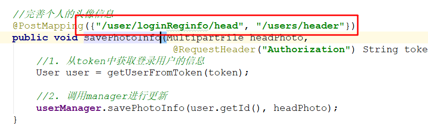 


# 统一处理token(理解 会用)

## 技术分析

在上面的开发代码中，我们会在每一个Controller中接收并在Service中对token做解析获取用户，这是一项繁琐且重复度比较高的工作。有什么好的解决方法吗？

本节内容我们通过`ThreadLocal`结合`SpringMVC拦截器`来实现统一token处理

  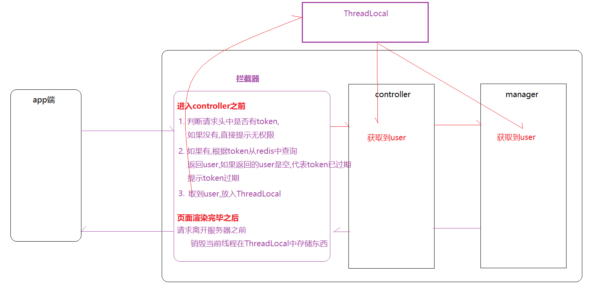  

### 拦截器

拦截器是Spring提供的一种技术, 它的功能似于过滤器Filter，它会在进入controller之前,离开controller之后以及页面渲染完毕之后进行拦截。

拦截器HandlerInterceptor接口的三个方法: 

* preHandle() : 在目标方法之前执行，一般用于预处理 
* postHandle()：在目标方法执行之后执行，一般用于后处理 
* afterCompletion()：整个请求处理完毕，在视图渲染完毕时回调，一般用于资源的清理或性能的统计

### ThreadLocal

线程局部变量，该变量对其他线程而言是隔离的；在进行对象跨层传递的时候，使用ThreadLocal可以避免多次传递，打破层次间的约束。

ThreadLocal的三个方法: 

- set(T value) ：设置当前线程绑定的变量
- get()：获取当前线程绑定的变量
- remove() ：移除当前线程绑定的变量 


## 代码改造                                                                                                                                                                                                                                                                                                                                                                                                                                                                                                                                                                                                                                                                                                                                                                                                                                                                                                                                                                                                                                                                                                                                                                                                                                                                                                                                                                     

### UserHolder

> 在`tanhua-app`模块编写一个`com.itheima.app.interceptor.UserHolder`，内部通过ThreadLocal来存储用户信息

```java
package com.itheima.app.interceptor;

import com.itheima.domain.db.User;

//操作ThreadLocal的
public class UserHolder {

    //准备好存放User的ThreadLocal
    private static ThreadLocal<User> th = new ThreadLocal<User>();

    //向th存放user
    public static void setUser(User user) {
        th.set(user);
    }

    //从th获取user
    public static User getUser() {
        return th.get();
    }

    //从th移除user
    public static void removeUser() {
        th.remove();
    }
}
```

### TokenInterceptor

> 在`tanhua-app`模块下创建`com.tanhua.app.interceptor.TokenInterceptor`，在拦截器中进行token的校验和处理       

```java
package com.itheima.app.interceptor;

import com.alibaba.fastjson.JSON;
import com.itheima.domain.db.User;
import com.itheima.util.ConstantUtil;
import org.apache.commons.lang3.StringUtils;
import org.springframework.beans.factory.annotation.Autowired;
import org.springframework.data.redis.core.StringRedisTemplate;
import org.springframework.stereotype.Component;
import org.springframework.web.servlet.HandlerInterceptor;

import javax.servlet.http.HttpServletRequest;
import javax.servlet.http.HttpServletResponse;
import java.time.Duration;

//开发拦截器
@Component
public class TokenInterceptor implements HandlerInterceptor {

    @Autowired
    private StringRedisTemplate stringRedisTemplate;

    //进入controller之前(token的校验)
    @Override
    public boolean preHandle(HttpServletRequest request, HttpServletResponse response, Object handler) throws Exception {
        //1. 判断请求头中是否有token,如果没有,直接无权限方法
        String token = request.getHeader("Authorization");
        if (StringUtils.isEmpty(token)) {
            response.setStatus(401);//无权访问
            return false;//禁止通行
        }

        //2. 从redis中未查到token或者查到的有问题
        User user = getUserFromToken(token);
        if (user == null) {
            response.setStatus(401);//无权访问
            return false;//禁止通行
        }

        //3. 将user信息存入threadLocal
        UserHolder.setUser(user);
        return true;//放行请求
    }

    //请求离开服务器之前(threadLocal的清理)
    @Override
    public void afterCompletion(HttpServletRequest request, HttpServletResponse response, Object handler, Exception ex) throws Exception {
        UserHolder.removeUser();
    }


    //根据token获取用户信息
    private User getUserFromToken(String token) {
        try {
            //1. 从redis中查询token
            String json = stringRedisTemplate.opsForValue().get(ConstantUtil.USER_TOKEN + token);

            //2. 将json转换成User对象
            User user = JSON.parseObject(json, User.class);

            //3. redis进行续期
            stringRedisTemplate.opsForValue().set(ConstantUtil.USER_TOKEN + token, json, Duration.ofDays(7));

            //4. 将user对象返回
            return user;
        } catch (Exception e) {
            //存在异常
            return null;
        }
    }
}
```

### WebConfig

> 在`tanhua-app`模块下创建`com.tanhua.app.interceptor.WebConfig`，实现WebMvcConfigurer接口，添加拦截器配置

```java
package com.itheima.app.interceptor;

import org.springframework.beans.factory.annotation.Autowired;
import org.springframework.context.annotation.Configuration;
import org.springframework.web.servlet.config.annotation.InterceptorRegistry;
import org.springframework.web.servlet.config.annotation.WebMvcConfigurer;

//配置拦截器
@Configuration
public class WebConfig implements WebMvcConfigurer {

    @Autowired
    private TokenInterceptor tokenInterceptor;

    //向springboot注册我们自己的拦截器
    @Override
    public void addInterceptors(InterceptorRegistry registry) {
        registry.addInterceptor(tokenInterceptor)//添加拦截器类
                .addPathPatterns("/**")//拦截所有
                .excludePathPatterns("/user/login","/user/loginVerification");
    }
}
```

### Controller调整

~~~java
package com.itheima.app.controller;

import com.alibaba.fastjson.JSON;
import com.itheima.app.interceptor.UserHolder;
import com.itheima.app.manager.UserManager;
import com.itheima.domain.db.User;
import com.itheima.domain.db.UserInfo;
import com.itheima.util.ConstantUtil;
import com.itheima.vo.UserInfoVo;
import org.springframework.beans.factory.annotation.Autowired;
import org.springframework.data.redis.core.StringRedisTemplate;
import org.springframework.web.bind.annotation.*;
import org.springframework.web.multipart.MultipartFile;

import java.io.IOException;
import java.time.Duration;
import java.util.Map;

//接收参数
@RestController// = @Controller + @ResponseBody
public class UserController {

    @Autowired
    private UserManager userManager;

    @Autowired
    private StringRedisTemplate stringRedisTemplate;


    //get delete 请求  直接取参数
    //post  put  请求  使用@RequestBody从请求体中取

    //用户保存,返回主键
    @PostMapping("/save")
    public Long save(@RequestBody User user) {
        //调用manager保存
        return userManager.save(user);
    }

    //根据手机号查询用户
    @GetMapping("/findByPhone")
    public User findByPhone(String phone) {
        //调用manager保存
        return userManager.findByPhone(phone);
    }

    //发送手机验证码
    @PostMapping("/user/login")
    public void sendSmsCode(@RequestBody Map<String, String> map) {
        //1. 接收参数
        String phone = map.get("phone");

        //2. 调用manager
        userManager.sendSmsCode(phone);
    }

    //注册登录
    @PostMapping("/user/loginVerification")
    public Map loginRegister(@RequestBody Map<String, String> map) {
        //1. 接收参数
        String phone = map.get("phone");
        String verificationCode = map.get("verificationCode");

        //2. 调用manager
        return userManager.loginRegister(phone, verificationCode);
    }

    //完善个人基本信息
    @PostMapping("/user/loginReginfo")
    public void saveBaseInfo(@RequestBody UserInfo userInfo) {
        //1. 根据token获取用户信息
        User user = UserHolder.getUser();

        //2. 将用户的id设置到UserInfo
        userInfo.setId(user.getId());

        //3. 调用manager保存
        userManager.saveBaseInfo(userInfo);
    }

    //完善个人的头像信息
    @PostMapping({"/user/loginReginfo/head", "/users/header"})
    public void savePhotoInfo(MultipartFile headPhoto) throws IOException {
        //1. 根据token获取用户信息
        User user = UserHolder.getUser();

        //2. 调用manager进行更新
        userManager.savePhotoInfo(user.getId(), headPhoto);
    }

    //查询个人信息
    @GetMapping("/users")
    public UserInfoVo findUserInfo(Long userID, Long huanxinID) {
        //如果userID不为空,就按照userID查询
        if (userID != null) {
            return userManager.findById(userID);
        }
        //如果userID为空,huanxinID不为空,就按照huanxinID查询
        if (huanxinID != null) {
            return userManager.findById(huanxinID);
        }
        //如果上面两个都为空,就从token中获取登录用户id查询
        User user = UserHolder.getUser();
        return userManager.findById(user.getId());
    }

    //修改个人信息
    @PutMapping("/users")
    public void updateBaseInfo(@RequestBody UserInfo userInfo) {

        //调用manager执行修改
        userManager.updateBaseInfo(userInfo);
    }
}
~~~

