# 回顾

```markdown
1. 完善个人信息

2. 查询个人信息

3. 修改个人信息

4. token处理
	  app                                 服务器                                         redis
认证   发送请求                            创建token                                      保存token
访问   携带token                           拦截器:拦住请求  获取token  进行校验,如果检验成功将User信息放入ThreaLocal    
              
5. 阿里云OSS存储   百度人脸识别
	1. 注册  登录  (秘钥)
	2. 实名认证  付费
	3. 创建项目
	4. api的使用(配置信息---参数)
	
6. 自动装配
	1. 配置类  xxxProperties
	2. 工具类  xxxTemplate
	3. 启动配置类
	   加载配置类, 创建工具类, 放入Spring容器
	4. 将启动类配置到/META-INF/spring.factories
```


# 查询通用设置

## 功能说明

通用设置，包含探花交友APP基本的软件设置功能。包含：

- 陌生人问题：当平台其他用户想进行在线交流时需要回答陌生人问题。
- 通知设置：包含一些APP通知设置
- 黑名单：对于不感兴趣的用户设置黑名单屏蔽骚扰
- 修改手机号：可以更改app绑定的手机号码

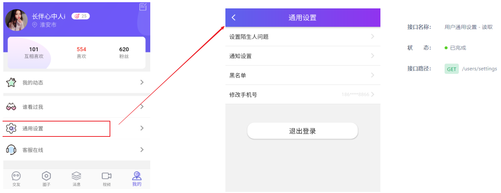 

>接口地址：https://mock-java.itheima.net/project/35/interface/api/893
>
>本次通用设置查询，主要查询的主要是陌生人问题和通知设置，条件是当前用户id， 使用的表主要有下面两张

 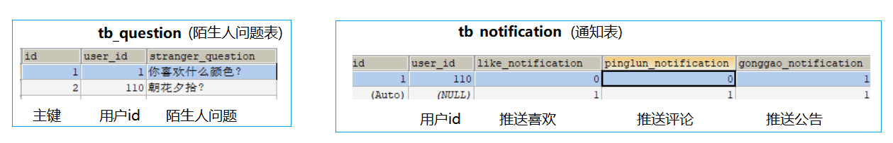 

## 思路分析

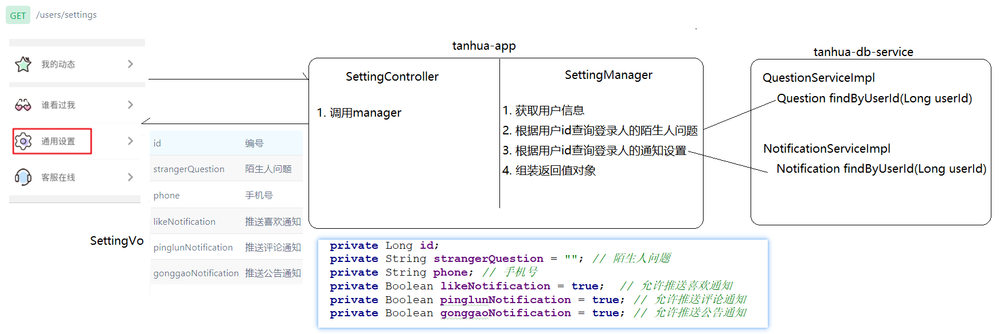 

## 代码实现

### QuestionService

>在`tanhua-db-interface`中创建`com.itheima.service.db.QuestionService`接口，实现下面方法

~~~java
package com.itheima.service.db;

import com.itheima.domain.db.Question;

public interface QuestionService {
    //根据用户id查询
    Question findByUserId(Long userId);
}
~~~

### QuestionServiceImpl

>在`tanhua-db-service`中创建`com.itheima.service.db.impl.QuestionServiceImpl`类，实现下面方法

~~~java
package com.itheima.service.db.impl;

import com.baomidou.mybatisplus.core.conditions.query.QueryWrapper;
import com.itheima.domain.db.Question;
import com.itheima.mapper.QuestionMapper;
import com.itheima.service.db.QuestionService;
import org.apache.dubbo.config.annotation.Service;
import org.springframework.beans.factory.annotation.Autowired;

@Service
public class QuestionServiceImpl implements QuestionService {

    @Autowired
    private QuestionMapper questionMapper;

    @Override
    public Question findByUserId(Long userId) {
        //构造查询条件 
        QueryWrapper<Question> wrapper = new QueryWrapper<>();
        wrapper.eq("user_id", userId); //where user_id = ?

        //执行查询
        return questionMapper.selectOne(wrapper);
    }
}
~~~

### NotificationService

>在`tanhua-db-interface`中创建`com.itheima.service.db.NotificationService`接口，实现下面方法

~~~java
package com.itheima.service.db;

import com.itheima.domain.db.Notification;

public interface NotificationService {
    //根据用户id查询
    Notification findByUserId(Long userId);
}
~~~

### NotificationServiceImpl

>在`tanhua-db-service`中创建`com.itheima.service.db.impl.NotificationServiceImpl`类，实现下面方法

~~~java
package com.itheima.service.db.impl;

import com.baomidou.mybatisplus.core.conditions.query.QueryWrapper;
import com.itheima.domain.db.Notification;
import com.itheima.mapper.NotificationMapper;
import com.itheima.service.db.NotificationService;
import org.apache.dubbo.config.annotation.Service;
import org.springframework.beans.factory.annotation.Autowired;

@Service
public class NotificationServiceImpl implements NotificationService {
    @Autowired
    private NotificationMapper notificationMapper;

    @Override
    public Notification findByUserId(Long userId) {
        //构造查询条件
        QueryWrapper<Notification> wrapper = new QueryWrapper<>();
        wrapper.eq("user_id", userId); //where user_id = ?

        //执行查询
        return notificationMapper.selectOne(wrapper);
    }
~~~

### SettingController

>在`tanhua-app`中创建`com.itheima.app.controller.SettingsController`类，实现下面方法

~~~java
package com.itheima.app.controller;

import com.itheima.app.manager.SettingManager;
import com.itheima.vo.SettingVo;
import org.springframework.beans.factory.annotation.Autowired;
import org.springframework.web.bind.annotation.GetMapping;
import org.springframework.web.bind.annotation.RestController;

@RestController
public class SettingController {

    @Autowired
    private SettingManager settingManager;

    //查询通用设置
    @GetMapping("/users/settings")
    public SettingVo findSettings(){
        //调用manager查询
        return settingManager.findSettings();
    }
}

~~~

### SettingManager

>在`tanhua-app`中创建`com.itheima.app.manager.SettingsManager`类，实现下面方法

~~~java
package com.itheima.app.manager;

import com.itheima.app.interceptor.UserHolder;
import com.itheima.domain.db.Notification;
import com.itheima.domain.db.Question;
import com.itheima.domain.db.User;
import com.itheima.service.db.NotificationService;
import com.itheima.service.db.QuestionService;
import com.itheima.vo.SettingVo;
import org.apache.dubbo.config.annotation.Reference;
import org.springframework.stereotype.Service;

@Service
public class SettingManager {

    @Reference
    private QuestionService questionService;

    @Reference
    private NotificationService notificationService;


    //查询通用设置
    public SettingVo findSettings() {
        //1. 从ThreaLocal中获取到用户信息
        User user = UserHolder.getUser();

        //2. 根据用户id查询陌生人问题
        Question question = questionService.findByUserId(user.getId());

        //3. 根据用户id查询通知设置
        Notification notification = notificationService.findByUserId(user.getId());

        //4. 组装返回值对象
        SettingVo settingVo = new SettingVo();
        //4-1 设置id和phone
        settingVo.setId(user.getId());
        settingVo.setPhone(user.getPhone());
        //4-2 设置陌生人问题
        if (question == null) {
            settingVo.setStrangerQuestion("你喜欢高山的巍峨还是大海的深邃");//设置默认问题
        }else {
            settingVo.setStrangerQuestion(question.getStrangerQuestion());
        }
        //4-3 设置通知设置
        if (notification == null){
            //设置默认通知设置
            settingVo.setLikeNotification(true);
            settingVo.setPinglunNotification(true);
            settingVo.setGonggaoNotification(true);
        }else {
            settingVo.setLikeNotification(notification.getLikeNotification());
            settingVo.setPinglunNotification(notification.getPinglunNotification());
            settingVo.setGonggaoNotification(notification.getGonggaoNotification());
        }
        return settingVo;
    }
}
~~~


# 设置陌生人问题

## 功能说明

> 用户在通用设置页面，点击设置陌生人问题，可以查看到陌生人问题（已做完）
>
> 接下来，需要填写陌生人问题；如果问题在数据库不存在，则新增；如果问题在数据库存在，则修改
>
> 接口地址：https://mock-java.itheima.net/project/35/interface/api/929

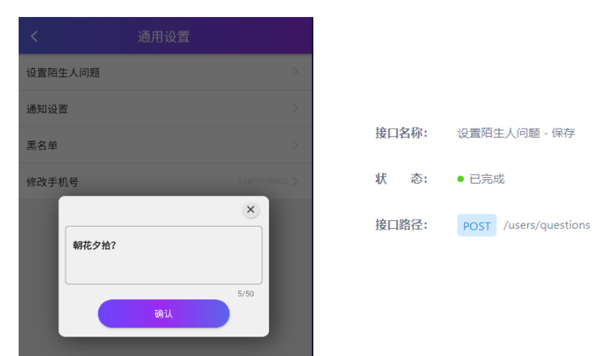 

## 思路分析 

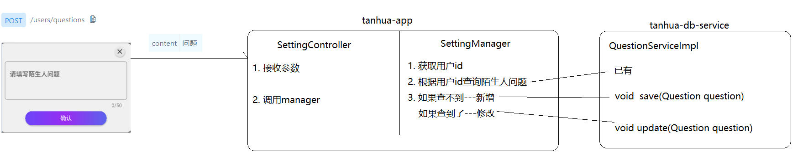 

## 代码实现

### SettingsController

```java
    //新增或修改用户的陌生人问题
    @PostMapping("/users/questions")
    public void saveOrUpdateQuestions(@RequestBody Map<String,String> map){
        //1. 获取参数
        String content = map.get("content");

        //2. 调用manager
        settingManager.saveOrUpdateQuestions(content);
    }
```

### SettingsManager

~~~java
    //新增或修改用户的陌生人问题
    public void saveOrUpdateQuestions(String content) {
        //1. 获取用户id
        Long userId = UserHolder.getUser().getId();

        //2. 根据用户id查询陌生人问题
        Question question = questionService.findByUserId(userId);

        //3. 如果查询不到--新增
        if (question == null){
            question = new Question();
            question.setUserId(userId);
            question.setStrangerQuestion(content);
            questionService.save(question);
        }else{
            //4. 如果查询到了--修改
            question.setStrangerQuestion(content);
            questionService.update(question);
        }
    }
~~~

### QuestionService

~~~java
    //保存用户的陌生人问题
    void save(Question question);

    //修改用户的陌生人问题
    void update(Question question);
~~~

### QuestionServiceImpl

~~~java
    @Override
    public void save(Question question) {
        questionMapper.insert(question);
    }

    @Override
    public void update(Question question) {
        questionMapper.updateById(question);
    }
~~~


# 设置通知

## 功能说明

>用户在通用设置页面，点击通知设置，可以查看到通知设置（已做完）
>
>接下来，需要填写通知设置；如果通知设置在数据库不存在，则新增；如果通知设置在数据库存在，则修改
>
>接口地址：https://mock-java.itheima.net/project/35/interface/api/965

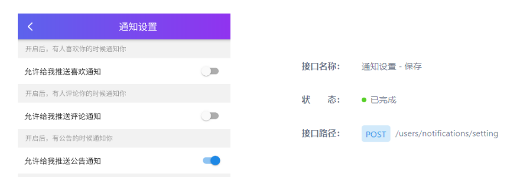 

## 思路分析

 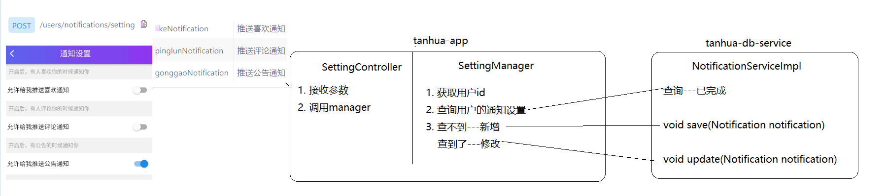 

## 代码实现

### SettingsController

```java
    //新增或修改用户的通知设置
    @PostMapping("/users/notifications/setting")
    public void saveOrUpdateNotifications(@RequestBody Notification notificationParam){
        //调用manager
        settingManager.saveOrUpdateNotifications(notificationParam);
    }
```

### SettingsManager

~~~java
    //新增或修改用户的通知设置
    public void saveOrUpdateNotifications(Notification notificationParam) {
        //1. 获取用户id
        Long userId = UserHolder.getUser().getId();

        //2. 根据用户id查询用户的通知设置
        Notification notification = notificationService.findByUserId(userId);

        //3. 如果查询不到--新增
        if (notification == null) {
            notificationParam.setUserId(userId);
            notificationService.save(notificationParam);
        } else {
            //4. 如果查询到了--修改
            notificationParam.setId(notification.getId());//where id = ?
            notificationService.update(notificationParam);
        }
    }
~~~

### NotificationService

~~~java
    //修改通知设置
    void update(Notification notification);
~~~

### NotificationServiceImpl

~~~java
    @Override
    public void update(Notification notification) {
        notificationMapper.updateById(notification);
    }
~~~


# 黑名单(难点)

## 黑名单分页查询

### 功能说明

> 用户在通用设置页面，点击黑名单，完成列表分页查询
>
> 接口地址:  https://mock-java.itheima.net/project/35/interface/api/935

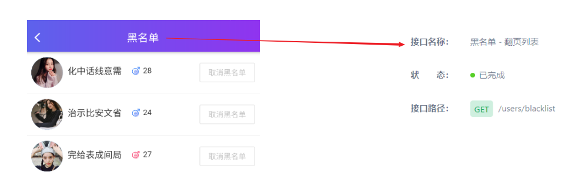 

### 思路分析

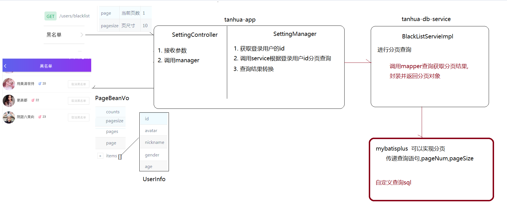 

### 技术分析

>mybatis-plus内置了分页插件，我们只需要开启分页拦截器即可

1. 在`tanhua-mapper`模块下创建`com.tanhua.config.MybatisPlusConfig`

   ~~~java
   package com.itheima.config;
   
   import com.baomidou.mybatisplus.extension.plugins.PaginationInterceptor;
   import org.springframework.context.annotation.Bean;
   import org.springframework.context.annotation.Configuration;
   
   @Configuration
   public class MybatisPlusConfig {
       //分页拦截器
       @Bean
       public PaginationInterceptor paginationInterceptor(){
           return new PaginationInterceptor();
       }
   }
   ~~~

2. 在代码中使用分页插件非常简单，只需两步

   ~~~java
   // 1. 创建Page对象，指定当前页和每页查询条数
   IPage page = new Page<>(当前页,每页个数);
   
   // 2. mapper查询
   page = mapper.selectPage(page,查询条件)
   ~~~

3. 若查询结果是关联多个表的操作，则需要用到自定义的mapper，此时的分页操作也很简单，只需要给mapper的第一个参数设置为`Page`对象即可

   ~~~java
   public interface BlackListMapper extends BaseMapper<BlackList> {
       @Select("自定义的查询sql")
       Page<UserInfo> findBlackListByUserId(Page page, Long userId);
   }
   ~~~

### BlackListMapper

> 编写出sql: 根据用户id查询出它的黑名单用户

~~~sql
-- 查询指定登录用户的黑明白用户信息
SELECT tui.* FROM 
	`tb_black_list` tbl JOIN tb_user_info tui ON tbl.`black_user_id` =  tui.`id`
	WHERE tbl.`user_id` = '110'
~~~

>编写出Mapper中的查询方法

~~~java
package com.itheima.mapper;

import com.baomidou.mybatisplus.core.mapper.BaseMapper;
import com.baomidou.mybatisplus.core.metadata.IPage;
import com.itheima.domain.db.BlackList;
import com.itheima.domain.db.UserInfo;
import org.apache.ibatis.annotations.Select;

import java.util.List;

// 黑名单
public interface BlackListMapper extends BaseMapper<BlackList> {

    //查询指定用户的黑名单用户列表
    @Select("SELECT tui.* FROM `tb_black_list` tbl JOIN tb_user_info tui ON tbl.`black_user_id` =  tui.`id` WHERE tbl.`user_id` = #{userId}")
    IPage<UserInfo> findBlackList(IPage page, Long userId);
}
~~~

### SettingsController

~~~java
    //黑名单列表查询
    @GetMapping("/users/blacklist")
    public PageBeanVo findBlackList(
            @RequestParam(value = "page", defaultValue = "1") Integer pageNum,
            @RequestParam(value = "pagesize", defaultValue = "10") Integer pageSize) {

        return settingManager.findBlackList(pageNum,pageSize);
    }
~~~

### SettingsManager

~~~java
    //分页查询黑名单列表
    public PageBeanVo findBlackList(Integer pageNum, Integer pageSize) {
        //1. 获取登录用户的id
        Long userId = UserHolder.getUser().getId();

        //2. 调用service查询
        return blackListService.findListByPage(userId,pageNum,pageSize);
    }
~~~

### BlackListService

>在`tanhua-db-interface`中创建`com.itheima.service.db.BlackListService`接口，实现下面方法

~~~java
package com.itheima.service.db;

import com.itheima.vo.PageBeanVo;

public interface BlackListService {
    //分页查询指定用户的黑名单
    PageBeanVo findListByPage(Long userId, Integer pageNum, Integer pageSize);
}
~~~

### BlackListServiceImpl

>在`tanhua-db-service`中创建`com.itheima.service.db.impl.BlackListServiceImpl`类，实现下面方法

~~~java
package com.itheima.service.db.impl;

import com.baomidou.mybatisplus.core.metadata.IPage;
import com.baomidou.mybatisplus.extension.plugins.pagination.Page;
import com.itheima.mapper.BlackListMapper;
import com.itheima.service.db.BlackListService;
import com.itheima.vo.PageBeanVo;
import org.apache.dubbo.config.annotation.Service;
import org.springframework.beans.factory.annotation.Autowired;

@Service
public class BlackListServiceImpl implements BlackListService {

    @Autowired
    private BlackListMapper blackListMapper;

    @Override
    public PageBeanVo findListByPage(Long userId, Integer pageNum, Integer pageSize) {

        //创建一个分页条件对象
        IPage page = new Page(pageNum, pageSize);

        //查询到的分页结果
        page = blackListMapper.findBlackList(page, userId);

        //构建返回对象
        return new PageBeanVo(pageNum, pageSize, page.getTotal(), page.getRecords());
    }
}
~~~


## 黑名单移除

### 功能说明

> 黑名单移除指的是对某一个用户进行移除，本质上就是删除数据库中的相关记录，条件就是当前用户id和黑名单用户id
>
> 接口文档 https://mock-java.itheima.net/project/35/interface/api/941

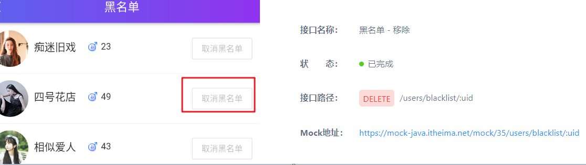 

### 思路分析

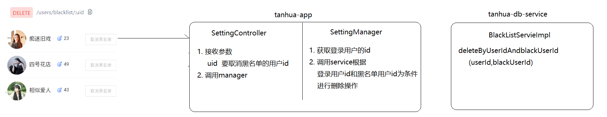 

### SettingsController

~~~java
    //移除黑名单用户
    @DeleteMapping("/users/blacklist/{uid}")
    public void deleteBlackUser(@PathVariable("uid") Long blackUserId) {
        settingManager.deleteBlackUser(blackUserId);
    }
~~~

### BlankListManager

~~~java
    //移除黑名单用户
    public void deleteBlackUser(Long blackUserId) {
        //1. 获取登录用户id
        Long userId = UserHolder.getUser().getId();

        //2. 调用service移除
        blackListService.deleteByUserIdAndBlackUserId(userId, blackUserId);
    }
~~~

### BlackListService

~~~java
    //根据登录用户id和黑名单用户id删除
    void deleteByUserIdAndBlackUserId(Long userId, Long blackUserId); @Override
~~~

### BlackListServiceImpl

~~~java
    public void deleteByUserIdAndBlackUserId(Long userId, Long blackUserId) {
        //构造条件
        QueryWrapper<BlackList> wrapper = new QueryWrapper<>();
        wrapper.eq("user_id",userId).eq("black_user_id",blackUserId);//where user_id =? and black_user_id = ?

        blackListMapper.delete(wrapper);
    }
~~~


# MongoDB介绍(理论)

## 需求说明

~~~markdown
* 对于社交类软件的功能，我们需要对它的功能特点做分析
	每天发布动态为海量数据
	数据价值较低，对事物性要求不高

* 针对以上特点，我们来分析一下
	mysql：关系型数据库，性能较差，扩容麻烦
	redis：硬件成本高

* 对于数据量大而言，显然不能够使用mysql和redis进行存储，我们需要通过MongoDB进行存储
* 探花交友项目
	mysql：存储用户信息等重要数据
	redis：提高热点数据的查询速度
	mongodb：承担社交的业务（动态、评论、视频）功能
~~~

## MongoDB介绍

~~~markdown
* MongoDB由C++语言编写，是一个跨平台的面向文档的数据库
	它介于关系数据库和非关系数据库之间，是非关系数据库当中功能最丰富，最像关系（MySQL）数据库的产品
	它支持的数据结构非常松散，是类似JSON的BSON格式，因此可以存储比较复杂的数据类型

* MongoDB主要特点如下：
	1. 面向集合存储，易于存储对象类型的数据 
	2. 文件存储格式为BSON（一种 JSON 的扩展）
	3. 支持动态查询，支持索引
	4. 支持复制和故障恢复
~~~

## MongoDB体系结构

> MongoDB 的逻辑结构主要由： 文档(document)、集合(collection)、数据库(database)这三部分组成的。 
>
> ~~~markdown
> 1. MongoDB的文档（document），相当于关系数据库中的一行记录。 
> 2. 多个文档组成一个集合（collection），相当于关系数据库的表。 
> 3. 多个集合（collection），逻辑上组织在一起就是数据库（database）。 
> ~~~

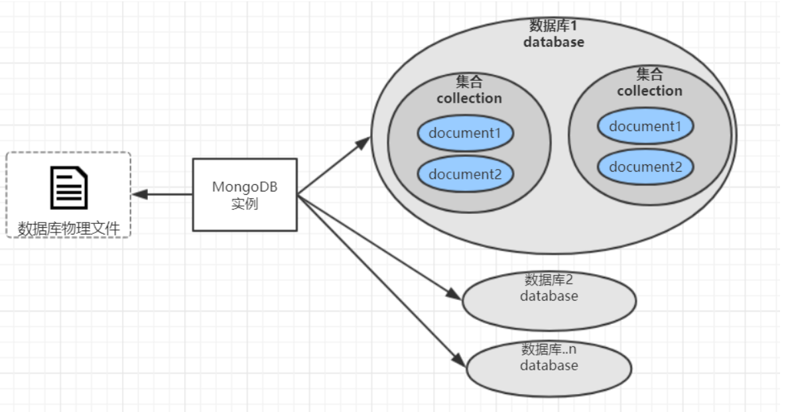 

为了更好的理解，下面与SQL中的概念进行对比：

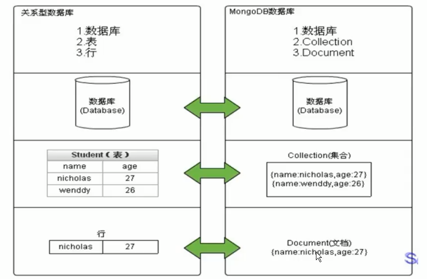 

| **RDBMS**                     | **MongoDB**                                     |
| ----------------------------- | ----------------------------------------------- |
| database(数据库)              | database（数据库）                              |
| table （表）                  | collection（ 集合）                             |
| row（ 行）                    | document（ BSON 文档）                          |
| column （列）                 | field （字段）                                  |
| index（唯一索引、主键索引）   | index （支持地理位置索引、全文索引 、哈希索引） |
| join （主外键关联）           | 表连接,MongoDB不支持                            |
| primary key(指定某个列做主键) | primary key (固定 `_id` 字段做为主键)           |

## MongoDB数据类型

| 数据类型     | 说明         | 解释说明                                       | Document举例          |
| ------------ | ------------ | ---------------------------------------------- | --------------------- |
| String       | 字符串       | UTF-8 编码的字符串才是合法的。                 | {key:"cba"}           |
| Integer      | 整型数值     | 根据你所采用的服务器，可分为32位或64位。       | {key:1}               |
| Boolean      | 布尔值       | 用于存储布尔值                                 | {key:true}            |
| Double       | 双精度浮点值 | 用于存储浮点值                                 | {key:3.14}            |
| **ObjectId** | 对象ID       | 用于创建文档的ID                               | {_id:new ObjectId()}  |
| Array        | 数组         | 用于将数组或列表或多个值存储为一个键           | {arr:["a","b"]}       |
| Timestamp    | 时间戳       | 从开始纪元开始的毫秒数                         | {ts: new Timestamp()} |
| Object       | 内嵌文档     | 文档可以作为文档中某个key的value               | {o:{foo:"bar"}}       |
| Null         | 空值         | 表示空值或者未定义的对象                       | {key:null}            |
| Date         | 格林尼治时间 | 日期时间，用Unix日期格式来存储当前日期或时间   | {birth:new Date()}    |
| Code         | 代码         | 可以包含JS代码                                 | {x:function(){}}      |
| File         | 文件         | 二进制转码(Base64)后 存储 (<16M)  GridFS(>16M) |                       |

## MongoDB安装

在课程资料的虚拟机中已经提供了MongoDB的镜像和容器，可以看到mongoDB已经启动，对外暴露了27017的操作端口     

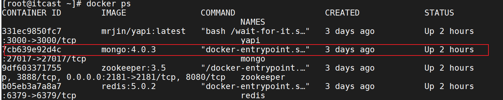 

## MongoDB客户端

> Robo 3T是MongoDB的客户端工具，在今天资料中提供了安装包，可以使用它来操作MongoDB。

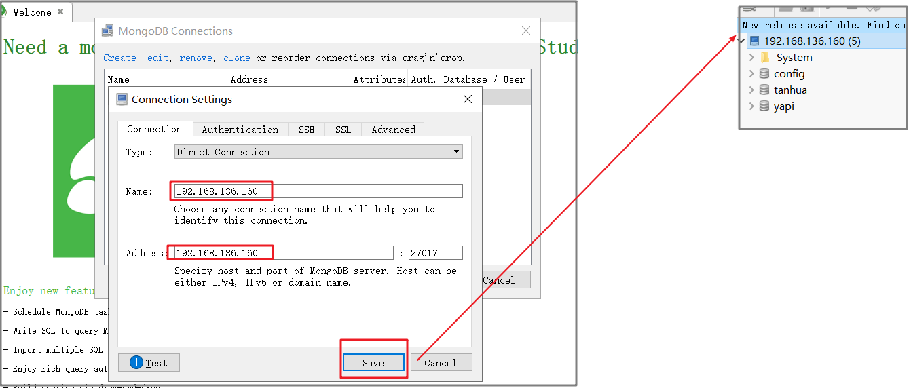 


# MongoDB命令(练习)

## 基本操作 (直接视图操作)

```shell
# 查看数据库
show dbs

# 切换数据库 如果没有对应的数据库则创建  (空库在视图中不显示)
use 数据库名

# 创建集合
db.createCollection("集合名")

# 查看集合
show collections

# 删除集合
db.集合名.drop()

# 删除当前数据库
db.dropDatabase()
```

## 新增数据

> 语法：

```shell
db.集合名.insert({json数据})
```

> 练习：

```shell
# 新增
db.user.insert({username:'zhangsan',age:18,address:'北京顺义'})
db.user.insert({username:'zhangsan',age:50,address:'北京大兴'})
db.user.insert({username:'lisi',age:30,address:'北京顺义'})
```

## 更新数据

> 语法：

```shell
db.集合名.update(
   <query>,  # 指定条件
   <update>, # 指定修改那个字段
   [
     upsert: <boolean>,
     multi: <boolean>
   ]
)
```

**参数说明：**

- **query** : update的查询条件，类似sql update查询内where后面的。

- **update** : update的对象和一些更新的操作符如：$set，也可以理解为sql update查询内set后面的

- **upsert** : （可选）这个参数的意思是，如果不存在要更新的记录，是否插入此条记录，true为插入，默认是false，不插入。

- **multi** : （可选）mongodb 默认是false，只更新找到的第一条记录，如果这个参数为true，就把按条件查出来多条记录全部更新。

> 练习：

```shell
# 查询全部
db.user.find()

# 更新一条满足条件的数据
db.user.update({username:'zhangsan'},{$set:{age:22}}) 
# 更新多条满足条件的数据
db.user.update({username:'zhangsan'},{$set:{age:22}},false,true) 

# 更新一个不存在的字段时，会新增
db.user.update({username:'zhangsan'},{$set:{sex:1}})

# 更新一条不存在的记录时，默认不会新增记录
db.user.update({username:'wangwu'},{$set:{sex:1}})
# 如果设置upsert参数为true，就是新增数据
db.user.update({username:'wangwu'},{$set:{sex:1}},true)
```

## 删除数据

> 语法：

```shell
db.集合名.remove(
   <query>,
   [
     justOne: <boolean>
   ]
)
```

**参数说明：**

- **query** :（可选）删除的文档的条件。
- **justOne** : （可选）如果设为 true ，则只删除一个文档，如果不设置该参数，或使用默认值 false，则删除所有匹配条件的文档。

> 练习

```shell
#删除所有数据
db.user.remove({})

#插入4条测试数据
db.user.insert({username:'zhangsan',age:18,address:'北京顺义'})
db.user.insert({username:'zhangsan',age:19,address:'北京顺义'})
db.user.insert({username:'zhangsan',age:20,address:'北京顺义'})
db.user.insert({username:'lisi',age:22,address:'北京顺义'})
db.user.insert({username:'wangwu',age:22,address:'北京顺义'})
db.user.insert({username:'zhaoliu',age:24,address:'北京顺义'})

# 按照条件删除1条
db.user.remove({username:'zhangsan'},true)
# 按照条件删除多条
db.user.remove({username:'zhangsan'},false)

#说明：为了简化操作，官方推荐使用deleteOne()与deleteMany()进行删除数据操作。
db.user.deleteOne({username:'zhangsan'}) # 按照条件删除1条
db.user.deleteMany({username:'zhangsan'})  # 按照条件删除多条
```

## 查询数据

> 语法：

```shell
db.集合.find(
	[query], 
	[fields]
).pretty()
```

**参数说明：**

- **query** ：可选，使用查询操作符指定查询条件
- **fields** ：可选，使用投影操作符指定返回的键。查询时返回文档中所有键值， 只需省略该参数即可（默认省略）。
- **pretty()**：可选， 该方法以格式化的方式来显示所有文档。

**条件查询：**

| 操作       | 格式                     | 范例                                           | RDBMS中的类似语句            |
| ---------- | ------------------------ | ---------------------------------------------- | ---------------------------- |
| 等于       | `{<key>:<value>}`        | `db.col.find({"likes":"黑马程序员"}).pretty()` | `where likes = '黑马程序员'` |
| 小于       | `{<key>:{$lt:<value>}}`  | `db.col.find({"likes":{$lt:50}}).pretty()`     | `where likes < 50`           |
| 小于或等于 | `{<key>:{$lte:<value>}}` | `db.col.find({"likes":{$lte:50}}).pretty()`    | `where likes <= 50`          |
| 大于       | `{<key>:{$gt:<value>}}`  | `db.col.find({"likes":{$gt:50}}).pretty()`     | `where likes > 50`           |
| 大于或等于 | `{<key>:{$gte:<value>}}` | `db.col.find({"likes":{$gte:50}}).pretty()`    | `where likes >= 50`          |
| 不等于     | `{<key>:{$ne:<value>}}`  | `db.col.find({"likes":{$ne:50}}).pretty()`     | `where likes != 50`          |

> 练习：

```shell
# 删除所有数据
db.user.remove({})

# 插入4条测试数据
db.user.insert({username:'zhangsan',age:18,address:'北京顺义'})
db.user.insert({username:'lisi',age:22,address:'北京顺义'})
db.user.insert({username:'wangwu',age:22,address:'北京顺义'})
db.user.insert({username:'zhaoliu',age:24,address:'北京顺义'})

db.user.find({})  # 查询全部数据 select * from user
db.user.find({},{username:true})  # 查询全部数据, 只显示username字段 select username from user
db.user.find({username:'zhangsan'}) # 查询username为zhangsan的数据  select * from user where username = 'zhangsan'
db.user.find({age:{$lte:21}}) # 查询小于等于21的数据
db.user.find({age:22, username:'wangwu'}) # and查询，age等于22并且username等于wangwu的数据

db.user.find().count()  # 查询数据条数
#分页查询：skip()起始索引，limit()每页显示一个数
db.user.find().skip(1).limit(2)  # 跳过1条数据，查询2条数据
db.user.find().sort({age:-1}) # 按照age倒序排序，-1为倒序，1为正序
```

## 创建索引

索引通常能够极大的提高查询的效率，如果没有索引，MongoDB在读取数据时必须扫描集合中的每个文件并选取那些符合查询条件的记录。

这种扫描全集合的查询效率是非常低的，特别在处理大量的数据时，查询可以要花费几十秒甚至几分钟，这对网站的性能是非常致命的。

索引是特殊的数据结构，索引存储在一个易于遍历读取的数据集合中，索引是对数据库表中一列或多列的值进行排序的一种结构。

```shell
# 插入1000条数据
for(var i=1;i<=1000;i++)db.user.insert({username:'name_'+i,age:10+i,address:'北京顺义'})

#创建索引
db.user.createIndex({'age':1})  #说明：1表示升序，-1表示降序。

#查看索引
db.user.getIndexes()
```


# MongoDB使用(重点)

## 创建模块

> 创建：`springboot-mongodb-demo`工程，并导入依赖

```xml
<parent>
    <groupId>org.springframework.boot</groupId>
    <artifactId>spring-boot-starter-parent</artifactId>
    <version>2.1.0.RELEASE</version>
</parent>

<dependencies>
    <dependency>
        <groupId>org.springframework.boot</groupId>
        <artifactId>spring-boot-starter-data-mongodb</artifactId>
    </dependency>
    <dependency>
        <groupId>org.projectlombok</groupId>
        <artifactId>lombok</artifactId>
        <version>1.18.10</version>
    </dependency>
    <dependency>
        <groupId>org.springframework.boot</groupId>
        <artifactId>spring-boot-starter-test</artifactId>
        <scope>test</scope>
    </dependency>
</dependencies>

<build>
    <plugins>
        <!-- 设置编译版本为1.8 -->
        <plugin>
            <groupId>org.apache.maven.plugins</groupId>
            <artifactId>maven-compiler-plugin</artifactId>
            <version>3.1</version>
            <configuration>
                <source>1.8</source>
                <target>1.8</target>
                <encoding>UTF-8</encoding>
            </configuration>
        </plugin>
    </plugins>
</build>
```

## 配置文件

> 编写application.yml配置文件

```yaml
spring:
  data:
    mongodb:
      uri: mongodb://192.168.136.160:27017/testdb
```

## 启动类

> 编写启动类

```java
package com.itheima;

import org.springframework.boot.SpringApplication;
import org.springframework.boot.autoconfigure.SpringBootApplication;

@SpringBootApplication
public class MongoApplication {
    public static void main(String[] args) {
        SpringApplication.run(MongoApplication.class, args);
    }
}
```

## 实体类

```java
package com.itheima.domain;

import lombok.AllArgsConstructor;
import lombok.Data;
import lombok.NoArgsConstructor;
import org.bson.types.ObjectId;
import org.springframework.data.mongodb.core.mapping.Document;

@Data
@AllArgsConstructor
@NoArgsConstructor
@Document(value="user") // 集合（表）名
public class User {
    private ObjectId id; // 主键
    private String username;
    private Integer age;
    private String address;
}
```

## CRUD操作

>**常见APi**
>
>~~~java
>// 新增或修改(不存在主键，新增； 存在主键，修改)  
>save(T object)
>
>// 条件修改，参数1：条件；  参数2：更新项； 参数3：操作对应的集合（可以是实体类，也可以直接写表名）
>updateFirst(Query query, Update update, Class<?> entityClass)// 修改一个
>updateMulti(Query query, Update update, Class<?> entityClass)// 修改符合条件的所有
>
>// 条件删除，参数1：条件；  参数2：操作对应的集合
>remove(Query query, Class<?> entityClass)
>
>// 查询    
>List<T> findAll(Class<T> entityClass)// 查询所有
>T findById(Object id, Class<T> entityClass)// 根据id查询
>List<T> find(Query query, Class<T> entityClass) // 条件查询
>
>// 排序 和 分页    
>Query query = new Query()
>.with(Sort.by(Sort.Order.desc("age"))) // 排序 
>.skip(0).limit(2); //分页  skip(从哪条记录查询).limit(查询多少条)   
>~~~

```java
package com.itheima;

import com.itheima.domain.User;
import org.bson.types.ObjectId;
import org.junit.Test;
import org.junit.runner.RunWith;
import org.springframework.beans.factory.annotation.Autowired;
import org.springframework.boot.test.context.SpringBootTest;
import org.springframework.data.domain.Sort;
import org.springframework.data.mongodb.core.MongoTemplate;
import org.springframework.data.mongodb.core.query.Criteria;
import org.springframework.data.mongodb.core.query.Query;
import org.springframework.data.mongodb.core.query.Update;
import org.springframework.test.context.junit4.SpringJUnit4ClassRunner;

import java.util.List;

@SpringBootTest
@RunWith(SpringJUnit4ClassRunner.class)
public class MongoTest {

    @Autowired
    private MongoTemplate mongoTemplate;

    //新增
    @Test
    public void testSave() {
        for (int i = 0; i < 10; i++) {
            User user = new User();
            //user.setId(new ObjectId("6010e9ff5098b224fc91a690"));
            user.setUsername("张三"+i);
            user.setAge(18+i);
            user.setAddress("北京顺义");

            mongoTemplate.save(user);
            //返回主键
            System.out.println(user.getId());
        }

    }

    //根据主键查询
    @Test
    public void findById() {
        User user = mongoTemplate.findById("6010e9ff5098b224fc91a690", User.class);
        System.out.println(user);
    }

    //查询所有
    @Test
    public void testFindAll() {
        List<User> userList = mongoTemplate.findAll(User.class);
        for (User user : userList) {
            System.out.println(user);
        }
    }

    //修改  update user set age=12,address="昌平" where username='' and age > 1
    @Test
    public void testUpdate() {
        //1. 设置更新条件 where
        Query query = new Query(
                Criteria.where("username").is("张三").and("age").gt(1)
        );

        //2. 设置要更新的字段 set
        Update update = new Update();
        update.set("age", 12);
        update.set("address", "北京昌平");

        //3. 执行更新
        mongoTemplate.updateFirst(query, update, User.class);
    }

    //删除 delete from user where age=12 and address="昌平"
    @Test
    public void testDelete() {
        //1. 设置删除条件 where
        Query query = new Query(
                Criteria.where("age").is(12).and("address").is("北京昌平")
        );

        //2. 执行更新
        mongoTemplate.remove(query, User.class);
    }

    //条件查询(分页 排序)
    @Test
    public void testFindByCondition() {
        //1. 设置查询条件 where
        Query query = new Query(
                Criteria.where("age").gt(19)
        ).with(Sort.by(Sort.Order.desc("age")))//order by age desc
         .skip(0).limit(3);//limit 0,3

        //2. 执行更新
        List<User> userList = mongoTemplate.find(query, User.class);
        for (User user : userList) {
            System.out.println(user);
        }
    }
}
```

