# 回顾

```markdown
1. 通用设置查询(  陌生人问题  和   通知  和  手机号)  Vo

2. 设置陌生人问题和通知(手机号 修改)

3. 黑名单查询和移除

4. 分页使用
	配置拦截器
	// 1. 创建Page对象，指定当前页和每页查询条数
	IPage page = new Page<>(当前页,每页个数);
	// 2. mapper查询
	page = mapper.selectPage(page,查询条件)

5. mongodb操作
```

~~~java
// 新增或修改(不存在主键，新增； 存在主键，修改)  
save(T object, String collectionName)

// 条件修改，参数1：条件；  参数2：更新项； 参数3：操作对应的集合（可以是实体类，也可以直接写表名）
updateFirst(Query query, Update update, Class<?> entityClass)// 修改一个
updateMulti(Query query, Update update, Class<?> entityClass)// 修改符合条件的所有

// 条件删除，参数1：条件；  参数2：操作对应的集合
remove(Query query, Class<?> entityClass)

// 查询    
List<T> findAll(Class<T> entityClass)// 查询所有
T findById(Object id, Class<T> entityClass)// 根据id查询
List<T> find(Query query, Class<T> entityClass) // 条件查询

// 排序 和 分页    
Query query = new Query()
	.with(Sort.by(Sort.Order.desc("age"),Sort.Order.asc("id"))) // 排序 
	.skip(0).limit(2); //分页  skip(从哪条记录查询).limit(查询多少条)   limit (pageNum-1)*pageSize,pageSize

//pageNum  pageSize
.skip((pageNum-1)*pageSize).limit(pageSize)
~~~


# 工程改造

## 工程结构改造图

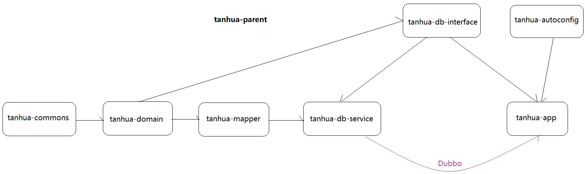

## 替换一个文件

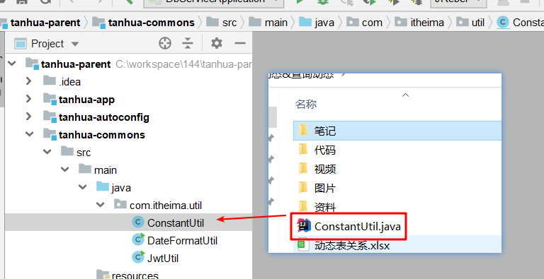 

## tanhua-domain

### 添加依赖

>在`tanhua-domain`模块中打开mongodb依赖的注释

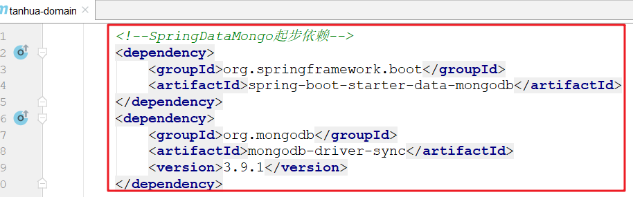 

### 添加实体类

>在`tanhua-domain`模块中加入mongo需要的实体类和vo类

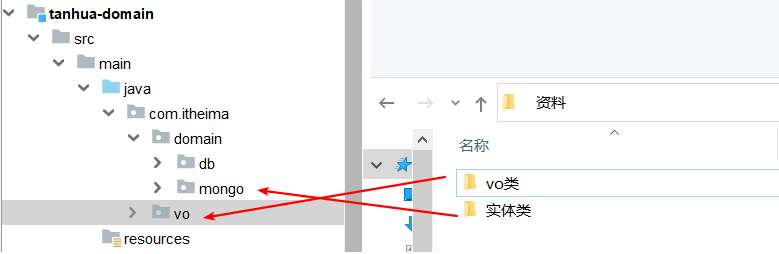 

## tanhua-mongo-interface

>创建`tanhua-mongo-interface`模块，用于声明mongo的业务接口

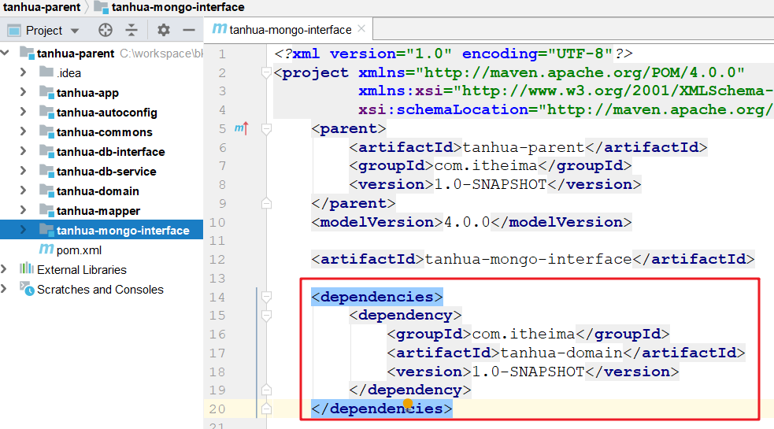 

## tanhua-mongo-service

>创建`tanhua-mongo-service`模块，用于编写mongo的业务类

### 创建模块添加依赖

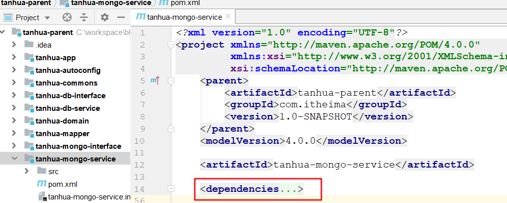 

~~~xml
<dependencies>
        <dependency>
            <groupId>com.itheima</groupId>
            <artifactId>tanhua-mongo-interface</artifactId>
            <version>1.0-SNAPSHOT</version>
        </dependency>
        <dependency>
            <groupId>org.springframework.boot</groupId>
            <artifactId>spring-boot-starter</artifactId>
        </dependency>
        <dependency>
            <groupId>com.fasterxml.jackson.core</groupId>
            <artifactId>jackson-databind</artifactId>
        </dependency>
        <dependency>
            <groupId>commons-codec</groupId>
            <artifactId>commons-codec</artifactId>
        </dependency>
        <dependency>
            <groupId>joda-time</groupId>
            <artifactId>joda-time</artifactId>
        </dependency>

        <!--dubbo的起步依赖-->
        <dependency>
            <groupId>org.apache.dubbo</groupId>
            <artifactId>dubbo-spring-boot-starter</artifactId>
            <version>2.7.5</version>
        </dependency>
        <!-- zookeeper的api管理依赖 -->
        <dependency>
            <groupId>org.apache.curator</groupId>
            <artifactId>curator-recipes</artifactId>
            <version>4.2.0</version>
        </dependency>
        <!-- zookeeper依赖 -->
        <dependency>
            <groupId>org.apache.zookeeper</groupId>
            <artifactId>zookeeper</artifactId>
            <version>3.4.12</version>
        </dependency>
    </dependencies>
~~~

### 创建启动类

>在`tanhua-mongo-service`模块中的创建`com.itheima.MongoServiceApplication`类，作为启动类

~~~java
package com.itheima;

import org.springframework.boot.SpringApplication;
import org.springframework.boot.autoconfigure.SpringBootApplication;

@SpringBootApplication
public class MongoServiceApplication {
    public static void main(String[] args) {
        SpringApplication.run(MongoServiceApplication.class,args);
    }
}
~~~

### 添加配置文件

>在`tanhua-mongo-service`模块中的`resources`文件夹下创建`application.yaml`, 添加如下内容

~~~yaml
# dubbo配置
dubbo:
  application:
    name: tanhua-mongo-service
  protocol:
    name: dubbo
    port: 20882
  registry:
    address: zookeeper://192.168.136.160:2181
  scan:
    base-packages: com.itheima.service

# mongo连接配置
spring:
  data:
    mongodb:
      uri: mongodb://192.168.136.160:27017/tanhua
~~~

## tanhua-app

>在`tanhua-app`模块中加入`tanhua-mongo-interface`依赖

~~~xml
<dependency>
    <groupId>com.itheima</groupId>
    <artifactId>tanhua-mongo-interface</artifactId>
    <version>1.0-SNAPSHOT</version>
</dependency>
~~~

## 启动依赖排除

>在`tanhua-app`和`tanhua-db-service`模块的启动类中分别排除mongo的自动装配
>
>~~~java
>@SpringBootApplication(exclude = MongoAutoConfiguration.class)
>~~~

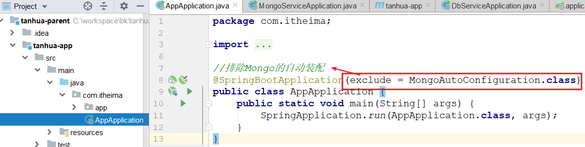 

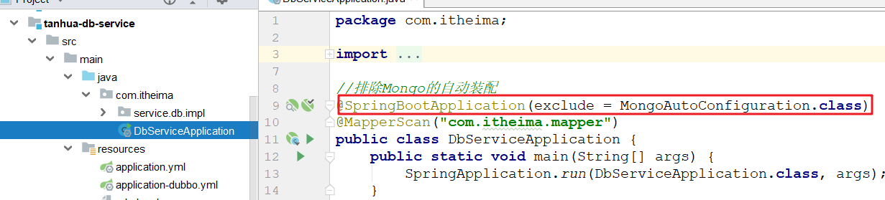 


#  发布动态(重点)

> 探花交友项目中的圈子功能，类似微信的朋友圈动态，基本的功能为：发布动态、查看动态以及对动态进行点赞、评论、喜欢。

## 表结构说明

~~~markdown
* 先思考一下，发布动态要做事情有哪些？
	1. 要将所发动态的内容记录下来
	2. 要将动态动态通知给好友（因为好友可以看到我的动态才对）
	
* 对于动态业务而言，主要是核心的4张表：
	动态详情表：记录了所有用户的发布的动态详细信息，如动态内容、图片地址等。
	个人动态表：是每个用户独立的，记录了该用户所发布动态的标识。
	好友表：    记录好友关系。
	好友动态表：是每个用户独立的，记录了该用户的所有好友发布动态的标识。
~~~

> **动态详情表：movement_detail**

~~~json
{
    "_id" : ObjectId("5fc78139368770421c0869f5"), //主键
    "pid" : NumberLong(10006), //大数据推荐id，要求是一个唯一的数字
    "userId" : NumberLong(99), //发布者id
    "textContent" : "好好学习，天天向上", //文本内容
    "medias":["http://xxxx/x/y/z.jpg"], //媒体数据，图片或小视频的访问地址
    "seeType":1, //谁可以看，1-公开，2-私密，3-部分可见，4-不给谁看
	"longitude":108.840974298098,//经度
	"latitude":34.2789316522934,//纬度
    "locationName":"上海市浦东区", //位置名称
 	"likeCount" : 0, //点赞人数
    "commentCount" : 0, //评论人数
    "loveCount" : 0, //喜欢人数
    "state" : 1, //发布状态 0 审核中  1 已发布  2 已驳回
    "created" : NumberLong(1606910265316) //发布时间
}
~~~

> **个人动态表：movement_mime_{userid}**

~~~json
{
    "_id":1, //主键
    "publishId": ObjectId("5fc78139368770421c0869f5"), //动态id
    "created":1568012791171 //发布时间
}
~~~

> **好友动态表：movement_friend_{userid}**

~~~json
{
    "_id" : ObjectId("5fc78139368770421c0869f5"),//主键id
    "publishId":1001, //动态id
    "userId":2, // 发布人id
    "created": NumberLong(1606910265316)//发布时间
}
~~~

> **好友表：friend**

~~~json
{
	"_id" : ObjectId("5fc307d8ad4b872488353d16"),//主键
    "userId" : NumberLong(99), //用户id
    "friendId" : NumberLong(1),//好友id
    "created" : NumberLong(1606617048129))//发布时间
}
~~~

==这是模拟的数据==

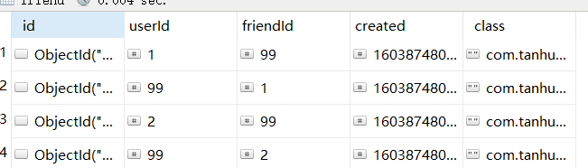 

~~~json
{
    "userId" : NumberLong(1),
    "friendId" : NumberLong(99),
    "created" : NumberLong(1603874806858),
    "_class" : "com.tanhua.domain.mongo.Friend"
}
{
    "userId" : NumberLong(99),
    "friendId" : NumberLong(1),
    "created" : NumberLong(1603874806858),
    "_class" : "com.tanhua.domain.mongo.Friend"
}
{
    "userId" : NumberLong(2),
    "friendId" : NumberLong(99),
    "created" : NumberLong(1603874806858),
    "_class" : "com.tanhua.domain.mongo.Friend"
}
{
    "userId" : NumberLong(99),
    "friendId" : NumberLong(2),
    "created" : NumberLong(1603874806858),
    "_class" : "com.tanhua.domain.mongo.Friend"
}
~~~

## 动态发布流程

~~~markdown
* 发布动态步骤:
     1. 向动态发布表写入动态信息, 拿到动态id
     2. 向我的动态表插入动态id
     3. 通过朋友关系表找到我的所有好友
     4. 向所有朋友的好友动态表插入动态id
~~~

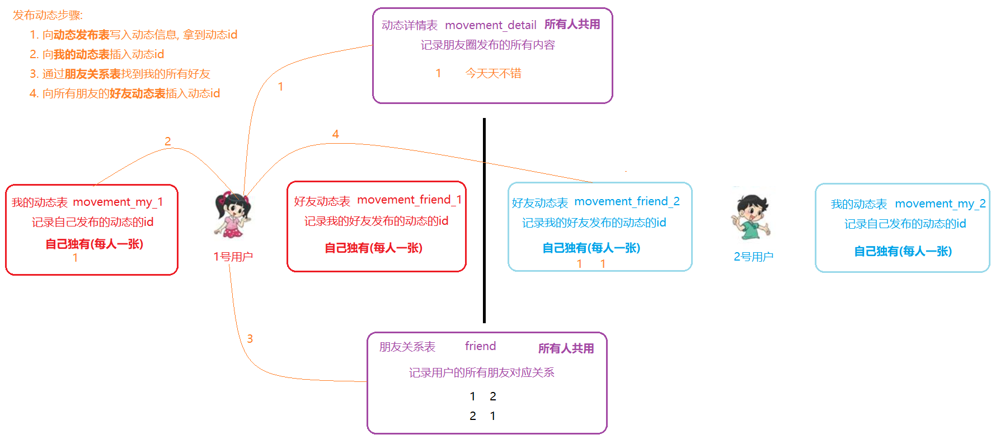

## 思路分析

>接口地址: https://mock-java.itheima.net/project/35/interface/api/701

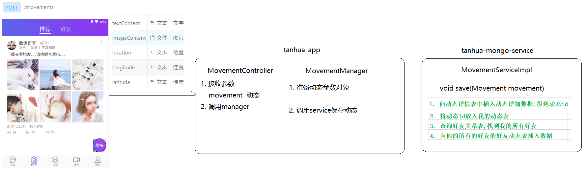 


~~~markdown
99号用户 发布消息


模拟好好友关系
99  1
1   99
99  2
2   99


~~~


## 代码实现

### MovementController

>在`tanhua-app`模块中创建` com.itheima.app.controller.MovementController`类

```java
package com.itheima.app.controller;

import com.itheima.app.manager.MovementManager;
import com.itheima.domain.mongo.Movement;
import org.springframework.beans.factory.annotation.Autowired;
import org.springframework.web.bind.annotation.PostMapping;
import org.springframework.web.bind.annotation.RestController;
import org.springframework.web.multipart.MultipartFile;

import java.io.IOException;

@RestController
public class MovementController {

    @Autowired
    private MovementManager movementManager;

    //注意: 这里的参数不能使用@RequestBody来接收
    @PostMapping("/movements")
    public void saveMovement(Movement movement, MultipartFile[] imageContent) throws IOException {
        //调用manager保存
        movementManager.saveMovement(movement, imageContent);
    }

}

```

### MovementManager

>在`tanhua-app`模块中创建` com.itheima.app.manager.MovementManager`类

~~~java
package com.itheima.app.manager;

import com.itheima.app.interceptor.UserHolder;
import com.itheima.autoconfig.oss.OssTemplate;
import com.itheima.domain.mongo.Movement;
import com.itheima.service.mongo.MovementService;
import org.apache.dubbo.config.annotation.Reference;
import org.springframework.beans.factory.annotation.Autowired;
import org.springframework.stereotype.Service;
import org.springframework.web.multipart.MultipartFile;

import java.io.IOException;
import java.util.ArrayList;
import java.util.List;

@Service
public class MovementManager {

    @Autowired
    private OssTemplate ossTemplate;

    @Reference
    private MovementService movementService;

    //保存动态
    public void saveMovement(Movement movement, MultipartFile[] imageContent) throws IOException {
        //1. 获取到用户信息
        Long userId = UserHolder.getUser().getId();

        //2. 封装保存的动态对象
        movement.setUserId(userId);//用户id
        movement.setPid(1L);//todo 暂时写死
        movement.setState(1);//todo 暂时写死
        movement.setCreated(System.currentTimeMillis());//创建时间(当前时间毫秒数)
        movement.setSeeType(1);//todo 公开
        // 阿里云文件上传
        List<String> files = new ArrayList<>();
        if (imageContent != null && imageContent.length > 0) {
            for (MultipartFile multipartFile : imageContent) {
                String filePath = ossTemplate.upload(multipartFile.getOriginalFilename(), multipartFile.getInputStream());
                files.add(filePath);
            }
        }
        movement.setMedias(files);

        //3. 执行动态保存
        movementService.save(movement);
    }
}

~~~

###  MovementService

>在`tanhua-mongo-interface`模块中创建` com.itheima.service.mongo.MovementService`类

```java
package com.itheima.service.mongo;

import com.itheima.domain.mongo.Movement;

public interface MovementService {
    //保存动态
    void save(Movement movement);
}

```

###  MovementServiceImpl

>在`tanhua-mongo-service`模块中创建`com.itheima.service.mongo.impl.MovementServiceImpl`类

~~~java
package com.itheima.service.mongo.impl;

import cn.hutool.core.collection.CollectionUtil;
import com.itheima.domain.mongo.Friend;
import com.itheima.domain.mongo.FriendMovement;
import com.itheima.domain.mongo.Movement;
import com.itheima.domain.mongo.MyMovement;
import com.itheima.service.mongo.MovementService;
import com.itheima.util.ConstantUtil;
import org.apache.dubbo.config.annotation.Service;
import org.bson.types.ObjectId;
import org.springframework.beans.factory.annotation.Autowired;
import org.springframework.data.mongodb.core.MongoTemplate;
import org.springframework.data.mongodb.core.query.Criteria;
import org.springframework.data.mongodb.core.query.Query;

import java.util.List;

@Service
public class MovementServiceImpl implements MovementService {
    @Autowired
    private MongoTemplate mongoTemplate;

    @Override
    public void save(Movement movement) {
        //1. 向动态详情表插入动态数据,得到id
        mongoTemplate.save(movement);
        ObjectId movementId = movement.getId();//动态id

        //2. 将动态id保存到我的动态表
        MyMovement myMovement = new MyMovement();
        myMovement.setPublishId(movementId);
        myMovement.setCreated(System.currentTimeMillis());
        mongoTemplate.save(myMovement, ConstantUtil.MOVEMENT_MINE + movement.getUserId());

        //3. 查询好友关系表,得到所有的好友
        Query query = new Query(
                Criteria.where("userId").is(movement.getUserId())
        );
        List<Friend> friendList = mongoTemplate.find(query, Friend.class);

        //4. 遍历所有好友,向他们的好友关系表中插入动态id
        if (CollectionUtil.isNotEmpty(friendList)) {
            for (Friend friend : friendList) {
                Long friendId = friend.getFriendId();//好友的id

                FriendMovement friendMovement = new FriendMovement();
                friendMovement.setUserId(movement.getUserId());//动态发布者的id
                friendMovement.setPublishId(movementId);//动态id
                friendMovement.setCreated(System.currentTimeMillis());//时间

                //保存
                mongoTemplate.save(friendMovement, ConstantUtil.MOVEMENT_FRIEND + friendId);
            }
        }
    }
}
~~~

## 全局唯一id设置

后期动态数据会涉及到大数据分析和智能推荐功能，要求每个动态有一个数值类型的唯一标识，但是mongoDB默认的`_id`主键并不符合规则

所以我们在保存动态时，需要再单独指定一个`pid` 作为大数据的主键

我们可以在mongoDB中模拟mysql的自增器，在保存动态时通过自增器指定`pid`的值

> 模拟自增器的表  sequence

```json
{
    "_id" : ObjectId("5fb8d0017ebff00d3089c6e8"),
    "collName" : "movement", // 自增id所属表
    "seqId" : 20007 // 自增id
}
```

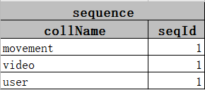 

> 在`tanhua-mongo-service`模块的`com.itheima.service.mongo.impl`包下复制以下自增器服务类：

```java
package com.itheima.service.mongo.impl;

import com.itheima.domain.mongo.Sequence;
import org.springframework.beans.factory.annotation.Autowired;
import org.springframework.data.mongodb.core.FindAndModifyOptions;
import org.springframework.data.mongodb.core.MongoTemplate;
import org.springframework.data.mongodb.core.query.Criteria;
import org.springframework.data.mongodb.core.query.Query;
import org.springframework.data.mongodb.core.query.Update;
import org.springframework.stereotype.Component;

// pid字段自增服务
@Component
public class IdService {

    @Autowired
    private MongoTemplate mongoTemplate;

    public Long getNextId(String collName) {
        //查询条件
        Query query = new Query(Criteria.where("collName").is(collName));

        //更新条件
        Update update = new Update();
        update.inc("seqId", 1);

        FindAndModifyOptions options = new FindAndModifyOptions();
        options.upsert(true); // 如果记录不存在，创建
        options.returnNew(true); // 返回新增后的值

        Sequence sequence = mongoTemplate.findAndModify(query, update, options, Sequence.class);
        return sequence.getSeqId();
    }
}
```

> 修改设置Pid的代码

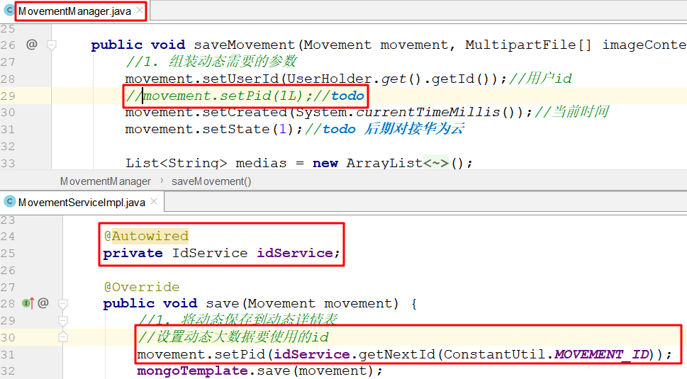 


# 查看自己发布的动态(重点)

## 业务需求

> 用户点击我的动态，根据userId查看自己的个人动态表即可获取到自己的动态信息
>
> 接口地址: https://mock-java.itheima.net/project/35/interface/api/689

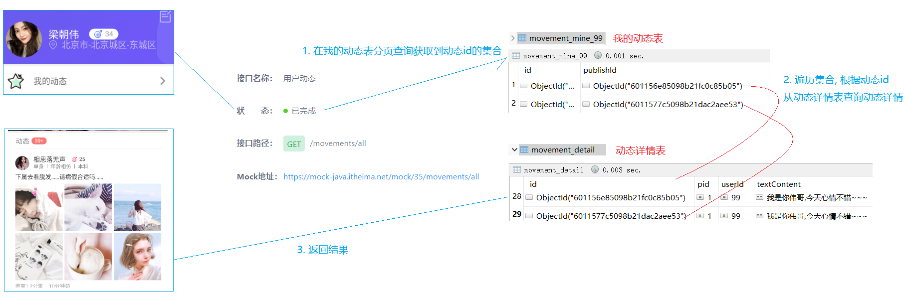 

##  思路分析

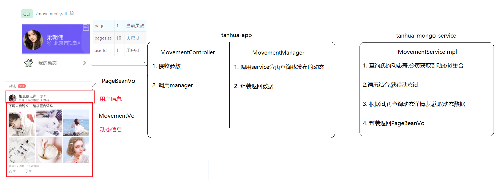  

## 代码实现

### MovementController

~~~java
    //查询我的动态
    @GetMapping("/movements/all")
    public PageBeanVo findMyMovement(Long userId,
                                     @RequestParam(value = "page", defaultValue = "1") Integer pageNum,
                                     @RequestParam(value = "pagesize", defaultValue = "10") Integer pageSize) {
        return movementManager.findMyMovement(userId, pageNum, pageSize);
    }
~~~

### MovementManager

~~~java
    //查询我的动态
    public PageBeanVo findMyMovement(Long userId, Integer pageNum, Integer pageSize) {
        //1. 调用service分页查询
        PageBeanVo pageBeanVo = movementService.findMyMovement(userId, pageNum, pageSize);

        //2. 组装返回数据
        //2-1 获取到返回值中的movement列表
        List<Movement> movementList = (List<Movement>) pageBeanVo.getItems();
        List<MovementVo> movementVoList = new ArrayList<>();//临时集合

        if (CollectionUtil.isNotEmpty(movementList)) {
            for (Movement movement : movementList) {
                //2-2 创建movementVo,来封装前端需要的返回值对象中的集合部分
                MovementVo movementVo = new MovementVo();

                //2-3 设置movementVo中动态发布者的信息
                UserInfo userInfo = userInfoService.findById(movement.getUserId());//根据动态发布人id查询其详细信息
                BeanUtils.copyProperties(userInfo, movementVo);//复制了头像 昵称 性别  年龄
                if (StringUtils.isNotEmpty(userInfo.getTags())) {
                    movementVo.setTags(userInfo.getTags().split(","));
                }

                //2-4 设置movementVo中动态的信息
                BeanUtils.copyProperties(movement, movementVo);//复制了用户id 文字动态 点赞  喜欢 评论数
                if (CollectionUtil.isNotEmpty(movement.getMedias())) {
                    movementVo.setImageContent(movement.getMedias().toArray(new String[]{}));
                }
                movementVo.setDistance("10公里");//todo 百度地图之后再处理
                movementVo.setCreateDate(DateFormatUtil.format(new Date(movement.getCreated())));

                //2-5 将movementVo放入临时集合
                movementVoList.add(movementVo);
            }
        }

        //3 替换分页对象中的items(List<Movement>---->List<MovementVo>)
        pageBeanVo.setItems(movementVoList);

        //4 返回结果
        return pageBeanVo;
    }
~~~

### MovementService

~~~java
    //分页查询我的动态
    PageBeanVo findMyMovement(Long userId, Integer pageNum, Integer pageSize);
~~~

### MovementServiceImpl

~~~java
    @Override
    public PageBeanVo findMyMovement(Long userId, Integer pageNum, Integer pageSize) {
        //1. 从我的动态表中分页查询动态id集合
        Query query = new Query()
                .with(Sort.by(Sort.Order.desc("created")))//时间倒序
                .skip((pageNum - 1) * pageSize).limit(pageSize);
        List<MyMovement> myMovementList = mongoTemplate.find(query, MyMovement.class, ConstantUtil.MOVEMENT_MINE + userId);


        //2. 遍历动态id的集合,得到动态id
        List<Movement> movementList = new ArrayList<>();
        if (CollectionUtil.isNotEmpty(myMovementList)) {
            for (MyMovement myMovement : myMovementList) {
                //3. 根据动态id查询动态详情
                ObjectId movementId = myMovement.getPublishId();//动态id
                Movement movement = mongoTemplate.findById(movementId, Movement.class);//根据动态id获取动态详情对象
                if (movement.getState() == 1) {
                    movementList.add(movement);
                }
            }
        }

        //4. 查询总记录数
        //select * from
        //select count(*) from
        long count = mongoTemplate.count(query, MyMovement.class, ConstantUtil.MOVEMENT_MINE + userId);

        //5. 组装返回结果
        return new PageBeanVo(pageNum, pageSize, count, movementList);
    }
~~~


# 查看好友发布的动态(重点)

## 业务需求

>用户在圈子中点击好友，就可以查看好友发布的动态，
>
>由于我的所有好友在发布动态的时候，都会向我的  好友动态表（movement_friend_{id}）  中插入数据，因此只需要查询这个表即可
>
>接口地址: https://mock-java.itheima.net/project/35/interface/api/683

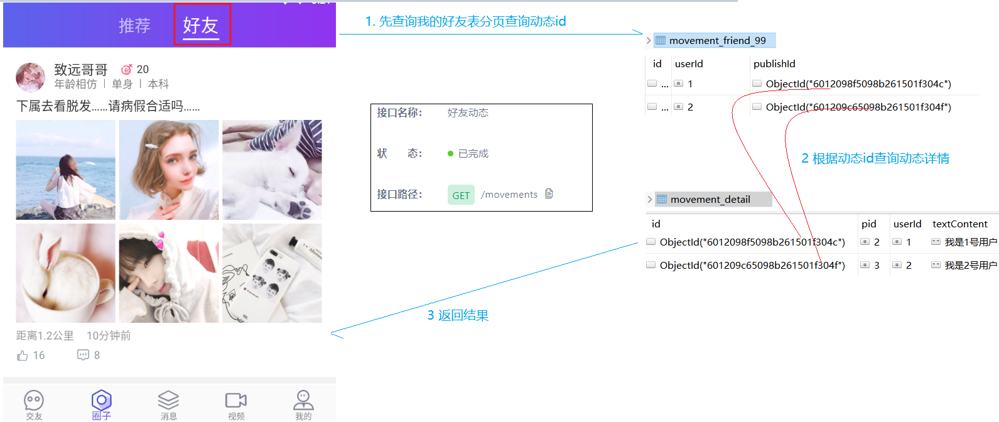  

## 思路分析 

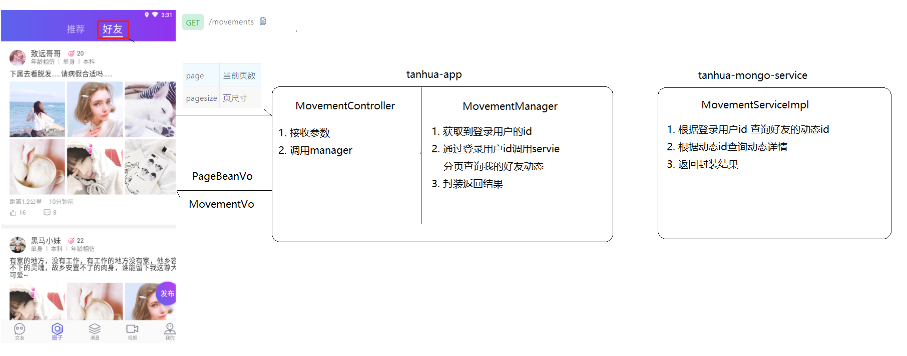 

## 代码实现

### MovementController

```java
    //查询我的好友动态
    @GetMapping("/movements")
    public PageBeanVo findFriendMovement(
            @RequestParam(value = "page", defaultValue = "1") Integer pageNum,
            @RequestParam(value = "pagesize", defaultValue = "10") Integer pageSize) {
        return movementManager.findFriendMovement(pageNum, pageSize);
    }
```

### MovementManager

~~~java
//查询我的好友动态
    public PageBeanVo findFriendMovement(Integer pageNum, Integer pageSize) {
        //1. 获取登录用户的id
        Long userId = UserHolder.getUser().getId();

        //2. 调用service分页查询好友的动态
        PageBeanVo pageBeanVo = movementService.findFriendMovement(userId, pageNum, pageSize);

        //2. 组装返回数据
        //2-1 获取到返回值中的movement列表
        List<Movement> movementList = (List<Movement>) pageBeanVo.getItems();
        List<MovementVo> movementVoList = new ArrayList<>();//临时集合

        if (CollectionUtil.isNotEmpty(movementList)) {
            for (Movement movement : movementList) {
                //2-2 创建movementVo,来封装前端需要的返回值对象中的集合部分
                MovementVo movementVo = new MovementVo();

                //2-3 设置movementVo中动态发布者的信息
                UserInfo userInfo = userInfoService.findById(movement.getUserId());//根据动态发布人id查询其详细信息
                movementVo.setUserInfo(userInfo);

                //2-4 设置movementVo中动态的信息
                movementVo.setMovement(movement);

                //2-5 将movementVo放入临时集合
                movementVoList.add(movementVo);
            }
        }

        //3 替换分页对象中的items(List<Movement>---->List<MovementVo>)
        pageBeanVo.setItems(movementVoList);

        //4 返回结果
        return pageBeanVo;
    }
~~~

### MovementService

```java
    //分页查询我的好友动态
    PageBeanVo findFriendMovement(Long userId, Integer pageNum, Integer pageSize);
```

### MovementServiceImpl

```java
    @Override
    public PageBeanVo findFriendMovement(Long userId, Integer pageNum, Integer pageSize) {
        //1. 从我的好友表中分页查询到动态的id集合
        Query query = new Query()
                .with(Sort.by(Sort.Order.desc("created")))//时间倒序
                .skip((pageNum - 1) * pageSize).limit(pageSize);
        List<FriendMovement> friendMovementList
                = mongoTemplate.find(query, FriendMovement.class, ConstantUtil.MOVEMENT_FRIEND + userId);//好友动态列表

        //2. 遍历id集合,获取动态详情
        List<Movement> movementList = new ArrayList<>();
        if (CollectionUtil.isNotEmpty(friendMovementList)){
            for (FriendMovement friendMovement : friendMovementList) {
                ObjectId movementId = friendMovement.getPublishId();//动态id
                Movement movement = mongoTemplate.findById(movementId, Movement.class);//根据动态id获取动态详情对象
                if (movement.getState() == 1) {
                    movementList.add(movement);
                }
            }
        }

        //3. 查询总记录数
        long count = mongoTemplate.count(query, FriendMovement.class, ConstantUtil.MOVEMENT_FRIEND + userId);

        //4. 组装返回结果
        return new PageBeanVo(pageNum,pageSize,count,movementList);
    }
```

