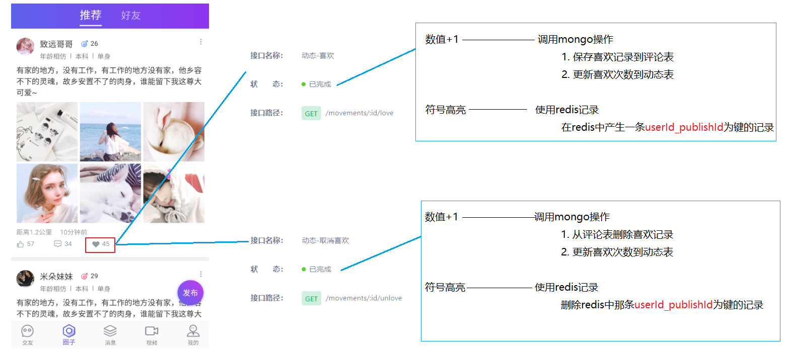

# 回顾

```markdown
1. 动态发布过程

2. 查询我的动态

3. 查询好友动态
```


# 查看推荐给我的动态(简单)

## 业务需求

> 推荐动态是通过推荐系统计算出的结果，现在我们只需要实现查询即可，推荐系统在后面的课程中完成。
>
> 接口文档地址: https://mock-java.itheima.net/project/35/interface/api/677

 

>**动态推荐表 recommend_movement**

```json
{
    "_id" : ObjectId("5fc36a7cad4b874ddcf5c67d"), // 主键id
    "pid" : NumberLong(10015), // 大数据推荐id
    "publishId" : ObjectId("5e82dc416401952928c211dd"), // 动态id
    "userId" : NumberLong(99), // 被推荐用户id
    "score" : 81.7874087521895, // 推荐分数
    "created" : NumberLong(1606642300024), // 创建时间
}
```

## 思路分析

 

## 代码实现

### MovementController

~~~java
    //查询推荐给我的动态
    @GetMapping("/movements/recommend")
    public PageBeanVo findRecommendMovement(
            @RequestParam(value = "page", defaultValue = "1") Integer pageNum,
            @RequestParam(value = "pagesize", defaultValue = "10") Integer pageSize) {
        return movementManager.findRecommendMovement(pageNum, pageSize);
    }
~~~

### MovementManager

~~~java
    //查询推荐给我的动态
    public PageBeanVo findRecommendMovement(Integer pageNum, Integer pageSize) {
        //1. 获取登录用户id
        Long userId = UserHolder.getUser().getId();

        //2. 根据登录用户id分页查询推荐动态
        PageBeanVo pageBeanVo = movementService.findRecommendMovement(userId,pageNum,pageSize);

        //3. 封装返回对象
        //3-1 获取到返回值中的movement列表
        List<Movement> movementList = (List<Movement>) pageBeanVo.getItems();
        List<MovementVo> movementVoList = new ArrayList<>();//临时集合

        if (CollectionUtil.isNotEmpty(movementList)) {
            for (Movement movement : movementList) {
                //3-2 创建movementVo,来封装前端需要的返回值对象中的集合部分
                MovementVo movementVo = new MovementVo();

                //3-3 设置movementVo中动态发布者的信息
                UserInfo userInfo = userInfoService.findById(movement.getUserId());//根据动态发布人id查询其详细信息
                movementVo.setUserInfo(userInfo);

                //3-4 设置movementVo中动态的信息
                movementVo.setMovement(movement);

                //3-5 将movementVo放入临时集合
                movementVoList.add(movementVo);
            }
        }

        //4 替换分页对象中的items(List<Movement>---->List<MovementVo>)
        pageBeanVo.setItems(movementVoList);

        //5 返回结果
        return pageBeanVo;
    }
~~~

### MovementService

```java
	//分页查询推荐给我的动态
    PageBeanVo findRecommendMovement(Long userId, Integer pageNum, Integer pageSize);
```

### MovementServiceImpl

```java
    @Override
    public PageBeanVo findRecommendMovement(Long userId, Integer pageNum, Integer pageSize) {
        //1. 从推荐动态表根据登录用户id分页查询推荐动态集合
        Query query = new Query(
                Criteria.where("userId").is(userId)
        ).with(Sort.by(Sort.Order.desc("score"), Sort.Order.desc("created")))//按照推荐分数 发布时间倒序排
                .skip((pageNum - 1) * pageSize).limit(pageSize);

        List<RecommendMovement> recommendMovementList = mongoTemplate.find(query, RecommendMovement.class);

        //2. 遍历集合获取到动态id
        List<Movement> movementList = new ArrayList<>();
        if (CollectionUtil.isNotEmpty(recommendMovementList)){
            for (RecommendMovement recommendMovement : recommendMovementList) {
                //3. 根据动态id查询动态详情
                ObjectId movementId = recommendMovement.getPublishId();//动态id
                Movement movement = mongoTemplate.findById(movementId, Movement.class);//根据动态id获取动态详情对象
                if (movement.getState() == 1) {
                    movementList.add(movement);
                }
            }
        }

        //4. 统计数量
        long count = mongoTemplate.count(query, RecommendMovement.class);

        //5. 组装返回结果
        return new PageBeanVo(pageNum,pageSize,count,movementList);
    }
```

### 添加推荐测试数据

> 在tanhua-service模块下创建`com.itheima.test.RecommendMovementTest`测试类，添加推荐用户测试数据
>
> 注意：运行提供者测试代码，必须先关闭tanhua-service服务;测试完删除本代码

```java
@RunWith(SpringRunner.class)
@SpringBootTest
public class RecommendMovementTest {

    @Autowired
    private MongoTemplate mongoTemplate;

    @Autowired
    private IdService idService;

    // 添加推荐动态测试数据
    @Test
    public void test01() throws Exception {
        Query query = new Query().skip(0).limit(5);
        List<Movement> movementList = mongoTemplate.find(query, Movement.class);

        for (int i = 0; i < 5; i++) {
            RecommendMovement recommendMovement = new RecommendMovement();
            recommendMovement.setCreated(System.currentTimeMillis());
            recommendMovement.setUserId(99L);//推荐给99
            recommendMovement.setPid(idService.getNextId(ConstantUtil.RECOMMEND_MOVEMENT_ID));
            recommendMovement.setScore(RandomUtil.randomDouble(70, 99));
            recommendMovement.setPublishId(movementList.get(i).getId());
            mongoTemplate.save(recommendMovement);
        }
    }
}
```

==注意修改下动态表中前五条数据的state=1==

# 动态点赞/喜欢/评论

## 业务说明

>在圈子发布的动态，我们可以对动态进行一些评论操作，主要有点赞、语言评论、喜欢

 

> 这些操作的信息主要保存在下面两张表中
>
> ​	movement  动态表， 每进行一次操作，对应动态的对应操作次数就会加1（或者减1）
>
> ​	comment    评论表， 每进行一次操作，这张表中就会增加（或者减少）一条记录

~~~json
//comment    评论表
{
    "_id" : ObjectId("5fc78139368770421c0869f5"), //主键
    "created" : NumberLong(1606617048129), // 时间
    "commentType":1, // 操作类型:  1-点赞，2-评论， 3-喜欢
    "pubType" : 1, // 操作对象: 1-对动态操作   2-对视频操作   3-对评论操作
    "publishId": "5e82dc3e6401952928c211a3", // 操作对象id
    "publishUserId" : NumberLong(1), //  操作对象所属用户id
    "content": "给力！", // 评论内容, 仅仅操作类型为评论时使用
    "userId" : NumberLong(99), // 操作人id
    
    "isParent":false, // 是否为父节点，默认是否
    "parentId":1001,  // 父节点id
	"likeCount" : 0,  // 对评论点赞的人数
}
~~~

~~~json
// 动态表  movement
{
    "_id" : ObjectId("5e82dc3e6401952928c211a3"),
    //.......省略很多
    "loveCount" : 1, // 被喜欢次数
    "likeCount" : 2, // 被点赞次数
    "commentCount" : 2, // 被评论次数
}
~~~

## 业务实现

实现对动态的==添加==或者==取消==(评论  点赞  喜欢)

### CommentService

>在`tanhua-mongo-interface`模块中创建`com.itheima.service.mongo.CommentService`

~~~java
package com.itheima.service.mongo;

import com.itheima.domain.mongo.Comment;

public interface CommentService {

    //对动态添加评论(点赞 喜欢 语言评论)----返回值就是操作之后的数量
    Integer saveMovementComment(Comment comment);

    //对动态取消评论(点赞 喜欢 语言评论)----返回值就是操作之后的数量
    Integer deleteMovementComment(Comment comment);
}

~~~

### CommentServiceImpl

>在`tanhua-mongo-service`模块中创建`com.itheima.service.mongo.impl.CommentServiceImpl`

~~~java
package com.itheima.service.mongo.impl;

import com.itheima.domain.mongo.Comment;
import com.itheima.domain.mongo.Movement;
import com.itheima.service.mongo.CommentService;
import org.apache.dubbo.config.annotation.Service;
import org.springframework.beans.factory.annotation.Autowired;
import org.springframework.data.mongodb.core.MongoTemplate;
import org.springframework.data.mongodb.core.query.Criteria;
import org.springframework.data.mongodb.core.query.Query;
import org.springframework.data.mongodb.core.query.Update;


@Service
public class CommentServiceImpl implements CommentService {

    @Autowired
    private MongoTemplate mongoTemplate;

    //动态id  操作类型  操作人  评论内容
    @Override
    public Integer saveMovementComment(Comment comment) {
        //1. 向评论表添加数据
        comment.setCreated(System.currentTimeMillis());//创建时间
        comment.setPubType(1);//对动态进行操作
        comment.setPublishUserId(mongoTemplate.findById(comment.getPublishId(), Movement.class).getUserId());//动态所属用户id
        mongoTemplate.save(comment);//评论保存

        //2. 改变动态表中的被评论动态的对应操作的数量
        //2-1 使用动态id作为查询条件
        Query query = new Query(Criteria.where("id").is(comment.getPublishId()));

        //2-2 组装更新字段
        Update update = new Update();
        if (comment.getCommentType() == 1) {//点赞操作
            update.inc("likeCount", 1);//set likeCount = likeCount + 1 where id =?
        } else if (comment.getCommentType() == 2) {//评论操作
            update.inc("commentCount", 1);
        } else {
            update.inc("loveCount", 1);
        }
        //2-3 执行更新操作
        mongoTemplate.updateFirst(query, update, Movement.class);//update movement set likeCount = likeCount + 1 where id =?

        //3 返回操作类型对应的次数
        Movement movement = mongoTemplate.findById(comment.getPublishId(), Movement.class);
        if (comment.getCommentType() == 1) {//点赞操作
            return movement.getLikeCount();
        } else if (comment.getCommentType() == 2) {//评论操作
            return movement.getCommentCount();
        } else {
            return movement.getLoveCount();
        }
    }


    @Override
    public Integer deleteMovementComment(Comment comment) {

        //1. 从评论表删除数据
        Query query1 = new Query(
                Criteria.where("userId").is(comment.getUserId())
                        .and("publishId").is(comment.getPublishId())
                        .and("commentType").is(comment.getCommentType())
        );
        mongoTemplate.remove(query1,Comment.class);//评论删除

        //2. 改变动态表中的被评论动态的对应操作的数量
        //2-1 使用动态id作为查询条件
        Query query = new Query(Criteria.where("id").is(comment.getPublishId()));

        //2-2 组装更新字段
        Update update = new Update();
        if (comment.getCommentType() == 1) {//点赞操作
            update.inc("likeCount", -1);//set likeCount = likeCount - 1 where id =?
        } else if (comment.getCommentType() == 2) {//评论操作
            update.inc("commentCount", -1);
        } else {
            update.inc("loveCount", -1);
        }
        //2-3 执行更新操作
        mongoTemplate.updateFirst(query, update, Movement.class);//update movement set likeCount = likeCount - 1 where id =?

        //3 返回操作类型对应的次数
        Movement movement = mongoTemplate.findById(comment.getPublishId(), Movement.class);
        if (comment.getCommentType() == 1) {//点赞操作
            return movement.getLikeCount();
        } else if (comment.getCommentType() == 2) {//评论操作
            return movement.getCommentCount();
        } else {
            return movement.getLoveCount();
        }
    }
}
~~~


## 动态点赞/取消点赞

### 业务需求

> 在推荐和好友的动态中，可以针对某个动态进行点赞(取消点赞)操作，接口地址
>
> ​	点赞:  https://mock-java.itheima.net/project/35/interface/api/707
>
> ​	动态点赞:  https://mock-java.itheima.net/project/35/interface/api/713

 

### 思路分析

 

### MovementController

~~~java
    //对动态进行点赞
    @GetMapping("/movements/{id}/like")
    public Integer movementLike(@PathVariable("id") String movementId) {
        return movementManager.movementLike(movementId);
    }


    //对动态进行取消点赞
    @GetMapping("/movements/{id}/dislike")
    public Integer movementDislike(@PathVariable("id") String movementId) {
        return movementManager.movementDislike(movementId);
    }
~~~

### MovementManager

~~~java
    //对动态进行点赞
    public Integer movementLike(String movementId) {
        //1. 组装comment对象
        Comment comment = new Comment();
        comment.setPublishId(new ObjectId(movementId));//动态id
        comment.setCommentType(1);//点赞
        comment.setUserId(UserHolder.getUser().getId());//操作人id

        //2. 调用service完成点赞
        Integer count = commentService.saveMovementComment(comment);

        //3. 向redis中记录点赞操作
        //stringRedisTemplate.opsForValue().set("movement_like:" + UserHolder.getUser().getId() + "_" + movementId, "1");
        //stringRedisTemplate.opsForValue().set(StrUtil.format("movement_like:{}_{}", UserHolder.getUser().getId(), movementId), "1");
        stringRedisTemplate.opsForValue().set(StrUtil.format(ConstantUtil.MOVEMENT_LIKE, UserHolder.getUser().getId(), movementId), "1");

        return count;
    }


    //对动态进行取消点赞
    public Integer movementDislike(String movementId) {
        //1. 组装comment对象
        Comment comment = new Comment();
        comment.setPublishId(new ObjectId(movementId));//动态id
        comment.setCommentType(1);//点赞
        comment.setUserId(UserHolder.getUser().getId());//操作人id

        //2. 调用service完成取消点赞
        Integer count = commentService.deleteMovementComment(comment);

        //3. 向redis中删除点赞操作
        stringRedisTemplate.delete(StrUtil.format(ConstantUtil.MOVEMENT_LIKE, UserHolder.getUser().getId(), movementId));

        return count;
    }
~~~

### 调整点赞显示

>在` findFriendMovement和findRecommendMovement方法中`修改好友动态和推荐动态中的点赞符号显示 
>

~~~java
//设置是否已经点赞
if (stringRedisTemplate.hasKey(StrUtil.format(ConstantUtil.MOVEMENT_LIKE, userId, movement.getId()))) {
    movementVo.setHasLiked(1); //点赞
} else {
    movementVo.setHasLiked(0); //未点赞
}
~~~

 

## 动态喜欢/取消喜欢

### 业务需求

> 在推荐动态中，可以针对某个动态进行喜欢(取消喜欢)操作，接口地址
>
> ​	点赞:  https://mock-java.itheima.net/project/35/interface/api/719
>
> ​	动态点赞:  https://mock-java.itheima.net/project/35/interface/api/725

 

### 思路分析

 

###  MovementController

```java
    //对动态进行喜欢
    @GetMapping("/movements/{id}/love")
    public Integer movementLove(@PathVariable("id") String movementId) {
        return movementManager.movementLove(movementId);
    }


    //对动态进行取消喜欢
    @GetMapping("/movements/{id}/unlove")
    public Integer movementUnlove(@PathVariable("id") String movementId) {
        return movementManager.movementUnlove(movementId);
    }
```

### MovementManager

~~~java
    //对动态进行喜欢
    public Integer movementLove(String movementId) {
        //1. 组装comment对象
        Comment comment = new Comment();
        comment.setPublishId(new ObjectId(movementId));//动态id
        comment.setCommentType(3);//喜欢
        comment.setUserId(UserHolder.getUser().getId());//操作人id

        //2. 调用service完成喜欢
        Integer count = commentService.saveMovementComment(comment);

        //3. 向redis中记录喜欢操作
        stringRedisTemplate.opsForValue().set(StrUtil.format(ConstantUtil.MOVEMENT_LOVE, UserHolder.getUser().getId(), movementId), "1");

        return count;
    }

    //对动态进行取消喜欢
    public Integer movementUnlove(String movementId) {
        //1. 组装comment对象
        Comment comment = new Comment();
        comment.setPublishId(new ObjectId(movementId));//动态id
        comment.setCommentType(3);//喜欢
        comment.setUserId(UserHolder.getUser().getId());//操作人id

        //2. 调用service完成取消喜欢
        Integer count = commentService.deleteMovementComment(comment);

        //3. 从redis中删除喜欢操作
        stringRedisTemplate.delete(StrUtil.format(ConstantUtil.MOVEMENT_LOVE, UserHolder.getUser().getId(), movementId));

        return count;
    }
~~~

### 调整推荐动态中的是否喜欢

>  findRecommendMovement

```java
//设置是否喜欢
if (stringRedisTemplate.hasKey(StrUtil.format(ConstantUtil.MOVEMENT_LOVE, userId, movement.getId()))) {
    movementVo.setHasLoved(1);
} else {
    movementVo.setHasLoved(0);
}
```


# 动态评论

>点击某一条动态的的评论按钮，就可以来到动态评论页面，此页面主要由两部分组成，分别是`单条动态`和`评论列表`
>
>单条动态: https://mock-java.itheima.net/project/35/interface/api/695
>
>评论列表: https://mock-java.itheima.net/project/35/interface/api/749


## 单条动态

### 业务需求

> 在圈子中，可以针对某个动态点击评论，跳转到单条动态页面，页面展示的是当前动态及动态发布者的信息
>
> 接口地址: https://mock-java.itheima.net/project/35/interface/api/695

 

### 思路分析

   

### MovementController

```java
    //单条动态
    @GetMapping("/movements/{id}")
    public MovementVo singletonMovement(@PathVariable("id") String movementId) {
        return movementManager.findMovementById(movementId);
    }
```

### MovementManager

~~~java
    //单条动态
    public MovementVo findMovementById(String movementId) {
        //1. 调用service根据动态id查询动态详情
        Movement movement = movementService.findMovementById(movementId);

        //2. 动态详情中获取发布者id,根据发布者id查询发布者信息
        Long userId = movement.getUserId();//动态的发布者id
        UserInfo userInfo = userInfoService.findById(userId);

        //3. 组装返回数据
        MovementVo movementVo = new MovementVo();
        movementVo.setUserInfo(userInfo);//用户部分
        movementVo.setMovement(movement);//动态部分

        return movementVo;
    }
~~~

### MovementService

~~~java
    //根据动态id查询动态信息
    Movement findMovementById(String movementId);
~~~

### MovementServiceImpl

```java
    @Override
    public Movement findMovementById(String movementId) {
        return mongoTemplate.findById(movementId, Movement.class);
    }
```

## 评论列表

### 业务需求

> 在圈子中，可以针对某个动态点击评论，跳转到评论列表页面
>
> 接口地址: https://mock-java.itheima.net/project/35/interface/api/749

 

### 思路分析

 

###  MovementController

```java
    //查询动态评论列表
    @GetMapping("/comments")
    public PageBeanVo findMovementComment(
            String movementId,
            @RequestParam(value = "page", defaultValue = "1") Integer pageNum,
            @RequestParam(value = "pagesize", defaultValue = "10") Integer pageSize){
        return movementManager.findMovementComment(movementId,pageNum,pageSize);
    }
```

### MovementManager

~~~java
    //查询指定动态的评论列表
    public PageBeanVo findMovementComment(String movementId, Integer pageNum, Integer pageSize) {
        //1. 调用service查询列表
        PageBeanVo pageBeanVo = commentService.findCommentByMovementId(movementId, pageNum, pageSize);

        //2. 组装返回结果
        List<Comment> commentList = (List<Comment>) pageBeanVo.getItems();
        List<CommentVo> commentVoList = new ArrayList<>();//临时集合

        if (CollectionUtil.isNotEmpty(commentList)) {
            for (Comment comment : commentList) {

                //3-1 设置评论信息
                CommentVo commentVo = new CommentVo();
                commentVo.setId(comment.getId().toHexString());//评论id
                commentVo.setContent(comment.getContent());//评论内容
                commentVo.setCreateDate(DateFormatUtil.format(new Date(comment.getCreated())));//评论的发布时间

                //3-2 设置评论发布人的信息
                Long userId = comment.getUserId();//评论人id
                UserInfo userInfo = userInfoService.findById(userId);//评论人信息
                commentVo.setAvatar(userInfo.getAvatar());//评论人头像
                commentVo.setNickname(userInfo.getNickname());//评论人昵称

                //3-3 存储到临时集合
                commentVoList.add(commentVo);
            }
        }
        pageBeanVo.setItems(commentVoList);

        return pageBeanVo;
    }
~~~

### CommentService

```java
    //根据动态的id查询评论列表
    PageBeanVo findCommentByMovementId(String movementId, Integer pageNum, Integer pageSize);
```

### CommentServiceImpl

~~~java
    @Override
    public PageBeanVo findCommentByMovementId(String movementId, Integer pageNum, Integer pageSize) {
        //1. 构建查询条件
        //注意:这个id必须使用new ObjectId(movementId)封装一下
        Query query = new Query(
                Criteria.where("publishId").is(new ObjectId(movementId)).and("commentType").is(2)
        ).with(Sort.by(Sort.Order.desc("created"))).skip((pageNum - 1) * pageSize).limit(pageSize);

        //2. 执行查询
        List<Comment> commentList = mongoTemplate.find(query, Comment.class);

        //3. 返回结果
        long count = mongoTemplate.count(query, Comment.class);
        return new PageBeanVo(pageNum, pageSize, count, commentList);
    }
~~~

## 发表评论

### 业务需求

> 用户在个人动态页面，可以对此动态进行评论
>
> 接口地址: https://mock-java.itheima.net/project/35/interface/api/755

 

### 思路分析

 

### MovementController

~~~java
    //对动态发表语言评论
    @PostMapping("/comments")
    public Integer saveComment(@RequestBody Map<String, String> map) {
        //1. 接收参数
        String movementId = map.get("movementId");//动态id
        String comment = map.get("comment");//评论内容

        //2. 调用manager保存评论
        return movementManager.saveComment(movementId, comment);
    }
~~~

### MovementManager

~~~java
    //对动态进行语言评论
    public Integer saveComment(String movementId, String commentContent) {
        //1. 组装comment对象
        Comment comment = new Comment();
        comment.setPublishId(new ObjectId(movementId));//动态id
        comment.setCommentType(2);//评论
        comment.setUserId(UserHolder.getUser().getId());//操作人
        comment.setContent(commentContent);//评论内容

        //2. 调用service保存评论
        Integer count = commentService.saveMovementComment(comment);

        return count;
    }
~~~


# 查询点赞/评论/喜欢用户

## 业务需求

> 用户在消息界面中，可以查看过对自己动态的进行过点赞、评论、喜欢的用户列表
>
> 查询到的表为mongo中的`comment`表，查询条件：`动态所属的用户id为和操作类型`

 

## 思路分析 

 

## 代码实现

### CommentService

~~~java
    //分页查询评论列表
    PageBeanVo findComment(Integer commentType,Long userId,Integer pageNum, Integer pageSize);
~~~

### CommentServiceImpl

~~~java
    @Override
    public PageBeanVo findComment(Integer commentType, Long userId, Integer pageNum, Integer pageSize) {
        //1. 构建查询条件
        Query query = new Query(
                Criteria.where("commentType").is(commentType).and("publishUserId").is(userId)
        ).with(Sort.by(Sort.Order.desc("created"))).skip((pageNum - 1) * pageSize).limit(pageSize);


        //2. 执行查询
        List<Comment> commentList = mongoTemplate.find(query, Comment.class);

        //3. 统计总记录数据
        long count = mongoTemplate.count(query, Comment.class);

        //4. 返回结果
        return new PageBeanVo(pageNum, pageSize, count, commentList);
    }釦
~~~

### MessageController

>在`tanhua-app`中创建`com.itheima.app.controller.MessageController`

~~~java
package com.itheima.app.controller;

import com.itheima.app.manager.MessageManager;
import com.itheima.vo.PageBeanVo;
import org.springframework.beans.factory.annotation.Autowired;
import org.springframework.web.bind.annotation.GetMapping;
import org.springframework.web.bind.annotation.RequestParam;
import org.springframework.web.bind.annotation.RestController;

@RestController
public class MessageController {

    @Autowired
    private MessageManager messageManager;

    //点赞列表
    @GetMapping("/messages/likes")
    public PageBeanVo likes(@RequestParam(value = "page", defaultValue = "1") Integer pageNum,
                            @RequestParam(value = "pagesize", defaultValue = "10") Integer pageSize) {
        Integer commentType = 1;
        return messageManager.findUserComment(commentType, pageNum, pageSize);
    }

    //评论列表
    @GetMapping("/messages/comments")
    public PageBeanVo comments(@RequestParam(value = "page", defaultValue = "1") Integer pageNum,
                               @RequestParam(value = "pagesize", defaultValue = "10") Integer pageSize) {
        Integer commentType = 2;
        return messageManager.findUserComment(commentType, pageNum, pageSize);
    }

    //喜欢列表
    @GetMapping("/messages/loves")
    public PageBeanVo loves(@RequestParam(value = "page", defaultValue = "1") Integer pageNum,
                            @RequestParam(value = "pagesize", defaultValue = "10") Integer pageSize) {
        Integer commentType = 3;
        return messageManager.findUserComment(commentType, pageNum, pageSize);
    }
}
~~~

### MessageManager

>在`tanhua-app`中创建`com.itheima.app.controller.MessageManager`

~~~java
package com.itheima.app.manager;

import cn.hutool.core.collection.CollectionUtil;
import com.itheima.app.interceptor.UserHolder;
import com.itheima.domain.db.UserInfo;
import com.itheima.domain.mongo.Comment;
import com.itheima.service.db.UserInfoService;
import com.itheima.service.mongo.CommentService;
import com.itheima.vo.PageBeanVo;
import com.itheima.vo.UserCommentVo;
import org.apache.dubbo.config.annotation.Reference;
import org.springframework.stereotype.Service;

import java.text.SimpleDateFormat;
import java.util.ArrayList;
import java.util.Date;
import java.util.List;

@Service
public class MessageManager {

    @Reference
    private CommentService commentService;

    @Reference
    private UserInfoService userInfoService;

    //根据评论类型分页查询
    public PageBeanVo findUserComment(Integer commentType, Integer pageNum, Integer pageSize) {
        //1. 获取登录用户id
        Long userId = UserHolder.getUser().getId();

        //2. 查询到了评论信息
        PageBeanVo pageBeanVo = commentService.findComment(commentType, userId, pageNum, pageSize);

        List<Comment> commentList = (List<Comment>) pageBeanVo.getItems();
        List<UserCommentVo> userCommentVoList = new ArrayList<>();
        if (CollectionUtil.isNotEmpty(commentList)) {
            for (Comment comment : commentList) {
                UserCommentVo userCommentVo = new UserCommentVo();

                //设置评论相关的
                userCommentVo.setId(comment.getId().toHexString());//评论id
                //userCommentVo.setCreateDate(DateFormatUtil.format(new Date(comment.getCreated())));//评论时间
                userCommentVo.setCreateDate(new SimpleDateFormat("yyyy-MM-dd HH:mm").format(new Date(comment.getCreated())));//评论时间


                //设置用户相关的
                UserInfo userInfo = userInfoService.findById(comment.getUserId());
                userCommentVo.setAvatar(userInfo.getAvatar());//设置评论者头像
                userCommentVo.setNickname(userInfo.getNickname());//设置评论者昵称

                userCommentVoList.add(userCommentVo);
            }
        }

        pageBeanVo.setItems(userCommentVoList);

        return pageBeanVo;
    }
}
~~~

