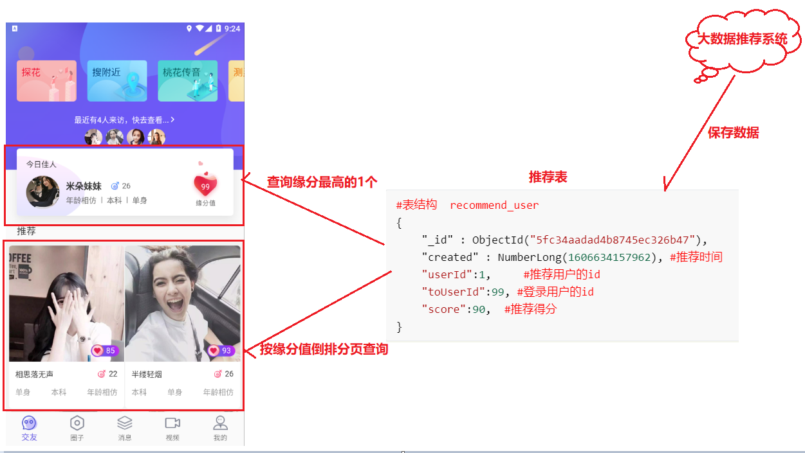
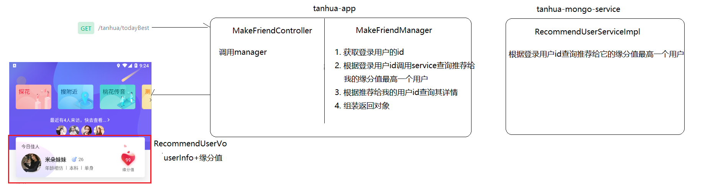
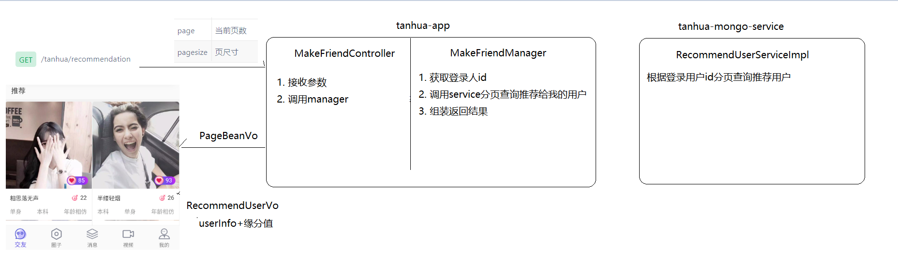
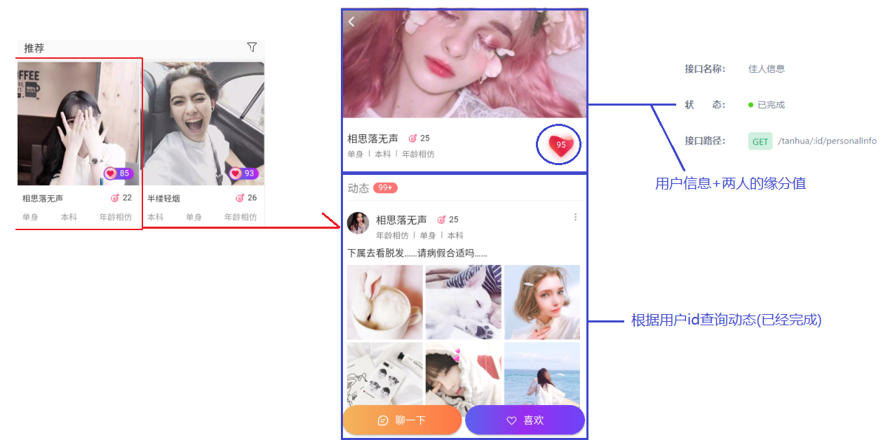
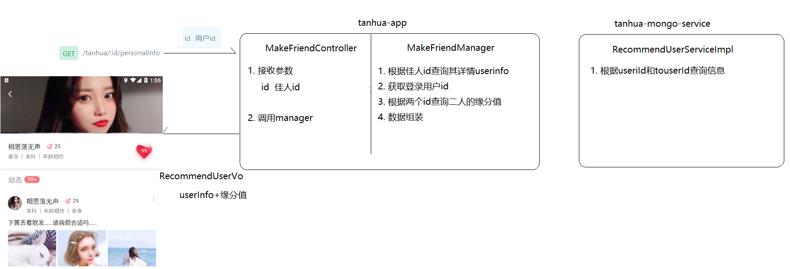
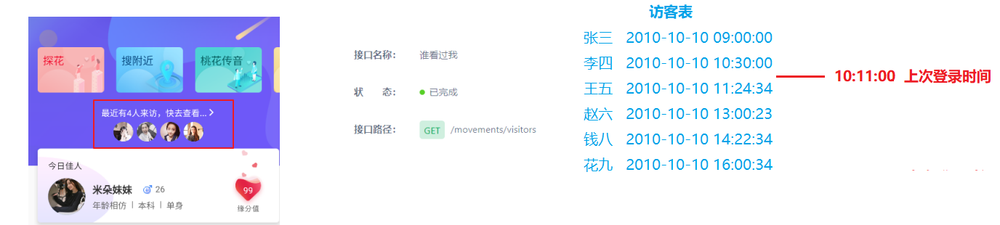
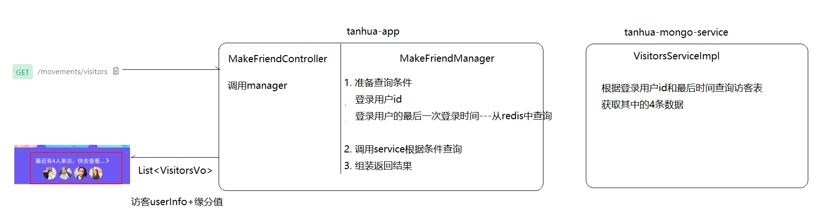
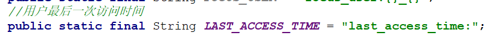
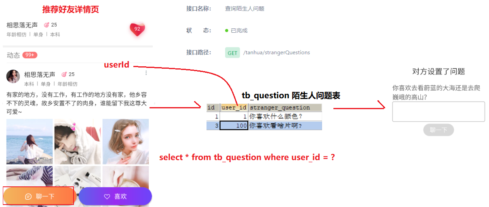
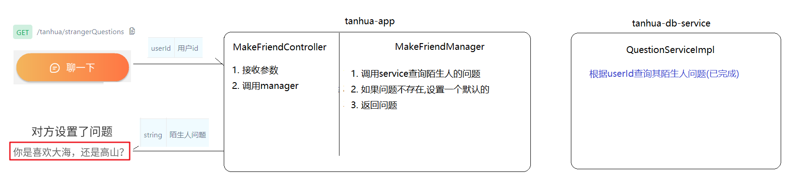

# 回顾

```markdown
1. 推荐动态 推荐表(大数据推荐进来的动态的id)--------->根据动态id查询动态详情表

2. 对动态的评论  喜欢  点赞
	1. 在mongodb中的评论中保存一条数据
	2. 修改mongodb中的动态表对应操作的次数
	3. 在redis中记录下某个用户是否对某条动态进行了对应的操作

3. 单体动态

4. 动态评论列表

5. 发布评论
```


# 推荐用户

## 业务需求

> 在用户登录成功后，就会进入交友页，交友页中有三个主要功能: 今日佳人、推荐列表、最近访客。

>今日佳人和推荐好友的数据都来自mongodb中`recommend_user`表，而这张表中的数据都是由大数据推荐系统保存进来的，表结构如下
>
>~~~json
>{
>	"_id" : ObjectId("5fc34aadad4b8745ec326b47"), //主键
>	"created" : NumberLong(1606634157962), // 推荐时间
>	"userId":1,     // 推荐用户的id
>	"toUserId":99, // 登录用户的id
>	"score":90,  // 缘分值
>}
>~~~
>
>我们今天暂时不考虑推荐数据怎么进来，而是在假设现在已经有推荐数据的基础上，实现数据的查询即可。
>
>今日佳人查询的是推荐系统推荐给登录人的缘分值最高的用户
>
>推荐列表查询的是推荐系统推荐给登录人的所有用户按照缘分值倒序分页的结果

 

## 今日佳人

>今日佳人就是从系统推荐给我的所有用户中获取缘分值最高的一个显示出来即可
>
>接口地址: https://mock-java.itheima.net/project/35/interface/api/617

### 思路分析 

 

### MakeFriendController

>在`tanhua-app`模块中创建`com.itheima.app.controller.MakeFriendController`类

~~~java
package com.itheima.app.controller;

import com.itheima.app.manager.MakeFriendManager;
import com.itheima.vo.RecommendUserVo;
import org.springframework.beans.factory.annotation.Autowired;
import org.springframework.web.bind.annotation.GetMapping;
import org.springframework.web.bind.annotation.RestController;

@RestController
public class MakeFriendController {

    @Autowired
    private MakeFriendManager makeFriendManager;

    //今日加入
    @GetMapping("/tanhua/todayBest")
    public RecommendUserVo findTodayBest(){
        return makeFriendManager.findTodayBest();
    }
}
~~~

### MakeFriendManager

>在`tanhua-app`模块中创建`com.itheima.app.manager.MakeFriendManager`类

~~~java
package com.itheima.app.manager;

import com.itheima.app.interceptor.UserHolder;
import com.itheima.domain.db.UserInfo;
import com.itheima.domain.mongo.RecommendUser;
import com.itheima.service.db.UserInfoService;
import com.itheima.service.mongo.RecommendUserService;
import com.itheima.vo.RecommendUserVo;
import org.apache.dubbo.config.annotation.Reference;
import org.springframework.stereotype.Service;

@Service
public class MakeFriendManager {

    @Reference
    private RecommendUserService recommendUserService;

    @Reference
    private UserInfoService userInfoService;


    //查找推荐给我的缘分值最高的用户
    public RecommendUserVo findTodayBest() {
        //1. 获取登录用户id
        Long userId = UserHolder.getUser().getId();

        //2. 调用service根据登录用户id查询推荐给我的缘分值最高的用户
        RecommendUser recommendUser = recommendUserService.findMaxScoreByUserId(userId);
        if (recommendUser == null) {//推荐表中未给当前登录用户推荐数据,手动推荐1号用户
            recommendUser = new RecommendUser();
            recommendUser.setUserId(1L);
            recommendUser.setToUserId(userId);
            recommendUser.setScore(100D);
        }

        //3. 根据推荐用户的id查询其详情
        Long uid = recommendUser.getUserId();//推荐给你的
        UserInfo userInfo = userInfoService.findById(uid);

        //4. 组装返回数据
        RecommendUserVo recommendUserVo = new RecommendUserVo();
        recommendUserVo.setUserInfo(userInfo);//推荐用户详情
        recommendUserVo.setFateValue(recommendUser.getScore().longValue());//二者缘分值

        return recommendUserVo;
    }
}
~~~

### RecommendUserService

>在`tanhua-mongo-interface`模块中创建`com.itheima.service.mongo.RecommendUserService`类

~~~java
package com.itheima.service.mongo;

import com.itheima.domain.mongo.RecommendUser;

public interface RecommendUserService {
    //根据登录用户id查询推荐给我的缘分值最高的用户
    RecommendUser findMaxScoreByUserId(Long userId);
}
~~~

### RecommendUserServiceImpl

>在`tanhua-mongo-service`模块中创建`com.itheima.service.mongo.impl.RecommendUserServiceImpl`类

~~~java
package com.itheima.service.mongo.impl;

import com.itheima.domain.mongo.RecommendUser;
import com.itheima.service.mongo.RecommendUserService;
import org.apache.dubbo.config.annotation.Service;
import org.springframework.beans.factory.annotation.Autowired;
import org.springframework.data.domain.Sort;
import org.springframework.data.mongodb.core.MongoTemplate;
import org.springframework.data.mongodb.core.query.Criteria;
import org.springframework.data.mongodb.core.query.Query;

@Service
public class RecommendUserServiceImpl implements RecommendUserService {

    @Autowired
    private MongoTemplate mongoTemplate;

    //userId 登录用户id
    @Override
    public RecommendUser findMaxScoreByUserId(Long userId) {
        //构造查询条件
        Query query = new Query(
                Criteria.where("toUserId").is(userId)
        ).with(Sort.by(Sort.Order.desc("score")));


        return mongoTemplate.findOne(query,RecommendUser.class);
    }
}
~~~


## 推荐列表

>推荐用户就是对系统推荐给我的所有用户进行缘分值倒序分页查询
>
>接口地址: https://mock-java.itheima.net/project/35/interface/api/623

### 思路分析 

 

### MakeFriendController

~~~java
    //推荐用户列表
    @GetMapping("/tanhua/recommendation")
    public PageBeanVo findRecommendUser(
            @RequestParam(value = "page", defaultValue = "1") Integer pageNum,
            @RequestParam(value = "pagesize", defaultValue = "10") Integer pageSize) {
        return makeFriendManager.findRecommendUser(pageNum,pageSize);
    }
~~~

### MakeFriendManager

~~~java
    //推荐用户列表
    public PageBeanVo findRecommendUser(Integer pageNum, Integer pageSize) {
        //1. 获取登录用户id
        Long userId = UserHolder.getUser().getId();

        //2. 调用service分页查询推荐用户列表
        PageBeanVo pageBeanVo = recommendUserService.findRecommendUser(userId, pageNum, pageSize);
        List<RecommendUser> recommendUserList = (List<RecommendUser>) pageBeanVo.getItems();

        //如果查询不到推荐数据,手动推荐2-11号数据给当前登录用户
        if (CollectionUtil.isEmpty(recommendUserList)) {
            for (long i = 2; i <= 11; i++) {
                RecommendUser recommendUser = new RecommendUser();
                recommendUser.setUserId(i);
                recommendUser.setToUserId(userId);
                recommendUser.setScore(RandomUtil.randomDouble(80, 100));
                recommendUserList.add(recommendUser);
            }
        }


        //3. 组装返回数据
        List<RecommendUserVo> recommendUserVoList = new ArrayList<>();
        for (RecommendUser recommendUser : recommendUserList) {
            //3-1. 根据推荐用户的id查询其详情
            Long uid = recommendUser.getUserId();//推荐给你的
            UserInfo userInfo = userInfoService.findById(uid);

            //3-2. 组装返回数据
            RecommendUserVo recommendUserVo = new RecommendUserVo();
            recommendUserVo.setUserInfo(userInfo);//推荐用户详情
            recommendUserVo.setFateValue(recommendUser.getScore().longValue());//二者缘分值

            recommendUserVoList.add(recommendUserVo);
        }

        pageBeanVo.setItems(recommendUserVoList);

        return pageBeanVo;
    }
~~~

### RecommendUserService

~~~java
    //根据登录用户id分页查询推荐给我的用户
    PageBeanVo findRecommendUser(Long userId, Integer pageNum, Integer pageSize);
~~~

### RecommendUserServiceImpl

~~~java
    //userId 登录用户id
    @Override
    public PageBeanVo findRecommendUser(Long userId, Integer pageNum, Integer pageSize) {
        //1. 构造查询条件
        Query query = new Query(
                Criteria.where("toUserId").is(userId)
        ).with(Sort.by(Sort.Order.desc("score")))
                .skip((pageNum - 1) * pageSize + 1).limit(pageSize);//跳过第一个用户

        //2. 执行查询
        List<RecommendUser> recommendUserList = mongoTemplate.find(query, RecommendUser.class);

        //3. 统计总记录数
        long count = mongoTemplate.count(query, RecommendUser.class);

        return new PageBeanVo(pageNum, pageSize, count - 1, recommendUserList);
    }
~~~


# 推荐用户详情

## 业务需求

> 用户在交友页面中，点击某个推荐用户，即可查看该用户详情
>
> 接口地址: https://mock-java.itheima.net/project/35/interface/api/629

 

## 需求分析

 

## 代码实现

### MakeFriendController

~~~java
    //查询佳人信息
    @GetMapping("/tanhua/{id}/personalInfo")
    public RecommendUserVo findPersonalInfo(@PathVariable("id") Long id){
        return makeFriendManager.findPersonalInfo(id);
    }
~~~

### MakeFriendManager

```java
    //查询佳人信息userinfo + 缘分值
    public RecommendUserVo findPersonalInfo(Long id) {
        //1. 查询佳人的用户信息
        UserInfo userInfo = userInfoService.findById(id);

        //2. 获取登录用户id
        Long userId = UserHolder.getUser().getId();

        //3. 根据两个id获取推荐用户信息(缘分值)
        RecommendUser recommendUser = recommendUserService.findByuserIdAndToUserId(userId, id);

        //4. 组装返回数据
        RecommendUserVo recommendUserVo = new RecommendUserVo();
        recommendUserVo.setUserInfo(userInfo);
        recommendUserVo.setFateValue(recommendUser.getScore().longValue());

        return recommendUserVo;
    }
```

### RecommendUserService

~~~java
    //根据userId和toUserId查询
    RecommendUser findByuserIdAndToUserId(Long userId, Long id);
~~~

### RecommendUserServiceImpl

~~~java
    //userId 登录用户id   id 推荐用户id
    @Override
    public RecommendUser findByuserIdAndToUserId(Long userId, Long id) {
        //构造查询条件
        Query query = new Query(
                Criteria.where("userId").is(id).and("toUserId").is(userId)
        );

        return mongoTemplate.findOne(query, RecommendUser.class);
    }
~~~


# 最近访客

## 业务需求

> 在用户登录成功后，就会进入交友页，查询到当前用户上次登录到本次登录之间的来访用户
>
> 接口地址: https://mock-java.itheima.net/project/35/interface/api/743
>
> 这里需要两个表来支持
>
>     1. 访客表，里面按照顺序保存了访问登录用户的所有访客的信息(使用mongo存储)
>     2. 本用户最后一次登录时间，针对一个用户，永远只记录上一次登录时间这一条数据即可(使用redis存储)

  

> 访客表结构 visitors
>
> ~~~json
> {
> 	"_id" : ObjectId("5e82de6e64019508d43187ac"), // 主键
> 	"userId" : NumberLong(111), // 登录用户id
> 	"visitorUserId" : NumberLong(28), // 访客用户id
> 	"score": 90,  // 访问用户的推荐得分
> 	"from" : "首页", // 访问来源  动态、小视频等等
> 	"date" : NumberLong(1585634926794) // 访问时间
> }
> ~~~

## 需求分析

 

## 代码实现

### MakeFriendController

```java
    //最近访客
    @GetMapping("/movements/visitors")
    public List<VisitorVo> findVisitor(){
        return makeFriendManager.findVisitor();
    }
```

### MakeFriendManager

 

~~~java
    //查询访客列表
    public List<VisitorVo> findVisitor() {
        //1. 获取登录用户id
        Long userId = UserHolder.getUser().getId();

        //2.从redis中查询当前用户的最后一次访问时间
        String lastAccessTime = stringRedisTemplate.opsForValue().get(ConstantUtil.LAST_ACCESS_TIME + userId);
        //如果查不到
        if (StringUtils.isEmpty(lastAccessTime)) {
            lastAccessTime = System.currentTimeMillis() + "";
        }

        //3. 调用service查询访客列表
        List<Visitor> visitorList = visitorService.findVisitorList(userId, lastAccessTime);
        List<VisitorVo> visitorVoList = new ArrayList<>();
        if (CollectionUtil.isNotEmpty(visitorList)) {
            for (Visitor visitor : visitorList) {
                //1. 查询访客的详细信息
                UserInfo userInfo = userInfoService.findById(visitor.getVisitorUserId());

                //2. 组装vo
                VisitorVo visitorVo = new VisitorVo();
                visitorVo.setUserInfo(userInfo);
                visitorVo.setFateValue(visitor.getScore().longValue());

                //3. 存储vo
                visitorVoList.add(visitorVo);
            }
        }

        //4. 更新redis中的最后一次访问时间
        stringRedisTemplate.opsForValue().set(ConstantUtil.LAST_ACCESS_TIME + userId, System.currentTimeMillis() + "");

        return visitorVoList;
    }
~~~

### VisitorService

>在`tanhua-mongo-interface`模块中创建`com.itheima.service.mongo.VisitorService`

~~~java
package com.itheima.service.mongo;

import com.itheima.domain.mongo.Visitor;

import java.util.List;

public interface VisitorService {
    //查询某个用户的最近访客
    List<Visitor> findVisitorList(Long userId, String lastAccessTime);
}
~~~

### VisitorServiceImpl

>在`tanhua-mongo-service`模块中创建`com.itheima.service.mongo.impl.VisitorServiceImpl`

~~~java
package com.itheima.service.mongo.impl;

import com.itheima.domain.mongo.Visitor;
import com.itheima.service.mongo.VisitorService;
import org.apache.dubbo.config.annotation.Service;
import org.springframework.beans.factory.annotation.Autowired;
import org.springframework.data.mongodb.core.MongoTemplate;
import org.springframework.data.mongodb.core.query.Criteria;
import org.springframework.data.mongodb.core.query.Query;

import java.util.List;

@Service
public class VisitorServiceImpl implements VisitorService {

    @Autowired
    private MongoTemplate mongoTemplate;

    //lastAccessTime 要求是时间的long表示法
    @Override
    public List<Visitor> findVisitorList(Long userId, String lastAccessTime) {
        //1. 构造查询条件
        Query query = new Query(
                Criteria.where("userId").is(userId).and("date").gt(Long.parseLong(lastAccessTime))
        ).skip(0).limit(4);

        //2. 查询访客列表
        List<Visitor> visitorList = mongoTemplate.find(query, Visitor.class);
        return visitorList;
    }
}
~~~

### 添加测试数据

由于目前没有实现访客记录功能，所以我们需要单独添加访客测试数据

> 在`tanhua-mongo-service`模块测试包下，添加此代码

```java
package com.itheima.test;

import cn.hutool.core.util.RandomUtil;
import com.itheima.domain.mongo.Visitor;
import org.junit.Test;
import org.junit.runner.RunWith;
import org.springframework.beans.factory.annotation.Autowired;
import org.springframework.boot.test.context.SpringBootTest;
import org.springframework.data.mongodb.core.MongoTemplate;
import org.springframework.test.context.junit4.SpringRunner;

@RunWith(SpringRunner.class)
@SpringBootTest
public class VisitorsTest {

    @Autowired
    private MongoTemplate mongoTemplate;

    @Test
    public void test01() throws Exception {
        for (int i = 0; i < 5; i++) {
            Visitor visitor = new Visitor();
            visitor.setFrom("首页"); // 访问来源
            visitor.setUserId(99L);//用户id
            visitor.setVisitorUserId(RandomUtil.randomLong(1, 20)); // 访客
            visitor.setScore(RandomUtil.randomDouble(60, 99)); // 缘分值
            visitor.setDate(System.currentTimeMillis()); // 访问时间
            mongoTemplate.save(visitor);
        }
        System.out.println("ok");
    }
}
```


# 查看陌生人问题

## 业务需求

> 在用户详情页面中，点击聊一下，弹出陌生人问题
>
> 接口地址: https://mock-java.itheima.net/project/35/interface/api/635

 

## 思路分析

  

## 代码实现

### MakeFriendController

```java
    //查询陌生人问题
    @GetMapping("/tanhua/strangerQuestions")
    public String findStrangerQuestions(Long userId){
        return makeFriendManager.findStrangerQuestions(userId);
    }
```

### MakeFriendManager

~~~java
    //根据用户id查询其陌生人问题
    public String findStrangerQuestions(Long userId) {
        //1. 调用service查询
        Question question = questionService.findByUserId(userId);

        //2. 如果查询不到,设置默认问题
        String strangerQuestion = "";
        if (question == null) {
            strangerQuestion = "你是喜欢高山的巍峨还是大海的深邃?";
        }else{
            strangerQuestion = question.getStrangerQuestion();
        }

        //3. 返回结果
        return strangerQuestion;
    }
~~~


