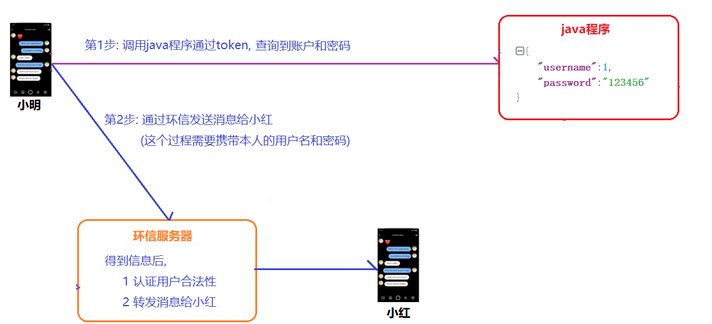
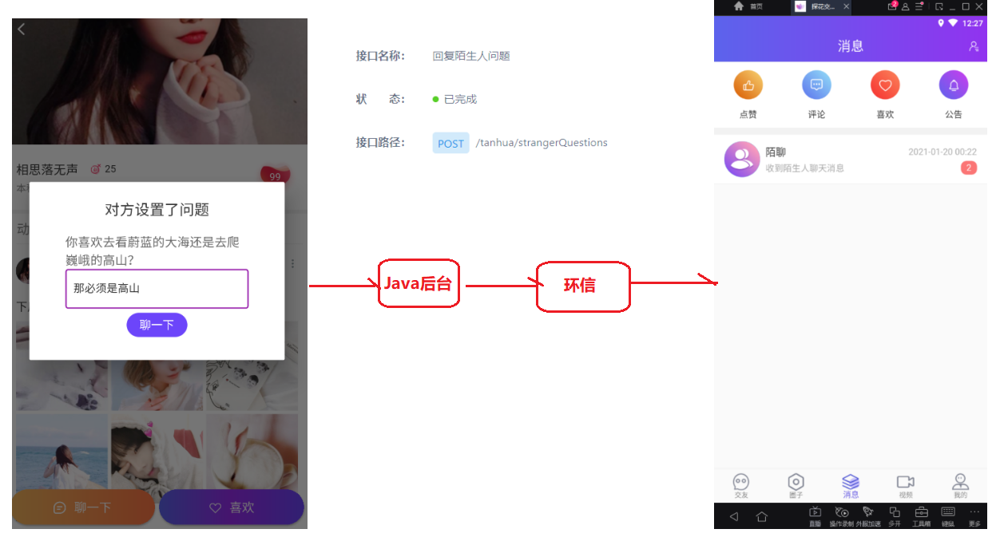

# 回顾

```markdown
1. 今日佳人   从推荐系统中获取缘分值最高的一个用户

2. 推荐列表   从推荐系统中获取缘分值最高用户列表(分页  排除第一个)

3. 最近访客   访客表(上次登录时间之后的所有访客记录)

4. 查询陌生人问题  
```

==复制四个vo到工程中==

 


# 即时通信

> 即时通信**（**Instant Messaging，简称IM）是一个实时通信系统，允许两人或多人使用网络实时的传递文字消息、文件、语音与视频交流。

## 功能说明

> 在探花交友项目中也提供了类似微信的聊天功能，用户可以相互聊天。

 

## 技术方案

~~~markdown
* 对于实现即时通讯往往有两种方案：
	1. 自主实现，从设计到架构，再到实现，需要有大量的人力、物力的支持，开发周期长，成本高，但可控性强。
	2. 对接第三方服务完成。成本低，开发周期短，能够快速的集成起来进行功能的开发，只是在可控性方面来说就差了一些。

* 我们如何选择呢
	如果是中大型企业做项目可以选择自主研发，如果是中小型企业研发中小型的项目，选择第二种方案即可。
~~~

## 环信

### 介绍

官网地址：https://www.easemob.com/  稳定健壮，消息必达，亿级并发的即时通讯云。

 

### 注册

>  填写邮箱+手机号注册账号(邮箱必须真实，且不能是QQ邮箱)

  

### 激活

> 邮箱激活

 

### 创建应用

> 需要使用环信平台，那么必须要进行注册，登录之后即可创建应用。环信100以内的用户免费使用，100以上就要注册企业版了。

  

> 创建应用

  

> 创建完成

  

## 开发功能说明(重要)

> 使用环信的最终目标是实现两个探花用户使用环信进行通讯，这里面包含这样几个流程

### 用户注册

>每一个探花用户都应该对应一个环信应用的用户, 在环信中用探花用户的id为标识    123456为密码

~~~markdown
* 每个探花用户想使用环信，必须在环信应用中创建一个用户作为自己在环信中身份的标识
* 我们这里采用的是数据库用户表中的id作为标识，使用123456作为密码，向环信中注册作为认证标识
* 这个过程应该在用户注册用的时候处理
~~~

 

### 用户认证

~~~markdown
* 在后面大部分时间的消息发送都是在手机app和环信服务器之间展开的
* 那这里手机在向环信发送信息的时候， 就需要携带着当前用户的认证信息，那这个认证信息从哪里来呢？
* 这时候，就需要我们java后台提供一个程序，可以给手机端返回当前用户的认证信息
~~~

    

### 打招呼

~~~markdown
* 这个场景指的是两个用户还不是好友的情况下，第一次通过打招呼相互认识，但是它实质上也是要通过环信给对方发消息
* 由于两个账户还不是好友，它是无法直接通过环信进行通讯的，必须借助于java后台程序
~~~

 

### 聊天

~~~markdown
* 这个场景指的是，两者已经成为好友了，然后再互相聊天，这个过程就不通过java后台程序了
* 而是在探花app和环信之间直接完成的
~~~

 

##  接口文档

- 探花前端使用AndroidSDK进行集成
  - 文档：http://docs-im.easemob.com/im/android/sdk/import
- 后端集成用户体系
  - 文档：http://docs-im.easemob.com/im/server/ready/user


## 抽取环信组件

### 导入依赖

> 已完成，此步略过

```xml
<!--restTemplate-->
<dependency>
    <groupId>org.springframework</groupId>
    <artifactId>spring-web</artifactId>
    <version>5.1.2.RELEASE</version>
</dependency>
```

### Propeties配置对象

> HuanXinProperties类中，从配置文件中获取环信配置信息

```java
package com.itheima.autoconfig.huanxin;

import lombok.Data;
import org.springframework.boot.context.properties.ConfigurationProperties;
import org.springframework.context.annotation.Configuration;

@Configuration
@ConfigurationProperties(prefix = "tanhua.huanxin")
@Data
public class HuanXinProperties {

    private String url;
    private String orgName;
    private String appName;
    private String clientId;
    private String clientSecret;

    public String getHuanXinUrl() {
        return this.url
                + this.orgName + "/"
                + this.appName;
    }
}
```

### Template模板对象

> 定义上传模板对象HuanXinTemplate，自动装配注入此对象，完成即时通讯功能

```java
package com.itheima.autoconfig.huanxin;

import com.alibaba.fastjson.JSON;
import org.springframework.http.HttpEntity;
import org.springframework.http.HttpHeaders;
import org.springframework.http.ResponseEntity;
import org.springframework.web.client.RestTemplate;

import java.util.*;

public class HuanXinTemplate {

    private HuanXinProperties huanXinProperties;

    private RestTemplate restTemplate;

    public HuanXinTemplate(HuanXinProperties huanXinProperties) {
        this.huanXinProperties = huanXinProperties;
        this.restTemplate = new RestTemplate();
    }

    private String token;

    private long expire = 0L;

    //获取token
    private String getToken() {

        Long now = System.currentTimeMillis();

        if (now > expire) {

            String url = this.huanXinProperties.getUrl()
                    + this.huanXinProperties.getOrgName() + "/"
                    + this.huanXinProperties.getAppName() + "/token";

            Map<String, Object> param = new HashMap<>();

            param.put("grant_type", "client_credentials");
            param.put("client_id", this.huanXinProperties.getClientId());
            param.put("client_secret", this.huanXinProperties.getClientSecret());

            ResponseEntity<Map> responseEntity = restTemplate.postForEntity(url, param, Map.class);
            Map<String, String> responseBody = responseEntity.getBody();
            token = responseBody.get("access_token");
            expire = System.currentTimeMillis() + 24 * 60 * 60 * 1000;
        }
        return token;
    }

    /**
     * 注册环信用户
     */
    public void register(Long userId) {

        String url = huanXinProperties.getHuanXinUrl() + "/users";

        String token = getToken();

        //请求头信息
        HttpHeaders httpHeaders = new HttpHeaders();
        httpHeaders.add("Content-Type", "application/json");
        httpHeaders.add("Authorization", "Bearer " + token);

        List<Map> huanXinUsers = new ArrayList<>();
        HashMap<Object, Object> huanxinMap = new HashMap<>();
        huanxinMap.put("username", userId.toString());
        huanxinMap.put("password", "123456");
        huanXinUsers.add(huanxinMap);

        try {
            HttpEntity<String> httpEntity = new HttpEntity(JSON.toJSONString(huanXinUsers), httpHeaders);
            //发起请求
            ResponseEntity<String> responseEntity = restTemplate.postForEntity(url, httpEntity, String.class);
        } catch (Exception e) {
            e.printStackTrace();
        }
    }

    /**
     * 添加好友
     */
    public void addContacts(Long userId, Long friendId) {

        String targetUrl = huanXinProperties.getHuanXinUrl() + "/users/" + userId + "/contacts/users/" + friendId;

        // 请求头
        HttpHeaders headers = new HttpHeaders();
        headers.add("Content-Type", "application/json ");
        headers.add("Authorization", "Bearer " + getToken());

        try {
            HttpEntity<String> httpEntity = new HttpEntity<>(headers);
            ResponseEntity<String> responseEntity = restTemplate.postForEntity(targetUrl, httpEntity, String.class);
        } catch (Exception e) {
            e.printStackTrace();
        }
    }

    /**
     * 发送消息
     */
    public void sendMsg(String target, String msg) {

        String targetUrl = huanXinProperties.getHuanXinUrl() + "/messages";

        HttpHeaders headers = new HttpHeaders();
        headers.add("Content-Type", "application/json ");
        headers.add("Authorization", "Bearer " + getToken());

        try {
            //请求头
            Map<String, Object> requestParam = new HashMap<>();
            requestParam.put("target_type", "users");
            requestParam.put("target", Arrays.asList(target));

            Map<String, Object> msgParam = new HashMap<>();
            msgParam.put("msg", msg);
            msgParam.put("type", "txt");

            requestParam.put("msg", msgParam);

            //表示消息发送者;无此字段Server会默认设置为“from”:“admin”，有from字段但值为空串(“”)时请求失败
            //requestParam.put("from", null);

            HttpEntity<Map> httpEntity = new HttpEntity<>(requestParam, headers);

            ResponseEntity<String> responseEntity = restTemplate.postForEntity(targetUrl, httpEntity, String.class);

        } catch (Exception e) {
            e.printStackTrace();
        }

    }
}
```

### 配置类

> 在配置类TanhuaAutoConfiguration中加入OssTemplate对象相关配置

```java
package com.itheima.autoconfig;

import com.itheima.autoconfig.face.AipFaceProperties;
import com.itheima.autoconfig.face.AipFaceTemplate;
import com.itheima.autoconfig.huanxin.HuanXinProperties;
import com.itheima.autoconfig.huanxin.HuanXinTemplate;
import com.itheima.autoconfig.oss.OssProperties;
import com.itheima.autoconfig.oss.OssTemplate;
import com.itheima.autoconfig.sms.SmsProperties;
import com.itheima.autoconfig.sms.SmsTemplate;
import org.springframework.context.annotation.Bean;
import org.springframework.context.annotation.Configuration;
import org.springframework.context.annotation.Import;

@Configuration
@Import({
        SmsProperties.class,//加载短信配置
        OssProperties.class,//加载oss配置
        AipFaceProperties.class,//加载人脸识别配置
        HuanXinProperties.class//加载环信配置
})
public class TanhuaAutoConfiguration {
    @Bean
    public AipFaceTemplate aipFaceTemplate(AipFaceProperties aipFaceProperties) {
        return new AipFaceTemplate(aipFaceProperties);
    }

    @Bean
    public SmsTemplate smsTemplate(SmsProperties smsProperties) {
        return new SmsTemplate(smsProperties);
    }

    @Bean
    public OssTemplate ossTemplate(OssProperties ossProperties) {
        return new OssTemplate(ossProperties);
    }

    @Bean
    public HuanXinTemplate huanXinTemplate(HuanXinProperties huanXinProperties) {
        return new HuanXinTemplate(huanXinProperties);
    }
}
```

### 测试

> tanhua-app工程加入环信配置信息如下:  ==下面一定换成你的==

```yaml
tanhua:
  huanxin:
    url: http://a1.easemob.com/
    orgName: 1129210104046247
    appName: tanhua
    clientId: YXA6fvvYD7wGTOSdUMtAEAPPXw
    clientSecret: YXA63DEHnf4Bndlo38-XJPVrn317USI
```

 

> 编写测试类，测试环信注册功能

```java
@RunWith(SpringRunner.class)
@SpringBootTest
public class HuanXinTest {

    @Autowired
    private HuanXinTemplate huanXinTemplate;

    @Test
    public void test01() throws Exception {
        huanXinTemplate.register(1L);
        huanXinTemplate.register(99L);
    }
}
```

 

# 探花集成环信

## 用户注册 

>此步骤就是实现用户注册成功之后,再向环信注册用户

  

## 用户认证

>此步骤就是实现用户认证，即用户访问该接口获取当前用户的用户名和密码
>
>接口地址：https://mock-java.itheima.net/project/35/interface/api/563

 >在`tanhua-app`模块创建`com.itheima.app.controller.HuanxinController`

```java
package com.itheima.app.controller;

import com.itheima.app.interceptor.UserHolder;
import org.springframework.web.bind.annotation.GetMapping;
import org.springframework.web.bind.annotation.RestController;

import java.util.HashMap;
import java.util.Map;

@RestController
public class HuanxinController {
	//获取环信用户信息
    @GetMapping(value = "/huanxin/user")
    public Map<String, String> huanxinUser() {
        Long username = UserHolder.getUser().getId();

        Map<String, String> result = new HashMap<>();
        result.put("username", username.toString());
        result.put("password", "123456");

        return result;
    }
}
```

## 发送消息给客户端

1. 目前已经完成了用户体系的对接，下面我们进行测试发送消息，首先在app端设置下环信的appkey

     

2. 我们暂时通过环信的控制台进行消息发送 

    

   消息内容：

   ~~~shell
   {
   	"userId": "1",
   	"nickname": "相思若无声",
   	"strangerQuestion": "你喜欢去看蔚蓝的大海还是去爬巍峨的高山?",
   	"reply": "我喜欢秋天的落叶，夏天的泉水，冬天的雪地，只要有你一切皆可~"
   }
   ~~~


# 打招呼

## 业务需求

> 用户在查看了陌生人的问题之后，作出回答，答案将以消息的方式发送给对方的app中
>
> 但是目前两者还不是好友，无法直接通过环信发送消息，需要先将消息发送到java后台，然后由java后台将消息发送到环信，环信再将消息发到对方app
>
> 当然这里还有一个前提条件，双方用户必须都在环信注册
>
> 接口地址: https://mock-java.itheima.net/project/35/interface/api/641

 

## 思路分析

 

## 代码实现

### MakeFriendController

```java
    //回答陌生人问题(打招呼)
    @PostMapping("/tanhua/strangerQuestions")
    public void replyStrangerQuestion(@RequestBody Map<String,String> map){
        //1. 接收参数
        Long strangerId = Long.parseLong(map.get("userId"));//陌生人id
        String reply = map.get("reply");//回复内容

        //2. 调用manager
        makeFriendManager.replyStrangerQuestion(strangerId,reply);
    }
```

### MakeFriendManager

~~~java
    //打招呼
    public void replyStrangerQuestion(Long strangerId, String reply) {
        //1. 获取登录用户id
        Long userId = UserHolder.getUser().getId();

        //2. 获取登录用户的昵称
        UserInfo userInfo = userInfoService.findById(userId);

        //3. 查询陌生人问题
        Question question = questionService.findByUserId(strangerId);
        String strangerQuestion = "你是喜欢高山的巍峨还是大海的深邃?";
        if (question != null) {
            strangerQuestion = question.getStrangerQuestion();
        }

        //4. 组装成map--->json
        HashMap<String, String> map = new HashMap<>();
        map.put("userId", userId + "");//用户id
        map.put("nickname", userInfo.getNickname());//用户昵称
        map.put("strangerQuestion", strangerQuestion);//陌生人问题
        map.put("reply", reply);//问题回复
        String json = JSON.toJSONString(map);

        //5. 调用环信的方法发送消息
        huanXinTemplate.sendMsg(strangerId + "", json);
    }
~~~


# 添加联系人

## 业务需求

> 用户获取到打招呼后，点击“聊一下”，就会成为联系人（好友）。这个过程中主要完成两个操作:
>
> 1. 向mongodb中的好友表保存两条记录(好友关系是相互的)
> 2. 调用环信的接口，在环信系统建立好友关系
>
> 接口地址：https://mock-java.itheima.net/project/35/interface/api/809

 

## 思路分析

 

## 代码实现

### MakeFriendController

~~~java
    //添加好友
    @PostMapping("/messages/contacts")
    public void addContacts(@RequestBody Map<String, String> map) {
        //获取参数
        Long friendId = Long.parseLong(map.get("userId"));//好友id
        //调用manager
        makeFriendManager.addContacts(friendId);
    }
~~~

### MakeManager

~~~java
    //添加好友
    public void addContacts(Long friendId) {
        //1. 获取登录人id
        Long userId = UserHolder.getUser().getId();

        //2. 调用service向mongo中保存好友关系
        friendService.addContacts(userId,friendId);

        //3. 调用template向环信中保存好友关系
        huanXinTemplate.addContacts(userId,friendId);
    }
~~~

### FriendService

>在`tanhua-mongo-interface`中创建`com.itheima.service.mongo.FriendService`

~~~java
package com.itheima.service.mongo;

public interface FriendService {

    //保存好友关系
    void addContacts(Long userId, Long friendId);
}

~~~

### FriendServiceImpl

>在`tanhua-mongo-interface`中创建`com.itheima.service.mongo.impl.FriendServiceImpl`

~~~java
package com.itheima.service.mongo.impl;

import com.itheima.domain.mongo.Friend;
import com.itheima.service.mongo.FriendService;
import org.apache.dubbo.config.annotation.Service;
import org.springframework.beans.factory.annotation.Autowired;
import org.springframework.data.mongodb.core.MongoTemplate;
import org.springframework.data.mongodb.core.query.Criteria;
import org.springframework.data.mongodb.core.query.Query;

@Service
public class FriendServiceImpl implements FriendService {

    @Autowired
    private MongoTemplate mongoTemplate;

    @Override
    public void addContacts(Long userId, Long friendId) {
        //正向userid--friendid
        Query query1 = new Query(Criteria.where("userId").is(userId).and("friendId").is(friendId));
        Friend friend1 = mongoTemplate.findOne(query1, Friend.class);
        if (friend1 == null) {
            Friend friend = new Friend();
            friend.setUserId(userId);
            friend.setFriendId(friendId);
            friend.setCreated(System.currentTimeMillis());
            mongoTemplate.save(friend);
        }

        //反向friendid---userid
        Query query2 = new Query(Criteria.where("userId").is(friendId).and("friendId").is(userId));
        Friend friend2 = mongoTemplate.findOne(query2, Friend.class);
        if (friend2 == null) {
            Friend friend = new Friend();
            friend.setUserId(friendId);
            friend.setFriendId(userId);
            friend.setCreated(System.currentTimeMillis());
            mongoTemplate.save(friend);
        }
    }
}
~~~


# 联系人列表

## 业务需求

> 用户在消息界面中，可以查看联系人（好友）列表
>
> 接口地址: https://mock-java.itheima.net/project/35/interface/api/803

 

## 需求分析

  

## 代码实现

### MakeFriendController

~~~java
    //查询本人的所有好友
    @GetMapping("/messages/contacts")
    public PageBeanVo findContact(
            @RequestParam(value = "page", defaultValue = "1") Integer pageNum,
            @RequestParam(value = "pagesize", defaultValue = "10") Integer pageSize){
        return makeFriendManager.findContact(pageNum,pageSize);
    }

~~~

### MakeFriendManager

~~~java
    //分页查询联系人
    public PageBeanVo findContact(Integer pageNum, Integer pageSize) {
        //1.获取登录用户id
        Long userId = UserHolder.getUser().getId();

        //2. 根据登录用户id分页查询联系人
        PageBeanVo pageBeanVo = friendService.findContact(userId, pageNum, pageSize);

        //3. 组装返回结果
        List<Friend> friendList = (List<Friend>) pageBeanVo.getItems();
        List<ContactVo> contactVoList = new ArrayList<>();
        if (CollectionUtil.isNotEmpty(friendList)) {
            for (Friend friend : friendList) {
                //3-1 获取朋友id
                Long friendId = friend.getFriendId();//朋友id
                //3-2 根据朋友id查询详情
                UserInfo userInfo = userInfoService.findById(friendId);
                //3-3 组装ContactVo
                ContactVo contactVo = new ContactVo();
                contactVo.setUserInfo(userInfo);//复制大部分的属性
                contactVo.setUserId(friendId + "");
                //3-4 放入临时集合
                contactVoList.add(contactVo);
            }
        }
        pageBeanVo.setItems(contactVoList);
        return pageBeanVo;
    }
~~~

### FriendService

~~~java
    //分页查询指定用户的联系人
    PageBeanVo findContact(Long userId, Integer pageNum, Integer pageSize);
~~~

### FriendServiceImpl

~~~java
    @Override
    public PageBeanVo findContact(Long userId, Integer pageNum, Integer pageSize) {
        //1. 组装查询条件
        Query query = new Query(
                Criteria.where("userId").is(userId)
        ).skip((pageNum - 1) * pageSize).limit(pageSize);

        //2. 执行查询
        List<Friend> friendList = mongoTemplate.find(query, Friend.class);

        //3. 执行统计
        long count = mongoTemplate.count(query, Friend.class);

        return new PageBeanVo(pageNum, pageSize, count, friendList);
    }
~~~


# 附近的人

## 业务需求

> 在交友（首页）中点击“搜附近”可以搜索附近的好友，要实现这个功需要下面2个步骤：
>
> 1. 每个用户需要`近实时`的上报自己的位置坐标（就是就是地图上的一个点）,存到mongo中的位置表
> 2. 搜索的时候，以自己的坐标为中心，以指定半径画个圆，只要在这个圆中的坐标都会被检索到

>需要用到的表( user_location )结构如下:
>
>~~~json
>{
>        "_id" : ObjectId("5fc3573ead4b871454f18ede"), //主键
>        "userId" : NumberLong(99), // 用户id
>        "location" : {    // 经纬度坐标，这是mongo内置的一种数据类型，称为geo  
>           "type" : "Point",
>           "coordinates" : [ 
>               116.635672,  // X 维度
>               40.169419    // Y 经度
>           ]
>        },
>        "address" : "顺义黑马程序员",  // 位置描述
>        "created" : NumberLong(1606637374367),  // 创建时间
>        "updated" : NumberLong(1606637374367),  // 更新时间
>        "lastUpdated" : NumberLong(1606637374367) // 上次更新时间
>}
>~~~

## 上报地理位置

### 业务需求

> 客户端（探花APP）检测用户的地理位置，当变化大于500米时或每隔5分钟，向服务端发送地理位置。
>
> 以百度地图举例：http://api.map.baidu.com/lbsapi/getpoint/index.html（坐标拾取器）
>
> 接口地址 https://mock-java.itheima.net/project/35/interface/api/557

 

### 思路分析

  

### UserController

~~~java
    //上报个人位置
    @PostMapping("/baidu/location")
    public void saveUserLocation(@RequestBody Map<String,String> map){
        //1. 获取参数
        Double latitude = Double.parseDouble(map.get("latitude"));//纬度
        Double longitude = Double.parseDouble(map.get("longitude"));//经度
        String addr = map.get("addrStr");//位置

        //2 调用manager
        userManager.saveUserLocation(latitude,longitude,addr);
    }
~~~

### UserManager

~~~java
    //上报位置信息
    public void saveUserLocation(Double latitude, Double longitude, String addr) {
        //1. 获取登录用户
        Long userId = UserHolder.getUser().getId();

        //2. 调用service上报位置信息
        locationService.saveUserLocation(userId, latitude, longitude, addr);
    }
~~~

### LocationService

>在`tanhua-mongo-interface`模块下创建`com.itheima.service.mongo.LocationService`

~~~java
package com.itheima.service.mongo;

public interface LocationService {

    //上报用户位置
    void saveUserLocation(Long userId, Double latitude, Double longitude, String addr);
}
~~~

### LocationServiceImpl

>在`tanhua-mongo-service`模块下创建`com.itheima.service.mongo.impl.LocationServiceImpl`

~~~java
package com.itheima.service.mongo.impl;

import com.itheima.domain.mongo.UserLocation;
import com.itheima.service.mongo.LocationService;
import org.apache.dubbo.config.annotation.Service;
import org.springframework.beans.factory.annotation.Autowired;
import org.springframework.data.mongodb.core.MongoTemplate;
import org.springframework.data.mongodb.core.geo.GeoJsonPoint;
import org.springframework.data.mongodb.core.query.Criteria;
import org.springframework.data.mongodb.core.query.Query;

@Service
public class LocationServiceImpl implements LocationService {

    @Autowired
    private MongoTemplate mongoTemplate;

    @Override
    public void saveUserLocation(Long userId, Double latitude, Double longitude, String addr) {

        //1. 根据用户id查询,库中是否存在我的位置
        Query query = new Query(Criteria.where("userId").is(userId));
        UserLocation userLocation = mongoTemplate.findOne(query, UserLocation.class);

        if (userLocation == null) {
            //2. 如果不存在,新增
            userLocation = new UserLocation();//创建一个
            userLocation.setUserId(userId);//用户id
            GeoJsonPoint location = new GeoJsonPoint(latitude, longitude);
            userLocation.setLocation(location);//设置当前用户的位置
            userLocation.setAddress(addr);//位置描述
            userLocation.setCreated(System.currentTimeMillis());
            userLocation.setUpdated(System.currentTimeMillis());
            userLocation.setLastUpdated(System.currentTimeMillis());

            mongoTemplate.save(userLocation);//保存

        } else {
            //3. 如果存在,更新记录
            userLocation.setUserId(userId);//用户id
            GeoJsonPoint location = new GeoJsonPoint(latitude, longitude);
            userLocation.setLocation(location);//设置当前用户的位置
            userLocation.setAddress(addr);//位置描述
            userLocation.setLastUpdated(userLocation.getUpdated());//上次更新时间
            userLocation.setUpdated(System.currentTimeMillis());//更新时间

            mongoTemplate.save(userLocation);//更新
        }
    }
}
~~~

### 测试模拟

> 使用前端postman模拟上传地理位置

```json
{
    "latitude":116.403963,
    "longitude":39.915119,
    "addrStr":"黑马程序员(顺义校区)"
}
```

 


## 查询附近好友

### 需求分析

>接口地址: https://mock-java.itheima.net/project/35/interface/api/611

  

### 思路分析

  

### MakeFriendController

```java
    //搜索附近的人
    @GetMapping("/tanhua/search")
    public List<NearUserVo> findNearUser(String gender, Long distance) {
        System.out.println(gender);
        return makeFriendManager.findNearUser(gender, distance);
    }
```

### MakeFriendManager

```java
    //搜索附近的人
    public List<NearUserVo> findNearUser(String gender, Long distance) {
        //1. 获取登录用户id
        Long userId = UserHolder.getUser().getId();

        //2. 查询附近的人
        List<UserLocationVo> userLocationList = locationService.findLocation(userId, distance);

        //3. 封装返回结果
        List<NearUserVo> nearUserVoList = new ArrayList<>();
        if (CollectionUtil.isNotEmpty(userLocationList)) {
            for (UserLocationVo userLocationVo : userLocationList) {
                Long uid = userLocationVo.getUserId();//附近的人的id
                UserInfo userInfo = userInfoService.findById(uid);//附近人的信息

                //排除自己
                if (userLocationVo.getUserId() == userId) {
                    continue;
                }

                //排除异性
                if (!StringUtils.equals(gender, userInfo.getGender())) {
                    continue;
                }

                //封装
                NearUserVo nearUserVo = new NearUserVo();
                nearUserVo.setUserId(uid);
                nearUserVo.setAvatar(userInfo.getAvatar());
                nearUserVo.setNickname(userInfo.getNickname());

                nearUserVoList.add(nearUserVo);
            }
        }

        //4. 返回结果
        return nearUserVoList;
    }
```

### LocationService

```java
    //查找指定用户附件的坐标
    List<UserLocationVo> findLocation(Long userId, Long distance);
```

### LocationServiceImpl

~~~java
    @Override
    public List<UserLocationVo> findLocation(Long userId, Long distance) {
        //1. 先根据用户id查询自己的坐标
        Query query1 = new Query(Criteria.where("userId").is(userId));
        UserLocation myLocation = mongoTemplate.findOne(query1, UserLocation.class);

        //2. 确定半径, 画个圈
        //2-1 确定半径距离
        Distance dis = new Distance(distance / 1000, Metrics.KILOMETERS);
        //2-2画个圆圈
        Circle circle = new Circle(myLocation.getLocation(), dis);

        //3 查询圆中的坐标
        //3-1 设置搜索条件
        Query query2 = new Query(
                Criteria.where("location").withinSphere(circle)
        );
        List<UserLocation> userLocationList = mongoTemplate.find(query2, UserLocation.class);

        //4 为了能够使用dubbo传递数据,我们单独封装一个Vo
        //userLocationList---userLocationVoList
        List<UserLocationVo> userLocationVoList = UserLocationVo.formatToList(userLocationList);

        return userLocationVoList;
    }
~~~

