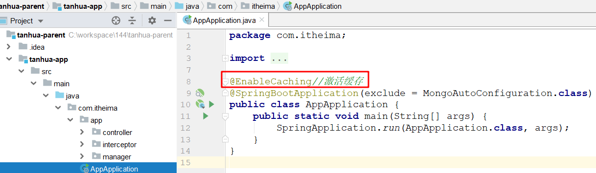

# 回顾

```markdown

```


# 视频存储方案

>视频功能类似于抖音、快手小视频的应用，用户可以上传小视频进行分享，也可以浏览查看别人分享的视频，并且可以对视频评论和点赞操作。
>
>对于小视频的功能的开发需要考虑的是：`存储`和`加载速度` 。
>
>- 对于存储而言，我们选择自己搭建分布式存储系统FastDFS进行存储
>
>- 对于加载速度，除了提升服务器带宽外可以通过CDN的方式进行加速

## FastDFS介绍

~~~markdown
* FastDFS是用C语言编写的一款开源的轻量级分布式文件系统。

* 它对文件进行管理，功能包括：文件存储、文件同步、文件访问（文件上传、文件下载）等，解决了大容量存储和负载均衡的问题。

* 特别适合以文件为载体的在线服务，如相册网站、视频网站等等。

* FastDFS为互联网量身定制，充分考虑了冗余备份、负载均衡、线性扩容等机制，并注重高可用、高性能等指标。

* 使用FastDFS很容易搭建一套高性能的文件服务器集群提供文件上传、下载等服务。  
~~~

## FastDFS架构


~~~markdown
* FastDFS由客户端(Client)、 跟踪服务器(Tracker Server)、 存储服务器(Storage Server)构成
* 客户端: 业务请求的发起方，与跟踪器服务器或存储节点进行数据交互。
* 跟踪器: 作用是负载均衡和调度，通过Tracker server在文件上传时可以根据一些策略找到Storage server提供文件上传服务。
* 存储器: 作用是文件存储，客户端上传的文件最终存储在Storage服务器上，存储节点中的服务器均可以随时增加或下线而不会影响线上服务。  
~~~

 

## 读写操作

### 上传文件

>客户端上传文件后存储服务器将文件ID返回给客户端，此文件ID用于以后访问该文件的索引信息。

 

### 下载文件

>客户端下载请求到Tracker服务，Tracker返回给客户端storage的信息，客户端根据这些信息进行请求storage获取到文件。

  

## FastDFS环境搭建

> 我们使用docker进行搭建应用环境；通过docker-compose.yml配置文件，一键启动并部署应用

```shell
#进入目录
cd /root/docker-file/fastdfs/
#启动
docker-compose up -d
#查看容器
docker ps -a
```

FastDFS调度服务器地址：192.168.136.160:22122
FastDFS存储服务器web访问地址：http://192.168.136.160:8888/

 

## SpringBoot访问FastDFS

### 导入依赖

> 找到`tanhua-app`模块的pom.xml文件，已完成，此步略过

```xml
<dependency>
    <groupId>com.github.tobato</groupId>
    <artifactId>fastdfs-client</artifactId>
    <version>1.26.7</version>
    <exclusions>
        <exclusion>
            <groupId>ch.qos.logback</groupId>
            <artifactId>logback-classic</artifactId>
        </exclusion>
    </exclusions>
</dependency>
```

### application.yml

>找到`tanhua-app`中的`application.yml`文件中添加下面配置

```yaml
fdfs:
  so-timeout: 1500
  connect-timeout: 600
  #缩略图生成参数
  thumb-image:
    width: 150
    height: 150
  #TrackerList参数,支持多个
  tracker-list: 192.168.136.160:22122
  web-server-url: http://192.168.136.160:8888/
```

### 单元测试

```java
import com.github.tobato.fastdfs.domain.fdfs.StorePath;
import com.github.tobato.fastdfs.service.FastFileStorageClient;
import org.junit.Test;
import org.junit.runner.RunWith;
import org.springframework.beans.factory.annotation.Autowired;
import org.springframework.boot.test.context.SpringBootTest;
import org.springframework.test.context.junit4.SpringRunner;

import java.io.File;
import java.io.IOException;

@RunWith(SpringRunner.class)
@SpringBootTest
public class FastDFSTest {

    @Autowired
    private FastFileStorageClient client;

    @Autowired
    private FdfsWebServer webServer;

    // 上传文件到fastDFS
    @Test
    public void test01()throws Exception{
        File file = new File("文件路径");
        FileInputStream fis = new FileInputStream(file);
        /*
            1.文件输入流
            2.文件大小
            3.文件扩展名
            4.文件基本属性 null即可
         */
        StorePath storePath = client.uploadFile(fis, file.length(), FileUtil.extName(file), null);

        System.out.println(webServer.getWebServerUrl() + storePath.getFullPath());
    }
}
```


# 小视频列表

## 业务需求

> 用户在小视频界面，即可分页查看推荐的小视频内容，内容数据来源于mongodb中推荐表(recommend_video) 和视频表(video)
>
> 	1. recommend_video表中数据由推荐系统生成，主要记录的是给哪个用户推荐了哪些视频（只有id）
> 	2. video表记录了视频的详细信息
>
> 接口地址: https://mock-java.itheima.net/project/35/interface/api/815

 

>表结构分析

~~~json
# 表名: recommend_video
{
    "_id" : ObjectId("5e82ddeb64019534c43323aa"),
    "userId" : NumberLong(7),    // 推荐给谁的
    "vid" : NumberLong(41),  // 这个是大数据推荐需要的数值类型唯一标识
    "videoId" : ObjectId("5fbe2a7bad4b87033c44c543"),  // 视频id
    "score" : 1.0, // 评分
    "date" : NumberLong(1585634795481), //时间
}
~~~

```json
# 表名:video
{
    "_id" : ObjectId("5fbe2a7bad4b87033c44c543"), 
    "vid" : NumberLong(41),  // 这个是大数据推荐需要的数值类型唯一标识
    "userId" : NumberLong(99), // 发布小视频用户id
    "text" : "左手右手一个慢动作", //内容 
    "picUrl" : "https://tanhua-v1.oss-cn-beijing.aliyuncs.com/images/2020/11/25/1606298235240.png", // 封面图片
    "videoUrl" : "http://192.168.136.160:8888/group1/M00/00/00/wKiIoF--KnuAHFIUABKFj1Iaxho667.mp4", // 小视频
    
    "likeCount" : 0,  // 点赞次数
    "commentCount" : 0,  // 评论次数
    "loveCount" : 0,  // 喜欢次数
    "created" : NumberLong(1606298235681), //创建时间
}
```

## 思路分析  

## 代码实现

### VideoController

>在`tanhua-app`中创建`com.itheima.app.controller.VideoController`类

~~~java
package com.itheima.app.controller;

import com.itheima.app.manager.VideoManager;
import com.itheima.vo.PageBeanVo;
import org.springframework.beans.factory.annotation.Autowired;
import org.springframework.web.bind.annotation.GetMapping;
import org.springframework.web.bind.annotation.RequestParam;
import org.springframework.web.bind.annotation.RestController;

@RestController
public class VideoController {

    @Autowired
    private VideoManager videoManager;

    //推荐视频
    @GetMapping("/smallVideos")
    public PageBeanVo findRecommendVideo(
            @RequestParam(value = "page", defaultValue = "1") Integer pageNum,
            @RequestParam(value = "pagesize", defaultValue = "10") Integer pageSize) {

        return videoManager.findRecommendVideo(pageNum,pageSize);
    }
}
~~~

### VideoManager

>在`tanhua-app`中创建`com.itheima.app.manager.VideoManager`类

~~~java
package com.itheima.app.manager;

import cn.hutool.core.collection.CollectionUtil;
import com.itheima.app.interceptor.UserHolder;
import com.itheima.domain.db.UserInfo;
import com.itheima.domain.mongo.Video;
import com.itheima.service.db.UserInfoService;
import com.itheima.service.mongo.VideoService;
import com.itheima.vo.PageBeanVo;
import com.itheima.vo.VideoVo;
import org.apache.dubbo.config.annotation.Reference;
import org.springframework.beans.BeanUtils;
import org.springframework.stereotype.Service;

import java.util.ArrayList;
import java.util.List;

@Service
public class VideoManager {

    @Reference
    private VideoService videoService;

    @Reference
    private UserInfoService userInfoService;

    //查询推荐给我的视频
    public PageBeanVo findRecommendVideo(Integer pageNum, Integer pageSize) {
        //1. 获取登录用户的id
        Long userId = UserHolder.getUser().getId();

        //2. 调用service分页查询推荐给我的视频详情
        PageBeanVo pageBeanVo = videoService.findRecommendVideo(userId,pageNum,pageSize);

        //3. 封装返回结果
        List<Video> videoList = (List<Video>) pageBeanVo.getItems();
        List<VideoVo> videoVoList = new ArrayList<>();
        if (CollectionUtil.isNotEmpty(videoList)){
            for (Video video : videoList) {
                VideoVo videoVo = new VideoVo();

                //3-1 设置视频发布人信息
                UserInfo userInfo = userInfoService.findById(video.getUserId());
                BeanUtils.copyProperties(userInfo,videoVo);

                //3-2 设置视频信息
                BeanUtils.copyProperties(video,videoVo);

                //3-3 设置上面没有赋值成功的
                videoVo.setId(video.getId().toHexString());//设置视频id
                videoVo.setCover(video.getPicUrl());//视频封面
                videoVo.setSignature(video.getText());//视频签名

                //todo 临时模拟
                videoVo.setHasLiked(1);//是否喜欢
                videoVo.setHasFocus(0);//是否点赞

                videoVoList.add(videoVo);
            }
        }

        pageBeanVo.setItems(videoVoList);

        return pageBeanVo;
    }
}
~~~

### VideoService

>在`tanhua-mongo-interface`中创建`com.itheima.service.mongo.VideoService`类

~~~java
package com.itheima.service.mongo;

import com.itheima.vo.PageBeanVo;

public interface VideoService {

    //查询推荐给指定用户的视频
    PageBeanVo findRecommendVideo(Long userId, Integer pageNum, Integer pageSize);
}
~~~

### VideoServiceImpl

>在`tanhua-mongo-service`中创建`com.itheima.service.mongo.impl.VideoServiceImpl`类

~~~java
package com.itheima.service.mongo.impl;

import cn.hutool.core.collection.CollectionUtil;
import com.itheima.domain.mongo.RecommendVideo;
import com.itheima.domain.mongo.Video;
import com.itheima.service.mongo.VideoService;
import com.itheima.vo.PageBeanVo;
import org.apache.dubbo.config.annotation.Service;
import org.bson.types.ObjectId;
import org.springframework.beans.factory.annotation.Autowired;
import org.springframework.data.domain.Sort;
import org.springframework.data.mongodb.core.MongoTemplate;
import org.springframework.data.mongodb.core.query.Criteria;
import org.springframework.data.mongodb.core.query.Query;

import java.util.ArrayList;
import java.util.List;

@Service
public class VideoServiceImpl implements VideoService {

    @Autowired
    private MongoTemplate mongoTemplate;

    @Override
    public PageBeanVo findRecommendVideo(Long userId, Integer pageNum, Integer pageSize) {
        //1. 先从推荐表查询到视频id集合
        Query query = new Query(
                Criteria.where("userId").is(userId)
        ).with(Sort.by(Sort.Order.desc("date"))).skip((pageNum - 1) * pageSize).limit(pageSize);
        List<RecommendVideo> recommendVideoList = mongoTemplate.find(query, RecommendVideo.class);

        //2. 遍历id集合,获取id
        List<Video> videosList = new ArrayList<>();
        if (CollectionUtil.isNotEmpty(recommendVideoList)) {
            for (RecommendVideo recommendVideo : recommendVideoList) {
                ObjectId videoId = recommendVideo.getVideoId();//视频id

                //3. 根据id查询视频详情
                Video video = mongoTemplate.findById(videoId, Video.class);
                videosList.add(video);
            }
        }

        //4. 统计下推荐记录数
        long count = mongoTemplate.count(query, RecommendVideo.class);

        //5. 组装返回结果
        return new PageBeanVo(pageNum, pageSize, count, videosList);
    }
}
~~~

### 添加测试数据

>在`tanhua-mongo-service`模块中使用下面测试类,创建测试数据

~~~java
package com.itheima.test;

import cn.hutool.core.util.RandomUtil;
import com.itheima.domain.mongo.Movement;
import com.itheima.domain.mongo.RecommendMovement;
import com.itheima.domain.mongo.RecommendVideo;
import com.itheima.domain.mongo.Video;
import com.itheima.service.mongo.impl.IdService;
import com.itheima.util.ConstantUtil;
import org.junit.Test;
import org.junit.runner.RunWith;
import org.springframework.beans.factory.annotation.Autowired;
import org.springframework.boot.test.context.SpringBootTest;
import org.springframework.data.mongodb.core.MongoTemplate;
import org.springframework.data.mongodb.core.query.Query;
import org.springframework.test.context.junit4.SpringRunner;

import java.util.List;

@RunWith(SpringRunner.class)
@SpringBootTest
public class RecommendVideoTest {
    @Autowired
    private MongoTemplate mongoTemplate;

    @Autowired
    private IdService idService;

    // 添加推荐动态测试数据
    @Test
    public void test01() throws Exception {
        Query query = new Query().skip(0).limit(9);
        List<Video> videoList = mongoTemplate.find(query, Video.class);

        for (int i = 0; i <9; i++) {
            RecommendVideo recommendVideo = new RecommendVideo();
            recommendVideo.setDate(System.currentTimeMillis());
            recommendVideo.setUserId(99L);//推荐给99
            recommendVideo.setVid(idService.getNextId(ConstantUtil.VIDEO_ID));
            recommendVideo.setScore(RandomUtil.randomDouble(70, 99));
            recommendVideo.setVideoId(videoList.get(i).getId());
            mongoTemplate.save(recommendVideo);
        }
    }
}
~~~


# 发布小视频

## 业务需求

> 用户在小视频界面，可以发布并上传自己拍摄的小视频，小视频信息保存到视频表
>
> 接口地址: https://mock-java.itheima.net/project/35/interface/api/821

 

## 需求分析

  

## 代码实现

### VideoController

```java
    //发布视频
    @PostMapping("/smallVideos")
    public void saveVideo(MultipartFile videoThumbnail, MultipartFile videoFile) throws IOException {
        videoManager.saveVideo(videoThumbnail, videoFile);
    }
```

### VideoManager

~~~java
    //发布视频
    public void saveVideo(MultipartFile videoThumbnail, MultipartFile videoFile) throws IOException {

        //1. 将图片上传到阿里云
        String picUrl = ossTemplate.upload(videoThumbnail.getOriginalFilename(), videoThumbnail.getInputStream());

        //2. 将视频上传到fastDFS
        StorePath storePath = client.uploadFile(videoFile.getInputStream(), videoFile.getSize(),
                FileUtil.extName(videoFile.getOriginalFilename()), null);
        String videoUrl = webServer.getWebServerUrl() + storePath.getFullPath();

        //3. 组装video
        Video video = new Video();
        video.setCreated(System.currentTimeMillis());
        video.setUserId(UserHolder.getUser().getId());
        video.setText("左手右手一个慢动作~~~");
        video.setPicUrl(picUrl);
        video.setVideoUrl(videoUrl);

        //4. 执行保存
        videoService.save(video);
    }
~~~

### VideoService

~~~java
    //发布视频
    void save(Video video);
~~~

### VideoServiceImpl

~~~java
    @Override
    public void save(Video video) {
        video.setVid(idService.getNextId(ConstantUtil.VIDEO_ID));//获取一个自增长的id
        mongoTemplate.save(video);//视频保存


        //todo 下面这段代码 仅仅是为了测试  作用就是将自己的视频推荐给自己
        RecommendVideo recommendVideo = new RecommendVideo();
        recommendVideo.setDate(System.currentTimeMillis());
        recommendVideo.setVid(video.getVid());
        recommendVideo.setUserId(video.getUserId());
        recommendVideo.setVideoId(video.getId());
        recommendVideo.setScore(RandomUtil.randomDouble(70, 99));
        mongoTemplate.save(recommendVideo);
    }
~~~

### 配置上传文件大小

>在`tanhua-app`模块中的`application.yaml`中添加下面配置
>
>~~~yaml
>spring:
>  servlet:
>       multipart:
>           max-file-size: 30MB
>           max-request-size: 30MB
>~~~

 


# 关注用户

## 业务需求

> 关注用户是关注小视频发布的作者，这样我们后面计算推荐时，关注的用户将权重更重一些。
>
> 关注信息的保存在mongodb中的`focus_user`表(==注意,要将mongo中的数据表改名==)
>
> 接口地址:   关注用户  https://mock-java.itheima.net/project/35/interface/api/839
>
> ​                  取消关注用户    https://mock-java.itheima.net/project/35/interface/api/845
>
> 注意: 为了提高查询速度, 我们将是否对视频发布用户关注过这种关系放入redis

 

> 表结构分析

```json
{
    "_id" : ObjectId("600a3b885098b2380c563911"),
    "created" : NumberLong(1611283336679), //创建时间
    "userId" : NumberLong(99), // 用户id
    "focusUserId" : NumberLong(99), //视频发布者id
}
```

## 思路分析


## 代码实现

### VideoController

~~~java
    //关注用户
    @PostMapping("/smallVideos/{uid}/userFocus")
    public void userFocus(@PathVariable("uid") Long focusId) {
        videoManager.userFocus(focusId);
    }

    //取消关注用户
    @PostMapping("/smallVideos/{uid}/userUnFocus")
    public void userUnFocus(@PathVariable("uid") Long focusId) {
        videoManager.userUnFocus(focusId);
    }
~~~

### VideoManager

~~~java
    //关注用户
    public void userFocus(Long focusId) {
        //1. 组装focus对象
        FocusUser focusUser = new FocusUser();
        focusUser.setCreated(System.currentTimeMillis());
        focusUser.setUserId(UserHolder.getUser().getId());//登录用户id
        focusUser.setFocusUserId(focusId);//视频发布用户id

        //2. 调用service保存关注
        focusUserService.save(focusUser);

        //3. 在redis中生成关注标识   99_1   focus_user:{}_{}
        String key = StrUtil.format(ConstantUtil.FOCUS_USER, UserHolder.getUser().getId(), focusId);
        stringRedisTemplate.opsForValue().set(key, "1");
    }

    //取消关注用户
    public void userUnFocus(Long focusId) {
        //1. 组装focus对象
        FocusUser focusUser = new FocusUser();
        focusUser.setUserId(UserHolder.getUser().getId());//登录用户id
        focusUser.setFocusUserId(focusId);//视频发布用户id

        //2. 调用service删除关注
        focusUserService.delete(focusUser);

        //3. 从redis中删除关注标识   99_1   focus_user:{}_{}
        String key = StrUtil.format(ConstantUtil.FOCUS_USER, UserHolder.getUser().getId(), focusId);
        stringRedisTemplate.delete(key);
    }
~~~

### FocusUserService

>在`tanhua-mongo-interface`模块添加`com.itheima.service.mongo.FocusUserService`

~~~java
package com.itheima.service.mongo;

import com.itheima.domain.mongo.FocusUser;

public interface FocusUserService {

    //添加关注
    void save(FocusUser focusUser);

    //删除关注
    void delete(FocusUser focusUser);
}

~~~

### FocusUserServiceImpl

>在`tanhua-mongo-service`模块添加`com.itheima.service.mongo.impl.FocusUserServiceImpl`

~~~java
package com.itheima.service.mongo.impl;

import com.itheima.domain.mongo.FocusUser;
import com.itheima.service.mongo.FocusUserService;
import org.apache.dubbo.config.annotation.Service;
import org.springframework.beans.factory.annotation.Autowired;
import org.springframework.data.mongodb.core.MongoTemplate;
import org.springframework.data.mongodb.core.query.Criteria;
import org.springframework.data.mongodb.core.query.Query;

@Service
public class FocusUserServiceImpl implements FocusUserService {

    @Autowired
    private MongoTemplate mongoTemplate;

    @Override
    public void save(FocusUser focusUser) {
        mongoTemplate.save(focusUser);
    }

    @Override
    public void delete(FocusUser focusUser) {
        Query query = new Query(
                Criteria.where("userId").is(focusUser.getUserId())
                        .and("focusUserId").is(focusUser.getFocusUserId())
        );
        mongoTemplate.remove(query, FocusUser.class);
    }
}
~~~

### 修改查询代码


# 视频列表缓存

## 缓存介绍

Spring3.1引入了激动人心的基于`注解`的缓存技术，通过在既有代码中加入少量它定义的各种注解，即能够达到缓存方法的返回对象的效果。

Spring的缓存技术还具备相当的灵活性，不仅能够使用SpEL来定义缓存的键和各种条件，也支持和主流的专业缓存比如Redis集成。

**springboot使用缓存常用注解**

| 名称           | 解释                                                         |
| :------------- | :----------------------------------------------------------- |
| @EnableCaching | 开启基于注解的缓存                                           |
| @Cacheable     | 主要针对方法配置，能够根据方法的请求参数（支持SpEL）对其进行缓存 |
| @CacheEvict    | 清空缓存                                                     |

**注意：被缓存的数据，需要实现序列化接口**

## 入门案例

### 准备基础代码

1. 创建工程

   ~~~XML
   <?xml version="1.0" encoding="UTF-8"?>
   <project xmlns="http://maven.apache.org/POM/4.0.0"
            xmlns:xsi="http://www.w3.org/2001/XMLSchema-instance"
            xsi:schemaLocation="http://maven.apache.org/POM/4.0.0 http://maven.apache.org/xsd/maven-4.0.0.xsd">
       <modelVersion>4.0.0</modelVersion>
   
       <groupId>com.itheima</groupId>
       <artifactId>springboot-cache</artifactId>
       <version>1.0-SNAPSHOT</version>
   
       <parent>
           <groupId>org.springframework.boot</groupId>
           <artifactId>spring-boot-starter-parent</artifactId>
           <version>2.2.2.RELEASE</version>
       </parent>
   
       <dependencies>
           <dependency>
               <groupId>org.springframework.boot</groupId>
               <artifactId>spring-boot-starter-web</artifactId>
           </dependency>
           <dependency>
               <groupId>org.projectlombok</groupId>
               <artifactId>lombok</artifactId>
           </dependency>
           <dependency>
               <groupId>org.springframework.boot</groupId>
               <artifactId>spring-boot-starter-data-redis</artifactId>
           </dependency>
       </dependencies>
   </project>
   ~~~

2. 创建实体类

   ~~~java
   package com.itheima.domain;
   
   import lombok.AllArgsConstructor;
   import lombok.Data;
   import lombok.NoArgsConstructor;
   
   import java.io.Serializable;
   
   @Data
   @NoArgsConstructor
   @AllArgsConstructor
   //必须实现序列化接口
   public class User implements Serializable {
       private String username;
       private String password;
   }
   ~~~

3. 创建controller

   ~~~java
   package com.itheima.controller;
   
   import com.itheima.domain.User;
   import org.springframework.cache.annotation.CacheEvict;
   import org.springframework.cache.annotation.Cacheable;
   import org.springframework.web.bind.annotation.RequestMapping;
   import org.springframework.web.bind.annotation.RestController;
   
   import java.util.ArrayList;
   import java.util.List;
   
   @RestController
   public class UserController {
   
       //模拟从数据库查询
       private static ArrayList<User> list = new ArrayList<User>();
   
       static {
           list.add(new User("张三", "123"));
           list.add(new User("李四", "123"));
       }
   
       //查询所有
       @RequestMapping("/findAll")
       public List<User> findAll() {
           System.out.println("从数据库中查询数据.............");
           return list;
       }
   
       //更新
       @RequestMapping("/save")
       public String save() {
           System.out.println("从数据库中保存.............");
           list.add(new User("王五", "123"));
           return "OK";
       }
   
   
       //分页查询
       @RequestMapping("/findByPage")
       public List<User> findByPage(Integer pageNum, Integer pageSize) {
           System.out.println("从数据库中查询数据,第" + pageNum + "页,每页" + pageSize + "条");
           return list;
       }
   }
   ~~~

4. application.yaml

   ~~~yaml
   spring:
     redis:
       host: 192.168.136.160
       port: 6379
       database: 5
   ~~~

5. 启动类

   ~~~java
   package com.itheima;
   
   import org.springframework.boot.SpringApplication;
   import org.springframework.boot.autoconfigure.SpringBootApplication;
   import org.springframework.cache.annotation.Cacheable;
   import org.springframework.cache.annotation.EnableCaching;
   
   @SpringBootApplication
   public class CacheApplication {
       public static void main(String[] args) {
           SpringApplication.run(CacheApplication.class);
       }
   }
   ~~~

### 缓存使用

1. 在启动类上添加注解

    

2. 代码实现

~~~java
package com.itheima.controller;

import com.itheima.domain.User;
import org.springframework.cache.annotation.CacheEvict;
import org.springframework.cache.annotation.Cacheable;
import org.springframework.web.bind.annotation.RequestMapping;
import org.springframework.web.bind.annotation.RestController;

import java.util.ArrayList;
import java.util.List;

@RestController
public class UserController {

    //模拟从数据库查询
    private static ArrayList<User> list = new ArrayList<User>();

    static {
        list.add(new User("张三", "123"));
        list.add(new User("李四", "123"));
    }

    //查询所有
    @Cacheable(value = "tanhua", key = "'user'")//如果缓存中没有,进入下面方法去查询,也会讲查询结果放入缓存; 如果缓存中有,直接返回
    @RequestMapping("/findAll")
    public List<User> findAll() {
        System.out.println("从数据库中查询数据.............");
        return list;
    }

    //更新
    @CacheEvict(value = "tanhua", allEntries = true)
    @RequestMapping("/save")
    public String save() {
        System.out.println("从数据库中保存.............");
        list.add(new User("王五", "123"));
        return "OK";
    }

    //users   List<User>

    //users_1_10    List<User>
    //users_2_10    List<User>
    //users_3_10    List<User>

    //分页查询
    @RequestMapping("/findByPage")
    @Cacheable(value = "tanhua", key = "'users_'+#pageNum+'_'+#pageSize")
    public List<User> findByPage(Integer pageNum, Integer pageSize) {
        System.out.println("从数据库中查询数据,第" + pageNum + "页,每页" + pageSize + "条");
        return list;
    }
}
~~~

## 视频列表缓存

1. 在启动类上添加开启缓存的注解

     

2. 在查询方法上添加缓存条件

    

3. 在新增方法上添加删除缓存

    	