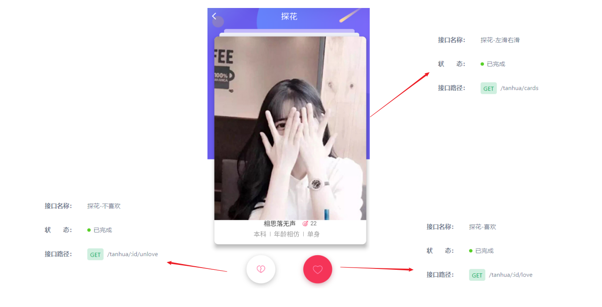
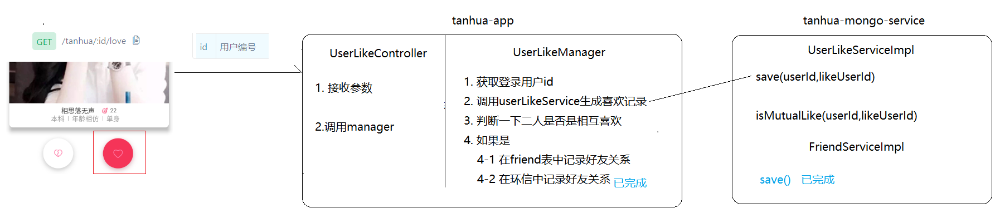
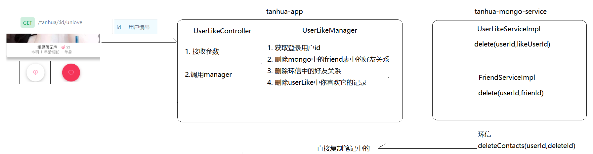
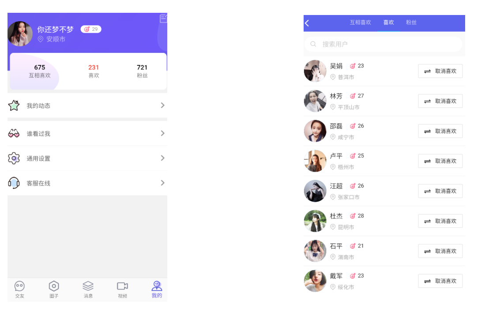
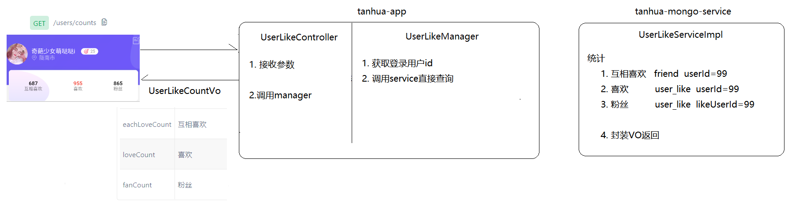
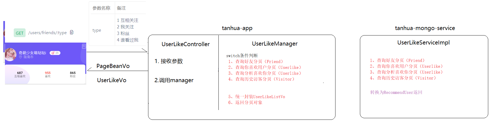
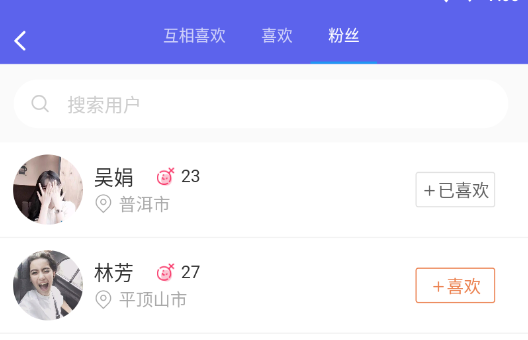
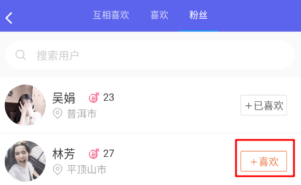
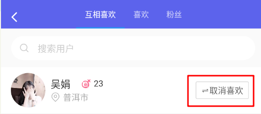

# 回顾

```markdown
1. 文件存储方案
	自己来: fastdfs
	第三方: 阿里云oss  七牛云

2. fastdfs的架构和使用流程
	角色: 客户端  跟踪服务器  存储服务器
	上传: 
		1. 存储服务器会定时向跟踪服务器上报自己的健康信息  
		2. 客户端联系跟踪服务器获取一个存储位置
		3. 客户端联系存储服务器进行文件存储
		4. 获取到文件存储之后的一个id
	下载:
    	nginx
		
3. 视频上传和查看
	上传: 封面---阿里云    视频---fastdfs   信息--mongo
	查看: 推荐---视频

4. Spring-Cache
	@EnableCaching//激活缓存
	@Cacheable(value = "tanhua", key = "'video_'+#userId+'_'+#pageNum+'_'+#pageSize")
	@CacheEvict(value = "tanhua",allEntries = true)

```


# 探花

> 探花功能是将推荐的好友随机的通过卡片的形式展现出来，用户可以选择左滑、右滑操作，左滑：“不喜欢”，右滑：“喜欢”。

 

## 卡片展示

>卡片中的数据是来自用户推荐表中的前20条，可以直接复用我们原来开发过的`推荐用户`功能
>
>接口地址：https://mock-java.itheima.net/project/35/interface/api/593
>
>在`MakeFriendController`添加下面方法

```java
    //探花--卡片展示
    @GetMapping("/tanhua/cards")
    public List<RecommendUserVo> findCards(){
        return (List<RecommendUserVo>) makeFriendManager.findRecommendUser(1,20).getItems();
    }
```

## 喜欢

### 功能说明

>在推荐卡片页面， 对指定的用户右滑，即可触发喜欢功能，其功能要求是：
>
>1. 将喜欢记录写入`user_like`表，
>2. 如果是对方也喜欢你，将二者关系记录到好友表`user_friend`
>3. 如果二者要加好友，我们还需要调用环信的接口，在环信系统中生成好友关系
>
>接口地址：https://mock-java.itheima.net/project/35/interface/api/599

>**用户喜欢表 user_like**

```json
{
    "_id" : ObjectId("5fc30872ad4b872488353d1c"),
    "created" : NumberLong(1606617202145),
    "userId" : NumberLong(99),  // 用户id，自己
    "likeUserId" : NumberLong(7)// 喜欢的用户id，对方
}
```

### 思路分析



### UserLikeController

>在`tanhua-app`模块创建`com.itheima.app.controller.UserLikeController`

```java
package com.itheima.app.controller;

import com.itheima.app.manager.UserLikeManager;
import org.springframework.beans.factory.annotation.Autowired;
import org.springframework.web.bind.annotation.GetMapping;
import org.springframework.web.bind.annotation.PathVariable;
import org.springframework.web.bind.annotation.RestController;

@RestController
public class UserLikeController {

    @Autowired
    private UserLikeManager userLikeManager;

    //喜欢
    @GetMapping("/tanhua/{id}/love")
    public void love(@PathVariable("id") Long likeUserId){
        userLikeManager.love(likeUserId);
    }
}

```

### UserLikeManager

>在`tanhua-app`模块创建`com.itheima.app.manager.UserLikeManager`

```java
package com.itheima.app.manager;

import com.itheima.app.interceptor.UserHolder;
import com.itheima.autoconfig.huanxin.HuanXinTemplate;
import com.itheima.service.mongo.FriendService;
import com.itheima.service.mongo.UserLikeService;
import org.apache.dubbo.config.annotation.Reference;
import org.springframework.beans.factory.annotation.Autowired;
import org.springframework.stereotype.Service;

@Service
public class UserLikeManager {
    @Autowired
    private HuanXinTemplate huanXinTemplate;

    @Reference
    private UserLikeService userLikeService;

    @Reference
    private FriendService friendService;

    //喜欢
    public void love(Long likeUserId) {
        //1. 获取登录用户id
        Long userId = UserHolder.getUser().getId();

        //2. 向mongo中记录喜欢
        userLikeService.save(userId,likeUserId);

        //3. 查询一下二人是否相互喜欢
        boolean flag = userLikeService.isMutualLike(userId,likeUserId);

        //4. 如果相互喜欢
        if (flag){
            //4-1 向mongo中的friend表中记录好友
            friendService.addContacts(userId,likeUserId);

            //4-2 向环信中记录好友
            huanXinTemplate.addContacts(userId,likeUserId);
        }
    }
}
```

### UserLikeService

>在`tanhua-mongo-interface`模块创建`com.itheima.service.mongo.UserLikeService`

```java
package com.itheima.service.mongo;

public interface UserLikeService {
    //添加喜欢记录
    void save(Long userId, Long likeUserId);

    //判断二人是否相互喜欢
    boolean isMutualLike(Long userId, Long likeUserId);
}

```

### UserLikeServiceImpl

>在`tanhua-mongo-service`模块创建`com.itheima.service.mongo.impl.UserLikeServiceImpl`

```java
package com.itheima.service.mongo.impl;

import com.itheima.domain.mongo.UserLike;
import com.itheima.service.mongo.UserLikeService;
import org.apache.dubbo.config.annotation.Service;
import org.springframework.beans.factory.annotation.Autowired;
import org.springframework.data.mongodb.core.MongoTemplate;
import org.springframework.data.mongodb.core.query.Criteria;
import org.springframework.data.mongodb.core.query.Query;

@Service
public class UserLikeServiceImpl implements UserLikeService {

    @Autowired
    private MongoTemplate mongoTemplate;

    @Override
    public void save(Long userId, Long likeUserId) {
        //1. 先判断下是否存在这个喜欢记录
        Query query = new Query(
                Criteria.where("userId").is(userId).and("likeUserId").is(likeUserId)
        );
        boolean exists = mongoTemplate.exists(query, UserLike.class);

        //2. 如果不存在,再去保存
        if (!exists){
            UserLike userLike = new UserLike();
            userLike.setUserId(userId);
            userLike.setLikeUserId(likeUserId);
            userLike.setCreated(System.currentTimeMillis());
            mongoTemplate.save(userLike);
        }

    }

    @Override
    public boolean isMutualLike(Long userId, Long likeUserId) {
        //1. 你是否喜欢她
        Query query1 = new Query(
                Criteria.where("userId").is(userId).and("likeUserId").is(likeUserId)
        );
        boolean exists1 = mongoTemplate.exists(query1, UserLike.class);

        //2. 她是否喜欢你
        Query query2 = new Query(
                Criteria.where("userId").is(likeUserId).and("likeUserId").is(userId)
        );
        boolean exists2 = mongoTemplate.exists(query2, UserLike.class);

        return exists1 && exists2;
    }
}
```


## 不喜欢

### 功能说明

> 在推荐卡片页面， 对指定的用户左滑，即可触发不喜欢功能，其功能要求是：
>
>    	1. 从`user_friend`表移除他们的好友关系（2条）
>       	2. 删除环信中的好友关系（2条）
>       	3. 从`user_like`表移除你对他的喜欢（1条）
>
> 接口地址： https://mock-java.itheima.net/project/35/interface/api/605

### 思路分析



### UserLikeController

```java
    //不喜欢
    @GetMapping("/tanhua/{id}/unlove")
    public void unlove(@PathVariable("id") Long likeUserId){
        userLikeManager.unlove(likeUserId);
    }
```

### UserLikeManager

```java
    //不喜欢
    public void unlove(Long likeUserId) {
        //1. 获取登录用户id
        Long userId = UserHolder.getUser().getId();

        //2. 删除mongo中好友关系(friend)
        friendService.deleteContacts(userId, likeUserId);

        //3. 删除环信中好友关系
        huanXinTemplate.deleteContacts(userId, likeUserId);

        //4. 删除mongo中的喜欢记录(user_like)
        userLikeService.delete(userId, likeUserId);
    }
```

### FriendService

~~~java
    //删除好友关系
    void deleteContacts(Long userId, Long likeUserId);
~~~

### FriendServiceImpl

~~~~java
    @Override
    public void deleteContacts(Long userId, Long likeUserId) {
        //正向
        Query query1 = new Query(Criteria.where("userId").is(userId).and("friendId").is(likeUserId));
        boolean flag1 = mongoTemplate.exists(query1, Friend.class);
        if (flag1) {
            mongoTemplate.remove(query1, Friend.class);
        }

        //反向
        Query query2 = new Query(Criteria.where("userId").is(likeUserId).and("friendId").is(userId));
        boolean flag2 = mongoTemplate.exists(query2, Friend.class);
        if (flag2) {
            mongoTemplate.remove(query2, Friend.class);
        }
    }
~~~~

### UserLikeService

```java
    //删除喜欢记录
    void delete(Long userId, Long likeUserId);
```

### UserLikeServiceImpl

```java
    @Override
    public void delete(Long userId, Long likeUserId) {
        Query query1 = new Query(
                Criteria.where("userId").is(userId).and("likeUserId").is(likeUserId)
        );
        boolean exists1 = mongoTemplate.exists(query1, UserLike.class);
        if (exists1) {
            mongoTemplate.remove(query1, UserLike.class);
        }
    }
```

### HuanxinTemplate

```java
/**
 * 解除好友关系
 */
public void deleteContacts(Long userId, Long friendId) {
    String targetUrl = huanXinProperties.getHuanXinUrl() + "/users/" + userId + "/contacts/users/" + friendId;
    System.out.println(targetUrl);
    // 请求头
    HttpHeaders headers = new HttpHeaders();
    headers.add("Content-Type", "application/json");
    headers.add("Authorization", "Bearer " + getToken());

    try {
        HttpEntity<String> httpEntity = new HttpEntity<>(headers);
        restTemplate.exchange(targetUrl, HttpMethod.DELETE, httpEntity, String.class);
    } catch (Exception e) {

    }
}
```


# 喜欢统计

## 业务需求

> 在我的模块中，将详细展现“喜欢”相关的数据，如下：
>
> - 相互喜欢: 查询好友列表 (  从friend表中根据userId查询我的所有好友数量  )
> - 喜欢: 查询你喜欢的用户 (  从user_like表中根据userId查询所有我喜欢的用户数量  )
> - 粉丝: 查询别人喜欢你的用户 (  从user_like表中根据userId查询所有喜欢我的用户数量 )
>
> 接口地址: https://mock-java.itheima.net/project/35/interface/api/899

 

## 思路分析



## 代码实现

### UserLikeCountVo

~~~java
package com.itheima.vo;

import lombok.AllArgsConstructor;
import lombok.Data;
import lombok.NoArgsConstructor;

import java.io.Serializable;

@Data
@NoArgsConstructor
@AllArgsConstructor
public class UserLikeCountVo implements Serializable {
    private Long eachLoveCount; //互相喜欢
    private Long loveCount; //喜欢
    private Long fanCount; //粉丝
}
~~~

### UserLikeController

~~~java
    //喜欢统计
    @GetMapping("/users/counts")
    public UserLikeCountVo counts(){
        return userLikeManager.counts();
    }
~~~

### UserLikeManager

~~~java
    //统计 好友  喜欢 粉丝数量
    public UserLikeCountVo counts() {
        Long userId = UserHolder.getUser().getId();

        return userLikeService.findUserLikeCount(userId);
    }
~~~

### UserLikeService

~~~java
    //统计 好友  喜欢 粉丝数量
    UserLikeCountVo findUserLikeCount(Long userId);
~~~

### UserLikeServiceImpl

~~~java
    @Override
    public UserLikeCountVo findUserLikeCount(Long userId) {

        //- 相互喜欢: 查询好友列表 (  从friend表中根据userId查询我的所有好友数量  )
        Query query1 = new Query(Criteria.where("userId").is(userId));
        long count1 = mongoTemplate.count(query1, Friend.class);

        //- 喜欢: 查询你喜欢的用户 (  从user_like表中根据userId查询所有我喜欢的用户数量  )
        Query query2 = new Query(Criteria.where("userId").is(userId));
        long count2 = mongoTemplate.count(query2, UserLike.class);

        //- 粉丝: 查询别人喜欢你的用户 (  从user_like表中根据userId查询所有喜欢我的用户数量 )
        Query query3 = new Query(Criteria.where("likeUserId").is(userId));
        long count3 = mongoTemplate.count(query3, UserLike.class);

        //封装
        UserLikeCountVo userLikeCountVo = new UserLikeCountVo();
        userLikeCountVo.setEachLoveCount(count1);
        userLikeCountVo.setLoveCount(count2);
        userLikeCountVo.setFanCount(count3);

        return userLikeCountVo;
    }
~~~


# 喜欢详情

## 业务需求

>该接口集成了4个功能，用type做了区分，如下：
>
>- 相互喜欢: 查询好友列表 (  从friend表中根据userId分页查询我的好友  )
>- 喜欢: 查询你喜欢的用户 (  从user_like表中根据userId分页查询我喜欢的用户  )
>- 粉丝: 查询别人喜欢你的用户 (  从user_like表中根据userId分页查询喜欢我的用户 )
>- 谁看过我: 查询访客列表( 从visitor表中根据userId分页查询访问过的用户)
>
>接口地址: https://mock-java.itheima.net/project/35/interface/api/905

## 思路分析

 

## 代码编写

### UserLikeVo

>==一定记得替换一下这个vo==

```java
package com.itheima.vo;

import lombok.AllArgsConstructor;
import lombok.Data;
import lombok.NoArgsConstructor;
import java.io.Serializable;

@Data
@NoArgsConstructor
@AllArgsConstructor
public class UserLikeVo implements Serializable {

    private Long id;
    private String avatar;
    private String nickname;
    private String gender;
    private Integer age;
    private String city;
    private String education;
    private Integer marriage; //婚姻状态（0未婚，1已婚）
    private Integer matchRate; //匹配度
    private boolean alreadyLove = false;//是否喜欢它
}
```

### UserLikeController

~~~java
    //喜欢详情
    @GetMapping("/users/friends/{type}")
    public PageBeanVo findType(
            @RequestParam(name = "page", defaultValue = "1") Integer pageNum,
            @RequestParam(name = "pagesize", defaultValue = "10") Integer pageSize,
            @PathVariable Integer type) {
        return userLikeManager.findType(pageNum, pageSize, type);
    }
~~~

### UserLikeManager

~~~java
    public PageBeanVo findType(Integer pageNum, Integer pageSize, Integer type) {
        // 1、获取用户id
        Long userId = UserHolder.getUser().getId();

        // 2、声明返回结果
        PageBeanVo pageBeanVo = null;

        // 3、类型判断
        switch (type) {
            case 1: { // 好友
                pageBeanVo = userLikeService.findEachLove(pageNum, pageSize, userId);
                break;
            }
            case 2: { // 我喜欢
                pageBeanVo = userLikeService.findLove(pageNum, pageSize, userId);
                break;
            }
            case 3: { // 粉丝
                pageBeanVo = userLikeService.findFan(pageNum, pageSize, userId);
                break;
            }
            case 4: { // 谁看过我
                pageBeanVo = userLikeService.findVisitor(pageNum, pageSize, userId);
                break;
            }
        }
        // 4、封装 vo
        List<RecommendUser> recommendUserList = (List<RecommendUser>) pageBeanVo.getItems();
        List<UserLikeVo> userLikeVoList = new ArrayList<>();
        if (CollectionUtil.isNotEmpty(recommendUserList)) {
            for (RecommendUser recommendUser : recommendUserList) {
                UserLikeVo userLikeVo = new UserLikeVo();
                UserInfo userInfo = userInfoService.findById(recommendUser.getUserId());
                BeanUtil.copyProperties(userInfo, userLikeVo);//复制用户信息部分
                userLikeVo.setMatchRate(recommendUser.getScore().intValue()); // 缘分值
                userLikeVoList.add(userLikeVo);
            }
        }
        pageBeanVo.setItems(userLikeVoList);

        return pageBeanVo;
    }
~~~

### UserLikeService

~~~java
    // 查询好友列表
    PageBeanVo findEachLove(Integer pageNum, Integer pageSize, Long userId);
    
    // 查询你喜欢用户列表
    PageBeanVo findLove(Integer pageNum, Integer pageSize, Long userId);
    
    // 查询粉丝用户列表
    PageBeanVo findFan(Integer pageNum, Integer pageSize, Long userId);
    
    // 查询历史访客用户列表
    PageBeanVo findVisitor(Integer pageNum, Integer pageSize, Long userId);
~~~

### UserLikeServiceImpl

~~~java
    @Override
    public PageBeanVo findEachLove(Integer pageNum, Integer pageSize, Long userId) {
        // 1、构造条件
        Integer index = (pageNum - 1) * pageSize;
        Query query = Query.query(Criteria.where("userId").is(userId)).skip(index).limit(pageSize);
        // 2、查询好友
        List<Friend> friendList = mongoTemplate.find(query, Friend.class);
        // 3、转换 recommend
        List<RecommendUser> userList = new ArrayList<>();
        for (Friend friend : friendList) {
            RecommendUser user = changeRecommendUser(friend.getUserId(), friend.getFriendId());
            userList.add(user);
        }
        long counts = mongoTemplate.count(query, Friend.class);
        // 4、返回分页对象
        return new PageBeanVo(pageNum, pageSize, counts, userList);
    }

    @Override
    public PageBeanVo findLove(Integer pageNum, Integer pageSize, Long userId) {
        // 1、构造条件
        Integer index = (pageNum - 1) * pageSize;
        Query query = Query.query(Criteria.where("userId").is(userId)).skip(index).limit(pageSize);
        // 2、查询你喜欢的
        List<UserLike> userLikeList = mongoTemplate.find(query, UserLike.class);
        // 3、转换 recommend
        List<RecommendUser> userList = new ArrayList<>();
        for (UserLike userLike : userLikeList) {
            RecommendUser user = changeRecommendUser(userLike.getUserId(), userLike.getLikeUserId());
            userList.add(user);
        }
        long counts = mongoTemplate.count(query, UserLike.class);
        // 4、返回分页
        return new PageBeanVo(pageNum, pageSize, counts, userList);
    }

    @Override
    public PageBeanVo findFan(Integer pageNum, Integer pageSize, Long userId) {
        // 1、构造条件
        Integer index = (pageNum - 1) * pageSize;
        Query query = Query.query(Criteria.where("likeUserId").is(userId)).skip(index).limit(pageSize);
        // 2、查询你喜欢的
        List<UserLike> userLikeList = mongoTemplate.find(query, UserLike.class);
        // 3、转换 recommend
        List<RecommendUser> userList = new ArrayList<>();
        for (UserLike userLike : userLikeList) {
            RecommendUser user = changeRecommendUser(userLike.getLikeUserId(), userLike.getUserId());
            userList.add(user);
        }
        long counts = mongoTemplate.count(query, UserLike.class);
        // 4、返回分页
        return new PageBeanVo(pageNum, pageSize, counts, userList);
    }

    @Override
    public PageBeanVo findVisitor(Integer pageNum, Integer pageSize, Long userId) {
        // 1、构造条件
        Integer index = (pageNum - 1) * pageSize;
        Query query = Query.query(Criteria.where("userId").is(userId)).skip(index).limit(pageSize);
        // 2、查询历史访客
        List<Visitor> visitorList = mongoTemplate.find(query, Visitor.class);
        // 3、转换 recommend
        List<RecommendUser> userList = new ArrayList<>();
        for (Visitor visitor : visitorList) {
            RecommendUser user = changeRecommendUser(visitor.getUserId(), visitor.getVisitorUserId());
            userList.add(user);
        }
        long counts = mongoTemplate.count(query, Visitor.class);
        // 4、返回分页
        return new PageBeanVo(pageNum, pageSize, counts, userList);
    }

    // 抽取一个方法，转为recommendUser
    private RecommendUser changeRecommendUser(Long toUserId, Long userId) {
        Query query = Query.query(Criteria.where("toUserId").is(toUserId).and("userId").is(userId));
        RecommendUser recommendUser = mongoTemplate.findOne(query, RecommendUser.class);
        if (recommendUser == null) { // 构建默认数据
            recommendUser = new RecommendUser();
            recommendUser.setToUserId(toUserId);
            recommendUser.setUserId(userId);
            recommendUser.setScore(95D);
        }
        return recommendUser;
    }
~~~

## 细节处理

### 显示喜欢状态

>在查询粉丝的时候，还要判断一下你们二人是否为相互喜欢

 

~~~java
    public PageBeanVo findType(Integer pageNum, Integer pageSize, Integer type) {
        // 1、获取用户id
        Long userId = UserHolder.getUser().getId();

        // 2、声明返回结果
        PageBeanVo pageBeanVo = null;

        // 3、类型判断
        switch (type) {
            case 1: { // 好友
                pageBeanVo = userLikeService.findEachLove(pageNum, pageSize, userId);
                break;
            }
            case 2: { // 我喜欢
                pageBeanVo = userLikeService.findLove(pageNum, pageSize, userId);
                break;
            }
            case 3: { // 粉丝
                pageBeanVo = userLikeService.findFan(pageNum, pageSize, userId);
                break;
            }
            case 4: { // 谁看过我
                pageBeanVo = userLikeService.findVisitor(pageNum, pageSize, userId);
                break;
            }
        }
        // 4、封装 vo
        List<RecommendUser> recommendUserList = (List<RecommendUser>) pageBeanVo.getItems();
        List<UserLikeVo> userLikeVoList = new ArrayList<>();
        if (CollectionUtil.isNotEmpty(recommendUserList)) {
            for (RecommendUser recommendUser : recommendUserList) {
                UserLikeVo userLikeVo = new UserLikeVo();
                UserInfo userInfo = userInfoService.findById(recommendUser.getUserId());
                BeanUtil.copyProperties(userInfo, userLikeVo);//复制用户信息部分
                userLikeVo.setMatchRate(recommendUser.getScore().intValue()); // 缘分值

                //粉丝
                if (type == 3) {
                    if (userLikeService.isMutualLike(recommendUser.getUserId(), recommendUser.getToUserId())) {
                        userLikeVo.setAlreadyLove(true);
                    }
                }
                userLikeVoList.add(userLikeVo);
            }
        }
        pageBeanVo.setItems(userLikeVoList);

        return pageBeanVo;
    }
~~~

### 粉丝喜欢

>在粉丝页面，可以选择一个粉丝进行喜欢
>
>接口地址: https://mock-java.itheima.net/project/35/interface/api/917

 

```java
    //粉丝喜欢
    @PostMapping("/users/fans/{uid}")
    public void FansLove(@PathVariable("uid") Long likeUserId){
        userLikeManager.love(likeUserId);
    }
```

### 取消喜欢

>在互相喜欢和喜欢页面，可以选择一个用户进行取消喜欢
>
>接口地址: https://mock-java.itheima.net/project/35/interface/api/923

 

```java
    //取消喜欢
    @DeleteMapping("/users/like/{uid}")
    public void unlike(@PathVariable("uid") Long likeUserId){
        userLikeManager.unlove(likeUserId);
    }
```